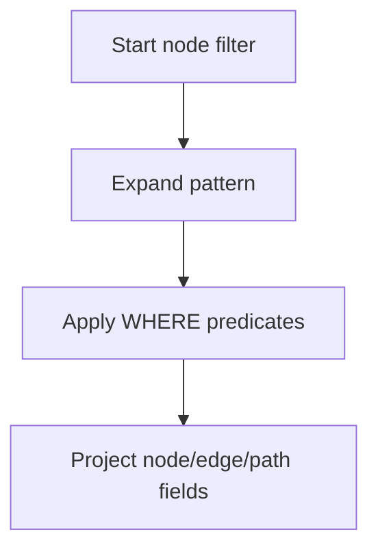

# Pattern Matching

## Direction Semantics

| Pattern | Meaning |
|---|---|
| `(a)-[:REL]->(b)` | Outgoing edge from `a` to `b` |
| `(a)<-[:REL]-(b)` | Incoming edge to `a` from `b` |
| `(a)-[:REL]-(b)` | Either direction |

## Basic and Composite Patterns

```cypher
MATCH (a:Person)-[:KNOWS]->(b:Person)
RETURN a.name, b.name;
```

```cypher
MATCH (a:Person)-[:KNOWS]->(b:Person),
      (b)-[:WORKS_AT]->(c:Company)
RETURN a.name, b.name, c.name;
```

## Variable-Length Patterns

Supported forms:

- `*`
- `*N`
- `*N..M`
- `*N..`
- `*..M`

```cypher
MATCH p = (a:Person)-[:KNOWS*1..3]->(b:Person)
RETURN p, length(p);
```

## Multiple Relationship Types

```cypher
MATCH (a)-[:TYPE1|TYPE2]->(x)
RETURN x;
```

## Optional Pattern and Existence Pattern

```cypher
MATCH (p:Person)
OPTIONAL MATCH (p)-[:WORKS_AT]->(c:Company)
RETURN p.name, c.name;
```

```cypher
MATCH (n:Person)
WHERE exists((n)-[:KNOWS]->())
RETURN n.name;
```

## Pattern Comprehension

```cypher
MATCH (n:Person {name: 'Alice'})
RETURN [(n)-[:KNOWS]->(m) | m.name] AS friends;
```



## Practical Checklist

- Filter start/end nodes early with labels + indexed properties.
- Keep variable-length upper bound (`*1..N`) whenever possible.
- Use `OPTIONAL MATCH` only for genuinely optional relationships.
- Use path projection only when path object is actually needed.
