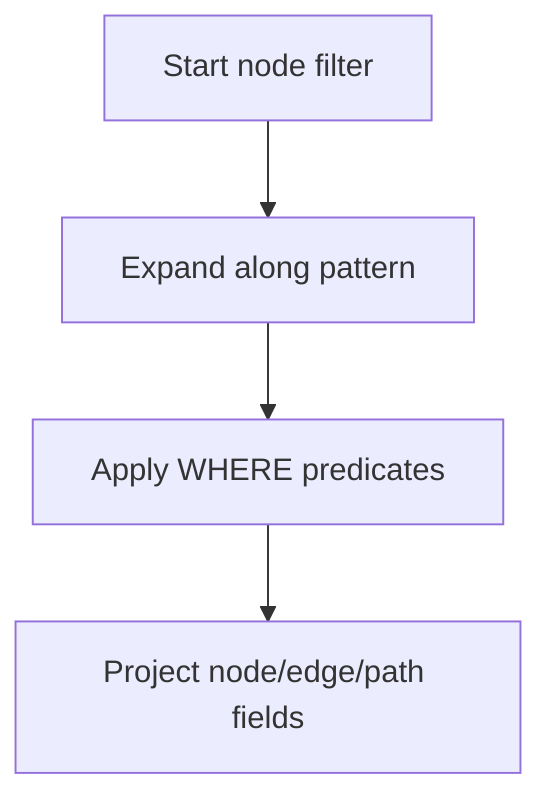

# Pattern Matching

## Direction Semantics

| Pattern | Meaning |
|---|---|
| `(a)-[:REL]->(b)` | Outgoing edge from `a` to `b` |
| `(a)<-[:REL]-(b)` | Incoming edge to `a` from `b` |
| `(a)-[:REL]-(b)` | Either direction |

## Basic and Composite Patterns

Single pattern — find all KNOWS relationships:

```cypher
MATCH (a:Person)-[:KNOWS]->(b:Person)
RETURN a.name, b.name;
```

Composite patterns — declare multiple relationship patterns in one `MATCH`:

```cypher
MATCH (a:Person)-[:KNOWS]->(b:Person),
      (b)-[:WORKS_AT]->(c:Company)
RETURN a.name, b.name, c.name;
```

:::tip
In composite patterns, all sub-patterns share intermediate variables (e.g., `b` above). The engine automatically performs equijoins on shared variables.
:::

## Variable-Length Patterns

| Syntax | Meaning |
|---|---|
| `*` | Any number of hops |
| `*N` | Exactly N hops |
| `*N..M` | N to M hops |
| `*N..` | At least N hops |
| `*..M` | At most M hops |

```cypher
MATCH p = (a:Person)-[:KNOWS*1..3]->(b:Person)
RETURN p, length(p);
```

:::warning
Variable-length patterns without an upper bound (`*1..`) can trigger full-graph traversal. Always prefer bounded ranges (e.g., `*1..4`).
:::

## Multiple Relationship Types

```cypher
MATCH (a)-[:TYPE1|TYPE2]->(x)
RETURN x;
```

## Optional Match and Existence Check

`OPTIONAL MATCH` returns `null` instead of dropping rows when the pattern does not match:

```cypher
MATCH (p:Person)
OPTIONAL MATCH (p)-[:WORKS_AT]->(c:Company)
RETURN p.name, c.name;
```

Use `exists()` in WHERE to test pattern existence:

```cypher
MATCH (n:Person)
WHERE exists((n)-[:KNOWS]->())
RETURN n.name;
```

## Shortest Path

Find the shortest path between two nodes:

```cypher
MATCH p = shortestPath((a:Person {name: 'Alice'})-[:KNOWS*]-(b:Person {name: 'Charlie'}))
RETURN p;
```

:::info
You can also use the `algo.shortestPath` procedure for shortest path, or `gds.shortestPath.dijkstra.stream` for weighted shortest paths via GDS.
:::

## Pattern Comprehension

Project matched results directly into a list:

```cypher
MATCH (n:Person {name: 'Alice'})
RETURN [(n)-[:KNOWS]->(m) | m.name] AS friends;
```

## Query Processing Flow



## Performance Checklist

- Filter start/end nodes early with labels + indexed properties
- Keep variable-length upper bound (`*1..N`) whenever possible
- Use `OPTIONAL MATCH` only for genuinely optional relationships
- Name and return path variables only when the path object is needed
