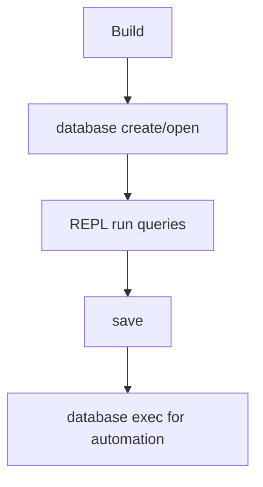

# Quick Start

## 1) Build Once

```bash
./scripts/run_tests.sh --quick
```

After build, CLI is usually at:

```bash
./buildDir/apps/cli/zyx
```

## 2) Open a Database

Create and enter interactive mode:

```bash
./buildDir/apps/cli/zyx database create ./demo.graph
```

Open an existing DB:

```bash
./buildDir/apps/cli/zyx database open ./demo.graph
```

Open or create if missing:

```bash
./buildDir/apps/cli/zyx database open ./demo.graph --create-if-missing
```

## 3) Run Your First Graph Query Set

```cypher
CREATE (a:User {name: 'Alice', age: 30});
CREATE (b:User {name: 'Bob', age: 25});
MATCH (a:User {name: 'Alice'}), (b:User {name: 'Bob'})
CREATE (a)-[:KNOWS {since: 2026}]->(b);
MATCH (a:User)-[r:KNOWS]->(b:User)
RETURN a.name, b.name, r.since;
```

## 4) Useful REPL Commands

- `help`: print command help
- `save`: flush storage to disk
- `debug ...`: inspect internal status (advanced)
- `exit`: quit REPL

## 5) Script Mode for Repeatable Runs

```bash
./buildDir/apps/cli/zyx database exec ./demo.graph ./seed.cypher
```

`seed.cypher` should keep one statement per `;` terminator.



## Quick Troubleshooting

| Symptom | Typical Cause | Action |
|---|---|---|
| `Script file not found` | Wrong script path | Use absolute path or check current working directory |
| `Syntax Error at line ...` | Missing `;` or unsupported syntax | Validate query against [Cypher Basics](cypher-basics) |
| Empty result where data is expected | Label/property mismatch | Run a broader `MATCH (n) RETURN n LIMIT 10;` first |
