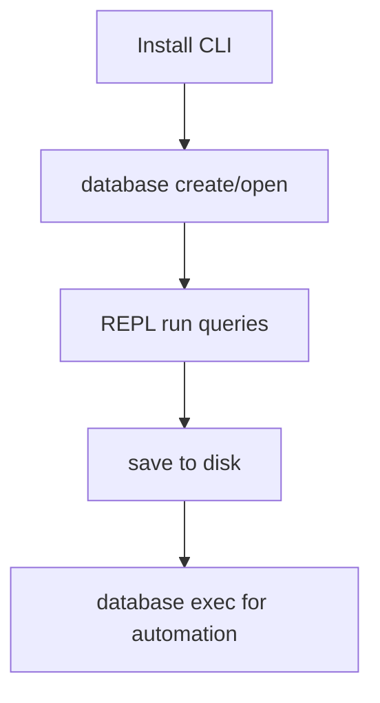

# Quick Start

This guide is for end users of ZYX CLI. Most users do not need to build from source.

## 1) Install or Download the CLI

Install ZYX using one of these methods:

- Download a pre-built executable
- Install via package manager
- Build from source (optional): [Installation Guide](../contributing/installation)

Run this to verify CLI availability:

```bash
zyx --help
```

:::info
If your executable is not on `PATH`, use the actual path (for example `./zyx` or `./buildDir/apps/cli/zyx`).
:::

## 2) Open a Database

Create and enter the REPL interactive mode:

```bash
zyx database create ./demo.graph
```

Open an existing DB:

```bash
zyx database open ./demo.graph
```

Open or create if missing:

```bash
zyx database open ./demo.graph --create-if-missing
```

:::tip Shorthand
`zyx database open ./demo.graph -c` is the short form of `--create-if-missing`. It is especially useful in scripts and automation.
:::

## 3) Run Your First Graph Query Set

Once inside the REPL, enter the following Cypher statements:

```cypher
CREATE (a:User {name: 'Alice', age: 30});
CREATE (b:User {name: 'Bob', age: 25});
MATCH (a:User {name: 'Alice'}), (b:User {name: 'Bob'})
CREATE (a)-[:KNOWS {since: 2026}]->(b);
MATCH (a:User)-[r:KNOWS]->(b:User)
RETURN a.name, b.name, r.since;
```

:::info
In the REPL, each statement executes immediately when terminated with `;`, or on an empty line. By default, each runs as an implicit transaction (auto-commit on success, auto-rollback on failure). For multi-step atomic operations, use `BEGIN` / `COMMIT` / `ROLLBACK` — see [Transactions](transactions).
:::

## 4) Useful REPL Commands

| Command | Description |
|---|---|
| `help` | Print available commands |
| `save` | Persist data to disk |
| `debug` | Enter debug mode (type `debug help` for subcommands) |
| `exit` | Quit the REPL |

:::tip Debug Mode
The `debug` command supports several subcommands:
- `debug summary` — View global file header stats
- `debug nodes [page]` — Inspect node segment pages
- `debug edges [page]` — Inspect edge segment pages
- `debug props [page]` — Inspect property segment pages
- `debug blobs [page]` — Inspect blob segment pages
- `debug indexes [page]` — Inspect index segment pages
- `debug states [page]` — Inspect state segment pages
- `debug state <key>` — Inspect a specific State key in detail
:::

## 5) Script Mode for Repeatable Runs

```bash
zyx database exec ./demo.graph ./seed.cypher
```

Each statement in `seed.cypher` should end with `;`. The script supports `//` line comments and ignores empty lines.

:::info
Script mode automatically creates the database if it does not exist (equivalent to `--create-if-missing`). Data is flushed to disk after the script completes.
:::



## 6) Bulk Import

In addition to inserting data one statement at a time in the REPL, ZYX provides a dedicated import command supporting CSV and JSONL formats:

```bash
zyx import \
  --database ./demo.graph \
  --nodes ./nodes.csv \
  --relationships ./rels.csv
```

:::tip
For full import command options, see the [Import & Export](import-export) chapter.
:::

## Quick Troubleshooting

| Symptom | Typical Cause | Action |
|---|---|---|
| `zyx: command not found` | CLI not installed or not in `PATH` | Install/download ZYX, or run using full executable path |
| `Script file not found` | Wrong script path | Use absolute path or check current working directory |
| `Syntax Error at line ...` | Missing `;` or unsupported syntax | Validate query against [Cypher Basics](cypher-basics) |
| Empty result where data is expected | Label/property mismatch | Run a broader `MATCH (n) RETURN n LIMIT 10;` first |

:::warning Feature Support
ZYX's Cypher implementation does not yet cover all openCypher features. If you encounter a syntax error, check [`UNSUPPORTED_CYPHER_FEATURES.md`](https://github.com/nexepic/zyx/blob/main/UNSUPPORTED_CYPHER_FEATURES.md) to confirm whether the feature is supported.
:::
