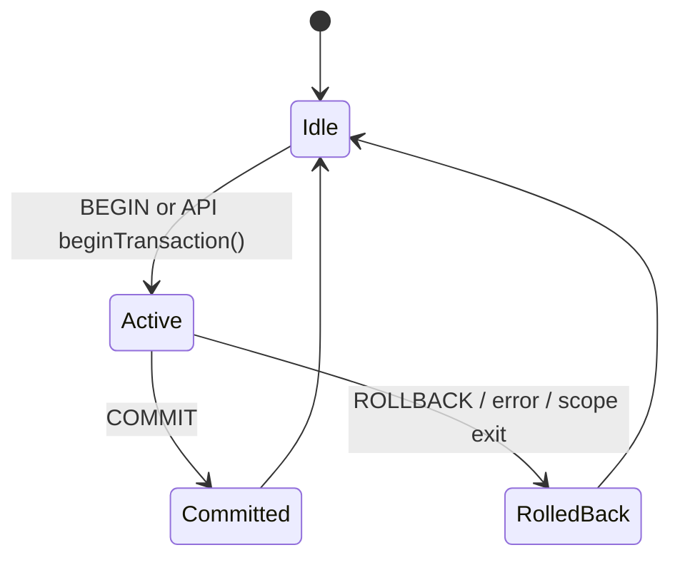

# Transactions

## Transaction Lifecycle



## Explicit Transaction in REPL

```cypher
BEGIN;
CREATE (:User {name: 'Alice'});
CREATE (:User {name: 'Bob'});
COMMIT;
```

Rollback case:

```cypher
BEGIN;
CREATE (:User {name: 'Temp'});
ROLLBACK;
```

## Implicit vs Explicit

| Mode | Typical Use | Notes |
|---|---|---|
| Implicit (single statement) | Simple one-shot reads/writes | Lowest operational overhead |
| Explicit (`BEGIN...COMMIT`) | Multi-step atomic updates | Clear success/failure boundary |
| API transaction object | Service-side orchestration | Auto-rollback if not committed |

## Behavior Notes

- Nested transactions are not supported.
- Write workload is single-writer oriented; reads rely on snapshots.
- Uncommitted changes are not durable until commit.
- Explicit `save`/flush can be used after commit for operational control.

## Failure Handling Pattern

1. Start explicit transaction for multi-step write.
2. Validate intermediate assumptions with `MATCH ... RETURN`.
3. `COMMIT` only when all checks pass.
4. `ROLLBACK` on any semantic or business failure.
