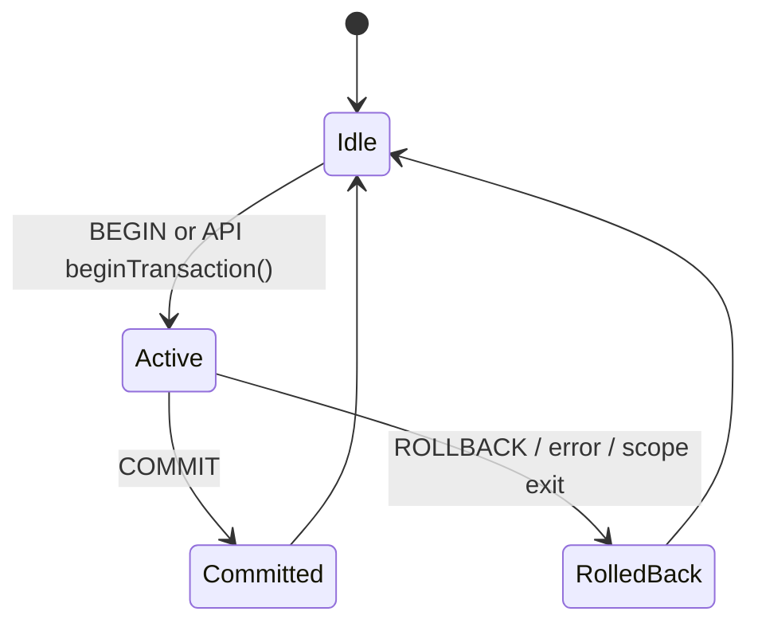
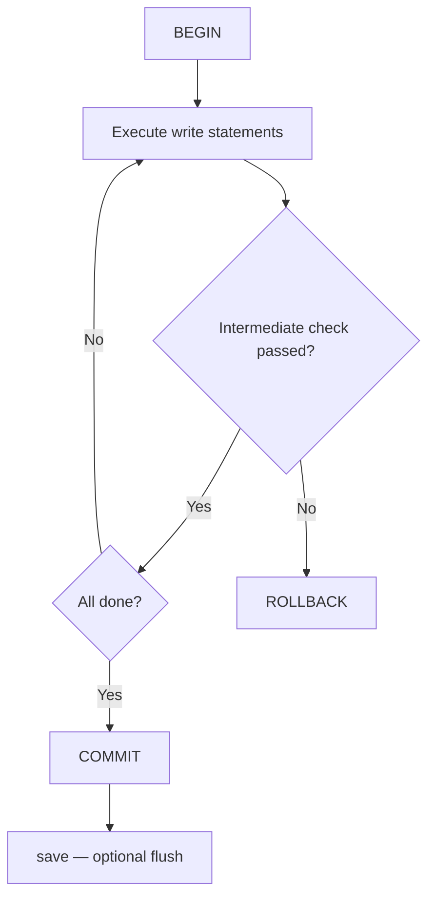

# Transactions

## Transaction Lifecycle



## Explicit Transactions in REPL

```cypher
BEGIN;
CREATE (:User {name: 'Alice'});
CREATE (:User {name: 'Bob'});
COMMIT;
```

Rollback case:

```cypher
BEGIN;
CREATE (:User {name: 'Temp'});
ROLLBACK;
```

## Three Transaction Modes

| Mode | Typical Use | Notes |
|---|---|---|
| Implicit (single statement) | Simple one-shot reads/writes | Each statement auto-wrapped in a transaction; lowest overhead |
| Explicit (`BEGIN...COMMIT`) | Multi-step atomic updates | Clear success/failure boundary |
| API transaction object | Service-side orchestration | C++ `Transaction` class auto-rolls back on destruction; Python `with` block auto-commits on success, auto-rolls back on exception |

:::tip API Auto-Rollback
A `Transaction` object obtained through the C++ API will automatically roll back when destroyed without a prior `commit()` call, ensuring no uncommitted dirty data is left behind.
:::

## Python Transaction Examples

```python
import zyxdb

with zyxdb.Database("/tmp/mydb.zyx") as db:
    # Write transaction — auto-commits on normal exit
    with db.begin_transaction() as tx:
        tx.execute("CREATE (n:User {name: 'Alice'})")
        tx.execute("CREATE (n:User {name: 'Bob'})")
        # auto-commits here

    # Explicit rollback
    with db.begin_transaction() as tx:
        tx.execute("CREATE (n:User {name: 'Temp'})")
        tx.rollback()

    # Auto-rollback on exception
    try:
        with db.begin_transaction() as tx:
            tx.execute("CREATE (n:User {name: 'Ghost'})")
            raise ValueError("oops")  # auto-rolls back
    except ValueError:
        pass

    # Read-only transaction (snapshot isolation)
    with db.begin_read_only_transaction() as tx:
        rows = list(tx.execute("MATCH (n:User) RETURN n.name AS name"))
```

:::tip
For the full Python Transaction API, see [Python API Reference](../api/python-api#transaction).
:::

## Behavior Notes

:::warning Concurrency Model
ZYX uses a **single-writer/multi-reader** model: only one write transaction is allowed at a time, while read transactions execute concurrently via snapshot isolation. Nested transactions are not supported.
:::

- Uncommitted changes are not durable until `COMMIT`
- After `COMMIT`, data is written to WAL and can be recovered even if the process crashes
- Use `save` or API `save()` after commit when immediate disk persistence is needed

## Failure Handling Pattern



1. Start an explicit transaction for multi-step writes
2. Validate intermediate assumptions with `MATCH ... RETURN`
3. `COMMIT` only when all checks pass
4. `ROLLBACK` on any semantic or business failure
