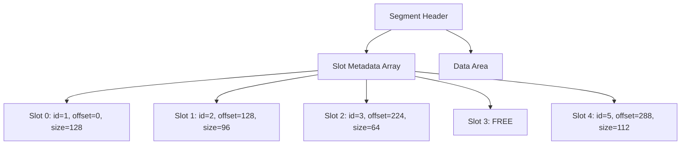

# 位图索引

ZYX 使用位图结构来跟踪段内的空闲和已用槽位。每个段维护有关哪些槽位已被占用的元数据，支持 O(1) 的槽位分配检查和高效的空间利用率跟踪。

## 槽位跟踪的工作原理

每个段头记录了总槽位数和当前数据使用量。槽位元数据以数组形式存储在段内，每条记录跟踪：

- **实体 ID**：分配给存储在此槽位中的实体的 ID
- **数据偏移**：在段数据区域内的字节偏移量
- **数据大小**：实体数据的字节大小
- **标志位**：活跃/非活跃状态及其他逐槽位标志

当一个实体被写入段时，会从空闲池中申请一个槽位。`IDAllocator` 确定实体 ID，段记录槽位元数据。当一个实体被删除时，其槽位被标记为非活跃，ID 被归还给分配器的 volatile intervals。

## 分配策略

ZYX 在段内使用**首个可用**（first-available）槽位分配策略：

1. 当创建新实体时，系统遍历对应实体类型的段链
2. 选择第一个具有可用槽位容量和足够数据空间的段
3. 如果没有现有段有空间，则在文件末尾分配新段
4. 用实体的 ID 和数据位置填充槽位元数据条目

这种方法避免了段内碎片化，因为实体数据按顺序写入数据区域，而槽位元数据独立增长。

## 空间效率

槽位跟踪增加的开销极小：

| 组件 | 大小 | 说明 |
|------|------|------|
| 段头 | 40 字节 | 每段固定 |
| 每槽位元数据 | ~32 字节 | ID、偏移量、大小、标志位 |
| 数据区域对齐 | 8 字节 | 跨平台访问对齐 |

对于 128 KB 的段，典型的槽位容量范围从数百个（用于 Blob 等大型实体）到数千个（用于 Property 等小型实体）。

## 与 IDAllocator 的集成

位图/槽位跟踪与 `IDAllocator` 协同工作：

- **分配**：`IDAllocator` 分配 ID，段分配器找到槽位，写入实体
- **释放**：槽位被标记为非活跃，ID 归还给 `IDAllocator` 的 volatile intervals
- **恢复**：WAL 重放通过重新应用已提交的写入来重建槽位状态

有关完整分配管道的详细信息，请参阅[段分配](segment-allocation)。

## 源码位置

| 组件 | 路径 |
|------|------|
| 段头 | `include/graph/storage/StorageHeaders.hpp` |
| SegmentAllocator | `include/graph/storage/SegmentAllocator.hpp` |
| IDAllocator | `include/graph/core/IDAllocator.hpp` |
