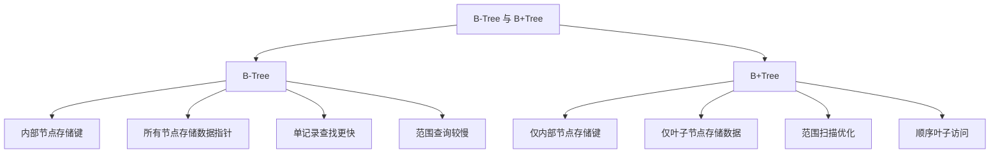
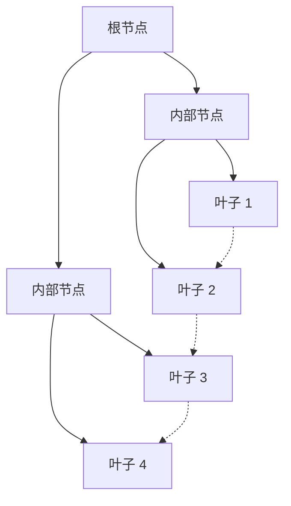
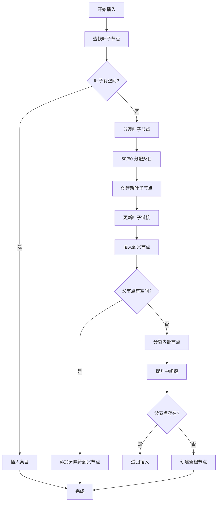
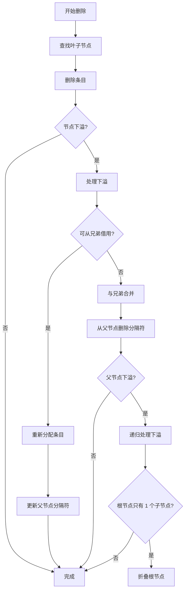
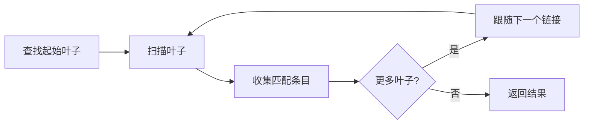

# B+Tree 索引

ZYX 使用 B+Tree 数据结构实现高效的标签和属性索引，提供快速查找、范围查询和有序遍历。该实现针对基于磁盘的存储进行了优化，通过 blob 存储支持大型键和值。

## 概述

B+Tree 是一种自平衡树数据结构，维护排序数据并允许对数时间内的搜索、顺序访问、插入和删除。它针对数据存储在磁盘上的存储系统进行了优化。

### 主要特性

- **平衡结构**：所有叶子节点在同一层级
- **有序数据**：键按排序存储以支持范围查询
- **高扇出**：最小化树高度以减少磁盘 I/O
- **叶子链接**：叶子节点双向链接以支持顺序访问
- **节点分裂/合并**：插入/删除时自动平衡
- **Blob 支持**：处理超大键和值列表

## B+Tree 与 B-Tree

### 为什么数据库选择 B+Tree？



**主要区别**：

| 特性 | B-Tree | B+Tree |
|------|--------|--------|
| 数据存储 | 所有节点 | 仅叶子节点 |
| 叶子链接 | 无 | 双向链接 |
| 范围查询 | 较慢（树遍历） | 更快（顺序扫描） |
| 扇出 | 较低 | 更高（更多指针） |
| 磁盘 I/O | 范围查询更多 | 优化顺序访问 |

## B+Tree 结构

### 节点布局



**B+Tree 结构：**
- 根节点：层级 2
- 内部节点：层级 1
- 叶子节点：层级 0（都在同一层级）
- 叶子节点双向链接以支持顺序访问

### 内部节点结构

内部节点包含分隔键和子指针：

```mermaid
classDiagram
    class InternalNode {
        +NodeType: INTERNAL
        +EntryCount: 3
        +ChildCount: 4
        +Level: 1
        +ParentId: 100
        +getChildren()
    }

    class ChildEntry {
        +Key: PropertyValue
        +ChildId: int64_t
    }

    InternalNode "1" --> "4" ChildEntry : contains
    ChildEntry : [DummyKey] -> ChildId: 200
    ChildEntry : [Key: 50] -> ChildId: 201
    ChildEntry : [Key: 100] -> ChildId: 202
    ChildEntry : [Key: 150] -> ChildId: 203
```

**搜索逻辑**：对于键 K，找到最大的分隔键 ≤ K，遍历到该子节点。

### 叶子节点结构

叶子节点包含实际的键值对和链表指针：

```mermaid
classDiagram
    class LeafNode {
        +NodeType: LEAF
        +EntryCount: 4
        +Level: 0
        +ParentId: 100
        +NextLeafId: 202
        +PrevLeafId: 200
        +getEntries()
    }

    class Entry {
        +Key: PropertyValue
        +Values: vector~int64_t~
        +KeyBlobId: int64_t
        +ValuesBlobId: int64_t
    }

    LeafNode "1" --> "4" Entry : contains
    Entry : [Key: 10] -> [Values: 1, 5, 8]
    Entry : [Key: 25] -> [Values: 3]
    Entry : [Key: 40] -> [Values: 7, 9]
    Entry : [Key: 45] -> [Values: 2, 4, 6]
```

**条目结构**：
```cpp
struct Entry {
    PropertyValue key;           // 索引键
    std::vector<int64_t> values; // 具有此键的实体 ID
    int64_t keyBlobId;           // 超大键的 blob ID
    int64_t valuesBlobId;        // 超大值列表的 blob ID
};
```

## 节点大小和容量

### 存储参数

```cpp
constexpr size_t TOTAL_INDEX_SIZE = 256;  // 节点总大小（字节）
constexpr size_t METADATA_SIZE = 43;      // 元数据开销
constexpr size_t DATA_SIZE = 213;         // 可用数据空间
```

### 容量计算

**叶子节点条目容量**：
- 小内联条目：每个节点约 20-30 个条目
- 使用 blob 存储：可存储更多条目

**内部节点扇出**：
- 典型扇出：每个内部节点 40-50 个子节点
- 100 万条目的树高度：log₅₀(1,000,000) ≈ 3-4 层

## 插入算法

### 处理流程



### 插入示例

```cpp
// 将属性值插入索引
void PropertyIndex::addProperty(int64_t entityId,
                                const std::string& key,
                                const PropertyValue& value) {
    auto treeManager = getTreeManagerForType(value.getType());
    auto& rootId = getRootMapForType(value.getType())[key];

    // 插入到 B+Tree
    rootId = treeManager->insert(rootId, value, entityId);
}
```

### 节点分裂

**叶子分裂**（50/50 分配）：
```cpp
void splitLeaf(Index& leaf, vector<Entry>& allEntries, int64_t& rootId) {
    // 1. 创建兄弟节点
    int64_t newLeafId = createNewNode(NodeType::LEAF);
    Index newLeaf = dataManager_->getIndex(newLeafId);

    // 2. 平均分配条目
    size_t mid = allEntries.size() / 2;
    vector<Entry> leftEntries(allEntries.begin(), allEntries.begin() + mid);
    vector<Entry> rightEntries(allEntries.begin() + mid, allEntries.end());

    // 3. 更新链表
    newLeaf.setNextLeafId(leaf.getNextLeafId());
    newLeaf.setPrevLeafId(leaf.getId());
    leaf.setNextLeafId(newLeafId);

    // 4. 写入数据并传播
    leaf.setAllEntries(leftEntries, dataManager_);
    newLeaf.setAllEntries(rightEntries, dataManager_);

    // 5. 将分隔符键插入父节点
    PropertyValue separatorKey = rightEntries.front().key;
    insertIntoParent(leaf, separatorKey, newLeafId, rootId);
}
```

## 删除算法

### 处理流程



### 下溢检测

```cpp
bool isUnderflow(double thresholdRatio) const {
    if (getEntryCount() == 0) return true;

    double currentUsage = static_cast<double>(metadata.dataUsage);
    double threshold = TOTAL_INDEX_SIZE * thresholdRatio;
    return currentUsage < threshold;
}
```

**下溢阈值**：节点容量的 40%

### 重新分配

从兄弟节点借用条目以平衡节点：

```cpp
void redistribute(Index& node, Index& sibling, Index& parent, bool isLeftSibling) {
    if (node.isLeaf()) {
        // 从左兄弟借用
        auto nodeEntries = node.getAllEntries(dataManager_);
        auto siblingEntries = sibling.getAllEntries(dataManager_);

        // 将兄弟的最后一个条目移到节点开头
        Entry borrowed = std::move(siblingEntries.back());
        siblingEntries.pop_back();
        nodeEntries.insert(nodeEntries.begin(), std::move(borrowed));

        // 更新父节点分隔符
        parentChildren[nodeIdx].key = nodeEntries.front().key;

        node.setAllEntries(nodeEntries, dataManager_);
        sibling.setAllEntries(siblingEntries, dataManager_);
    }
}
```

### 节点合并

当兄弟节点都下溢时，合并它们：

```cpp
void mergeNodes(Index& leftNode, Index& rightNode,
                Index& parent, const PropertyValue& separatorKey,
                int64_t& rootId) {
    if (leftNode.isLeaf()) {
        // 合并叶子条目
        auto leftEntries = leftNode.getAllEntries(dataManager_);
        auto rightEntries = rightNode.getAllEntries(dataManager_);

        leftEntries.insert(leftEntries.end(),
                          std::make_move_iterator(rightEntries.begin()),
                          std::make_move_iterator(rightEntries.end()));

        leftNode.setAllEntries(leftEntries, dataManager_);

        // 更新链表
        leftNode.setNextLeafId(rightNode.getNextLeafId());
    } else {
        // 使用分隔符合并内部节点
        auto leftChildren = leftNode.getAllChildren(dataManager_);
        auto rightChildren = rightNode.getAllChildren(dataManager_);

        ChildEntry separatorChildEntry{separatorKey, rightChildren.front().childId, 0};
        rightChildren.erase(rightChildren.begin());

        leftChildren.push_back(std::move(separatorChildEntry));
        leftChildren.insert(leftChildren.end(),
                           std::make_move_iterator(rightChildren.begin()),
                           std::make_move_iterator(rightChildren.end()));

        leftNode.setAllChildren(leftChildren, dataManager_);
    }

    // 删除右节点并更新父节点
    dataManager_->deleteIndex(rightNode);
    // 检查父节点下溢...
}
```

## 搜索操作

### 精确匹配搜索

```cpp
std::vector<int64_t> PropertyIndex::findExactMatch(
    const std::string& key,
    const PropertyValue& value) const {

    auto treeManager = getTreeManagerForType(value.getType());
    const auto& rootId = getRootMapForType(value.getType()).at(key);

    return treeManager->find(rootId, value);
}
```

**搜索路径**：
1. 从根节点开始
2. 在每个内部节点，找到合适的子节点
3. 遍历到叶子层级
4. 扫描叶子查找匹配的键

**时间复杂度**：O(logₙ N)，其中 n 是扇出，N 是总条目数

### 范围查询

```cpp
std::vector<int64_t> IndexTreeManager::findRange(
    int64_t rootId,
    const PropertyValue& minKey,
    const PropertyValue& maxKey) const {

    std::vector<int64_t> results;

    // 1. 查找起始叶子节点
    int64_t startLeafId = findLeafNode(rootId, minKey);
    int64_t currentLeafId = startLeafId;

    // 2. 扫描链接的叶子节点
    while (currentLeafId != 0) {
        auto currentLeaf = dataManager_->getIndex(currentLeafId);
        auto entries = currentLeaf.getAllEntries(dataManager_);

        // 3. 收集匹配的条目
        for (const auto& entry : entries) {
            if (!keyComparator_(entry.key, maxKey)) {
                // 条目键 > maxKey，完成扫描
                return results;
            }
            if (!keyComparator_(entry.key, minKey)) {
                // 条目键 >= minKey，添加值
                results.insert(results.end(), entry.values.begin(), entry.values.end());
            }
        }

        // 4. 移动到下一个叶子
        currentLeafId = currentLeaf.getNextLeafId();
    }

    return results;
}
```

**范围查询遍历**：



## 大数据的 Blob 存储

### 当键/值不适合内联存储时

**阈值**：
- 内部键：32 字节内联
- 叶子键：32 字节内联
- 叶子值：32 字节内联

**Blob 存储策略**：

```cpp
struct Entry {
    PropertyValue key;
    std::vector<int64_t> values;
    int64_t keyBlobId = 0;      // 超大键的 blob
    int64_t valuesBlobId = 0;   // 超大值列表的 blob 链
};
```

当数据超过阈值时：
1. 将数据序列化到 blob 存储
2. 在条目中存储 blob ID
3. 访问时从 blob 检索

## 时间和空间复杂度

### 时间复杂度

| 操作 | 平均情况 | 最坏情况 |
|------|----------|----------|
| 搜索（精确） | O(log N) | O(log N) |
| 插入 | O(log N) | O(log N) |
| 删除 | O(log N) | O(log N) |
| 范围查询 | O(log N + K) | O(log N + K) |
| 顺序扫描 | O(K) | O(K) |

其中：
- N = 总条目数
- K = 结果/范围中的条目数

### 空间复杂度

| 组件 | 空间 |
|------|------|
| 节点大小 | 256 字节（固定） |
| 每节点元数据 | 43 字节 |
| 每节点数据 | 213 字节 |
| 总树大小 | O(N) |

**扇出计算**：
- 指针大小：8 字节
- 键大小：可变（通常 4-16 字节）
- 子条目：约 16-24 字节
- 扇出：213 / 16 ≈ 13 个子节点（保守估计）
- 实际扇出：优化后 40-50 个

## 磁盘 I/O 特性

### 每次操作的 I/O

| 操作 | 磁盘读取 | 磁盘写入 |
|------|----------|----------|
| 搜索 | O(logₙ N) | 0 |
| 插入 | O(logₙ N) | O(logₙ N) |
| 删除 | O(logₙ N) | O(logₙ N) |
| 范围查询 | O(logₙ N + K/b) | 0 |

其中：
- n = 扇出（每个内部节点的子节点数）
- N = 总条目数
- K = 结果大小
- b = 分支因子（每个叶子的条目数）

### 优化策略

1. **高扇出**：最小化树高度
2. **节点大小**：256 字节适合磁盘块
3. **顺序扫描**：叶子链接支持范围查询
4. **批量操作**：减少批量插入的 I/O

**示例**：对于扇出 50 的 100 万条目：
- 树高度：⌈log₅₀(1,000,000)⌉ = 4 层
- 每次搜索最大 I/O：4 次磁盘读取

## 并发操作

### 锁策略

```cpp
class IndexTreeManager {
    mutable std::shared_mutex mutex_;  // 读写锁
};
```

**锁类型**：
- **共享锁**：用于读操作（find、findRange）
- **排他锁**：用于写操作（insert、remove、clear）

### 并发控制

```cpp
// 读操作 - 共享锁
std::vector<int64_t> find(int64_t rootId, const PropertyValue& key) const {
    std::shared_lock lock(mutex_);  // 允许并发读者
    // ... 搜索逻辑
}

// 写操作 - 排他锁
int64_t insert(int64_t rootId, const PropertyValue& key, int64_t value) {
    std::unique_lock lock(mutex_);  // 独占访问
    // ... 插入逻辑
}
```

**优点**：
- 多个并发读者
- 单个写者独占访问
- 正确的加锁顺序无死锁

## 在 ZYX 中的应用

### 标签索引

将标签令牌映射到实体 ID：

```cpp
class LabelIndex {
    std::shared_ptr<IndexTreeManager> treeManager_;
    std::unordered_map<LabelToken, int64_t> labelRoots_;

    void addLabel(LabelToken label, int64_t entityId);
    std::vector<int64_t> findEntities(LabelToken label);
};
```

### 属性索引

将属性值映射到实体 ID：

```cpp
class PropertyIndex {
    // 为每个属性类型提供单独的树管理器
    std::shared_ptr<IndexTreeManager> stringTreeManager_;
    std::shared_ptr<IndexTreeManager> intTreeManager_;
    std::shared_ptr<IndexTreeManager> doubleTreeManager_;
    std::shared_ptr<IndexTreeManager> boolTreeManager_;

    void addProperty(int64_t entityId, const std::string& key,
                    const PropertyValue& value);
    std::vector<int64_t> findExactMatch(const std::string& key,
                                       const PropertyValue& value);
    std::vector<int64_t> findRange(const std::string& key,
                                  double minValue, double maxValue);
};
```

## 配置参数

### 节点大小

```cpp
constexpr size_t TOTAL_INDEX_SIZE = 256;
```

**权衡**：
- 更大的节点：更高的扇出，更短的树，但每个节点的磁盘 I/O 更多
- 更小的节点：每个节点的磁盘 I/O 更少，但树更高
- 256 字节：对典型磁盘块大小平衡

### 下溢阈值

```cpp
static constexpr double UNDERFLOW_THRESHOLD_RATIO = 0.4;
```

**权衡**：
- 更低的阈值：更激进的合并，更少的空间浪费
- 更高的阈值：更少的合并，但更多的空空间
- 0.4 (40%)：在合并频率和空间利用率之间平衡

### 内联阈值

```cpp
constexpr size_t INTERNAL_KEY_INLINE_THRESHOLD = 32;
constexpr size_t LEAF_KEY_INLINE_THRESHOLD = 32;
constexpr size_t LEAF_VALUES_INLINE_THRESHOLD = 32;
```

**权衡**：
- 更大的阈值：更少的 blob 读取，但更大的节点
- 更小的阈值：更小的节点，但更多的 blob 开销
- 32 字节：对典型属性值平衡

## 性能考虑

### 优化技术

1. **批量插入**：
   ```cpp
   int64_t insertBatch(int64_t rootId,
                      const vector<pair<PropertyValue, int64_t>>& entries);
   ```
   - 在插入前排序和合并条目
   - 减少树重组开销

2. **单次插入**：
   ```cpp
   InsertResult tryInsertEntry(const PropertyValue& key, int64_t value);
   ```
   - 组合反序列化 + 插入 + 序列化
   - 防止双重反序列化

3. **缓存节点**：
   - 频繁访问的节点缓存在内存中
   - 减少热数据的磁盘 I/O

### 基准测试

典型性能特征：

| 指标 | 值 |
|------|-----|
| 每叶子条目数 | 20-30 |
| 扇出 | 40-50 |
| 树高度（100 万条目） | 3-4 层 |
| 搜索时间 | ~4 次磁盘读取 |
| 插入时间 | ~4 次磁盘读取 + ~4 次磁盘写入 |
| 范围查询 | O(log N + K/b) |

## 最佳实践

1. **选择性索引**：仅索引频繁查询的属性
2. **使用适当的类型**：为范围查询选择数值类型
3. **批量操作**：对批量加载使用批量插入
4. **监控树高度**：如果树增长过高则重建
5. **配置阈值**：根据工作负载特征调整

## 参见

- [存储系统](/zh/docs/zyx/architecture/storage) - 整体存储架构
