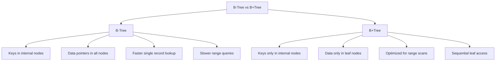
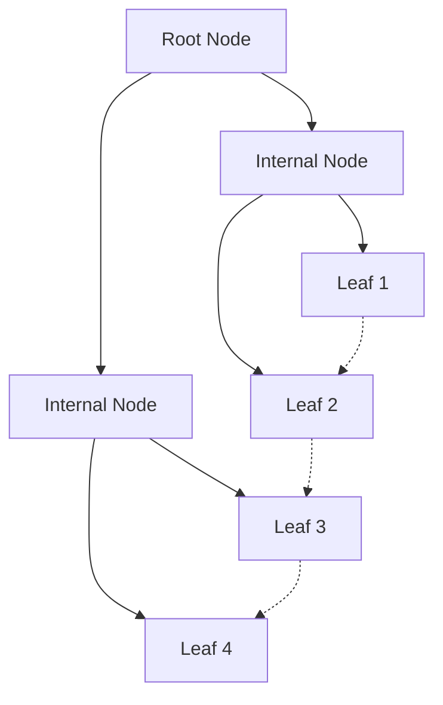
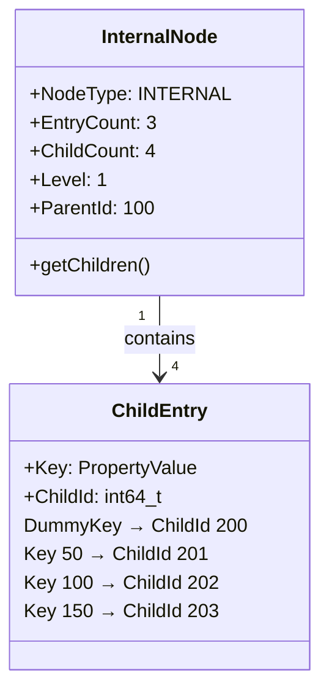
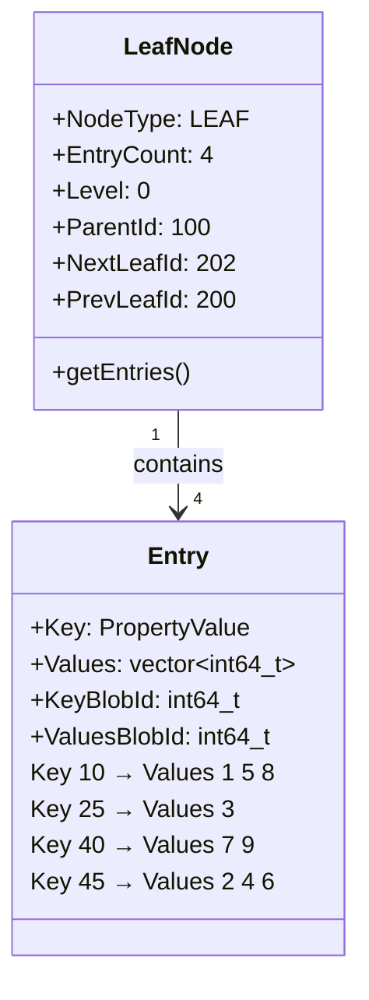
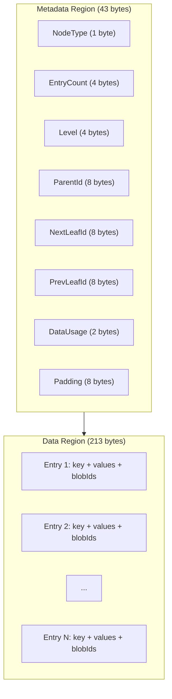
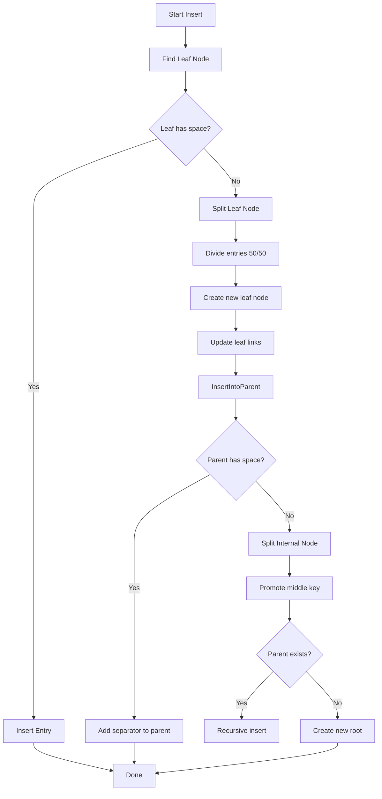
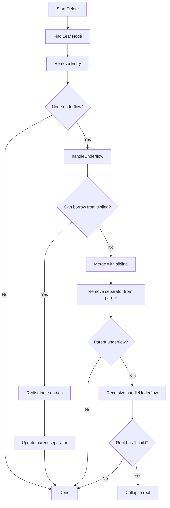
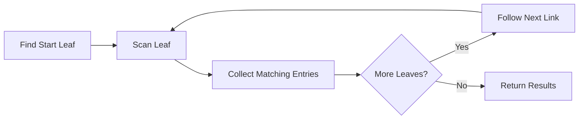

# B+Tree 索引

ZYX 使用 B+Tree 数据结构对标签和属性进行高效索引，支持快速查找、范围查询和有序遍历。该实现针对磁盘存储进行了优化，并通过 blob 存储支持大尺寸键值。

## 概述

B+Tree 是一种自平衡树数据结构，维护有序数据并支持对数时间的搜索、顺序访问、插入和删除操作。它针对数据存储在磁盘上的存储系统进行了优化。

### 核心特性

- **平衡结构**：所有叶子节点处于同一层级
- **有序数据**：按键的排序顺序存储，支持范围查询
- **高扇出**：最小化树高度，减少磁盘 I/O
- **叶子链接**：叶子节点通过双向链表连接，支持顺序访问
- **节点分裂/合并**：插入/删除时自动平衡
- **Blob 支持**：处理超大键和值列表

## B+Tree 与 B-Tree 对比

### 为什么数据库选择 B+Tree？

**主要区别**：

| 特性 | B-Tree | B+Tree |
|------|--------|--------|
| 数据存储位置 | 所有节点 | 仅叶子节点 |
| 叶子链接 | 无 | 双向链接 |
| 范围查询 | 较慢（需遍历树） | 较快（顺序扫描） |
| 扇出 | 较低 | 较高（更多指针） |
| 磁盘 I/O | 范围查询时较多 | 针对顺序访问优化 |

## B+Tree 结构

### 节点布局

**B+Tree 结构**：
- 根节点：第 2 层
- 内部节点：第 1 层
- 叶子节点：第 0 层（全部处于同一层级）
- 叶子节点通过双向链表连接，支持顺序访问

### 内部节点结构

内部节点包含分隔键和子节点指针。每个子节点指针关联一个分隔键，该分隔键划分键空间。第一个子节点使用一个虚拟键（表示负无穷），后续子节点与划分其键范围的关键值配对。

**搜索逻辑**：对于键 K，找到小于或等于 K 的最大分隔键，然后进入对应的子节点。

### 叶子节点结构

叶子节点包含实际的键值对，以及 next 和 previous 叶子指针，构成贯穿所有叶子节点的双向链表。

**条目结构**：每个条目存储索引键、共享该键值的实体 ID 向量以及可选的 blob ID。`keyBlobId` 字段在键本身超过内联阈值时持有对 blob 存储的引用。`valuesBlobId` 字段在实体 ID 列表过大无法内联存储时持有对 blob 存储的引用。

### 节点内存布局

每个 B+Tree 节点占用固定的 256 字节块，分为两个区域：

- **元数据区域**（43 字节）：包含节点类型（叶子或内部）、条目计数、树层级、父节点指针，以及叶子节点的 next/previous 指针。此开销固定不变，不受内容影响。
- **数据区域**（213 字节）：存储实际条目（叶子节点为键值对，内部节点为分隔键-子节点对）。条目按顺序紧凑排列；超大数据会被转移到 blob 存储。

## 节点大小与容量

### 存储参数

ZYX 使用固定 256 字节的节点，与存储块边界对齐。每个节点将 43 字节用于元数据（节点类型、层级、父 ID、叶子链表指针、数据使用量跟踪），213 字节用于实际条目数据。这种布局确保了可预测的 I/O 行为并简化了空间管理。

### 容量计算

**叶子节点条目容量**：
- 小型内联条目：每个节点约 20-30 个条目
- 配合 blob 存储处理超大数据：实际上不限条目数

**内部节点扇出**：
- 典型扇出：每个内部节点 40-50 个子节点
- 100 万条目的树高度：log50(1,000,000) 约为 3-4 层

## 插入算法

### 流程图

### 插入过程详解

当属性值被添加到索引时，系统根据值的类型（integer、string、double、boolean）将其路由到相应的 `IndexTreeManager`。树管理器从根节点开始，通过内部节点的分隔键比较逻辑，逐层向下定位到正确的叶子节点。

如果目标叶子节点有足够的空间，条目按排序顺序插入，操作完成。当叶子节点已满时，执行 50/50 分裂：创建一个新的兄弟叶子节点，条目在原始节点和新节点之间均匀分配，双向叶子链表随之更新。新节点（右侧）的第一个键成为向上传播到父节点的分隔键。

这种传播可能会在父节点也已满时级联发生，导致父节点也进行分裂。在最坏情况下，分裂一直传播到根节点，此时创建一个包含两个子节点的新根节点，树高度增加一层。

### 节点分裂（50/50 分配）

叶子节点分裂将条目在两个节点之间均匀分配。原始节点（左侧）保留前半部分条目，新节点（右侧）接收后半部分条目。分裂后，叶子链表被修复：左侧节点的 next 指针和右侧节点的 previous 指针被更新以维护双向链表。分隔键（右侧节点的第一个键）随后被插入到父节点中。

内部节点分裂遵循相同的 50/50 原则，但包含一个额外步骤：中间键作为分隔键向上提升，而不是留在任一子节点中。

## 删除算法

### 流程图

### 下溢检测

删除条目后，系统检查节点是否已降至下溢阈值以下。阈值设定为总节点大小（256 字节）的 40%，即当节点的数据使用量降至约 102 字节以下时，该节点被视为不饱满。空节点无论阈值如何始终被视为不饱满。

40% 的比率（由 `UNDERFLOW_THRESHOLD_RATIO = 0.4` 定义）平衡了两个因素：较低的阈值会容忍更多的空间浪费并触发更少的合并，而较高的阈值会导致频繁的合并和重分布。所选值允许节点适度稀疏而不触发过多的再平衡操作。

### 重分布

当节点下溢但其兄弟节点有多余条目时，系统在它们之间重新分配条目。对于叶子节点，将左侧兄弟的最后一个条目（或右侧兄弟的第一个条目）移动到不饱满的节点。然后更新父节点的分隔键以反映两个节点之间的新边界。

这种方式优于合并，因为它不会减少节点总数，也避免了将变更进一步向上传播。

### 节点合并

当不饱满的节点和其兄弟节点都过于稀疏而无法进行重分布时，两个节点被合并为一个。对于叶子节点，右侧节点的所有条目被追加到左侧节点，双向叶子链表被更新以跳过被移除的节点。对于内部节点，父节点的分隔键被下拉到合并后的节点中，同时包含两个节点的所有子条目。

合并后，右侧节点被删除，父节点失去一个分隔键-子节点对。这可能导致父节点本身下溢，触发向上递归的再平衡。如果再平衡到达根节点且根节点只剩一个子节点，根节点被收缩（由其唯一子节点替代），树高度减少一层。

## 搜索操作

### 精确匹配搜索

精确匹配搜索从根节点向下遍历到叶子节点。在每个内部节点层级，算法通过找到小于或等于搜索键的最大分隔键来定位适当的子节点。到达叶子层级后，扫描条目以找到精确匹配的键，并返回关联的实体 ID 向量。

**搜索路径**：
1. 从根节点开始
2. 在每个内部节点，使用分隔键找到对应的子节点
3. 向下遍历到叶子层级
4. 扫描叶子节点查找匹配的键并返回其值

**时间复杂度**：O(log_n N)，其中 n 为扇出，N 为总条目数。

### 范围查询

范围查询利用双向链表的叶子结构实现高效的顺序扫描。算法首先沿树下降找到包含范围最小键的叶子节点。从该起始叶子节点开始，按顺序扫描条目，收集所有键在指定范围内的实体 ID。当一个叶子节点扫描完毕后，算法沿 next 指针继续在相邻叶子节点中扫描。当遇到超出最大边界的键或没有更多叶子节点时，扫描停止。

**时间复杂度**：O(log_n N + K)，其中 K 为结果范围内的条目数。对数项用于查找起始叶子节点，线性项用于通过链接叶子节点的顺序扫描。

## Blob 存储与大数据

### 键/值超出内联限制时

每个节点的内联存储空间有限（213 字节数据区域）。当键或值列表超过 32 字节的内联阈值时，会被序列化到独立的 blob 存储区域，节点条目中仅保留 blob ID。

**内联阈值**：
- 内部键：32 字节 —— 超过此长度的键存储为 blob
- 叶子键：32 字节 —— 叶子层级键使用相同阈值
- 叶子值：32 字节 —— 序列化后的值列表须在此限制内

**Blob 存储策略**：

`Entry` 结构在其内联数据旁包含两个 blob ID 字段。当键已被转移到 blob 存储时，`keyBlobId` 字段被设为非零值。类似地，当实体 ID 列表过大时，`valuesBlobId` 被设为非零值。在读取访问时，系统检查这些 blob ID，并在必要时从 blob 存储中检索完整数据。这种双层方法使得常见（小型）条目在节点内保持紧凑，同时支持任意大小的键和值列表而不牺牲节点容量。

## 时间与空间复杂度

### 时间复杂度

| 操作 | 平均情况 | 最坏情况 |
|------|----------|----------|
| 搜索（精确匹配） | O(log N) | O(log N) |
| 插入 | O(log N) | O(log N) |
| 删除 | O(log N) | O(log N) |
| 范围查询 | O(log N + K) | O(log N + K) |
| 顺序扫描 | O(K) | O(K) |

其中：
- N = 总条目数
- K = 结果/范围内的条目数

### 空间复杂度

| 组件 | 空间 |
|------|------|
| 节点大小 | 256 字节（固定） |
| 每节点元数据 | 43 字节 |
| 每节点数据 | 213 字节 |
| 树总大小 | O(N) |

**扇出计算**：
- 指针大小：8 字节
- 键大小：可变（通常 4-16 字节）
- 子条目：约 16-24 字节
- 扇出：213 / 16 约为 13 个子节点（保守估计）
- 实际扇出：优化后 40-50

## 磁盘 I/O 特性

### 每次操作的 I/O

| 操作 | 磁盘读取 | 磁盘写入 |
|------|----------|----------|
| 搜索 | O(log_n N) | 0 |
| 插入 | O(log_n N) | O(log_n N) |
| 删除 | O(log_n N) | O(log_n N) |
| 范围查询 | O(log_n N + K/b) | 0 |

其中：
- n = 扇出（每个内部节点的子节点数）
- N = 总条目数
- K = 结果大小
- b = 分支因子（每个叶子节点的条目数）

### 优化策略

1. **高扇出**：最小化树高度
2. **节点大小**：256 字节与磁盘块对齐
3. **顺序扫描**：叶子链接使范围查询无需重新遍历树
4. **批量操作**：减少批量插入的 I/O

**示例**：100 万条目，扇出 50：
- 树高度：ceil(log50(1,000,000)) = 4 层
- 每次搜索最大 I/O：4 次磁盘读取

## 并发操作

### 加锁策略

`IndexTreeManager` 使用 `std::shared_mutex` 协调并发访问。此读写锁允许多个线程同时执行读操作，同时确保写操作具有独占访问权。

**锁类型**：
- **共享锁**：在读操作（精确匹配搜索、范围查询）时获取。多个读者可以同时持有共享锁，为查找密集型工作负载提供高吞吐量。
- **排他锁**：在写操作（插入、删除、清空）时获取。同一时间只能有一个写者持有锁，所有读者在写操作期间被阻塞。

这种方式适合读密集型访问模式，这在图数据库索引查找中很常见。写操作虽然被串行化，但由于树结构变更（分裂和合并）相对于总操作数来说较为罕见，因此影响有限。

## ZYX 中的应用

### 标签索引

标签索引使用 B+Tree 将标签 token 映射到实体 ID。每个唯一标签都有自己的树根，存储在内存映射中。当节点被分配标签时，节点 ID 被插入到以该标签根为根的树中。查找时遍历树找到标签的条目，返回所有关联的实体 ID。

### 属性索引

属性索引为每种属性值类型维护独立的 `IndexTreeManager` 实例：string、integer、double 和 boolean。这种类型隔离的方法确保树内的比较始终类型一致，避免了跨类型排序的复杂性。

对于每个属性名，按类型跟踪树根。精确匹配查询路由到相应的树管理器并执行标准 B+Tree 查找。范围查询（适用于数值类型）使用前面描述的链接叶子扫描来收集属性值在指定范围内的所有实体 ID。

## 配置参数

### 节点大小

总节点大小固定为 256 字节。此值是一个平衡选择：较大的节点提供更高的扇出和更矮的树，但会增加每次读写节点的 I/O 开销。较小的节点减少单节点 I/O 但需要更多树层级。在 256 字节下，节点可以舒适地容纳在典型存储块大小内，同时为大多数数据集提供足够的扇出。

### 下溢阈值

下溢阈值比率设定为 0.4（40%）。这意味着当节点的数据使用量降至总节点大小的 40% 以下时，该节点被视为不饱满。权衡在于合并频率和空间利用率之间：较低的阈值容忍更多空间浪费但减少再平衡开销，较高的阈值保持节点紧凑但代价是更频繁的合并和重分布。40% 的值提供了实用的平衡。

### 内联阈值

所有内联阈值（内部键、叶子键和叶子值）均设为 32 字节。在此限制内的数据直接存储在节点条目中。超过阈值的数据被转移到 blob 存储，仅在线保留 blob ID。32 字节阈值可以容纳大多数常见属性值（小整数、短字符串、布尔值），同时保持节点条目格式紧凑。

## 性能考量

### 优化技术

1. **批量插入**：`insertBatch` 方法接收一组键值对，排序后合并重复项再插入树中。与逐条插入相比，这减少了树重构操作的次数。

2. **单趟插入**：`tryInsertEntry` 方法将反序列化、插入和序列化合并为对节点数据的单趟操作。避免了将节点反序列化、修改、再序列化为独立步骤的开销。

3. **节点缓存**：频繁访问的节点由页面缓冲池缓存在内存中，减少热索引数据的磁盘 I/O。这对树的上层节点尤其有效，因为每次操作都会访问它们。

### 基准性能

典型性能特征：

| 指标 | 数值 |
|------|------|
| 每叶子节点条目数 | 20-30 |
| 扇出 | 40-50 |
| 树高度（100 万条目） | 3-4 层 |
| 搜索时间 | 约 4 次磁盘读取 |
| 插入时间 | 约 4 次磁盘读取 + 4 次磁盘写入 |
| 范围查询 | O(log N + K/b) |

## 最佳实践

1. **选择性索引**：仅对频繁查询的属性建立索引
2. **使用合适的类型**：为范围查询选择数值类型
3. **批量操作**：批量加载时使用批量插入
4. **监控树高度**：树过高时考虑重建
5. **调整阈值**：根据工作负载特征进行调优

## 源码

- Header: `include/graph/core/IndexTreeManager.hpp`
- Implementation: `src/core/IndexTreeManager.cpp`

## 另见

- [存储系统](/zh/docs/zyx/architecture/storage) - 整体存储架构
