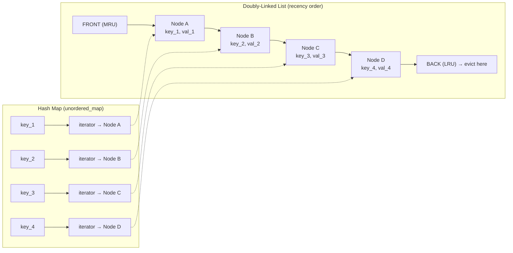
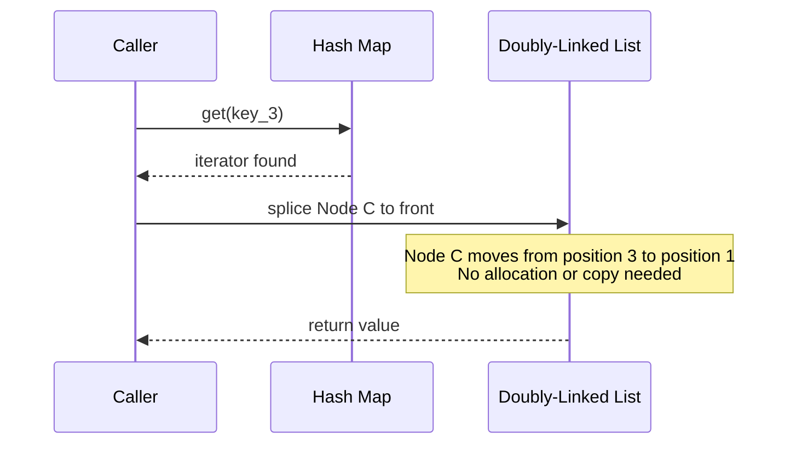
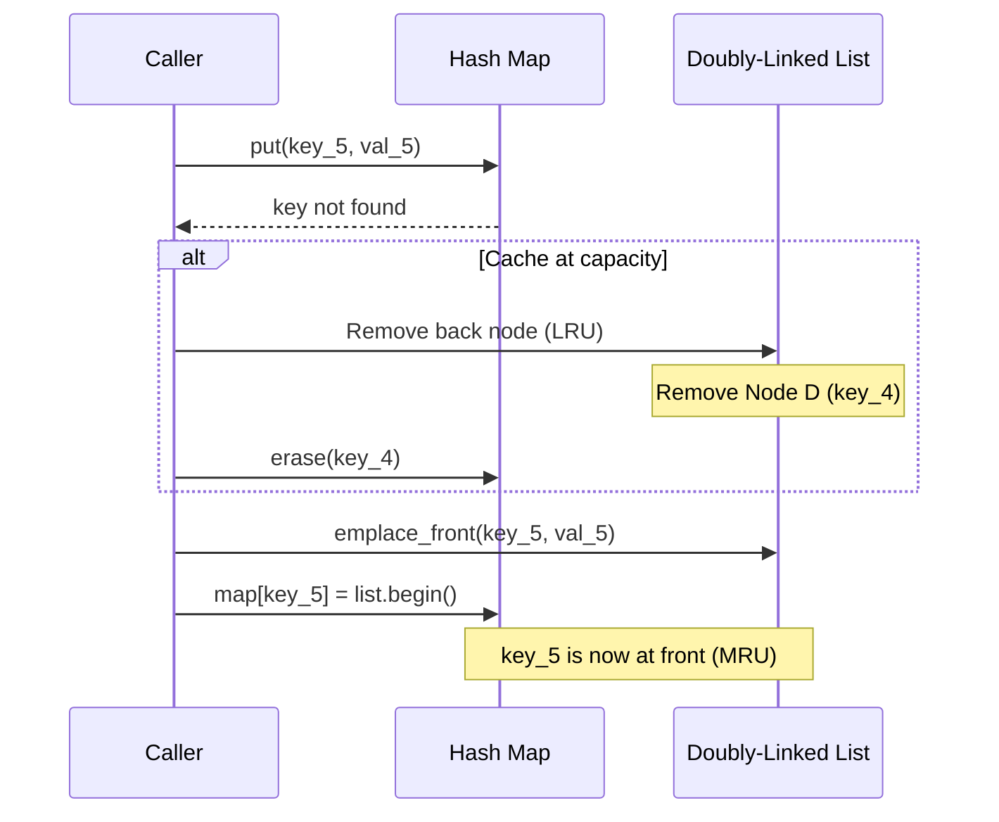
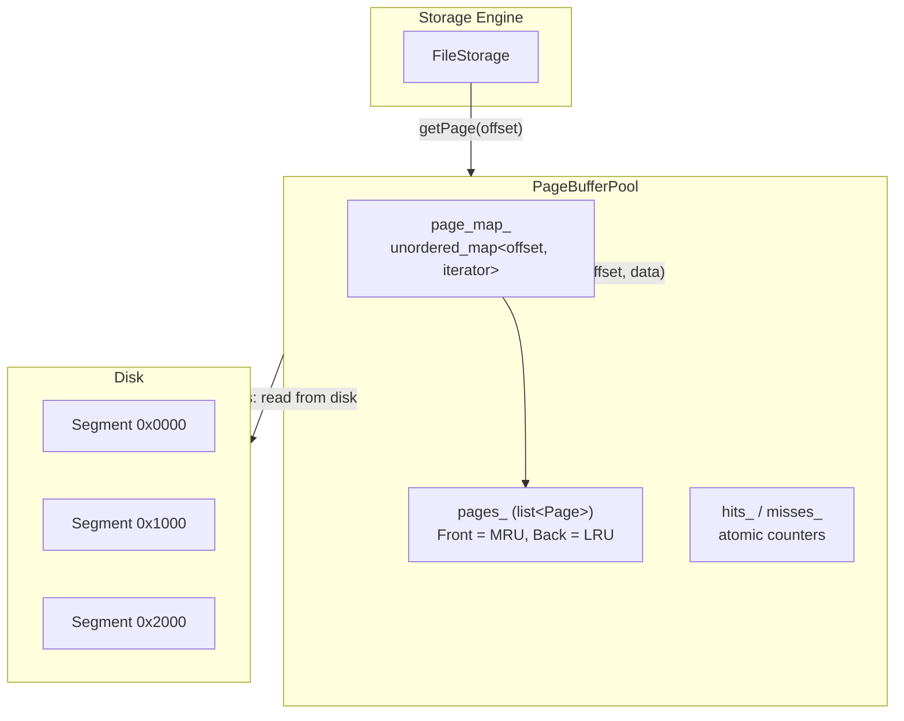
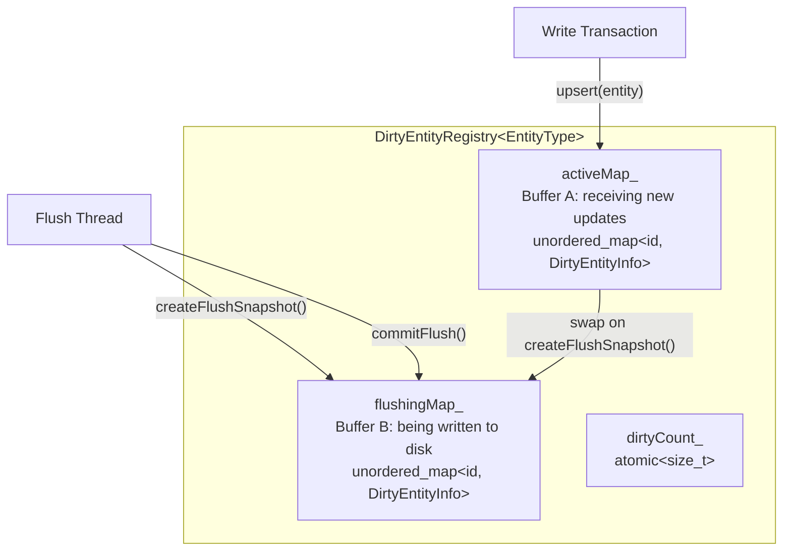

# 缓存淘汰算法

ZYX 使用 LRU（Least Recently Used，最近最少使用）缓存淘汰策略管理内存缓存。核心的 `LRUCache` 模板提供 O(1) 的查找与更新操作，`PageBufferPool` 在存储段级别应用相同策略。修改过的实体通过双缓冲的 `DirtyEntityRegistry` 单独跟踪，支持在刷盘期间进行非阻塞写入。

## 概述

缓存系统基于三个组件构建：

- **LRUCache** -- 通用模板类，使用哈希表加双向链表，提供 O(1) 的 get、put 和淘汰操作
- **PageBufferPool** -- 段级 LRU 缓存，内部基于相同的哈希表加链表模式，将整个存储段作为原始字节页进行缓存
- **DirtyEntityRegistry** -- 双缓冲注册表，通过两个映射（active 和 flushing）跟踪已修改（脏）实体，支持在 I/O 期间进行非阻塞并发写入

源码位置：

- `LRUCache`: `include/graph/storage/CacheManager.hpp`
- `PageBufferPool`: `include/graph/storage/PageBufferPool.hpp`
- `DirtyEntityRegistry`: `include/graph/storage/DirtyEntityRegistry.hpp`

## LRU 缓存数据结构

`LRUCache<K, V>` 模板组合了两个标准容器：

1. 一个 `std::list<std::pair<K, V>>`（双向链表），按访问时间排序 -- 最近使用的在头部，最久未使用的在尾部
2. 一个 `std::unordered_map<K, iterator>`（哈希表），将每个键直接映射到其链表迭代器，实现 O(1) 查找

这种组合使得每个操作都能在常数时间内完成：

| 操作 | 时间复杂度 | 说明 |
|---|---|---|
| `get(key)` | O(1) | 哈希表查找 + `splice` 移至链表头部 |
| `put(key, value)` | O(1) | 哈希表查找 + 链表插入或更新 |
| `remove(key)` | O(1) | 哈希表查找 + 链表删除 |
| `evict()` | O(1) | 移除链表尾部元素 + 从哈希表擦除 |
| `peek(key)` | O(1) | 哈希表查找，不改变顺序 |
| `contains(key)` | O(1) | 仅哈希表查找 |

下图展示了数据结构的内部布局：

## LRU 操作

### Get 操作

当调用 `get(key)` 时：

1. 在哈希表中查找键
2. 如果未找到，递增未命中计数器并返回默认构造的 `V`
3. 如果找到，递增命中计数器，通过 `splice` 将节点移至链表头部，并返回值

`splice` 操作将链表节点从当前位置分离并在 O(1) 时间内重新插入到头部，无需任何内存分配或拷贝。

### Put 操作

当调用 `put(key, value)` 时：

1. 如果容量为 0，立即返回（缓存已禁用）
2. 在哈希表中查找键
3. 如果键已存在，原地更新值并通过 `splice` 将节点移至头部
4. 如果键是新的且缓存已满，淘汰最近最少使用的项（链表尾部），然后在头部插入新条目

### 淘汰

淘汰在 `put` 期间缓存已满时内联执行。最近最少使用的条目始终是链表的尾部元素：

1. 访问 `list.back()` 获取 LRU 键值对
2. 从哈希表中擦除键
3. 从链表中弹出尾部元素

淘汰策略是纯 LRU -- 没有加权评分、没有频率跟踪、没有自适应调整。条目严格按照最后访问的顺序被淘汰。

### 其他操作

除了核心的 get/put/淘汰循环外，`LRUCache` 还提供：

- **`tryPut(key, value)`** -- 非阻塞变体，使用 `std::try_to_lock` 尝试获取写锁。如果锁被争用，直接返回 `false` 而不阻塞。用于并行扫描路径中，等待缓存插入的代价超过缓存未命中的情况。
- **`peek(key)`** -- 返回值但不将节点移至头部。获取共享锁，不会扰乱访问顺序。
- **`remove(key)`** -- 显式移除指定条目，无论其在 LRU 链表中的位置。
- **`snapshot()`** -- 获取共享锁并返回按访问顺序排列的所有键值对的向量副本。
- **`contains(key)`** -- 检查键是否存在，不影响顺序（共享锁）。

## 线程安全模型

`LRUCache` 使用 `std::shared_mutex` 进行读写锁定：

| 操作 | 锁类型 | 原因 |
|---|---|---|
| `get(key)` | 排他锁（`unique_lock`） | 通过 `splice` 修改链表顺序 |
| `put(key, value)` | 排他锁（`unique_lock`） | 修改哈希表和链表 |
| `tryPut(key, value)` | 排他锁（`try_to_lock`） | 非阻塞尝试；争用时跳过 |
| `peek(key)` | 共享锁（`shared_lock`） | 只读；不改变顺序 |
| `contains(key)` | 共享锁（`shared_lock`） | 只读；仅哈希表查找 |
| `size()` | 共享锁（`shared_lock`） | 只读 |
| `snapshot()` | 共享锁（`shared_lock`） | 只读副本 |

注意 `get` 需要排他锁，因为它调用 `splice` 修改链表。真正的只读操作（`peek`、`contains`、`size`、`snapshot`）使用共享锁，允许并发读取。

命中和未命中统计通过 `std::atomic<uint64_t>` 计数器以 `std::memory_order_relaxed` 内存序跟踪，因此不会与互斥锁产生争用。

## 缓存统计

`LRUCache` 和 `PageBufferPool` 都跟踪命中和未命中计数：

- **命中数**：每次 `get` 或 `getPage` 找到请求的条目时递增
- **未命中数**：每次查找失败时递增
- **重置**：`resetStats()` 将两个计数器归零

命中率计算公式为 `hits / (hits + misses)`。这些计数器是原子类型，可以在不获取互斥锁的情况下读取。

## PageBufferPool

`PageBufferPool` 是一个段级缓存，将整个存储段作为原始字节缓冲区存储。它实现了与 `LRUCache` 相同的 LRU 模式，但专门针对页级 I/O：

- **键**：段偏移量（`uint64_t`），标识磁盘上的位置
- **值**：`Page` 结构体，包含段偏移量和 `std::vector<uint8_t>` 原始数据
- **容量**：以页数为单位度量，而非字节数

### 架构

### 操作

**getPage(segmentOffset)**：在哈希表中查找段偏移量。命中时，将页面移至链表头部并返回缓存数据的指针。未命中时返回 `nullptr`，调用方（通常是 `FileStorage`）需要从磁盘读取段并通过 `putPage` 插入。

**putPage(segmentOffset, data)**：如果页面已存在，原地更新数据并移至头部。如果缓存已满，淘汰 LRU 页面（从链表和哈希表中移除）。然后将新页面插入头部。

**invalidate(segmentOffset)**：从缓存中移除指定页面。用于写入操作修改磁盘上的段之后，确保缓存副本不会过时。

**clear()**：清空哈希表和链表中的所有页面。

## 脏实体跟踪

`DirtyEntityRegistry` 跟踪哪些实体（节点和边）已被修改但尚未持久化到磁盘。与简单的集合不同，它使用双缓冲设计，允许在刷盘进行时继续写入。

### 双缓冲设计

### 双缓冲工作原理

每个实体被包装在 `DirtyEntityInfo<EntityType>` 结构体中，记录：

- **EntityChangeType**：`CHANGE_ADDED`、`CHANGE_MODIFIED` 或 `CHANGE_DELETED` 之一
- **Backup**：原始实体状态的可选副本（用于回滚）

刷盘周期如下：

1. **createFlushSnapshot()** -- 调用线程获取排他锁并将 active 映射交换到 flushing 映射。创建一个新的空 active 映射。这将当前的脏实体集合"冻结"，供 I/O 线程写入，同时新的更新流入新的 active 映射。

2. **I/O 写入** -- 遍历 flushing 映射并将每个实体写入磁盘。此操作在注册表锁之外执行，因此不会阻塞新的更新。

3. **commitFlush()** -- 所有写入成功后，在排他锁下清空 flushing 映射。

如果在 `commitFlush()` 之前第二次调用 `createFlushSnapshot()`（正常操作中不应发生），active 映射条目将被合并到现有的 flushing 映射中，而不是覆盖它。

### 并发访问安全

注册表使用 `std::shared_mutex` 保证线程安全：

| 操作 | 锁类型 | 说明 |
|---|---|---|
| `upsert()` | 排他锁 | 写入 active 映射 |
| `remove()` | 排他锁 | 先检查 flushing 映射；如果实体正在被刷盘则拒绝移除 |
| `getInfo()` | 共享锁 | 先检查 active 映射，再检查 flushing 映射 |
| `getAllDirtyInfos()` | 共享锁 | 合并两个映射（active 优先） |
| `copyMergedMap()` | 共享锁 | 返回合并副本用于快照隔离 |
| `contains()` | 共享锁 | 检查两个映射 |
| `createFlushSnapshot()` | 排他锁 | 交换缓冲区 |
| `commitFlush()` | 排他锁 | 清空 flushing 缓冲区 |

`remove()` 操作有一个安全检查：如果实体当前在 flushing 映射中，移除将被拒绝，因为 I/O 线程即将将其写入磁盘。在此时移除会导致内存与磁盘之间的不一致。

## 复杂度分析

| 组件 | 操作 | 时间 | 空间 |
|---|---|---|---|
| LRUCache | get | O(1) | O(capacity) |
| LRUCache | put | O(1) | O(capacity) |
| LRUCache | evict | O(1) | -- |
| LRUCache | peek | O(1) | -- |
| LRUCache | tryPut | O(1) | -- |
| PageBufferPool | getPage | O(1) | O(capacity pages) |
| PageBufferPool | putPage | O(1) | O(capacity pages) |
| PageBufferPool | invalidate | O(1) | -- |
| DirtyEntityRegistry | upsert | O(1) 均摊 | O(脏实体数) |
| DirtyEntityRegistry | getInfo | O(1) | -- |
| DirtyEntityRegistry | createFlushSnapshot | O(1) 交换 | -- |
| DirtyEntityRegistry | commitFlush | O(n)，n = flushing 数量 | -- |

## 最佳实践

1. **合理设置缓存大小**：`LRUCache` 的容量在构造时设定。对于 `PageBufferPool`，容量以页数为单位。选择一个适合工作集且不超过可用内存的大小。
2. **监控命中率**：使用 `hits()` 和 `misses()` 计算命中率。设计良好的缓存在大多数工作负载下应达到 80% 以上的命中率。
3. **在并行路径中使用 tryPut**：当多个线程扫描并填充缓存时，`tryPut` 可避免扫描线程在争用的锁上阻塞。
4. **写入后失效**：修改磁盘上的段之后，调用 `PageBufferPool` 的 `invalidate()` 以防止读取过时数据。
5. **让刷盘周期完成**：不要在 `commitFlush()` 完成之前第二次调用 `createFlushSnapshot()`，因为这会强制进行不必要的合并。

## 另见

- [缓存管理](/zh/docs/zyx/architecture/cache) - 整体缓存架构
- [存储系统](/zh/docs/zyx/architecture/storage) - 持久化存储
- [性能优化](/zh/docs/zyx/architecture/optimization) - 性能调优
