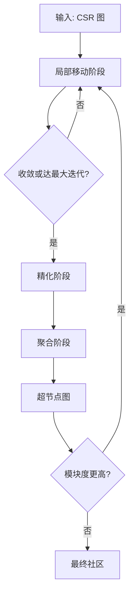

# 社区检测算法

社区检测算法用于识别在组内连接密集但在组间连接稀疏的节点组。这些算法是图分析的基础，可用于社交网络分析、欺诈检测和生物网络解读等任务。

## 概述

ZYX 实现了 **Leiden 算法**进行社区检测，该算法在经典 Louvain 方法的基础上增加了精化阶段以确保社区内部连接。实现使用紧凑的压缩稀疏行（CSR）表示进行高效的图遍历，并支持单线程和通过线程池的并行执行。

### 核心特性

- **Leiden 算法**：在 Louvain 基础上增加精化阶段，确保社区内部连接
- **层级提升**：通过将社区聚合为超节点进行分层聚类
- **CSR 投影**：内存高效（约 16 字节/边）的图表示
- **并行执行**：具有自适应工作线程选择的 BSP（批量同步并行）模型
- **模块度优化**：质量度量（Q ∈ [-0.5, 1]）指导社区形成

## 数学基础

### 模块度

模块度通过比较社区内部的边密度与随机图中的预期边密度来衡量社区划分的质量：

$$
Q = \sum_c \left( \frac{E_c}{m} - \gamma \left( \frac{D_c}{2m} \right)^2 \right)
$$

其中：
- $E_c$ = 社区 $c$ 内部的边权重总和
- $D_c$ = 社区 $c$ 中节点度数的总和
- $m$ = 图中边的总权重
- $\gamma$ = 分辨率参数（默认为 1.0）
- 值越高表示社区结构越好

### 分辨率参数

分辨率参数 $\gamma$ 控制社区大小：
- $\gamma < 1$：更大、更通用的社区
- $\gamma > 1$：更小、更细粒度的社区
- 默认 $\gamma = 1.0$ 提供平衡的结果

## 算法设计

### Leiden 流程

Leiden 算法在每个层级执行三阶段流程：



#### 阶段一：局部移动（模块度优化）

每个节点评估移动到相邻社区以最大化模块度增益：

$$
\Delta Q = \frac{2m}{k_i} \left( \sum_{in} - \gamma \frac{\sigma_{tot}^c}{2m} k_i \right)
$$

其中：
- $k_i$ = 节点 $i$ 的加权度数
- $\sum_{in}$ = 从节点 $i$ 到社区 $c$ 的边权重之和
- $\sigma_{tot}^c$ = 社区 $c$ 的边权重总和

算法使用 **BSP（批量同步并行）** 模型：
1. 所有工作线程读取社区度数和（$\sigma_{tot}$）的一致快照
2. 工作线程独立为其节点分区计算最优移动
3. 原子更新将移动应用回共享状态
4. 重复直到收敛或达到最大迭代次数

#### 阶段二：精化（连接性保证）

局部移动收敛后，精化阶段确保每个社区内部连接：

1. 对每个社区内的边执行并查集（Union-Find）
2. 将断开的组件拆分为单独的社区
3. 应用阈值 $\theta$（默认 0.01）控制拆分的激进程度

这保证了每个层级的社区都是**局部连接的**——这是相比 Louvain 的关键优势，Louvain 可能产生断开的社区。

#### 阶段三：聚合（层级提升）

社区成为收缩图中的超节点：

1. 将原始节点映射到其社区 ID
2. 将社区间边聚合为加权总和
3. 为超节点图构建新的 CSR 投影
4. 在收缩图上重复三阶段流程
5. 将社区 ID 链接回原始节点

### CSR 投影

实现使用紧凑的 CSR（压缩稀疏行）表示：

| 数组 | 大小 | 描述 |
|------|------|------|
| `rowPtr_` | n+1 | 行偏移量指向 colIdx |
| `colIdx_` | E | 目标节点索引 |
| `weights_` | E | 边权重（默认为 1.0）|
| `nodeIds_` | n | 原始节点 ID |

内存占用：每边约 16 字节（而邻接表为 40-80 字节）。

**并行 CSR 构建**：
- 节点在工作线程之间分区
- 每个工作线程为其分区构建线程局部的边列表
- 单一压缩过程组装最终 CSR
- 原子游标处理镜像写入（无向边的两个方向）

### 并行执行模型

实现使用自适应并行化策略：

1. **小图**（< 1024 节点）：串行执行避免线程开销
2. **大图**：通过 `ParallelOperatorExecutor::runRangePartitions` 并行执行
3. **自适应工作线程选择**：`decideParallelExecution` 根据工作负载选择最佳线程数

**BSP 同步点**：
- `sigmaTot` 快照：每个局部移动迭代一次
- 原子更新确保移动计数的正确聚合
- 精化和聚合在并行局部移动后串行运行

## 配置参数

| 参数 | 默认值 | 范围 | 描述 |
|------|--------|------|------|
| `maxIterations` | 20 | 1-100 | 每层局部移动的最大迭代次数 |
| `maxLevels` | 10 | 1-100 | 最大层级提升次数 |
| `resolution` | 1.0 | 0.0-10.0 | 模块度分辨率参数 |
| `refinementThreshold` | 0.01 | -1.0 到 1.0 | 精化阶段的 theta 值 |

### 参数指导

- **小图**（< 1K 节点）：默认参数效果良好
- **大图**（> 100K 节点）：考虑增加 `maxLevels` 以获得更好质量
- **密集图**：降低 `resolution`（如 0.8）以找到更大的社区
- **稀疏图**：提高 `resolution`（如 1.5）以找到更多社区

## 使用方法

### Cypher GDS API

```cypher
// 创建图投影
CALL gds.graph.project("myGraph", "Person", "KNOWS")

// 运行 Leiden 社区检测
CALL gds.leiden.stream("myGraph", {
    maxIterations: 20,
    maxLevels: 10,
    resolution: 1.0,
    refinementThreshold: 0.01
})
YIELD nodeId, communityId
RETURN nodeId, communityId
ORDER BY communityId, nodeId
```

### Python API

```python
from zyx import Graph

g = Graph("my.db")
# 投影图
g.run("CALL gds.graph.project('social', 'Person', 'KNOWS')")

# 运行 Leiden
result = g.run("""
    CALL gds.leiden.stream('social', {maxIterations: 20})
    YIELD nodeId, communityId
    RETURN nodeId, communityId
    ORDER BY communityId
""")
for row in result:
    print(f"Node {row['nodeId']}: Community {row['communityId']}")
```

### C++ API

```cpp
#include "graph/query/algorithm/LeidenEngine.hpp"
#include "graph/query/algorithm/CsrProjection.hpp"

using namespace graph::query::algorithm;

// 从图投影构建 CSR
auto csr = CsrProjection::build(graphProjection, threadPool.get());

// 运行 Leiden
LeidenOptions opts{
    .maxIterations = 20,
    .maxLevels = 10,
    .resolution = 1.0,
    .refinementThreshold = 0.01
};

auto communities = LeidenEngine::run(*csr, opts, threadPool.get());

// 检查模块度质量
double q = LeidenEngine::modularity(*csr, communityOf, 1.0);
printf("Modularity Q = %.4f\n", q);
```

## 性能特征

### 时间复杂度

| 阶段 | 复杂度 |
|------|--------|
| CSR 构建 | O(n + m) |
| 局部移动（每次迭代）| O(n + m) |
| 精化 | O(n + m) α(n) |
| 聚合 | O(n + m) |

其中 $n$ = 节点数，$m$ = 边数，α = 逆阿克曼函数（实际为常数）。

### 空间复杂度

| 组件 | 空间 |
|------|------|
| CSR | O(n + m) |
| 社区分配 | O(n) |
| sigmaTot（原子）| O(n) |

总计：O(n + m) ≈ 每边约 16 字节

### 基准测试结果

基于内部基准测试（参见 commit `b6311b2c`）：

| 图规模 | 局部移动加速 | CSR 构建加速 |
|--------|-------------|-------------|
| 小型（<1K）| ~1x（串行）| ~1x（串行）|
| 中型（10K-100K）| ~1.27-1.35x | ~1.1x |
| 大型（>100K）| ~1.35x | ~1.1x |

结果在自动线程系统上收集，具有自适应并行性。

## 优势与局限

### 优势

- **质量保证**：精化确保内部连接的社区
- **层级性**：层级提升揭示多尺度社区结构
- **高效性**：CSR 表示最小化内存和遍历成本
- **可扩展性**：并行 BSP 模型处理大型图
- **可调性**：分辨率参数控制社区粒度

### 局限

- **非确定性**：不同运行可能产生不同的划分（尽管质量相似）
- **局部最优**：贪婪局部移动可能错过全局最优
- **内存密集**：完整 CSR 需要图加载到内存中
- **分辨率权衡**：单一分辨率参数可能不适合所有社区结构

## 另见

- [查询优化](/zh/docs/zyx/algorithms/query-optimization) - 算法执行上下文
- [关系遍历](/zh/docs/zyx/algorithms/relationship-traversal) - 图遍历内部实现
- [用户指南：高级查询](/zh/docs/zyx/user-guide/advanced-queries) - GDS 过程参考