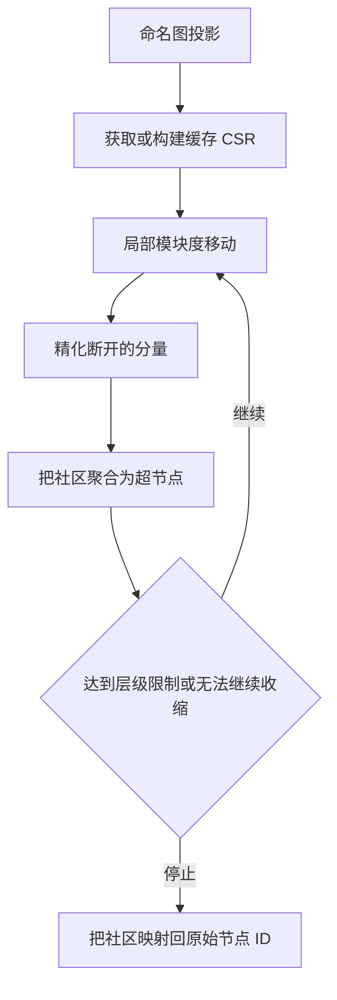

# Leiden 社区检测

ZYX 在命名 GDS 图投影上实现了分层 Leiden 社区检测。Leiden 通过贪心方式提升模块度，精化断开的部分，再把社区收缩为超节点并进入下一层。

对于社交图或相似度图，应创建 `UNDIRECTED` 投影，让每条存储关系贡献两个方向。投影中配置的属性权重或常量权重会直接用于模块度优化。

## 运行 Leiden

先创建投影，再使用 options Map 调用 `gds.leiden.stream`：

```cypher
CALL gds.graph.project('social', {
    nodeLabels: 'Person',
    relationships: {
        KNOWS: {
            orientation: 'UNDIRECTED',
            weightProperty: 'strength',
            defaultWeight: 1.0
        }
    }
})
```

```cypher
CALL gds.leiden.stream('social', {
    maxIterations: 20,
    maxLevels: 10,
    resolution: 1.0,
    refinementThreshold: 0.01,
    concurrency: 0
})
YIELD nodeId, communityId
RETURN nodeId, communityId
ORDER BY communityId, nodeId
```

该过程为每个投影节点返回一行：

| 字段 | 类型 | 含义 |
|---|---|---|
| `nodeId` | 整数 | 原始数据库节点 ID |
| `communityId` | 整数 | 本次运行生成的稠密社区 ID |

社区 ID 只用于标识单次结果中的划分。不要把其数值当作跨投影重建或跨运行稳定的标识符。

## 参数

| 参数 | 默认值 | 校验规则 | 含义 |
|---|---:|---|---|
| `maxIterations` | `20` | 正整数 | 每个层级的最大局部移动迭代次数 |
| `maxLevels` | `10` | 正整数 | 最大层级数 |
| `resolution` | `1.0` | 正有限数值 | 值越大，越倾向于较小社区 |
| `refinementThreshold` | `0.01` | 非负有限数值 | 精化阶段接受拆分所需的最小增益；`0` 禁用精化 |
| `concurrency` | `0` | 非负整数 | 工作线程数；`0` 使用运行时默认值，`1` 强制串行执行 |

`threadCount` 可以作为 `concurrency` 的别名，也支持 snake_case 参数名。推荐使用 options Map，因为随着控制项增加，它仍然清晰且具备扩展性。

同时支持位置参数形式：`gds.leiden.stream(graphName[, maxIterations, resolution[, threadCount[, maxLevels[, refinementThreshold]]]])`，但 options Map 是主要 API。

## 执行流水线



### 局部移动

每个节点检查相邻社区，并在模块度增益为正时移动。并行 worker 通过原子值读取最新社区标签，因此局部移动可以采用异步更新，同时避免并发读写未定义行为。每个社区的度数总和也使用原子更新。

节点数少于 1,024 的图使用串行 executor 路径，以避免分区开销。更大的工作负载会在该过程的线程池中分区执行。

### 精化

ZYX 使用 Union-Find 查找当前社区内部的连通分量。最大分量保留父标签，其他分量只有在模块度增益达到 `refinementThreshold` 时才会被拆分；将阈值设为 0 会禁用该阶段。

### 聚合

社区被收缩为带权重的超节点 CSR。社区之间的弧按权重合并，算法在更小的图上重复执行，再把各层结果链接回原始节点 ID。

## CSR Cache 与内存

Leiden 会向投影 catalog 请求紧凑 CSR 表示。第一次 Leiden 调用会惰性构建 CSR；同一命名投影的后续调用会直接复用。可以用以下查询检查 cache 状态和内存估算：

```cypher
CALL gds.graph.list('social')
YIELD name, nodeCount, edgeCount, hasCsr, memoryBytes, csrMemoryBytes, stale
RETURN name, nodeCount, edgeCount, hasCsr, memoryBytes, csrMemoryBytes, stale
```

主要时间与存储特征如下：

| 阶段 | 时间 | 额外空间 |
|---|---|---|
| CSR 构建 | 与投影节点数和弧数线性相关 | 与投影节点数和弧数线性相关 |
| 每轮局部移动 | 与遍历的投影弧数线性相关 | 与投影节点数线性相关 |
| 精化 | 近线性的 Union-Find 遍历 | 与投影节点数线性相关 |
| 聚合 | 与投影节点数和弧数线性相关 | 与收缩图规模线性相关 |

参数调优时应复用同一个投影，以摊销 CSR 构建成本。分析结束后删除投影，释放邻接表与 CSR 内存。

## 快照语义

命名投影是不可变快照。投影创建后的数据库变更会把它标记为 `stale`，但不会改变 Leiden 看到的数据。需要当前图数据时应重建失效投影：

```cypher
CALL gds.graph.drop('social')
```

并行异步移动可能使不同运行产生不同的社区 ID 数值或等价划分。应比较划分质量与成员关系，而不是直接比较 `communityId` 数值。

## 调优建议

- 从默认参数开始；对称社区结构优先使用 `UNDIRECTED` 投影。
- 提高 `resolution` 会倾向于更小社区，降低它会倾向于更大社区。
- 仅当局部移动因迭代次数限制而停止时，再提高 `maxIterations`。
- 大图在达到层级限制时仍持续收缩，可提高 `maxLevels`。
- 小图或调试场景可以设置 `concurrency: 1`，使用开销最低的串行路径。
- 除非业务明确接受断开的部分保留在同一标签下，否则应保持精化开启。

## 另见

- [GDS 图投影](/zh/docs/zyx/algorithms/graph-projections) - 投影 schema、catalog、权重与生命周期
- [高级查询](/zh/docs/zyx/user-guide/advanced-queries) - 内置过程总览
- [关系遍历](/zh/docs/zyx/algorithms/relationship-traversal) - 持久化图遍历内部实现
