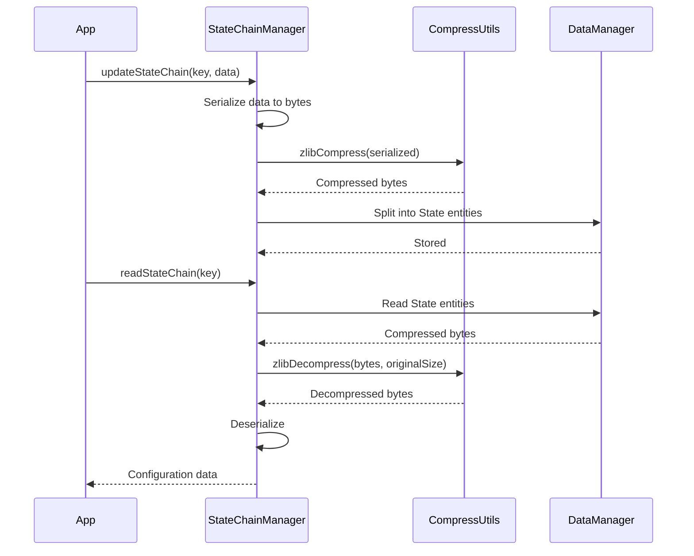

# 压缩

ZYX 使用 **zlib (DEFLATE)** 对状态链和大型数据段进行无损压缩。压缩可以减少存储占用和 I/O 带宽，同时保证数据完整性。

## 压缩的应用场景

压缩主要应用于以下两种场景：

- **状态链**：由 `StateChainManager` 管理的配置数据（索引元数据、根 ID 映射、键类型映射）在存储前会先序列化并压缩。读取时，数据会被解压并反序列化。
- **大型数据段**：超过实用内联阈值的数据会以 Blob 实体的形式外部存储，这些数据可能会被压缩。

## 压缩 API

压缩层提供两个函数：

| 函数 | 用途 |
|------|------|
| `zlibCompress(data)` | 使用 zlib DEFLATE 压缩原始字节 |
| `zlibDecompress(data, originalSize)` | 解压还原为原始字节 |

两个函数均在内部处理内存分配，并验证压缩/解压结果。失败时会抛出异常（在覆盖率模式下，错误会被记录到日志而非抛出异常）。

## 状态链压缩流程

当 `StateChainManager` 写入配置数据时：

1. **序列化**：将配置对象（根 ID、键类型映射、启用标志）序列化为二进制字节流
2. **压缩**：使用 `zlibCompress()` 压缩序列化后的字节
3. **拆分**：如果压缩后的数据超过单个 State 实体的容量，则拆分到多个 State 实体形成链式结构
4. **存储**：每个 State 实体通过 `DataManager` 写入存储层

读取时，流程反向执行：读取 State 实体，拼接数据，解压，然后反序列化。

## 性能特征

| 指标 | 典型值 |
|------|--------|
| 压缩率（索引元数据） | 缩减 60-80% 体积 |
| 压缩速度 | ~100 MB/s |
| 解压速度 | ~200 MB/s |
| 状态链开销 | 每条链一个段（128 KB） |

压缩在写入时执行，解压在读取时执行。由于状态链属于配置数据（而非查询结果数据），性能影响可以忽略不计——状态链仅在启动时读取，并在索引生命周期变更时写入。

## 源码位置

| 组件 | 路径 |
|------|------|
| CompressUtils | `include/graph/utils/CompressUtils.hpp` |
| StateChainManager | `include/graph/core/StateChainManager.hpp` |
