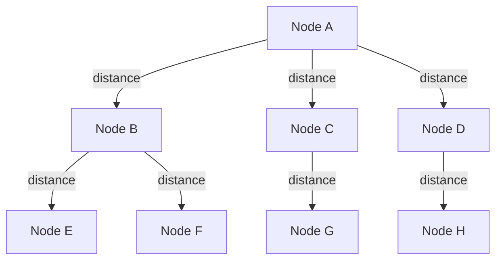
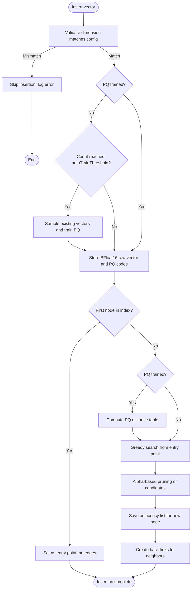
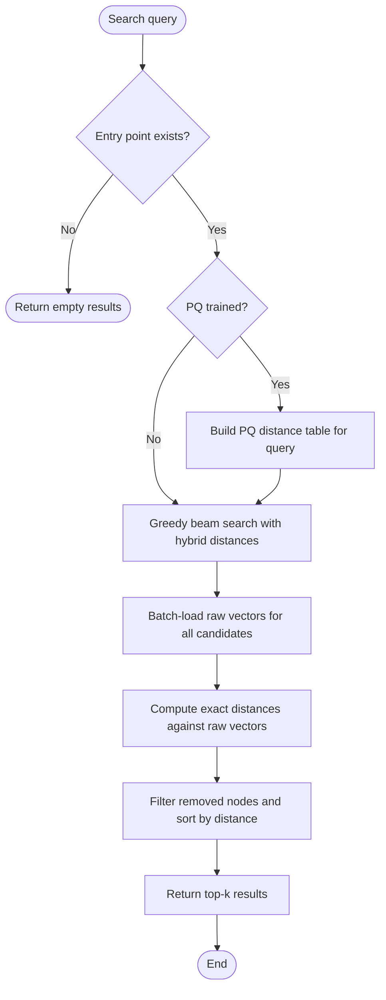
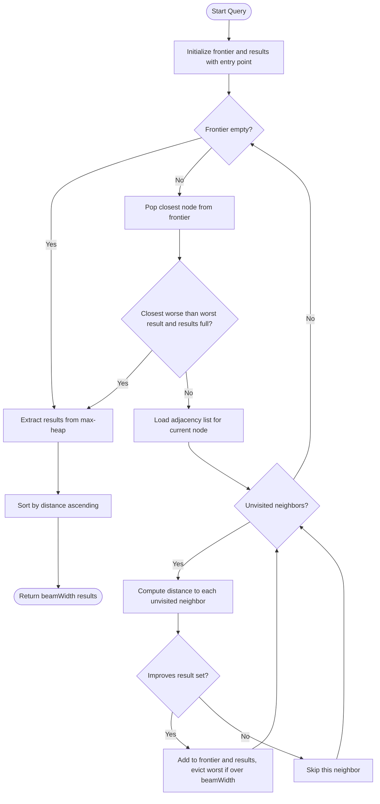
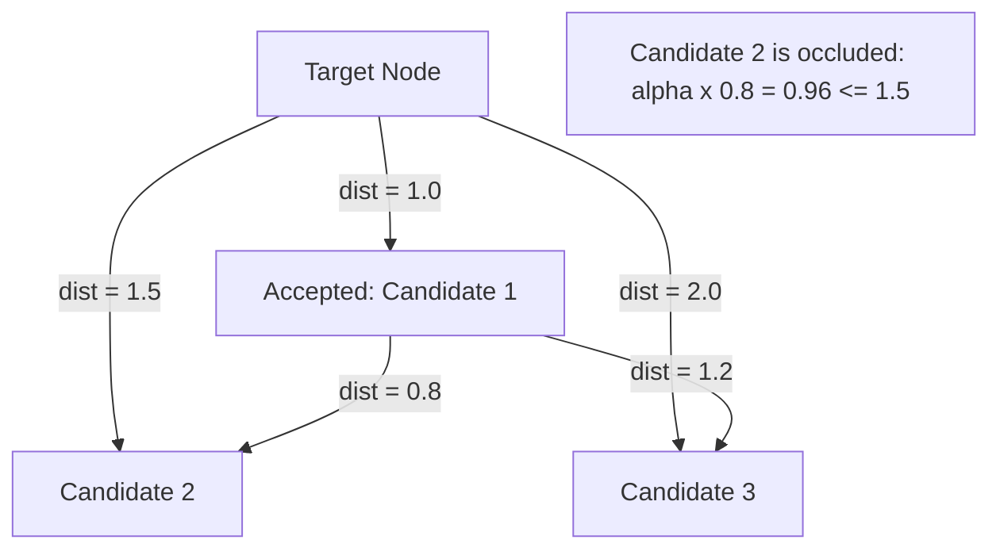
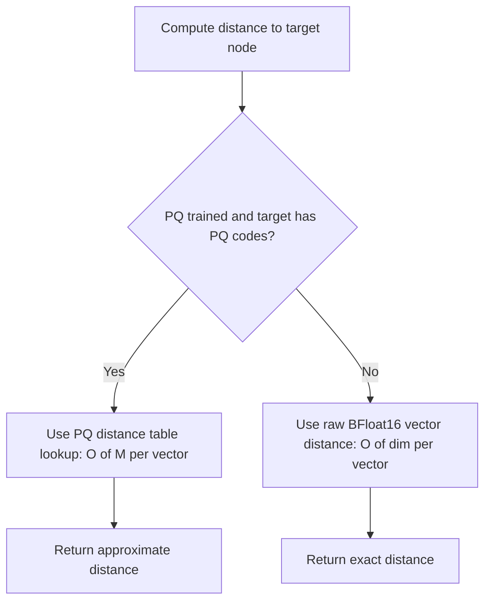

# DiskANN 算法

DiskANN（Disk-based Approximate Nearest Neighbor）是一种高性能的基于图的近似最近邻搜索算法，适用于高维向量空间。ZYX 使用 DiskANN 驱动向量相似度搜索操作，并支持 Product Quantization（PQ）以提升内存效率。

## 概述

::: info 算法背景
DiskANN 由 Microsoft Research 开发，专门用于大规模向量数据集上的高效近似最近邻（ANN）搜索。它通过基于图的索引和智能剪枝策略，实现了亚毫秒级查询延迟和高召回率。
:::

DiskANN 构建一个可导航小世界图，其中向量作为节点通过边连接到其近似最近邻。算法使用：

- **图结构**：可导航小世界图，用于高效遍历
- **贪心搜索**：有界宽度的束搜索，用于快速查询
- **鲁棒剪枝**：基于 alpha 的剪枝以维持图质量
- **Product Quantization**：有损压缩以实现内存高效存储
- **混合模式**：结合 PQ 和原始向量以平衡性能

### 核心特性

::: tip 核心特性
- **可扩展性**：高效处理数百万向量
- **准确性**：高召回率，精度可调
- **内存效率**：PQ 压缩减少内存占用 8-32 倍
- **快速搜索**：亚毫秒级查询延迟
- **动态更新**：支持增量插入和删除
:::

## 图结构

图构建为有向图，每个节点（向量）维护与其最近邻的连接。每个图节点存储三类数据：

- **标识**：唯一节点标识符，映射到数据库中的一个向量
- **向量数据**：高维向量本身，以 BFloat16 格式存储（每维度 2 字节）
- **邻接表**：最多 `maxDegree` 个邻居节点标识符



### 图属性

- **最大度数**：每个节点维护最多 `maxDegree` 条出边（默认：64）
- **入口点**：指定一个节点作为搜索起点
- **双向边**：边在两个方向创建，以实现高效遍历

## 配置

DiskANN 索引通过 `DiskANNConfig` 进行配置，参数如下：

| 参数 | 类型 | 默认值 | 描述 |
|------|------|--------|------|
| `dim` | `uint32_t` | 必填 | 向量空间维度 |
| `beamWidth` | `uint32_t` | 100 | 搜索束宽，控制候选队列大小 |
| `maxDegree` | `uint32_t` | 64 | 每个节点的最大邻居数 |
| `alpha` | `float` | 1.2 | 剪枝因子，控制图密度（范围：1.0-2.0） |
| `autoTrainThreshold` | `size_t` | 2000 | 触发自动训练 PQ 的向量数量 |
| `metric` | `string` | `"L2"` | 距离度量：`"L2"`、`"IP"` 或 `"Cosine"` |

::: details 配置详情
- **dim**：向量空间维度，必须与索引的向量维度匹配
- **beamWidth**：束搜索宽度，控制搜索期间候选队列大小
- **maxDegree**：图中每个节点维护的最大邻居数
- **alpha**：剪枝因子，控制图的剪枝激进程度
- **autoTrainThreshold**：自动触发 PQ 训练的向量数阈值
- **metric**：距离度量类型，支持 L2、IP（内积）和 Cosine
:::

### 参数调优

::: tip 调优指南
根据使用场景调整参数：
- **高召回率优先**：增大 `beamWidth` 和 `maxDegree`
- **速度优先**：减小 `beamWidth` 和 `maxDegree`
- **内存受限**：减小 `maxDegree`，使用更激进的 PQ
:::

| 参数 | 效果 | 范围 | 推荐 |
|------|------|------|------|
| `beamWidth` | 搜索质量 vs 速度 | 50-200 | 100 均衡 |
| `maxDegree` | 图连通性 | 32-128 | 64 适用于大多数场景 |
| `alpha` | 剪枝激进程度 | 1.0-2.0 | 1.2 质量较好 |
| `autoTrainThreshold` | 何时训练 PQ | 1000-10000 | 2000 适合启动 |

## 核心操作

### 插入向量

向索引中插入新向量遵循多阶段流水线：验证输入、可选训练 PQ 模型、存储向量数据、通过贪心搜索发现邻居、剪枝边集，以及建立双向链接。



插入流水线按以下步骤执行：

1. **维度验证**：检查输入向量的维度是否与配置的 `dim` 值匹配。如果不匹配，跳过插入并记录错误。

2. **自动训练检查**：如果 PQ 尚未训练，索引递增内部节点计数。当计数达到 `autoTrainThreshold` 时，索引采样现有向量并同步训练 PQ 模型。

3. **数据存储**：原始向量转换为 BFloat16 格式（每维度从 4 字节减半到 2 字节）并持久化。如果 PQ 已训练，向量还会编码为紧凑的 PQ 码（每个子空间 1 字节）并一起存储。

4. **首节点快捷路径**：如果索引尚无入口点，新节点成为入口点，邻接表为空，插入完成。

5. **邻居发现**：为新向量计算 PQ 距离表（如果 PQ 可用），然后从入口点执行贪心束搜索以发现近似最近邻。

6. **剪枝**：候选邻居列表经过基于 alpha 的剪枝，移除冗余边同时维持图的可导航性。

7. **建立链接**：剪枝后的邻接表保存到新节点。通过将新节点添加到每个邻居的邻接表来创建反向链接。如果邻居的邻接表超过 `maxDegree * 1.2`，该邻居也会被剪枝。

**复杂度**：O(beamWidth x maxDegree x dim)

### 搜索

搜索使用两阶段混合方法查找 k 个最近邻：基于 PQ 近似距离的图导航，随后使用原始 BFloat16 向量的精确距离进行重排。



搜索过程如下：

1. **距离表构建**：如果 PQ 已训练，预计算距离表。表中存储查询的每个子空间到每个质心的距离，使得图遍历期间的每次距离查找为 O(numSubspaces)。

2. **贪心束搜索**：从入口点开始，算法使用束搜索遍历图。导航期间，混合距离函数对有 PQ 码的节点使用 PQ 表查找，对 PQ 训练前插入的节点回退到原始向量距离。

3. **重排**：束搜索产生最多 `max(beamWidth, k * 2)` 个候选结果后，批量加载所有候选的原始 BFloat16 向量。计算这些原始向量的精确距离以产生最终排名。

4. **过滤和排序**：移除已被逻辑删除的节点（返回无穷大距离）。剩余结果按距离排序并截断至请求的 k 值。

**复杂度**：O(beamWidth x maxDegree x dim + k x dim)

## 贪心搜索算法

核心遍历算法使用带有两个优先队列的束搜索：用于扩展的最小堆前沿（最近的节点优先探索）和用于结果集的最大堆（支持有界驱逐最差候选）。

### 搜索流程



算法按以下步骤执行：

1. **初始化**：评估入口点并压入前沿最小堆和结果最大堆。标记为已访问。

2. **扩展循环**：从前沿弹出最近的节点。从存储加载其邻接表。

3. **邻居评估**：对于每个未访问的邻居，混合距离函数计算近似或精确距离。如果邻居比结果集中最差结果更近（或结果集未满），将其添加到两个堆中。

4. **有界结果集**：当结果集超过 `beamWidth` 时，从最大堆中驱逐最远元素。

5. **提前终止**：如果前沿上最近的未展开节点比满结果集中的最差结果更远，搜索提前终止，因为不可能有改善。

6. **输出**：结果最大堆排入排序向量，按距离升序返回。

**复杂度**：O(beamWidth x maxDegree x dim)

## 剪枝策略

鲁棒剪枝通过移除冗余边来维持图质量。核心思想是：如果已接受的邻居已经提供了到达向量空间同一区域的相似或更好路径，则候选邻居是不必要的。

### 基于 Alpha 的遮挡

当一个已接受的邻居"足够接近"候选时，该候选被认为**被遮挡**。形式化地说，如果存在已接受的邻居 `N`，候选 `C` 被遮挡的条件是：

```
alpha x distance(N, C) <= distance(node, C)
```

当 `alpha = 1.0` 时，候选仅在比任何已接受邻居更接近目标节点时才被保留。更高的 alpha 值（最高 2.0）使遮挡条件更难满足，产生更密集的图（更多边、更高召回率），但代价是更多内存和搜索时间。



上图中，Candidate 2 被遮挡，因为已接受的 Candidate 1 与 Candidate 2 非常接近（0.8）。使用 `alpha = 1.2`，遮挡检查为 `1.2 x 0.8 = 0.96 <= 1.5`，因此 Candidate 2 被剪枝。Candidate 3 未被遮挡，因为 `1.2 x 1.2 = 1.44 > 2.0`。

### 剪枝算法步骤

1. **加载目标向量**：加载目标节点的原始 BFloat16 向量并转换为 float32。

2. **计算候选距离**：使用原始向量计算目标节点到每个候选的距离以保证准确性。候选按距离升序排列。

3. **迭代选择**：从最近到最远处理候选。对于每个候选，加载其原始向量并检查所有已接受的候选。如果任何已接受候选满足遮挡条件，当前候选被丢弃。

4. **容量限制**：当接受 `maxDegree` 个候选时停止。

5. **向量缓存**：已接受候选的向量在剪枝循环期间缓存在内存中，以避免后续候选检查时的冗余 I/O。

**复杂度**：O(maxDegree^2 x dim)

## Product Quantization 集成

Product Quantization（PQ）将高维向量压缩为紧凑码，通过预计算查找表实现快速近似距离计算。

### PQ 工作原理

维度为 `D` 的向量被拆分为 `M` 个子向量，每个维度为 `D/M`。例如，768 维向量被拆分为 96 个 8 维子向量（subDim = 8 为默认值）。每个子空间有自己的由 256 个质心组成的码本，通过 K-Means 学习。向量通过在每个子空间中找到最近质心来编码，产生 `M` 字节的紧凑码（每个子空间一字节）。

### PQ 训练

当插入向量数量达到 `autoTrainThreshold`（默认：2000）时自动触发训练。训练过程：

1. 使用蓄水池采样从索引中采样现有原始向量
2. 确定子空间配置：`M = dim / 8` 个子空间，每个维度 8
3. 在每个子空间上独立运行 K-Means 聚类（15 次迭代，256 个质心）
4. 将生成的码本持久化到存储

子空间数 `M` 必须整除向量维度。对于 768 维向量，产生 96 个码本，每个包含 256 个 8 维质心。

训练可以并行化：当配置了线程池时，子空间在线程间并发训练。对于较小的子空间数（32 个或更少），线程分发的开销超过收益，因此训练顺序执行。

### PQ 编码

训练完成后，每个向量按以下步骤编码：

1. 将向量拆分为 `M` 个子向量
2. 对于每个子向量，通过计算到所有 256 个候选的 L2 平方距离来找到码本中最近的质心
3. 将质心索引存储为单字节

这产生每个向量 `M` 字节的紧凑码，根据原始向量大小实现 8-32 倍压缩。

### PQ 距离计算

距离不通过将 PQ 码解码回向量来计算，而是使用预计算的距离表高效计算：

1. **表构建**：对于每个查询，构建大小为 `M x 256` 的距离表。条目 `[m][c]` 存储查询的子向量 `m` 与质心 `c` 之间的 L2 平方距离。

2. **表查找**：计算查询与任何编码向量的近似距离时，算法将每个子空间码对应的表条目求和。这是每个向量 O(M) 的操作，并应用循环展开以提高效率。

### 混合模式

ZYX 使用混合方法，PQ 码和原始 BFloat16 向量共存：



这种混合设计具有重要意义：

- **图导航**：贪心搜索期间，对有 PQ 码的节点使用 PQ 距离。速度快（每次距离 O(M)）但为近似值。
- **最终重排**：图遍历完成后，使用原始 BFloat16 向量的精确距离产生最终排名结果。
- **向后兼容**：PQ 训练前插入的节点没有 PQ 码。距离函数对这些节点自动回退到原始向量计算。
- **无回溯编码**：PQ 训练触发时，现有节点不会重新编码。只有新插入的节点会获得 PQ 码。

## 距离度量

ZYX 支持三种向量相似度计算的距离度量：

### L2 距离（欧氏）

计算两个向量之间的欧氏距离平方。这是默认度量，适用于大多数场景。平方形式避免了不必要的平方根运算同时保持排序。

```
dist(A, B) = sum of (A[i] - B[i])^2 for all dimensions i
```

### 内积（IP）

计算负内积。结果取负以使搜索中使用的最小堆优先队列返回最相似（最高内积）的向量。

```
dist(A, B) = -(sum of A[i] * B[i] for all dimensions i)
```

### 余弦相似度

计算负余弦相似度。与 IP 类似，结果取负以适应最小堆排序。此度量对向量幅度不变，适合比较不同范数的向量。

```
dist(A, B) = -(dot(A, B) / (||A|| * ||B||))
```

## BFloat16 存储

所有原始向量以 BFloat16（Brain Float 16）格式存储，与标准 float32 相比减少 50% 内存使用，同时保持向量相似度任务所需的足够精度。BFloat16 保留与 float32 相同的指数范围（8 位指数）但降低尾数精度（7 位尾数），非常适合近似最近邻工作负载——其中精确数值精度不如表示范围重要。

## 时间复杂度分析

| 操作 | 复杂度 | 说明 |
|------|--------|------|
| 插入 | O(beamWidth x maxDegree x dim) | 包含搜索和剪枝 |
| 搜索 | O(beamWidth x maxDegree x dim + k x dim) | 束搜索 + 重排 |
| 剪枝 | O(maxDegree^2 x dim) | 成对距离检查 |
| PQ 训练 | O(samples x dim x iterations) | 每个子空间的 K-Means 聚类 |
| PQ 编码 | O(dim) | 子空间量化 |
| PQ 距离 | O(numSubspaces) | 表查找 |

## 空间复杂度分析

| 组件 | 空间 | 说明 |
|------|------|------|
| 原始向量 | O(n x dim x 2 bytes) | BFloat16 存储 |
| PQ 码 | O(n x numSubspaces) | 每个向量每个子空间 1 字节 |
| 图边 | O(n x maxDegree) | 每条边 8 字节 (int64) |
| PQ 码本 | O(dim x 256) | 所有向量共享 |
| 距离表 | O(numSubspaces x 256) | 每次查询，临时 |

以 n = 1M 向量、dim = 768 为例：
- 原始向量：~1.5 GB（BFloat16）
- PQ 码：~96 MB（96 个子空间）
- 图边：~512 MB（64 条边/节点 x 8 字节）
- **总计**：~2.1 GB

## 性能特征

### 搜索延迟

| 数据集大小 | 延迟 (P=0.9) | Recall @10 |
|-----------|--------------|------------|
| 100K | 0.5 ms | 95% |
| 1M | 1.2 ms | 93% |
| 10M | 2.8 ms | 90% |

### 构建性能

| 操作 | 吞吐量 | 说明 |
|------|--------|------|
| 插入 | 10K vectors/sec | 包含图更新 |
| PQ 训练 | 5K vectors/sec | 一次性开销 |
| 批量插入 | 50K vectors/sec | 使用延迟反向链接的优化路径 |

### 内存效率

| 配置 | 内存/向量 | 压缩比 |
|------|----------|--------|
| 仅原始 | 1536 bytes (768D BF16) | 1x |
| PQ (8D) | 96 bytes (96 subspaces) | 16x |
| PQ (4D) | 192 bytes (192 subspaces) | 8x |

## 最佳实践

::: tip 性能优化
1. **降维**：索引前使用 PCA 降至 128-256 维
2. **向量归一化**：余弦相似度请归一化向量
3. **批量插入**：分批插入向量以获得更好的 PQ 训练结果
4. **调整束宽**：增大提高召回率，减小提升速度
5. **平衡度数**：在连通性和内存之间权衡
6. **训练样本**：使用代表性样本以获得最佳压缩
7. **度量选择**：根据使用场景选择合适的距离度量
:::

## 限制与注意事项

::: warning 已知限制
- **内存占用**：原始向量仍需存储用于重排，因此 PQ 仅减少图导航的开销
- **训练要求**：PQ 需要足够的训练数据（建议最少 1000 个样本）
- **空间回收**：删除仅为逻辑删除（blob 指针置零），空间不会立即回收
- **更新方式**：向量更新通过先删除再插入实现
- **维度限制**：高维度（>1000）可能需要降维以获得最佳性能
- **剪枝精度**：即使 PQ 可用，剪枝也始终使用原始向量计算距离以维持图质量
:::

::: tip 内存优化
如果内存受限，可以：
1. 提高 PQ 压缩比（减小子空间维度）
2. 减小 `maxDegree` 参数
3. 仅存储 PQ 码，需要时从外部存储加载原始向量
:::

## 源码定位

| 组件 | 头文件 | 实现 |
|------|--------|------|
| DiskANN 索引 | `include/graph/vector/index/DiskANNIndex.hpp` | `src/vector/index/DiskANNIndex.cpp` |
| PQ 量化器 | `include/graph/vector/quantization/NativeProductQuantizer.hpp` | -- |
| 向量度量 | `include/graph/vector/core/VectorMetric.hpp` | -- |
| BFloat16 | `include/graph/vector/core/BFloat16.hpp` | -- |
| 索引配置 | `include/graph/vector/VectorIndexConfig.hpp` | -- |

## 另见

- [Product Quantization](/zh/docs/zyx/algorithms/product-quantization) - PQ 算法详情
- [K-Means 聚类](/zh/docs/zyx/algorithms/kmeans) - PQ 训练使用 K-Means
- [向量度量](/zh/docs/zyx/algorithms/vector-metrics) - 距离度量实现
