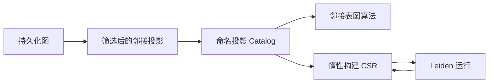

# GDS 图投影

ZYX 图算法运行在命名内存投影上，不会在每个算法步骤中反复读取存储记录。投影会一次性筛选节点和关系，应用方向与权重规则，并在线程安全的 catalog 中保存适合算法访问的邻接表示。

投影不会持久化到数据库文件。它会一直存在，直到被显式删除或数据库实例关闭。

## 创建投影

推荐使用单个可扩展配置 Map 的 API：

```cypher
CALL gds.graph.project('social', {
    nodeLabels: ['Person', 'Organization'],
    relationships: {
        KNOWS: {
            orientation: 'UNDIRECTED',
            weightProperty: 'strength',
            defaultWeight: 1.0
        },
        WORKS_AT: {
            orientation: 'NATURAL',
            weight: 0.5
        }
    }
})
YIELD name, nodeCount, edgeCount
RETURN name, nodeCount, edgeCount
```

`gds.graph.project` 返回一行 `name`、`nodeCount` 和 `edgeCount`。重复的投影名会被拒绝；重建前需要先删除已有投影。

### 投影配置

| 字段 | 接受的值 | 默认值 | 含义 |
|---|---|---|---|
| `nodeLabels` | 字符串、字符串列表或节点投影 Map | 所有标签 | 包含具有任一所选标签的节点 |
| `relationships` | 字符串、字符串列表或关系投影 Map | 所有类型 | 选择关系类型及各类型的行为 |
| `relationshipTypes` | 字符串或字符串列表 | 所有类型 | 未配置关系类型的简写形式 |
| `orientation` | `NATURAL`、`REVERSE` 或 `UNDIRECTED` | `NATURAL` | 关系条目的默认方向 |
| `relationshipWeightProperty` | 字符串 | 无 | 关系条目默认使用的权重属性 |
| `defaultWeight` | 非负有限数值 | `1.0` | 所选属性不存在或为 NULL 时使用的权重 |

使用 `'*'` 表示所有标签或所有关系类型。不提供 `nodeLabels` 或关系选择字段时效果相同。

当节点投影与关系投影需要分别传入时，也可以使用原生三段式 API：

```cypher
CALL gds.graph.project(
    'code',
    ['Function', 'Method', 'Class'],
    {
        CALLS: {weight: 8.0},
        IMPORTS: {weight: 2.0},
        DECLARES: {orientation: 'REVERSE', weight: 4.0}
    },
    {orientation: 'UNDIRECTED'}
)
```

其签名为 `gds.graph.project(name, nodeProjection, relationshipProjection[, config])`。只投影单一标签和类型时，节点投影与关系投影都可以直接使用字符串。

### 节点选择

选择多个标签时，节点具有其中任意一个标签就会被包含。仅当关系的两个端点都属于投影节点集合时，该关系才会进入投影。

节点投影 Map 可以把投影名映射到一个或多个存储标签：

```cypher
CALL gds.graph.project(
    'callables',
    {
        functions: {label: 'Function'},
        methods: {labels: ['Method', 'Constructor']}
    },
    'CALLS'
)
```

### 关系方向

| 方向 | 生成的投影弧 |
|---|---|
| `NATURAL` | 从存储关系的 source 到 target 生成一条弧 |
| `REVERSE` | 从存储关系的 target 到 source 生成一条弧 |
| `UNDIRECTED` | 每个方向各生成一条弧；自环仍只生成一条 |

`edgeCount` 统计投影弧，而不是存储关系数。因此，一条非自环的无向关系会为 `edgeCount` 贡献 2。

### 关系权重

关系条目可以不带权重、使用常量权重或读取属性：

```cypher
CALL gds.graph.project('routes', {
    nodeLabels: 'City',
    relationships: {
        ROAD: {weightProperty: 'distance', defaultWeight: 1.0},
        FERRY: {weight: 12.5}
    }
})
```

权重必须是非负有限数值。属性不存在或为 NULL 时使用 `defaultWeight`；属性存在但不是数值或值非法时，投影构建会失败。关系级设置优先于全局方向与权重默认值。

## 投影 Catalog

### 检查与查询

```cypher
CALL gds.graph.exists('social')
```

```cypher
CALL gds.graph.list()
```

```cypher
CALL gds.graph.list('social')
```

```cypher
CALL gds.graph.schema('social')
```

`gds.graph.exists` 始终返回 `name` 和 `exists`。`gds.graph.list()` 按名称排序返回所有 descriptor；`gds.graph.list(name)` 在投影不存在时返回零行。`gds.graph.schema(name)` 遇到未知名称会报错。

`gds.graph.list` 返回以下字段：

| 字段 | 含义 |
|---|---|
| `name` | 投影名称 |
| `nodeCount`、`edgeCount` | 投影节点数和弧数 |
| `isWeighted` | 是否有关系投影使用权重 |
| `createdAtMillis` | Unix epoch 毫秒格式的创建时间 |
| `buildMillis` | 投影构建耗时，单位为毫秒 |
| `memoryBytes` | 邻接投影的估算内存 |
| `hasCsr`、`csrMemoryBytes` | 是否已创建惰性 CSR cache 及其估算内存 |
| `sourceRevision`、`currentRevision` | 构建时和检查时的图 revision |
| `stale` | 两个 revision 是否不同 |
| `nodeLabels`、`relationships` | 规范化后的投影 schema |

`relationships` 的每一项都包含 `type`、`orientation`、`weightKind`、`weightProperty`、`constantWeight` 和 `defaultWeight`。空 `type` 表示所有关系类型。

`gds.graph.schema` 返回更精简的 schema 视图：`name`、`nodeLabels`、`relationships` 和 `stale`。

### 失效判定

每次图数据变更都会推进数据库的 graph revision。如果投影构建时的 revision 与当前 revision 不同，投影会被标记为 `stale`。ZYX 不会静默重建投影：算法仍然读取不可变的投影快照。如果算法必须看到新的图数据，应删除并重建失效投影。

```cypher
CALL gds.graph.drop('social')
```

```cypher
CALL gds.graph.dropAll()
```

`gds.graph.drop` 返回被删除的 `name`，未知投影会报错。`gds.graph.dropAll` 返回 `droppedCount`，同时释放相关的 CSR cache。

## 性能模型

投影构建会扫描存储并创建入边与出边邻接表。此后算法只遍历内存数据，不产生存储 I/O。使用 CSR 的算法（当前包括 Leiden）会在首次运行时惰性构建紧凑表示，并在后续运行中复用。



对于重复分析，应创建一次投影、运行多个算法、通过 `memoryBytes` 和 `csrMemoryBytes` 检查内存，最后显式删除。大型数据库应优先选择有界的标签与关系类型，以减少构建时间和内存占用。

## 另见

- [社区检测](/zh/docs/zyx/algorithms/community-detection) - Leiden 过程、参数与执行模型
- [高级查询](/zh/docs/zyx/user-guide/advanced-queries) - 内置过程总览
- [关系遍历](/zh/docs/zyx/algorithms/relationship-traversal) - 持久化图遍历内部实现
