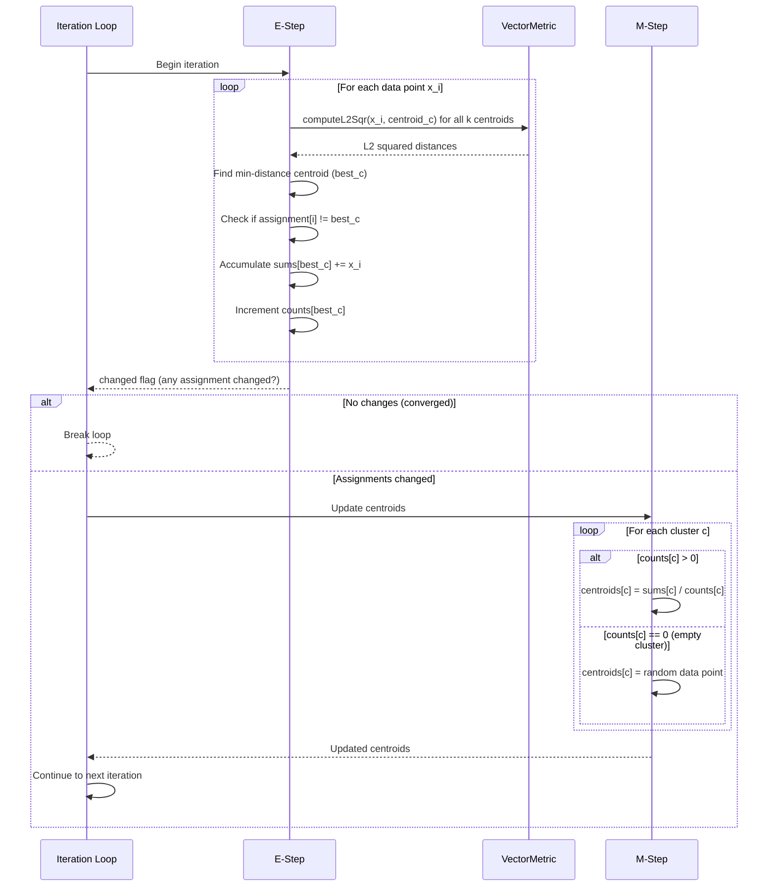
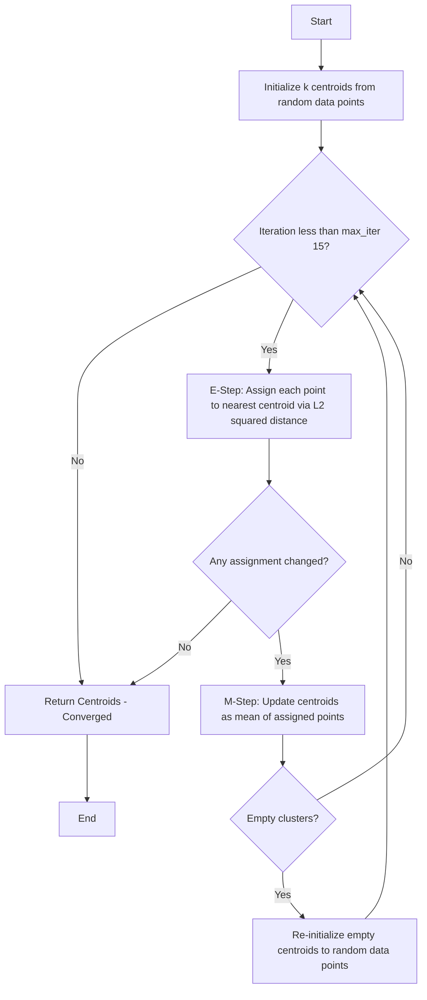
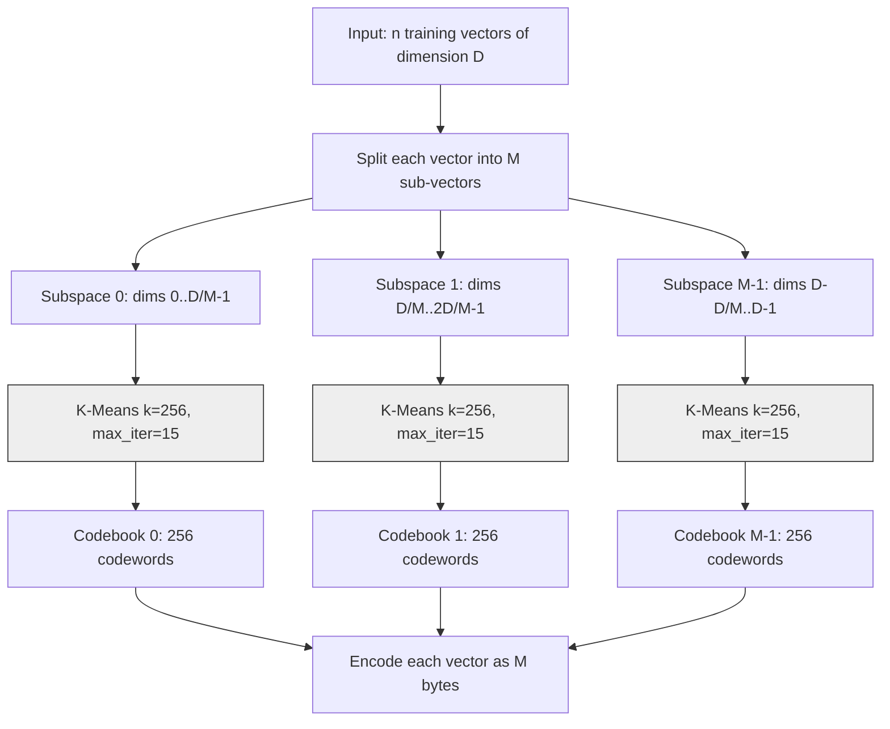

# K-Means 聚类算法

K-Means 是一种基础的无监督机器学习算法，用于将数据点按相似度聚类分组。在 ZYX 中，K-Means 专门用于训练 Product Quantization (PQ) 码本，而 PQ 码本是高效向量相似搜索和压缩的核心组件。

## 概述

K-Means 将 n 个数据点划分为 k 个簇，每个数据点属于距离其均值（质心）最近的簇。算法通过迭代优化簇分配来最小化簇内平方和（Within-Cluster Sum of Squares, WCSS），也称惯性。

### 核心特性

- **划分式聚类**：将数据划分为互不重叠的簇
- **基于质心**：每个簇由其均值点表示
- **迭代优化**：通过 EM 算法收敛到局部最小值
- **L2 距离**：使用平方欧氏距离作为相似度度量

## 数学基础

### 目标函数

K-Means 优化以下目标函数：

```
J = Sum(i=1..n) Sum(j=1..k) ||x_i - mu_j||^2
```

其中：
- `J` = 目标函数（簇内平方和）
- `n` = 数据点数量
- `k` = 簇数量
- `x_i` = 第 i 个数据点
- `mu_j` = 簇 j 的质心
- `||.||` = L2 范数（欧氏距离）

### 收敛性质

- **单调收敛**：目标函数值不会增加
- **局部最小值**：收敛到局部最优，不一定是全局最优
- **有限步收敛**：保证在有限次迭代内收敛
- **线性收敛**：通常在 O(log n) 次迭代内收敛

## 算法步骤

K-Means 算法遵循迭代的期望最大化（Expectation-Maximization, EM）方法。ZYX 使用经典的 Lloyd 算法，采用随机初始化、固定种子以确保可复现性，以及最多 15 次迭代。

### 1. 初始化

算法使用梅森旋转随机数生成器（`std::mt19937`），以固定值 **42** 作为种子，随机选择 k 个数据点作为初始质心。这种确定性种子确保了跨运行的结果可复现——给定相同的输入数据，K-Means 始终产生相同的质心。

对于 k 个质心中的每一个，从范围 `[0, n-1]` 中均匀随机抽取一个索引，将对应的数据点复制为初始质心。这是标准的随机初始化，而非 K-Means++。

### 2. E 步（期望步）

在每次迭代中，每个数据点被分配到在 L2 平方距离下质心最近的簇。对于每个点，算法计算到所有 k 个质心的距离，并选择距离最小的一个。

距离计算使用 `VectorMetric::computeL2Sqr`，该函数采用 4 路循环展开：内层循环每次迭代处理四个维度，在四个独立的临时变量中累加部分和后再合并。这减少了循环开销，并有助于编译器自动向量化。当向量长度不是 4 的倍数时，剩余维度由单独的标量尾部循环处理。

计算新分配后，算法检查其是否与上一次迭代的分配不同。`changed` 标志跟踪是否有任何点切换了簇，用于收敛检测。

在执行分配的同时，算法还累加每个簇的总和与计数，以便后续的 M 步可以复用这些工作，无需对数据进行第二次遍历。

### 3. M 步（最大化步）

对于至少有一个已分配点的簇，质心被更新为分配给它的所有点的均值。均值的计算方式是将累加总和乘以计数的倒数（`1.0f / count`），避免重复除法。

对于空簇（没有已分配点的簇），质心会被重新初始化为从同一均匀分布中随机抽取的新数据点。这防止簇永久保持为空，避免潜在地降低量化质量。

### 4. 收敛检查

E 步之后，如果没有数据点改变其簇分配（`changed` 为 false），算法已收敛并提前终止。否则，继续迭代直到达到最大迭代次数（15）。

### 单次 EM 迭代详解

以下时序图展示了单次 EM 迭代的详细流程：



## 算法流程图



**K-Means 算法流程：**
- 初始化：从数据中随机选择 k 个质心
- E 步：将每个点分配到最近的质心
- M 步：将质心重新计算为已分配点的均值
- 检查收敛或达到最大迭代次数
- 通过重新初始化处理空簇

## 处理空簇

当一个簇变为空（E 步中没有分配到点）时，算法将其质心重新初始化为随机选择的数据点。这种策略在 PQ 使用场景中简单有效，因为训练数据通常足够大，空簇很少出现。ZYX 中不使用其他替代策略（如拆分最大的簇）。

## 距离计算：L2 平方

K-Means 使用 L2 平方距离而非完整欧氏距离。这是一种不影响正确性的优化：

- **无需 sqrt**：平方根运算开销大且在比较中不必要——距离排序在不取平方根时保持不变。
- **相同的 argmin**：因为 sqrt 是单调函数，`argmin ||a - b||^2 == argmin ||a - b||`。
- **更快的计算**：每次距离检查节省一次浮点平方根运算。

`VectorMetric::computeL2Sqr` 的实现使用 4 路循环展开：每次循环迭代处理四个维度差值，将它们平方并求和。这减少了循环开销，并为编译器的 SIMD 自动向量化创造了机会。当向量长度不是 4 的倍数时，标量尾部循环处理剩余维度。

## 时间和空间复杂度

### 时间复杂度

**每次迭代：**
- 分配步：O(n x k x d)
  - n 个数据点
  - k 个质心
  - d 个维度
- 更新步：O(n x d)
- **每次迭代总计**：O(n x k x d)

**整体：**
- **最坏情况**：O(n x k x d x I)
  - I = 迭代次数（通常 10-50）
- **平均情况**：O(n x k x d x log I)
- **典型情况**：O(n x k x d x 15) [默认最大迭代次数]

### 空间复杂度

- **质心**：O(k x d)
- **分配**：O(n)
- **累加器**：O(k x d)
- **总计**：O(k x d + n)

### 复杂度比较

| 组件 | 空间 | 时间（每次迭代） |
|------|------|------------------|
| 质心 | O(k x d) | - |
| 分配 | O(n) | - |
| E 步 | - | O(n x k x d) |
| M 步 | - | O(n x d) |
| **总计** | **O(n + k x d)** | **O(n x k x d)** |

## 与 Product Quantization 的集成

K-Means 在 ZYX 中不是通用聚类工具。它专门用于训练 PQ 码本。Product Quantizer 将每个输入向量拆分为子向量（每个子空间一个），并在每个子空间上独立运行 K-Means，生成 256 个质心的码本。每个质心是一个码字，K-Means 训练确保码字最小化其子空间内的量化误差。

### PQ 码本训练流程

以下图示展示了 K-Means 如何集成到 PQ 训练流程中：



### 工作原理

1. **子空间提取**：每个维度为 D 的训练向量被拆分为 M 个等长子向量。例如，一个 128 维向量在 M=8 个子空间下产生 8 个 16 维子向量。

2. **每个子空间独立 K-Means**：对于每个子空间，收集所有 n 个子向量并传入 k=256 的 K-Means。这会为每个子空间生成 256 个码字（质心）的码本。选择 256 这个值是为了让每个码字索引恰好能用一个字节（8 位 = 256 个值）表示。

3. **编码**：训练完成后，任何向量都被编码为 M 字节的序列。对于每个子空间，在对应码本中找到最近的码字（同样使用 L2 平方距离），并将其索引（0-255）存储为 `uint8_t`。

4. **子空间间并行**：PQ 训练器可以使用线程池并行运行不同子空间的 K-Means（外层并行）。此外，每个单独的 K-Means 运行可以在 E 步中使用线程池进行内层并行，使用线程局部累加器避免竞争。

### PQ 编码

码本训练完成后，编码向量涉及在每个子空间中找到最近的码字。对于 M 个子向量中的每一个，算法计算到对应码本中所有 256 个码字的 L2 平方距离，并存储最近码字的索引。结果是将原始 D 维向量压缩为紧凑的 M 字节表示。

## 配置参数

### 关键参数

| 参数 | 默认值 | 范围 | 说明 |
|------|--------|------|------|
| `k` | 256（用于 PQ） | 2 到 sqrt(n) | 簇数量（每个子空间的码字数） |
| `max_iter` | 15 | 1-1000 | 最大迭代次数 |
| `seed` | 42 | 固定 | 初始化随机种子（不可配置） |

### 参数选择

**k = 256（用于 PQ）**：这个值在 Product Quantization 中是固定的，因为每个码字索引必须能放入一个字节（8 位 = 256 个值）。这在量化精度和压缩率之间提供了良好的平衡。

**max_iter = 15**：经验上对 PQ 码本训练足够。算法通常在子空间数据上 10-15 次迭代内收敛。增加此值很少能显著改善码本质量。

## 性能优化

### 优化技术

1. **固定种子（42）**：确定性初始化确保结果可复现，简化测试和调试。
2. **4 路循环展开**：L2 平方距离计算每次迭代处理四个维度，减少循环开销并支持编译器自动向量化。
3. **单遍 E 步**：簇分配和累加器更新在同一数据遍历循环中完成，避免第二次遍历。
4. **提前收敛**：当没有点改变簇时，算法立即终止，避免不必要的迭代。
5. **乘法逆元**：质心更新使用 `sum * (1.0f / count)` 而非 `sum / count`，将重复除法替换为一次除法和多次乘法。

### 线程池并行

当提供了线程池且数据集包含至少 256 个点时，E 步跨多个线程并行运行。每个线程维护自己的局部累加器（总和与计数）以避免竞争。所有线程完成后，线程局部累加器被合并为全局总和与计数，然后 M 步更新质心。并行路径使用宽松原子操作来处理 `changed` 标志。

### 内存效率

- **原地更新**：质心直接更新，无需在每次迭代时分配新存储。
- **连续存储**：数据和质心使用 `std::vector<std::vector<float>>`，实现缓存友好的顺序访问。
- **最小开销**：仅分配必要的数据结构——质心、分配、总和和计数。

## ZYX 中的使用场景

### Product Quantization 码本训练

K-Means 在 ZYX 中的唯一用途是训练 PQ 码本。每个子空间获得独立的 K-Means 运行（k=256），产生 256 个码字以最小化该子空间内的量化误差。

## 优势与局限

### 优势

- **简单**：易于理解和实现
- **高效**：随数据规模线性扩展
- **有效**：在 PQ 子空间聚类中表现良好
- **快速收敛**：通常在 10-15 次迭代内收敛
- **确定性**：固定种子确保可复现的结果

### 局限

- **局部最优**：对随机初始化敏感；不同种子可能产生不同结果
- **固定 k**：必须预先知道簇的数量
- **球形簇假设**：假设各向同性（圆形）的簇形状
- **离群值敏感**：均值对离群值敏感，可能将质心拉离簇中心

## 源码位置

- **KMeans**: `include/graph/vector/quantization/KMeans.hpp`
- **VectorMetric** (L2 距离): `include/graph/vector/core/VectorMetric.hpp`
- **ProductQuantizer** (调用方): `include/graph/vector/quantization/NativeProductQuantizer.hpp`

## 另见

- [Product Quantization](/zh/docs/zyx/algorithms/product-quantization) - 使用 K-Means 的向量压缩
- [Vector Metrics](/zh/docs/zyx/algorithms/vector-metrics) - 距离计算详解
- [DiskANN](/zh/docs/zyx/algorithms/diskann) - 基于图的向量搜索算法
