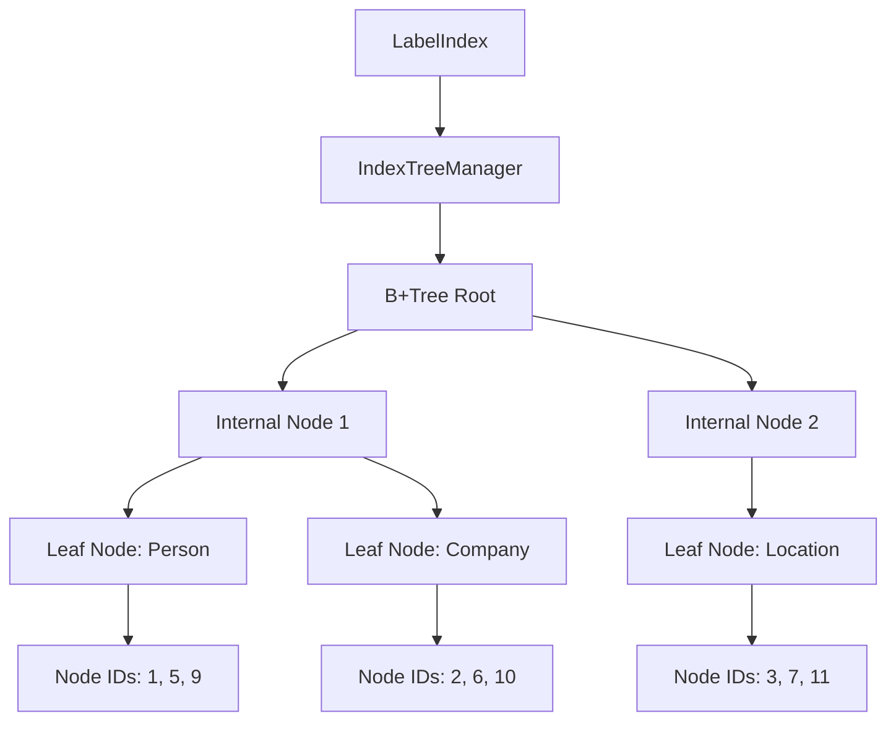
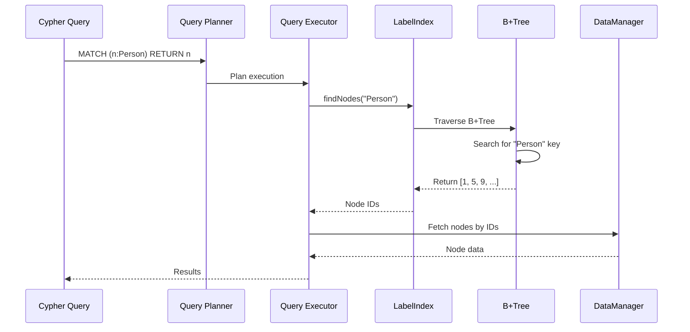
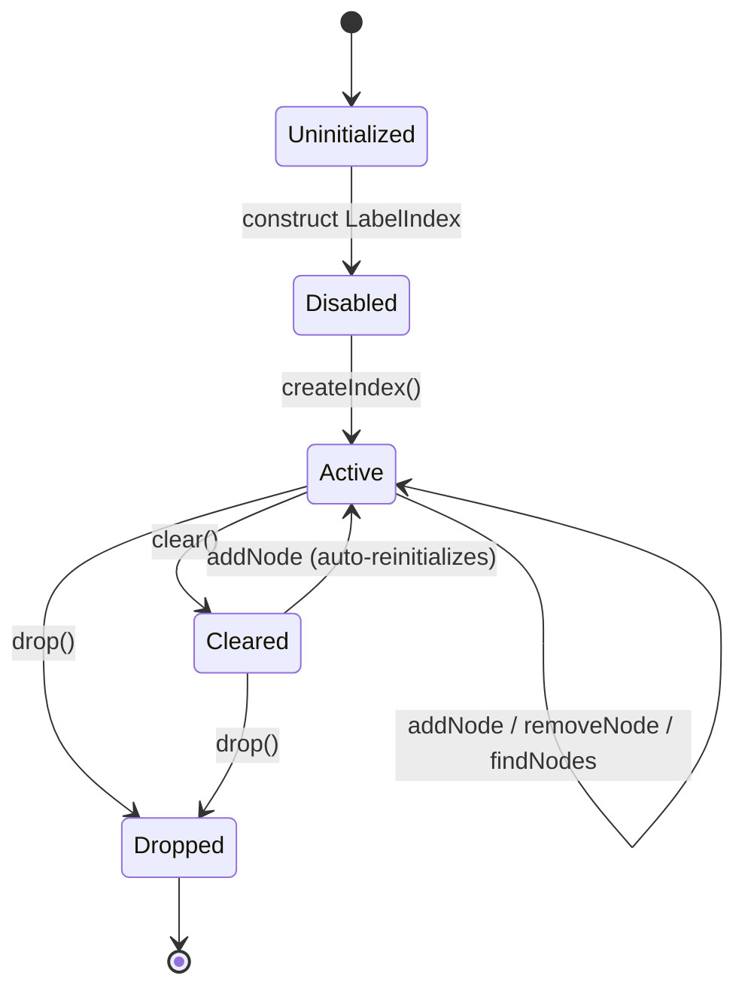
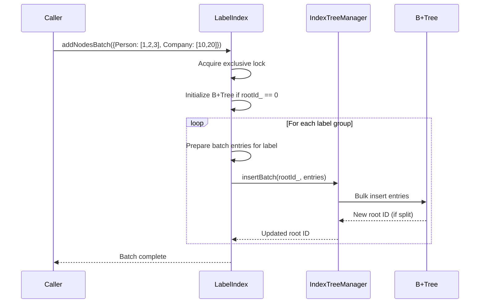

# 标签索引

ZYX 使用 B+Tree 结构实现高性能标签索引，将节点标签高效映射到对应的节点 ID。这使得 Cypher 中基于标签的查询（如 `MATCH (n:Person) RETURN n`）能够快速执行。

## 概述

标签索引提供以下能力：

- **基于 B+Tree 的索引**：通过 IndexTreeManager 使用单个 B+Tree 实现高效的标签到节点 ID 映射
- **多标签支持**：节点可以同时拥有多个被索引的标签
- **批量操作**：优化的批量插入，支持高效索引构建
- **并发访问**：使用 shared mutex 实现线程安全操作
- **状态持久化**：重启后自动恢复索引状态
- **动态启用/禁用**：运行时管理索引，不会丢失数据

## 架构

### 标签索引结构



LabelIndex 拥有一个 IndexTreeManager 实例，该实例管理一棵 B+Tree。该树以标签字符串作为键、节点 ID 作为值。由于 B+Tree 支持重复键，因此同一个标签下可以存储多个节点 ID。每个标签到节点 ID 的映射是独立的：从某个标签中添加或移除节点不会影响其他标签。

### 查询流程



当查询规划器遇到标签过滤器（如 `MATCH (n:Person)`）时，会检查标签索引是否可用且已启用。如果可用，执行器调用 `findNodes("Person")` 直接从 B+Tree 中获取匹配的节点 ID，然后从存储中获取完整的节点数据。如果没有索引，则需要全表扫描并通过标签过滤器过滤。

## 索引生命周期

标签索引在其生命周期中会经历多个状态。状态通过 `SystemStateManager` 持久化，它将 B+Tree 根 ID 和启用标志作为键值对存储。

### 生命周期状态图



### 初始化

当 `LabelIndex` 被构造时，它会自动调用 `initialize()`。该方法从 `SystemStateManager` 加载两项持久化状态：

1. **根 ID** -- B+Tree 根节点的 segment ID。值为 0 表示尚未创建 B+Tree。
2. **启用标志** -- 存储在由状态键加上配置后缀派生的配置键下。如果不存在则默认为 false。

有一个安全回退机制防止数据漂移：如果根 ID 非零但启用标志为 false，索引会强制将 `enabled_` 设为 true。这确保了磁盘上存在的任何物理 B+Tree 数据永远不会因过期的启用标志而被孤立。

### createIndex()

调用 `createIndex()` 会将 `enabled_` 设为 true，并立即将启用标志持久化到 `SystemStateManager`。这保证了重启后 `initialize()` 会读取到 true，索引将处于活跃状态。

### clear()

`clear()` 方法通过委托 `IndexTreeManager::clear(rootId_)` 移除所有 B+Tree 数据，然后将内存中的根 ID 重置为 0。重要的是，启用标志保持为 true。这使得 `clear()` 适用于索引重建场景——索引会立即被重新填充。

### drop()

`drop()` 方法执行完整的拆解操作：调用 `clear()` 移除所有 B+Tree 数据，将 `enabled_` 设为 false，并从 `SystemStateManager` 中移除配置键和根 ID 键。`drop()` 之后，索引处于干净状态，就像从未存在过一样。

### saveState()

在正常操作期间，`saveState()` 将当前根 ID（如果非零）和启用标志（如果为 true）持久化到 `SystemStateManager`。它使用稀疏持久化策略：只写入非默认值，最小化状态存储开销。`flush()` 方法直接委托给 `saveState()`。

## 核心操作

### addNode

向索引中添加单个节点到标签的映射。该操作获取排他锁，首次使用时初始化 B+Tree（当根 ID 为 0 时），然后通过 `IndexTreeManager::insert()` 插入标签到节点 ID 的映射。如果 B+Tree 根在插入过程中分裂，内存中的根 ID 会更新为新的根。

- **时间复杂度**：O(log n)，其中 n 为唯一标签数量
- **空间复杂度**：O(1) 摊销每次插入（B+Tree 增长）
- **并发控制**：排他锁

### addNodesBatch

接受一个从标签字符串到节点 ID 向量的映射，并批量插入。该操作在整个批次期间获取单个排他锁，按需初始化 B+Tree，然后遍历每个标签分组。对于每个标签，它准备一个 `PropertyValue` 到节点 ID 的映射向量，并调用 `IndexTreeManager::insertBatch()`。

按标签分组对 B+Tree 效率很重要：共享同一键的所有条目一起插入，减少了树遍历和节点分裂的次数。

### 批量插入流程



**优化措施**：

- **单次锁获取**：相比逐条插入减少了锁竞争
- **按标签分组**：最小化 B+Tree 遍历和节点分裂
- **预分配向量**：批量条目向量精确预留所需大小

### removeNode

移除一个节点到标签的映射。如果 B+Tree 尚未初始化（根 ID 为 0），操作立即返回。否则委托给 `IndexTreeManager::remove()`，该方法通过重新分配或合并 B+Tree 节点自动处理下溢。

- **时间复杂度**：O(log n)
- **自动再平衡**：B+Tree 通过合并或重新分配处理下溢

### findNodes

检索与给定标签关联的所有节点 ID。如果 B+Tree 尚未初始化，返回空向量。该操作获取共享锁，允许来自多个线程的并发读取。

- **时间复杂度**：O(log n + k)，其中 k 为拥有该标签的节点数量
- **并发控制**：共享锁
- **返回值**：节点 ID 向量

### hasLabel

检查特定节点 ID 是否与给定标签关联。内部调用 `findNodes()` 并在结果中搜索目标 ID。如果 B+Tree 尚未初始化，返回 false。

- **时间复杂度**：O(log n + k)，其中 k 为拥有该标签的节点数量
- **并发控制**：共享锁
- **使用场景**：无需获取完整节点数据即可快速检查标签是否存在

## B+Tree 集成

LabelIndex 将所有 B+Tree 操作委托给 `IndexTreeManager`（源码：`include/graph/core/IndexTreeManager.hpp`）。该管理器提供以下能力：

| 方法 | 描述 |
|------|------|
| `initialize()` | 创建新的空 B+Tree 根节点并返回其 ID |
| `insert(rootId, key, value)` | 插入单个键值对；返回（可能是新的）根 ID |
| `insertBatch(rootId, entries)` | 批量插入多个键值对；返回（可能是新的）根 ID |
| `remove(rootId, key, value)` | 移除特定键值对；自动处理再平衡 |
| `find(rootId, key)` | 返回与给定键关联的所有值 |
| `clear(rootId)` | 删除以给定 ID 为根的整棵 B+Tree |
| `findLeafNode(rootId, key)` | 定位可能包含给定键的叶节点 |

B+Tree 层的关键特性：

1. **重复键支持**：多个节点 ID 可以共享同一个标签键
2. **自动再平衡**：分裂和合并操作维持树的平衡
3. **Blob 存储**：当值列表超过节点容量时，存储在外部
4. **类型安全**：LabelIndex 使用 `PropertyType::STRING` 键和 `int64_t` 值（节点 ID）配置 B+Tree

## 并发控制

LabelIndex 使用 `std::shared_mutex` 实现线程安全访问：

| 锁类型 | 操作 | 行为 |
|--------|------|------|
| 共享锁 | `findNodes`、`hasLabel`、`isEmpty`、`isEnabled`、`hasPhysicalData`、`saveState` | 多个读取者可以并发执行 |
| 排他锁 | `addNode`、`addNodesBatch`、`removeNode`、`createIndex`、`clear`、`drop`、`initialize` | 同一时间只有一个写入者；阻塞所有读取者 |

这允许高读取并发：多个线程可以同时查询索引。写操作被序列化，写入者在完成前会阻塞所有读取者。

## 状态查询

LabelIndex 提供三个方法用于检查索引状态：

| 方法 | 描述 |
|------|------|
| `isEmpty()` | 如果索引未启用则返回 true（检查启用标志，而非物理数据） |
| `isEnabled()` | 直接返回启用标志 |
| `hasPhysicalData()` | 如果根 ID 非零（B+Tree 存在于磁盘上）则返回 true |

注意 `isEmpty()` 和 `hasPhysicalData()` 可能返回不同结果。一个被 `clear()` 处理过的索引仍然处于启用状态（因此 `isEmpty()` 返回 false），但没有物理数据（因此 `hasPhysicalData()` 返回 false）。

## 多标签支持

节点可以同时拥有多个被索引的标签。每个标签到节点 ID 的映射作为独立条目存储在 B+Tree 中。先将节点添加到 "Person" 标签下，再添加到 "Employee" 标签下，会创建两个独立的条目。按任一标签查询都会返回该节点。从某个标签中移除节点不会影响其在其他标签下的存在。

## 性能特征

### 时间复杂度

| 操作 | 平均情况 | 最坏情况 |
|------|----------|----------|
| addNode | O(log n) | O(log n) |
| addNodesBatch | O(m log n) | O(m log n) |
| removeNode | O(log n) | O(log n) |
| findNodes | O(log n + k) | O(log n + k) |
| hasLabel | O(log n + k) | O(log n + k) |

其中：

- n = B+Tree 中唯一标签数量
- m = 批次中的节点数量
- k = 拥有指定标签的节点数量

### 空间复杂度

| 组件 | 空间 | 描述 |
|------|------|------|
| B+Tree 节点 | O(n x b) | n 个标签，b = 分支因子 |
| 叶条目 | O(N) | 所有节点 ID 引用 |
| 状态元数据 | O(1) | 根 ID + 启用标志 |

总计：**O(N)**，其中 N = 节点-标签关联的总数

### 内存开销

```
For 1 million nodes with 2 labels each:

B+Tree Structure:
- Internal nodes: ~100 nodes x 256 bytes = 25.6 KB
- Leaf nodes: ~500 nodes x 256 bytes = 128 KB
- Node ID references: 2M x 8 bytes = 16 MB

Total Index Size: ~16.15 MB
Overhead per Node-Label: ~8 bytes

State Storage:
- Root ID: 8 bytes
- Enabled flag: 1 byte (if true)
```

## 局限性

1. **不支持部分匹配**：标签必须完全匹配（不支持通配符或前缀搜索）
2. **不支持范围查询**：标签是类别性的，非有序的
3. **内存限制**：操作期间整个索引结构必须能装入内存
4. **写入序列化**：同一时间只有一个并发写入者

## 源码位置

- `include/graph/storage/indexes/LabelIndex.hpp` -- LabelIndex 类定义
- `src/storage/indexes/LabelIndex.cpp` -- LabelIndex 实现
- `include/graph/core/IndexTreeManager.hpp` -- LabelIndex 使用的 B+Tree 管理器

## 另见

- [B+Tree 索引](/zh/docs/zyx/algorithms/btree-indexing) - B+Tree 结构详情
- [属性索引](/zh/docs/zyx/algorithms/property-index) - 基于属性的索引
- [查询优化](/zh/docs/zyx/algorithms/query-optimization) - 查询中的索引使用
- [存储系统](/zh/docs/zyx/architecture/storage) - 整体存储架构
