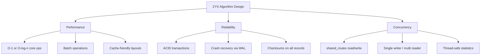

# 算法总览

ZYX 在索引、存储、查询处理、向量搜索和并发控制等方面采用了一系列算法。本节记录每种算法的设计、数据流和性能特征。

## 算法分类

### 存储算法

管理持久化数据存储与分配的算法：

- **[段分配](segment-allocation)** — 段如何分配、链接成链，以及按实体类型进行跟踪
- **[段压缩](segment-compaction)** — 多阶段压缩，在删除操作后回收碎片化空间
- **[位图索引](bitmap-indexing)** — 使用位图结构跟踪段内空闲槽位
- **[压缩](compression)** — 基于 Zlib 的无损压缩，用于状态链和大数据

### 事务与并发

保证 ACID 特性和崩溃恢复的算法：

- **[状态链与乐观锁](state-chain-optimistic-locking)** — 基于版本链的配置存储，支持原子读写
- **[WAL 恢复](wal-recovery)** — 4 阶段崩溃恢复：扫描、去重、重放、收尾

### 索引算法

用于快速数据查找的算法：

- **[B+Tree 索引](btree-indexing)** — 用于标签索引和属性索引的 B+Tree 结构
- **[标签索引](label-index)** — 使用 B+Tree 的标签到节点 ID 映射
- **[属性索引](property-index)** — 针对属性值的类型特定 B+Tree 索引

### 查询算法

用于高效查询执行的算法：

- **[查询优化](query-optimization)** — 基于固定点迭代的多规则优化器
- **[关系遍历](relationship-traversal)** — 用于边遍历的双向链表邻接表

### 缓存

- **[缓存淘汰](cache-eviction)** — 带命中/未命中统计和线程安全操作的 LRU 缓存

### 向量搜索

用于高维向量相似性搜索的算法：

- **[向量度量](vector-metrics)** — 经过优化的 L2 和 IP 距离计算，支持混合精度
- **[乘积量化](product-quantization)** — 通过子空间量化进行向量压缩
- **[K-Means 聚类](kmeans)** — Lloyd 算法，用于 PQ 码本训练
- **[DiskANN](diskann)** — 可导航小世界图，用于近似最近邻搜索

## 设计原则

所有算法共享以下特性：

- **线程安全**：使用 `std::shared_mutex` 实现并发读访问和独占写访问
- **批量操作**：针对索引构建和数据导入的优化批量处理路径
- **惰性初始化**：组件（QueryEngine、ThreadPool、WAL）在首次使用时初始化
- **基于段的存储**：所有数据存储在固定大小的段中，以链表形式链接

## 复杂度汇总

| 类别 | 关键操作 | 复杂度 |
|----------|--------------|------------|
| Segment Allocation | Allocate entity slot | O(1) amortized |
| B+Tree Index | Search / Insert | O(log n) |
| Label Index | Find nodes by label | O(log n + k) |
| Property Index | Exact match | O(log n + k) |
| Property Index | Range query | O(log n + k) |
| Relationship Traversal | Get outgoing/incoming edges | O(k) |
| LRU Cache | Get / Put | O(1) |
| DiskANN Search | K-nearest neighbors | O(beamWidth × maxDegree × dim) |
| PQ Distance | Approximate distance | O(numSubspaces) |

其中 n = 索引中的条目数，k = 结果数量，dim = 向量维度。
