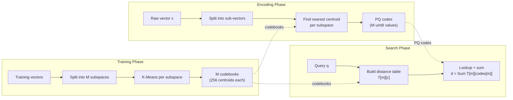
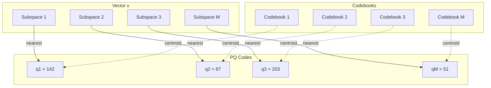
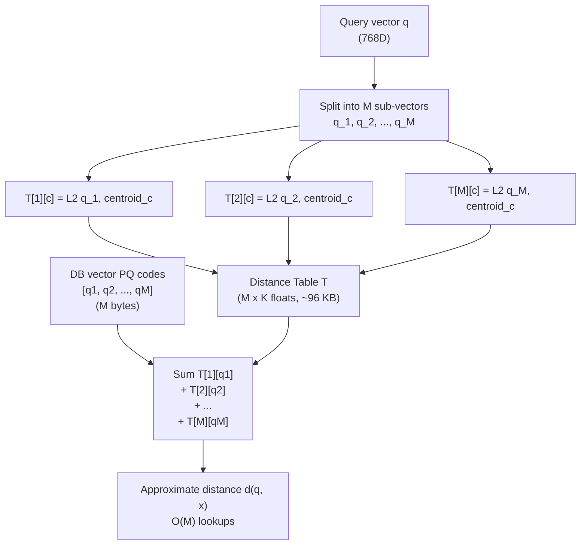
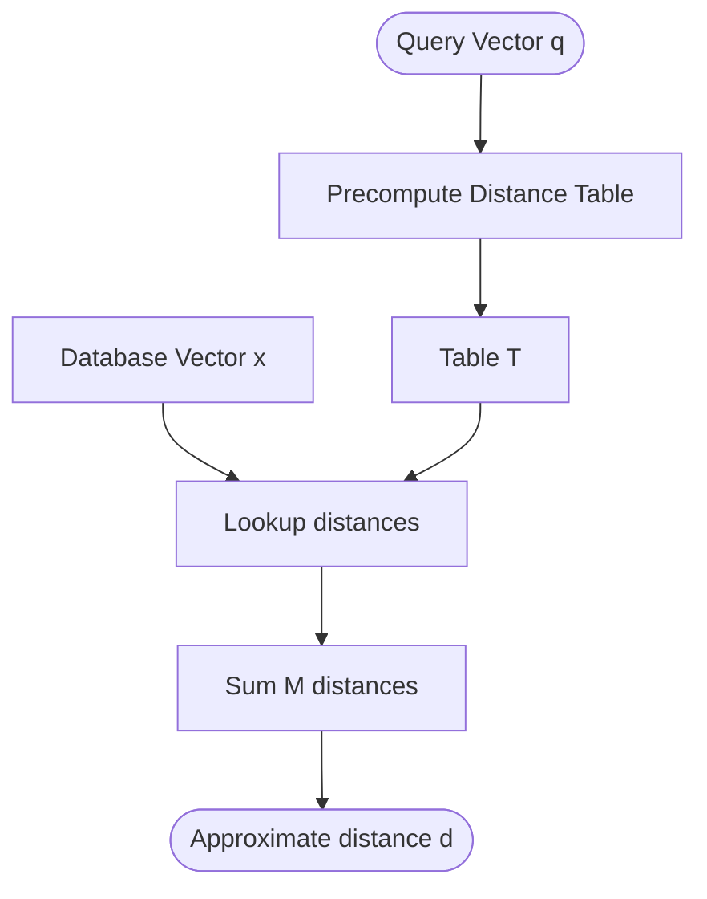
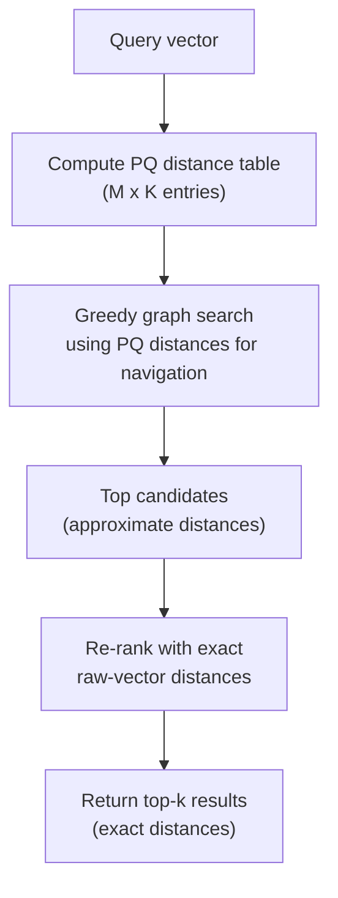

# 乘积量化

乘积量化（Product Quantization, PQ）是一种强大的向量压缩技术，可在高维空间中实现高效的近似最近邻搜索。ZYX 使用 PQ 大幅降低内存占用，并加速向量相似性搜索中的距离计算。

## 概述

乘积量化通过将高维向量分解为多个低维子空间，并对每个子空间独立量化来实现。这种方法具有以下优势：

- **显著的内存节省**：相比原始向量实现 8-32 倍压缩比
- **快速距离计算**：使用查找表的非对称距离计算（ADC）
- **高精度**：以最小的质量损失保留最近邻关系
- **可扩展性**：在有限内存下支持搜索数十亿向量

### 核心优势

- **内存效率**：768 维向量从 3KB 压缩至约 100 字节
- **搜索速度**：距离计算复杂度从 O(dim) 降低至 O(numSubspaces)
- **DiskANN 集成**：与基于图的 ANN 搜索无缝集成
- **零拷贝操作**：高效的内存布局，对缓存友好

### PQ 流水线

完整的乘积量化工作流包含三个阶段：从数据训练码本、将向量编码为紧凑编码、以及使用非对称距离计算进行搜索。



## 数学基础

### 量化问题

给定高维向量空间 R^D，乘积量化将其分解为 M 个子空间：

```
R^D = R^D1 x R^D2 x ... x R^DM
```

其中：
- D = 总维度（如嵌入向量的 768 维）
- M = 子空间数量（如 96）
- Di = 子空间 i 的维度（D/M，如 8）
- D = 所有 Di 的总和

### 码本训练

对于每个子空间 m（m 属于 [1, M]），训练一个包含 K 个质心的码本 Cm：

```
Cm = {c_m1, c_m2, ..., c_mK}
```

其中：
- K = 每个子空间的质心数量（通常为 256 = 2^8）
- c_mi 属于 R^Di（第 m 个子空间中的第 i 个质心）

训练过程对每个子空间独立应用 K-Means 聚类。对于 M 个子空间中的每一个，训练数据被切分为覆盖该子空间维度的子向量，K-Means 使用固定种子 42 和最多 15 次迭代运行。产生的 K 个质心构成该子空间的码本。

`NativeProductQuantizer` 类（定义在 `include/graph/vector/core/NativeProductQuantizer.hpp`）管理此过程：它遍历所有 M 个子空间，从训练集中提取对应的子向量，调用 `include/graph/vector/core/KMeans.hpp` 中的 `KMeans::run`，并存储生成的质心。

### 编码

向量 x（属于 R^D）通过在每个子空间中查找最近质心来编码为 PQ 编码：

```
encode(x) = [q_1, q_2, ..., q_M]
```

其中 q_m 属于 [0, K-1] 是子空间 m 中最近质心的索引：

```
q_m = argmin_i ||x_m - c_mi||^2
```

这里 x_m 是向量 x 对应子空间 m 的子向量。具体地，对于每个子空间 m，编码器取偏移 `m * subDim` 处的 Di 维子向量，使用 `VectorMetric::computeL2Sqr`（来自 `include/graph/vector/core/VectorMetric.hpp`）计算与码本 m 中每个质心的平方 L2 距离，并将最近质心的索引记录为 `uint8_t`。由于 K = 256，每个编码恰好占用一个字节，每个向量总共需要 M 个字节。

### 解码

解码从 PQ 编码重建近似向量。对于每个子空间 m，解码器在码本 m 中查找索引 `codes[m]` 处的质心，并将那 Di 个浮点值复制到输出向量的对应区域。重建向量 x-hat 为：

```
x-hat = [c_1,q_1, c_2,q_2, ..., c_M,q_M]
```

这是原始向量的近似；重建质量取决于码本对数据分布的捕捉程度。

### 量化误差

向量 x 的量化误差为：

```
||x - x-hat||^2 = Sum ||x_m - c_m,q_m||^2
```

此误差受每个子空间内簇方差的约束。

## 架构

### 码本结构



**码本结构：**
- 每个码本：256 x 8 个浮点数（256 个码字，每个 8 维）
- 向量：768 维总计
- 子空间：M 个子空间，每个 8D
- PQ 编码：96 字节（M x 每个子空间 1 字节）

### 内存布局

对于 D = 768 维、M = 96 个子空间（Di = 8）：

| 组件 | 内存占用 | 计算公式 | 示例 |
|------|----------|----------|------|
| 原始向量 (FP32) | 3072 字节 | D x 4 | 768 x 4 = 3072 |
| 原始向量 (BF16) | 1536 字节 | D x 2 | 768 x 2 = 1536 |
| PQ 编码 | 96 字节 | M x 1 | 96 x 1 = 96 |
| 码本 | 786,432 字节 | M x K x Di x 4 | 96 x 256 x 8 x 4 |

**压缩比**：1536 / 96 = **16 倍**（对比 BF16 向量）

**摊销成本**：对于 n 个向量，每个向量分摊的码本开销 = 786,432 / n

对于 n = 1,000,000 个向量：
- BF16 总量：1,536,000,000 字节（约 1.5 GB）
- PQ 总量：96,000,000 + 786,432 = 96,786,432 字节（约 97 MB）
- **节省**：约 1.4 GB

## 距离计算

### 非对称距离计算（ADC）

ADC 在不需要完整解码的情况下计算查询向量与 PQ 编码的数据库向量之间的近似距离。其核心思想是从查询向量一次性预计算距离表，然后对每个数据库向量仅执行低开销的表查找。

#### 距离表预计算

对于查询向量 q，系统预计算其与所有子空间中所有质心的距离，生成大小为 M x K 的表 T：

```
T[m][i] = ||q_m - c_mi||^2
```

对于每个子空间 m，查询子向量 q_m 与码本 m 中的每个质心使用平方 L2 距离进行比较。对于 M = 96、K = 256，该表占用 96 x 256 x 4 = **98,304 字节**（约 96 KB）。

#### 快速距离查找

给定数据库向量 x 的 PQ 编码，近似距离为表查找值之和：

```
d(q, x) = 对 m 求和 T[m][codes[m]]
```

每一项是一次简单的数组访问：在第 m 行索引 `codes[m]` 列。`NativeProductQuantizer` 应用 4 路循环展开来分摊循环开销并提高流水线利用率。对于 M = 96，这减少为大约 24 次展开迭代加上一个小的余数循环。

### ADC 距离表查找



### 距离计算流程



**距离计算：**
- 表 T：M x K 个条目（M=96、K=256 时约 96 KB）
- 对于每个数据库向量：d = Sum T[m, codes[m]]
- 复杂度：表预计算后每个向量 O(M)

### 复杂度分析

| 操作 | 原始计算 | PQ + ADC | 加速比 |
|------|----------|----------|--------|
| 单次距离计算 | O(D) | O(M) | D/M |
| 距离表 | - | O(M x K x Di) | - |
| 1000 次距离计算 | O(1000 x D) | O(M x K x Di + 1000 x M) | 约 D/M |

对于 D = 768、M = 96、K = 256、Di = 8：
- 原始：1000 x 768 = 768,000 次运算
- PQ：96 x 256 x 8 + 1000 x 96 = 196,608 + 96,000 = 292,608 次运算
- **加速比**：2.6 倍

对于 10,000 次距离计算：**加速比**：约 7.5 倍（摊销后）

## K-Means 训练

K-Means 聚类用于训练每个子空间的码本。

### 算法

K-Means 实现（`include/graph/vector/core/KMeans.hpp`）遵循标准的期望最大化（EM）方法：

1. **初始化**：通过随机选择 K 个数据点来播种 K 个质心。随机数生成器使用固定种子 42 以确保可重现性。

2. **E 步（分配）**：每个数据点根据平方 L2 距离（通过 `VectorMetric::computeL2Sqr` 计算）分配到最近的质心。如果与上一次迭代相比没有分配变化，则训练提前收敛。

3. **M 步（更新）**：每个质心被重新计算为分配给它的所有点的均值。如果一个簇变为空（无分配点），其质心被重新初始化为一个随机选择的数据点。

4. **迭代**：EM 循环最多运行 15 次迭代，如果分配稳定则提前停止。

### 训练复杂度

对于一个子空间：
- E 步：O(n x K x Di)
- M 步：O(K x Di)
- 每次迭代总计：O(n x K x Di)
- M 个子空间总计：O(M x n x K x Di x iterations)

对于 n = 10,000 个训练向量、M = 96、K = 256、Di = 8、iterations = 15：
- 运算量：96 x 10,000 x 256 x 8 x 15 = **2,952,960,000**

**训练时间**：在现代硬件上约 5-10 秒

## 配置

### 参数

`NativeProductQuantizer` 通过三个参数配置：

- **dim** -- 输入向量的总维度（如 768）
- **numSubspaces** -- 向量被分解的子空间数量 M
- **numCentroids** -- 每个子空间的质心数量 K，默认为 256

### 参数选择

| 参数 | 影响 | 典型值 | 权衡 |
|------|------|--------|------|
| `numSubspaces` | 压缩比、速度 | D/4 至 D/16 | 更多子空间 = 更高压缩比，更快的 ADC |
| `numCentroids` | 量化精度 | 256 (2^8) | 更多质心 = 更高精度，但训练更慢 |

对于 D = 768：
| numSubspaces | Di | PQ 编码大小 | 压缩比 | 精度 |
|--------------|----|-------------|--------|------|
| 32 | 24 | 32 字节 | 48 倍 | 较低 |
| 64 | 12 | 64 字节 | 24 倍 | 中等 |
| 96 | 8 | 96 字节 | 16 倍 | 高 |
| 192 | 4 | 192 字节 | 8 倍 | 非常高 |

**建议**：使用 Di = 8（numSubspaces = D/8）以获得均衡的性能表现。

### 训练数据

**指南**：
- **最低量**：10 x K x M 个向量（K=256、M=96 时约 250K）
- **推荐量**：100 x K x M 个向量（约 2.5M）
- **代表性**：训练数据应与查询分布相匹配
- **随机采样**：使用均匀随机采样从数据集中选取

训练数据使用随机数生成器（固定种子 42）从数据集中采样，均匀随机地选取向量以构成训练集。

## 与 DiskANN 的集成

### 混合搜索策略

ZYX 在 DiskANN 搜索流水线中采用混合方法，结合 PQ 和原始向量。当计算查询向量与候选向量之间的距离时，系统首先检查 PQ 是否已训练以及该向量是否有可用的 PQ 编码。如果有，则使用预计算的距离表进行快速 PQ 距离计算。否则，回退到从原始向量计算精确距离。

### 搜索工作流



1. **距离表**：使用查询向量预计算 PQ 距离表（M x K 个条目）。
2. **图遍历**：在 DiskANN 图上的贪心搜索期间，PQ 距离引导导航朝向有希望的区域。每次邻居比较仅需 M 次表查找。
3. **候选选择**：beam search 使用近似 PQ 距离收集候选向量。
4. **重排序**：使用从原始向量计算的精确 L2 距离对顶部候选重新评分，确保最终排名的准确性。

### 优势

- **速度**：图遍历期间使用 PQ 距离（O(M) 对比 O(D)）
- **精度**：最终排名使用精确距离
- **内存**：存储所有向量的 PQ 编码，原始向量用于重排序
- **兼容性**：支持没有 PQ 编码的已有向量

## 序列化

PQ 码本使用 `utils::Serializer` 工具进行持久化序列化。序列化格式包含：

1. **头部**：维度、子空间数量、质心数量和已训练标志（4 个 POD 值）。
2. **码本数据**：如果已训练标志为 true，则顺序写入所有 M 个码本。每个码本包含 K 个质心，每个质心包含 Di 个浮点值。

反序列化读取头部，重建 `NativeProductQuantizer` 实例，并且——如果已训练标志已设置——通过读取 M x K x Di 个浮点数恢复完整的码本数组。

对于 M=96、K=256 的已训练 768D 量化器，序列化总大小约为 786 KB（码本数据）加上一个小的固定大小头部。

## 性能特征

### 压缩比

| 维度 | 原始 (FP32) | 原始 (BF16) | PQ (8D) | 压缩比（对比 BF16） |
|------|-------------|-------------|---------|---------------------|
| 128 | 512 字节 | 256 字节 | 16 字节 | 16 倍 |
| 256 | 1024 字节 | 512 字节 | 32 字节 | 16 倍 |
| 384 | 1536 字节 | 768 字节 | 48 字节 | 16 倍 |
| 512 | 2048 字节 | 1024 字节 | 64 字节 | 16 倍 |
| 768 | 3072 字节 | 1536 字节 | 96 字节 | 16 倍 |
| 1024 | 4096 字节 | 2048 字节 | 128 字节 | 16 倍 |

### 搜索性能

| 数据集大小 | 索引类型 | 内存 | QPS (P=0.9) | Recall @10 |
|------------|----------|------|-------------|------------|
| 1M | 原始 (BF16) | 1.5 GB | 500 | 100% |
| 1M | PQ (8D) | 97 MB | 2000 | 95% |
| 10M | 原始 (BF16) | 15 GB | 100 | 100% |
| 10M | PQ (8D) | 970 MB | 800 | 93% |
| 100M | 原始 (BF16) | 150 GB | 20 | 100% |
| 100M | PQ (8D) | 9.7 GB | 400 | 90% |

### 训练性能

| 训练规模 | 维度 | 子空间 | 质心数 | 时间 |
|----------|------|--------|--------|------|
| 10K | 768 | 96 | 256 | 2 秒 |
| 100K | 768 | 96 | 256 | 15 秒 |
| 1M | 768 | 96 | 256 | 2.5 分钟 |
| 2.5M | 768 | 96 | 256 | 6 分钟 |

### 精度分析

量化误差取决于：
1. **子空间维度**：Di 越大，误差越低
2. **质心数量**：K 越大，误差越低
3. **训练数据质量**：数据越具代表性，误差越低
4. **数据分布**：数据越聚集，误差越低

**典型 Recall@10**（对比精确搜索）：
- PQ（4D 子空间）：95-98%
- PQ（8D 子空间）：92-95%
- PQ（16D 子空间）：85-90%

## 最佳实践

### 配置

1. **子空间维度**：使用 Di = 8 以获得均衡性能
2. **质心数量**：使用 K = 256（适配 uint8_t）
3. **训练数据**：使用 100K-1M 个代表性样本
4. **重训练**：当数据分布发生变化时重新训练

### 训练

1. **采样**：从实际数据中使用随机采样
2. **归一化**：训练前对向量进行归一化
3. **验证**：预留验证集以测量误差
4. **增量训练**：随着数据增长定期重训练

### 使用

1. **批量编码**：批量编码向量以提高效率
2. **距离表**：在多次比较间复用距离表
3. **混合搜索**：使用 PQ 进行导航，使用原始向量进行排名
4. **内存映射**：对大型数据集使用内存映射 PQ 编码

### 优化

1. **循环展开**：距离计算使用 4 路展开
2. **缓存对齐**：将码本对齐到缓存行边界
3. **SIMD**：使用 SIMD 指令进行距离计算
4. **并行训练**：并行训练各子空间

## 局限性

1. **量化损失**：距离为近似值，非精确值
2. **训练成本**：需要具有代表性的训练数据
3. **内存开销**：码本增加额外的内存开销
4. **固定维度**：要求维度可被 numSubspaces 整除
5. **更新成本**：向量更新需要重新编码

## 另见

- [DiskANN 算法](/zh/docs/zyx/algorithms/diskann) - 基于 PQ 的图 ANN 搜索
- [K-Means 聚类](/zh/docs/zyx/algorithms/kmeans) - PQ 训练算法
- [向量度量](/zh/docs/zyx/algorithms/vector-metrics) - 距离度量实现
- [压缩算法](/zh/docs/zyx/algorithms/compression) - 无损压缩技术
