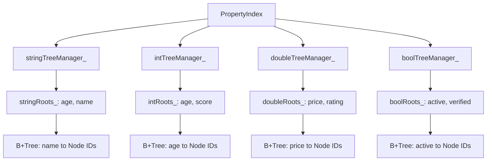
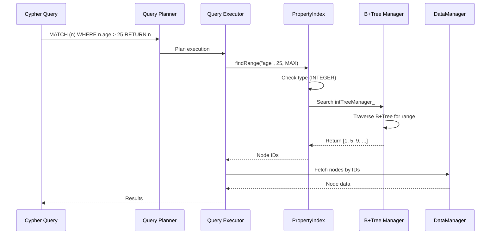
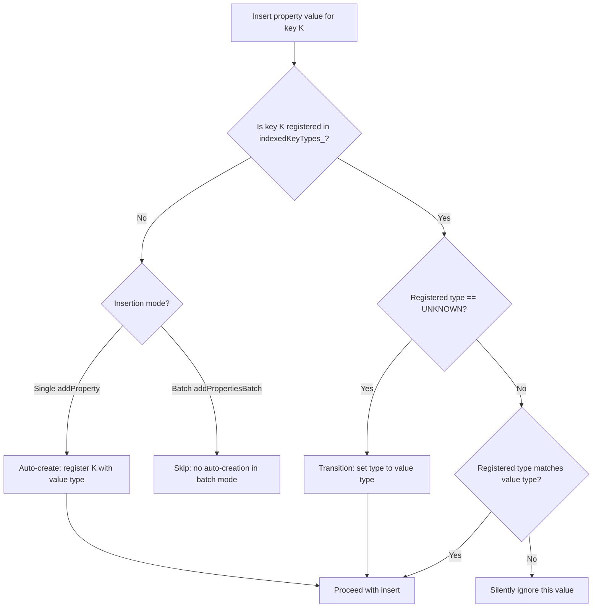
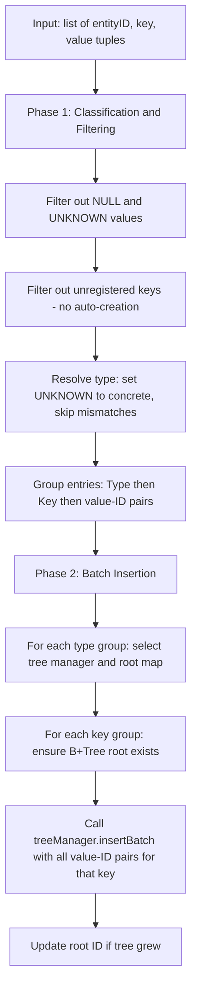
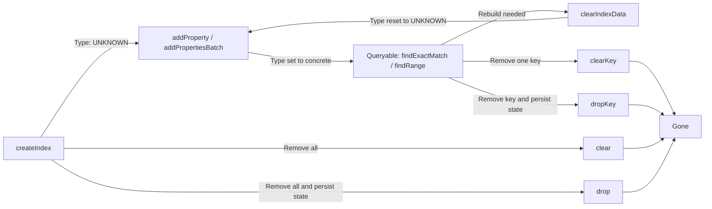

# 属性索引

ZYX 实现了高性能属性索引系统，采用类型特定的 B+Tree 结构，将属性值高效映射到对应的实体 ID。这使得 Cypher 中基于属性的查询能够快速执行，例如 `MATCH (n) WHERE n.age > 25 RETURN n` 或 `MATCH (n) WHERE n.name = 'Alice' RETURN n`。

## 概述

属性索引提供以下能力：

- **类型特定索引**：为 string、integer、double 和 boolean 属性类型分别维护独立的 B+Tree
- **多键索引**：支持同时索引多个属性键
- **自动类型推断**：根据首次插入的值确定属性类型
- **批量操作**：优化的批量插入，用于高效构建索引
- **并发访问**：使用 shared mutex 实现线程安全操作
- **状态持久化**：重启后自动恢复索引元数据
- **动态索引管理**：运行时创建、清除和删除索引

## 架构

### 多类型索引结构

`PropertyIndex` 类维护四个独立的 `IndexTreeManager` 实例，每个属性类型各一个。每个 tree manager 持有一个 root map，将属性键名映射到 B+Tree 的 root ID。共享的 `indexedKeyTypes_` map 记录每个属性键的声明类型。

在构造时，`PropertyIndex` 创建全部四个 `IndexTreeManager` 实例（每个都配置了对应 `PropertyType` 的键比较函数），并调用 `initialize()` 恢复持久化状态。源码：`include/graph/storage/indexes/PropertyIndex.hpp`。

### 基于属性的查询流程

当 Cypher 查询包含基于属性的过滤条件时，查询规划器决定是否可以使用属性索引来满足该查询。如果被过滤的属性键存在索引，规划器会生成索引查找操作，而非全节点扫描。

执行器从索引中获取实体 ID，然后从 `DataManager` 中获取完整的实体数据。

## 核心操作

### 初始化

启动时，`initialize()` 在排他锁下加载持久化的索引元数据。该过程分为三步：

1. **反序列化 root map**：从 `SystemStateManager` 加载四个 root map（string、int、double、bool）。每个 map 将属性键名关联到 B+Tree root ID。
2. **反序列化键类型 map**：加载属性键名到其 `PropertyType` 值的映射。类型在持久化状态中以 `int64_t` 存储，加载时转回枚举值。
3. **重建键列表缓存**：从 `indexedKeyTypes_` 的键集合填充 `indexedKeysList_`，提供对已索引键的快速枚举。

所有元数据在一次锁获取中原子性地恢复。

### 创建索引

`createIndex(key)` 操作在任何数据插入之前注册一个属性键以进行索引。它获取排他锁，如果该键尚未注册，则将其以 `UNKNOWN` 类型添加到 `indexedKeyTypes_`，并追加到 `indexedKeysList_`。

关键特性：

- **即时注册**：即使在任何数据插入之前，该键也会对 `getIndexedKeys()` 可见。
- **延迟类型确定**：类型初始为 `UNKNOWN`，由该键首次插入的值确定。
- **幂等性**：对同一键多次调用 `createIndex` 是安全的；后续调用为空操作。
- **不分配 B+Tree**：在实际插入第一个值之前不会创建树节点。

此操作通常用于在批量数据加载之前预声明索引。

### 类型推断

类型推断根据首次插入的值确定属性类型，并对所有后续插入强制执行类型一致性。

推断规则对 `addProperty` 和 `addPropertiesBatch` 同样适用，但有一个关键区别：批量模式不会自动创建新的键注册。类型为 `UNKNOWN` 或 `NULL_TYPE` 的值总是被拒绝，永远不会被索引。

### 添加属性

`addProperty(entityId, key, value)` 操作向索引中添加单条属性条目。它获取排他锁并执行以下步骤：

1. **验证值类型**：确定传入值的 `PropertyType`。如果为 `UNKNOWN` 或 `NULL_TYPE`，立即返回。
2. **解析键类型**：在 `indexedKeyTypes_` 中查找该键。如果未找到，则以推断类型自动创建条目。如果找到但类型为 `UNKNOWN`，则转换为具体类型。如果已注册类型与值类型不匹配，则静默忽略该值。
3. **定位树结构**：使用 `getTreeManagerForType` 和 `getRootMapForType` 选择已解析类型对应的 `IndexTreeManager` 和 root map。
4. **按需初始化 B+Tree**：如果 root map 中不包含该键的条目，则通过 `treeManager->initialize()` 创建新的 B+Tree 并存储 root ID。
5. **插入 B+Tree**：调用 `treeManager->insert(rootId, value, entityId)`，并在树因根节点分裂而增长时更新存储的 root ID。

时间复杂度：O(log n)，其中 n 为唯一属性值的数量。空间复杂度：每次插入摊销 O(1)。

### 批量添加属性

`addPropertiesBatch(properties)` 操作提供优化的批量插入。它接收一个 (entity ID, key, value) 元组的扁平列表，分两个阶段处理。

**阶段 1 -- 分类与过滤**：检查每个元组。跳过类型为 `UNKNOWN` 或 `NULL_TYPE` 的值。跳过未在 `indexedKeyTypes_` 中找到的键（批量模式下不自动创建）。将类型为 `UNKNOWN` 的键转换为具体值类型。通过过滤的条目被放入嵌套分组结构：`PropertyType -> key name -> list of (value, entityId) pairs`。

**阶段 2 -- 批量插入**：对每个类型分组，选择对应的 `IndexTreeManager` 和 root map。对类型分组内的每个键，如果 B+Tree root 不存在则初始化，然后以该键的全部条目列表调用 `insertBatch`。如果树增长了则更新 root ID。

优化措施：

- **单次锁获取**：整个批量操作在一次排他锁下运行，减少与单独插入相比的锁竞争。
- **按类型分组**：通过集中处理同类型的所有条目来减少 tree manager 切换。
- **按键分组**：每个键的条目通过单次 `insertBatch` 调用传入，使 B+Tree 能够优化内部节点分裂。
- **不自动创建**：防止批量加载期间意外的索引膨胀。键必须预先通过 `createIndex` 注册。

大批量操作的吞吐量约为单独插入的 10 倍。

### 删除属性

`removeProperty(entityId, key, value)` 操作从索引中删除特定的属性条目。它获取排他锁并：

1. 查找该键的已注册类型。如果键未被索引，立即返回。
2. 检查值类型是否与已注册类型匹配。如果不匹配，立即返回。
3. 选择适当的 tree manager 和 root map，定位该键的 B+Tree root，并调用 `treeManager->remove(rootId, value, entityId)`。

B+Tree 在删除后处理任何必要的重平衡操作（合并或重新分配）。时间复杂度：O(log n)。

### 精确匹配查找

`findExactMatch(key, value)` 操作检索所有具有精确属性值匹配的实体 ID。它获取共享锁并：

1. 确定值的类型并检查键是否以匹配类型被索引。类型不匹配时返回空向量。
2. 在对应的类型特定 root map 中查找 root ID。
3. 调用 `treeManager->find(rootId, value)` 遍历 B+Tree 并收集匹配叶节点处的所有实体 ID。

返回实体 ID 向量。时间复杂度：O(log n + k)，其中 k 为匹配实体数量。共享锁允许并发读取。

使用场景：带有等值谓词的 Cypher 查询，如 `WHERE n.name = 'Alice'`。

### 范围查询

`findRange(key, minValue, maxValue)` 操作检索属性值落在数值或字符串范围内的实体 ID。它获取共享锁并：

1. 查找该键的已索引类型。只有 `INTEGER`、`DOUBLE` 和 `STRING` 类型支持范围查询。其他类型返回空结果。
2. 对边界值执行类型提升以匹配已索引类型：
   - 如果索引类型为 `INTEGER` 而边界为 `DOUBLE`，下界使用 `ceil` 转换，上界使用 `floor` 转换。
   - 如果索引类型为 `DOUBLE` 而边界为 `INTEGER`，将边界提升为 `DOUBLE`。
   - 如果边界为 `NULL_TYPE`，视为无界。
   - 不兼容的类型组合返回空结果。
3. 调用 `treeManager->findRange(rootId, minKey, maxKey)` 扫描 B+Tree 中范围内的所有条目。

返回实体 ID 向量。时间复杂度：O(log n + k)，其中 k 为范围内实体数量。

使用场景：Cypher 范围查询，如 `WHERE n.age > 25 AND n.age < 65`。

## 类型系统

### 属性类型

属性索引支持四种索引属性类型：

| 类型 | 描述 | 示例值 | 范围查询 |
|------|------|--------|----------|
| STRING | 文本字符串 | "Alice", "Bob" | 支持 |
| INTEGER | 64 位整数 | 25, -10, 1000 | 支持 |
| DOUBLE | 浮点数 | 3.14, -0.5, 1e6 | 支持 |
| BOOLEAN | 布尔值 | true, false | 不支持 |

### 类型验证

类型验证在单个属性键的索引内强制执行一致性：

- 首次为某个键插入的值决定了该键整个索引的类型。
- 后续插入必须提供与已注册类型匹配的值。
- 与已注册类型不匹配的值会被静默忽略，不会抛出错误。
- `NULL_TYPE` 和 `UNKNOWN` 值在任何情况下都不会被索引。

此设计意味着像 `"age"` 这样的属性键只能是 `INTEGER`、`DOUBLE` 或 `STRING` 中的一种，不会混合。如果键最初通过 `createIndex` 注册（类型为 `UNKNOWN`），第一个具体值将永久确定类型。

## 索引生命周期

### 清除索引数据

`clearIndexData(key)` 操作删除某个键的所有 B+Tree 数据，同时在 `indexedKeyTypes_` 中保留键定义。它获取排他锁并：

1. 检查键是否存在于 `indexedKeyTypes_` 中。如果不存在则立即返回。
2. 从所有四个 root map（string、int、double、bool）中清除该键的 root 条目，作为防御性措施，即使逻辑上只有一个类型 map 应包含该键。
3. 将键的类型在 `indexedKeyTypes_` 中重置为 `UNKNOWN`，允许在后续重建时重新确定类型。

此操作由索引构建器在从头重建索引时使用。

### 清除键

`clearKey(key)` 操作同时删除特定属性键的 B+Tree 数据和键定义。它获取排他锁并：

1. 如果键的类型为 `UNKNOWN`（从未创建过 B+Tree），只需从 `indexedKeyTypes_` 中移除并返回。
2. 对于具体类型，选择对应的 root map 和 tree manager，清除 B+Tree，从 root map 中移除 root 条目，从 `indexedKeyTypes_` 中移除该键，并从 `indexedKeysList_` 中移除。

### 删除键

`dropKey(key)` 操作在 `clearKey` 基础上额外删除持久化状态。调用 `clearKey(key)` 后，检查每个 root map 和类型 map。如果某些 map 此时为空，则从 `SystemStateManager` 中移除对应的条目以清理持久化存储。

### 清除全部

`clear()` 操作删除每个键的所有索引数据。它获取排他锁并遍历所有四个 root map，通过各自的 tree manager 清除每个 B+Tree。然后清空 `indexedKeyTypes_` 和 `indexedKeysList_`。

### 删除全部

`drop()` 操作调用 `clear()` 删除所有内存数据，然后从 `SystemStateManager` 中移除全部五个持久化状态条目（四个 root map 和一个键类型 map）。

## 状态持久化

索引元数据通过 `SystemStateManager` 进行持久化，后者将键值映射存储到持久存储。

### 保存状态

`saveState()` 操作获取共享锁并序列化两类数据：

- **Root map**：每个非空 root map（string、int、double、bool）以 `string -> int64_t` map 的形式写入，以基础状态键加类型特定后缀作为存储键。
- **键类型 map**：`indexedKeyTypes_` map 通过将每个 `PropertyType` 枚举值转换为 `int64_t` 并存储为 `string -> int64_t` map 来序列化。

只有非空 map 才会被持久化，产生稀疏状态以避免写入不必要的数据。

### 加载状态

`deserializeRootMap()` 和 `deserializeKeyTypeMap()` 方法从 `SystemStateManager` 加载 root map 和键类型 map。类型 map 通过将每个 `int64_t` 转回 `PropertyType` 来反序列化。

### 刷写

`flush()` 方法是一个便捷封装，调用 `saveState()` 将当前元数据持久化到持久存储。

## 并发控制

属性索引使用每个 `PropertyIndex` 实例一个 `std::shared_mutex` 来协调并发访问。

**锁策略**：

- **共享锁**（`std::shared_lock`）：由所有读操作使用 -- `findExactMatch`、`findRange`、`isEmpty`、`hasKeyIndexed`、`getIndexedKeyType`、`getIndexedKeys` 和 `saveState`。多个线程可以同时持有共享锁。
- **排他锁**（`std::unique_lock`）：由所有写操作使用 -- `addProperty`、`addPropertiesBatch`、`removeProperty`、`createIndex`、`clearIndexData`、`clearKey`、`clear` 和 `initialize`。只有一个线程可以持有排他锁，且它会阻塞所有共享锁。

此策略提供高读取并发性和写入串行化。每个 `PropertyIndex` 实例（通常节点一个、边一个）有各自独立的 mutex，因此节点属性查找不会阻塞边属性查找。

## 性能特征

### 时间复杂度

| 操作 | 平均情况 | 最坏情况 |
|------|----------|----------|
| createIndex | O(1) | O(1) |
| addProperty | O(log n) | O(log n) |
| addPropertiesBatch | O(m log n) | O(m log n) |
| removeProperty | O(log n) | O(log n) |
| findExactMatch | O(log n + k) | O(log n + k) |
| findRange | O(log n + k) | O(log n + k) |
| clearKey | O(1) | O(1) |
| dropKey | O(1) | O(1) |

其中：
- n = 某个键的唯一属性值数量
- m = 批量操作中的属性数量
- k = 匹配查询的实体数量

### 空间复杂度

| 组件 | 空间 | 描述 |
|------|------|------|
| B+Tree 节点（每个键） | O(n x b) | n 个值，b = 分支因子 |
| Root Map | O(k) | k = 已索引键数量 |
| 类型 Map | O(k) | k = 已索引键数量 |
| 键列表 | O(k) | 缓存的键列表 |

总计：O(N)，其中 N = 属性值-实体关联的总数。

### 内存开销

对于 100 万个节点，每个节点有 5 个已索引属性：

- B+Tree 结构（每个属性键）：内部节点约 25.6 KB，叶节点约 128 KB，实体 ID 引用约 8 MB，每个键合计约 8.15 MB。
- 5 个属性总计：约 40.75 MB。
- 每个属性值-实体关联的开销：约 8 字节。
- 状态元数据（root map、类型 map、键列表）：总计约 2 KB。

## 多键索引

实体可以拥有多个已索引属性，每个属性维护在其独立的 B+Tree 中。单属性 API 中没有跨属性组合索引；每个属性键独立索引。多个索引结果可以在查询执行层通过集合交集进行组合。

每个属性类型被路由到其专用的 tree manager：string 值路由到 `stringTreeManager_`，root 存储在 `stringRoots_` 中；integer 值路由到 `intTreeManager_`，root 存储在 `intRoots_` 中，以此类推。这种类型分离确保了每个 B+Tree 内的类型安全，并允许 tree manager 使用类型优化的比较函数。只有数值类型（INTEGER、DOUBLE）和 STRING 支持通过 `findRange` 进行范围查询。

## 复合索引

除了单属性索引，`PropertyIndex` 还支持基于多个属性键的复合索引。复合索引使用空字节分隔符将多个属性值编码为单个字符串键，然后将编码后的键存储在专用的 `compositeTreeManager_` B+Tree 中。

关键操作：

- **createCompositeIndex(keys)**：为有序属性键列表注册复合索引。创建新的 B+Tree root。
- **addCompositeEntry(entityId, keys, values)**：将值编码为复合键并插入实体 ID。
- **findCompositeExact(keys, values)**：精确匹配所有值的实体 ID 查找。
- **findCompositePrefix(prefixKeys, prefixValues)**：匹配复合键前导子集的实体 ID 查找，使用从编码前缀到高位哨兵值的范围扫描。

复合索引定义和 root 与单属性状态一起持久化。

## 最佳实践

1. **显式创建索引**：在批量加载前使用 `createIndex()` 以确保可预测的行为。
2. **批量操作**：批量数据加载使用 `addPropertiesBatch()`，比单独插入快约 10 倍。
3. **类型一致性**：确保共享同一键的所有实体的属性值类型一致。
4. **选择性索引**：仅索引频繁查询的属性，避免不必要的内存和写入开销。
5. **数值类型用于范围查询**：需要范围查询的属性使用 INTEGER 或 DOUBLE 类型。
6. **监控状态**：使用 `hasKeyIndexed()` 和 `getIndexedKeyType()` 验证索引状态。
7. **定期持久化**：在关键操作后调用 `flush()` 确保元数据持久性。
8. **清理**：索引不再需要时使用 `dropKey()` 回收内存和持久化状态。

## 局限性

1. **不支持部分字符串匹配**：字符串属性查找要求精确匹配或范围查询；单属性索引不支持通配符或前缀搜索。
2. **类型严格性**：类型不匹配时静默忽略，不报告错误。
3. **内存限制**：整个索引结构必须能装入内存。
4. **写入串行化**：每个 `PropertyIndex` 实例只允许一个并发写入者。
5. **不自动删除**：删除实体不会自动从属性索引中删除其条目；调用方必须显式调用 `removeProperty`。

## 另见

- [B+Tree 索引](/zh/docs/zyx/algorithms/btree-indexing) - B+Tree 结构详解
- [标签索引](/zh/docs/zyx/algorithms/label-index) - 基于标签的索引
- [查询优化](/zh/docs/zyx/algorithms/query-optimization) - 查询中的索引使用
- [存储系统](/zh/docs/zyx/architecture/storage) - 整体存储架构
