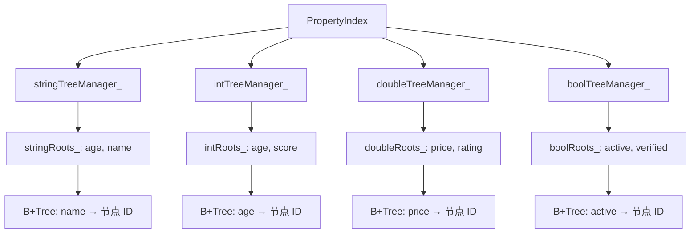
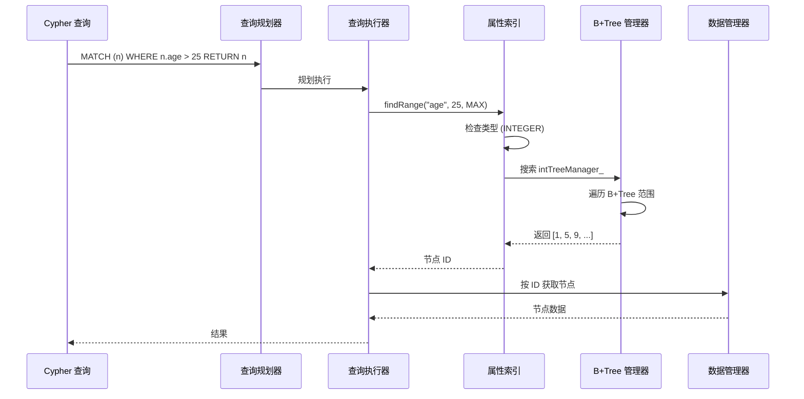

# 属性索引

ZYX 使用类型特定的 B+Tree 结构实现了高性能属性索引系统，能够高效地将属性值映射到对应的实体 ID。这使得 Cypher 查询如 `MATCH (n) WHERE n.age > 25 RETURN n` 或 `MATCH (n) WHERE n.name = 'Alice' RETURN n` 能够快速执行。

## 概述

属性索引提供以下功能：

- **类型特定索引**：为字符串、整数、双精度浮点数和布尔属性类型分别使用独立的 B+Tree
- **多键索引**：支持同时索引多个属性键
- **自动类型推断**：从首次插入的值推断属性类型
- **批量操作**：优化的批量插入以实现高效索引构建
- **并发访问**：使用共享互斥锁实现线程安全操作
- **状态持久化**：跨重启自动持久化索引元数据
- **动态索引管理**：运行时索引创建、清除和删除

## 架构

### 多类型索引结构



### 基于属性的查询流程



## 实现

### 类定义

```cpp
class PropertyIndex {
public:
    PropertyIndex(std::shared_ptr<storage::DataManager> dataManager,
                  std::shared_ptr<storage::state::SystemStateManager> systemStateManager,
                  uint32_t indexType,
                  std::string baseStateKey);

    // 核心操作
    void addProperty(int64_t entityId, const std::string &key, const PropertyValue &value);
    void addPropertiesBatch(const std::vector<std::tuple<int64_t, std::string, PropertyValue>> &properties);
    void removeProperty(int64_t entityId, const std::string &key, const PropertyValue &value);
    std::vector<int64_t> findExactMatch(const std::string &key, const PropertyValue &value) const;
    std::vector<int64_t> findRange(const std::string &key, double minValue, double maxValue) const;

    // 索引生命周期
    void createIndex(const std::string &key);
    void clearIndexData(const std::string &key);
    void clearKey(const std::string &key);
    void dropKey(const std::string &key);
    void clear();
    void drop();
    void flush() const;
    void saveState() const;

    // 状态查询
    bool isEmpty() const;
    bool hasKeyIndexed(const std::string &key) const;
    const std::vector<std::string> &getIndexedKeys() const;
    PropertyType getIndexedKeyType(const std::string &key) const;

private:
    std::shared_ptr<storage::DataManager> dataManager_;
    std::shared_ptr<storage::state::SystemStateManager> systemStateManager_;

    // 类型特定的树管理器
    std::shared_ptr<IndexTreeManager> stringTreeManager_;
    std::shared_ptr<IndexTreeManager> intTreeManager_;
    std::shared_ptr<IndexTreeManager> doubleTreeManager_;
    std::shared_ptr<IndexTreeManager> boolTreeManager_;

    mutable std::shared_mutex mutex_;
    const std::string baseStateKey_;

    // 不同属性类型的根 ID
    std::unordered_map<std::string, int64_t> stringRoots_;
    std::unordered_map<std::string, int64_t> intRoots_;
    std::unordered_map<std::string, int64_t> doubleRoots_;
    std::unordered_map<std::string, int64_t> boolRoots_;

    // 每个索引键的类型映射
    std::unordered_map<std::string, PropertyType> indexedKeyTypes_;
    std::vector<std::string> indexedKeysList_;
};
```

## 核心操作

### 初始化

属性索引在启动时从持久化状态初始化：

```cpp
void PropertyIndex::initialize() {
    std::unique_lock lock(mutex_);

    // 1. 加载所有类型的根映射
    deserializeRootMap();

    // 2. 加载键类型映射
    deserializeKeyTypeMap();

    // 3. 重建索引键列表缓存
    indexedKeysList_.clear();
    indexedKeysList_.reserve(indexedKeyTypes_.size());
    for (const auto &key: indexedKeyTypes_ | std::views::keys) {
        indexedKeysList_.push_back(key);
    }
}
```

**关键点**：
- 每种属性类型（string、int、double、bool）有独立的根映射
- 键类型映射跟踪每个属性键使用的类型
- 索引键列表缓存用于快速枚举
- 所有元数据跨重启持久化

### 创建索引

注册属性键以进行索引：

```cpp
void PropertyIndex::createIndex(const std::string &key) {
    std::unique_lock lock(mutex_);
    if (!indexedKeyTypes_.contains(key)) {
        indexedKeyTypes_[key] = PropertyType::UNKNOWN;
        indexedKeysList_.push_back(key);
    }
}
```

**特性**：
- **立即注册**：键在数据插入前就对 `listIndexes()` 可见
- **类型推断**：类型从 UNKNOWN 开始，从首次插入的值确定
- **幂等性**：可以对同一键多次安全调用
- **无数据结构创建**：B+Tree 仅在首次数据插入时初始化

**使用场景**：在批量数据加载之前预先声明索引

### 添加属性

将单个属性值添加到索引：

```cpp
void PropertyIndex::addProperty(int64_t entityId, const std::string &key,
                                const PropertyValue &value) {
    std::unique_lock lock(mutex_);

    // 1. 验证值类型
    PropertyType valueType = getPropertyType(value);
    if (valueType == PropertyType::UNKNOWN || valueType == PropertyType::NULL_TYPE) {
        return;
    }

    // 2. 检查或注册键类型
    auto it = indexedKeyTypes_.find(key);
    if (it == indexedKeyTypes_.end()) {
        // 自动创建：使用推断的类型注册键
        indexedKeyTypes_[key] = valueType;
    } else if (it->second == PropertyType::UNKNOWN) {
        // 从 UNKNOWN 转换为具体类型
        it->second = valueType;
    } else if (it->second != valueType) {
        // 类型不匹配：忽略值
        return;
    }

    // 3. 获取类型特定的树管理器和根映射
    auto treeManager = getTreeManagerForType(valueType);
    auto &rootMap = getRootMapForType(valueType);

    // 4. 如果需要，初始化 B+Tree
    if (!rootMap.contains(key)) {
        rootMap[key] = treeManager->initialize();
    }

    // 5. 插入到 B+Tree
    rootMap[key] = treeManager->insert(rootMap[key], value, entityId);
}
```

**特性**：
- **时间复杂度**：O(log n)，其中 n 是唯一属性值的数量
- **空间复杂度**：O(1) 摊销（B+Tree 增长）
- **自动创建**：如果键未注册则自动创建索引
- **类型验证**：强制现有索引的类型一致性

**类型推断规则**：
1. 首次插入确定类型
2. 后续插入必须匹配类型
3. 类型不匹配将被静默忽略
4. NULL 和 UNKNOWN 值从不被索引

### 批量添加属性

优化的多属性批量插入：

```cpp
void PropertyIndex::addPropertiesBatch(
    const std::vector<std::tuple<int64_t, std::string, PropertyValue>> &properties
) {
    if (properties.empty())
        return;

    std::unique_lock lock(mutex_);

    // 结构：Type -> Key -> {Value, EntityID} 对列表
    std::map<PropertyType, std::map<std::string, std::vector<std::pair<PropertyValue, int64_t>>>> groupedBatch;

    // 1. 分类和过滤阶段
    for (const auto &[entityId, key, value]: properties) {
        PropertyType valueType = getPropertyType(value);
        if (valueType == PropertyType::UNKNOWN || valueType == PropertyType::NULL_TYPE) {
            continue;
        }

        // 检查键是否已注册（批量模式不自动创建）
        auto it = indexedKeyTypes_.find(key);
        if (it == indexedKeyTypes_.end()) {
            continue;
        }

        PropertyType registeredType = it->second;

        if (registeredType == PropertyType::UNKNOWN) {
            // 首次看到数据，设置类型
            indexedKeyTypes_[key] = valueType;
            registeredType = valueType;
        } else if (registeredType != valueType) {
            // 类型不匹配，跳过此属性
            continue;
        }

        // 添加到分组批量
        groupedBatch[registeredType][key].emplace_back(value, entityId);
    }

    // 2. 批量插入阶段
    for (auto &[type, keyMap]: groupedBatch) {
        auto treeManager = getTreeManagerForType(type);
        auto &rootMap = getRootMapForType(type);

        if (!treeManager)
            continue;

        for (auto &[key, entries]: keyMap) {
            if (entries.empty())
                continue;

            // 确保根存在
            if (!rootMap.contains(key)) {
                rootMap[key] = treeManager->initialize();
            }

            int64_t currentRootId = rootMap[key];

            // 在 B+Tree 上执行批量插入
            int64_t newRootId = treeManager->insertBatch(currentRootId, entries);

            // 如果树增长则更新根
            if (newRootId != currentRootId) {
                rootMap[key] = newRootId;
            }
        }
    }
}
```

**优化**：
- **单次锁获取**：相比单独插入减少争用
- **基于类型的分组**：最小化树管理器切换
- **基于键的分组**：优化 B+Tree 批量插入
- **无自动创建**：防止批量加载中的意外索引爆炸

**性能**：
- **吞吐量**：大批量操作比单独插入快约 10 倍
- **内存**：在插入前在内存中分组条目
- **使用场景**：数据库启动或批量导入期间的索引构建

### 删除属性

从索引中删除属性值：

```cpp
void PropertyIndex::removeProperty(int64_t entityId, const std::string &key,
                                   const PropertyValue &value) {
    std::unique_lock lock(mutex_);

    // 1. 查找键的注册类型
    const auto it = indexedKeyTypes_.find(key);
    if (it == indexedKeyTypes_.end()) {
        return; // 键未索引
    }

    const PropertyType registeredType = it->second;
    const PropertyType valueType = getPropertyType(value);

    // 2. 验证类型匹配
    if (registeredType != valueType) {
        return;
    }

    // 3. 获取类型特定的结构
    const auto treeManager = getTreeManagerForType(registeredType);
    auto &rootMap = getRootMapForType(registeredType);
    const auto rootIt = rootMap.find(key);

    if (rootIt == rootMap.end()) {
        return; // 此键无根
    }

    // 4. 从 B+Tree 删除
    (void) treeManager->remove(rootMap.at(key), value, entityId);
}
```

**特性**：
- **时间复杂度**：O(log n)
- **自动重平衡**：B+Tree 通过合并/重新分配处理下溢
- **类型验证**：仅当类型匹配注册类型时删除

### 查找精确匹配

检索具有精确属性值匹配的实体：

```cpp
std::vector<int64_t> PropertyIndex::findExactMatch(
    const std::string &key,
    const PropertyValue &value
) const {
    std::shared_lock lock(mutex_);

    // 1. 获取值类型
    const PropertyType valueType = getPropertyType(value);

    // 2. 检查键是否以匹配类型索引
    if (const auto it = indexedKeyTypes_.find(key);
        it == indexedKeyTypes_.end() || it->second != valueType) {
        return {};
    }

    // 3. 获取类型特定的根映射
    const auto &rootMap = getRootMapForType(valueType);
    const auto rootIt = rootMap.find(key);

    if (rootIt == rootMap.end()) {
        return {};
    }

    // 4. 搜索 B+Tree
    return getTreeManagerForType(valueType)->find(rootIt->second, value);
}
```

**特性**：
- **时间复杂度**：O(log n + k)，其中 k 是匹配实体的数量
- **并发**：共享锁允许并发读取
- **类型验证**：类型不匹配时返回空
- **返回**：实体 ID 向量（未找到时为空）

**使用场景**：如 `WHERE n.name = 'Alice'` 的查询

### 查找范围

检索具有数值范围内属性值的实体：

```cpp
std::vector<int64_t> PropertyIndex::findRange(
    const std::string &key,
    double minValue,
    double maxValue
) const {
    std::shared_lock lock(mutex_);

    // 1. 获取键类型
    PropertyType type = getIndexedKeyType(key);

    // 2. 验证数值类型
    if (type != PropertyType::INTEGER && type != PropertyType::DOUBLE) {
        return {};
    }

    // 3. 获取类型特定的根映射
    const auto &rootMap = getRootMapForType(type);
    auto rootIt = rootMap.find(key);

    if (rootIt == rootMap.end()) {
        return {};
    }

    // 4. 转换为适当类型
    PropertyValue minKey, maxKey;
    if (type == PropertyType::INTEGER) {
        minKey = static_cast<int64_t>(std::ceil(minValue));
        maxKey = static_cast<int64_t>(std::floor(maxValue));
    } else {
        minKey = minValue;
        maxKey = maxValue;
    }

    // 5. 搜索 B+Tree 范围
    return getTreeManagerForType(type)->findRange(rootIt->second, minKey, maxKey);
}
```

**特性**：
- **时间复杂度**：O(log n + k)，其中 k 是范围内的实体数量
- **仅数值类型**：仅支持 INTEGER 和 DOUBLE 类型
- **类型转换**：自动将 double 转换为 integer 以用于 INTEGER 索引
- **使用场景**：如 `WHERE n.age > 25 AND n.age < 65` 的查询

## 类型系统

### 属性类型

属性索引支持四种索引属性类型：

| 类型 | 描述 | 示例值 | 范围查询 |
|------|-------------|----------------|---------------|
| STRING | 文本字符串 | "Alice", "Bob" | 否 |
| INTEGER | 64位整数 | 25, -10, 1000 | 是 |
| DOUBLE | 浮点数 | 3.14, -0.5, 1e6 | 是 |
| BOOLEAN | 真/假值 | true, false | 否 |

### 类型推断

类型从首次插入的值推断：

```cpp
// 首次插入确定类型
propertyIndex.addProperty(1, "age", PropertyValue(25));  // 类型: INTEGER
propertyIndex.addProperty(2, "age", PropertyValue(30));  // OK: 匹配 INTEGER
propertyIndex.addProperty(3, "age", PropertyValue("25")); // 忽略: 类型不匹配

// 显式创建允许延迟类型推断
propertyIndex.createIndex("salary");  // 类型: UNKNOWN
propertyIndex.addProperty(1, "salary", PropertyValue(50000.50));  // 类型: DOUBLE
```

### 类型验证

```cpp
// 类型验证确保一致性
propertyIndex.addProperty(1, "name", PropertyValue("Alice"));  // 类型: STRING
propertyIndex.addProperty(2, "name", PropertyValue(123));       // 忽略: INTEGER != STRING
propertyIndex.addProperty(3, "name", PropertyValue(true));      // 忽略: BOOLEAN != STRING
```

## 索引生命周期

### 清除索引数据

清除 B+Tree 数据同时保留索引定义：

```cpp
void PropertyIndex::clearIndexData(const std::string &key) {
    std::unique_lock lock(mutex_);

    if (!indexedKeyTypes_.contains(key)) {
        return;
    }

    // 清除所有类型的根（防御性深度防御）
    auto clearRoot = [&](auto &rootMap, auto &treeManager) {
        if (auto rootIt = rootMap.find(key); rootIt != rootMap.end()) {
            treeManager->clear(rootIt->second);
            rootMap.erase(rootIt);
        }
    };

    clearRoot(stringRoots_, stringTreeManager_);
    clearRoot(intRoots_, intTreeManager_);
    clearRoot(doubleRoots_, doubleTreeManager_);
    clearRoot(boolRoots_, boolTreeManager_);

    // 重置类型为 UNKNOWN 以便重建
    indexedKeyTypes_[key] = PropertyType::UNKNOWN;
}
```

**使用场景**：索引重建场景

### 清除键

删除特定键的数据和定义：

```cpp
void PropertyIndex::clearKey(const std::string &key) {
    std::unique_lock lock(mutex_);

    auto it = indexedKeyTypes_.find(key);
    if (it == indexedKeyTypes_.end()) {
        return;
    }

    PropertyType type = it->second;

    // 处理 UNKNOWN 类型（无 B+Tree 需清除）
    if (type == PropertyType::UNKNOWN) {
        indexedKeyTypes_.erase(it);
        return;
    }

    // 清除具体类型的 B+Tree
    auto &rootMap = getRootMapForType(type);
    auto rootIt = rootMap.find(key);

    if (rootIt != rootMap.end()) {
        auto treeManager = getTreeManagerForType(type);
        treeManager->clear(rootIt->second);
        rootMap.erase(rootIt);
    }

    // 删除类型映射
    indexedKeyTypes_.erase(it);
    std::erase(indexedKeysList_, key);
}
```

### 删除键

完全删除键及其持久化状态：

```cpp
void PropertyIndex::dropKey(const std::string &key) {
    // 清除数据和定义
    clearKey(key);

    // 如果映射为空则删除持久化状态
    if (stringRoots_.empty()) {
        systemStateManager_->remove(baseStateKey_ + storage::state::keys::SUFFIX_STRING_ROOTS);
    }
    if (intRoots_.empty()) {
        systemStateManager_->remove(baseStateKey_ + storage::state::keys::SUFFIX_INT_ROOTS);
    }
    if (doubleRoots_.empty()) {
        systemStateManager_->remove(baseStateKey_ + storage::state::keys::SUFFIX_DOUBLE_ROOTS);
    }
    if (boolRoots_.empty()) {
        systemStateManager_->remove(baseStateKey_ + storage::state::keys::SUFFIX_BOOL_ROOTS);
    }

    if (indexedKeyTypes_.empty()) {
        systemStateManager_->remove(baseStateKey_ + storage::state::keys::SUFFIX_KEY_TYPES);
    }
}
```

### 清除全部

删除所有索引数据：

```cpp
void PropertyIndex::clear() {
    std::unique_lock lock(mutex_);

    auto clearAllRoots = [&](auto &rootMap, auto &treeManager) {
        for (const auto &rootId: rootMap | std::views::values) {
            treeManager->clear(rootId);
        }
        rootMap.clear();
    };

    clearAllRoots(stringRoots_, stringTreeManager_);
    clearAllRoots(intRoots_, intTreeManager_);
    clearAllRoots(doubleRoots_, doubleTreeManager_);
    clearAllRoots(boolRoots_, boolTreeManager_);

    indexedKeyTypes_.clear();
    indexedKeysList_.clear();
}
```

### 删除全部

完全删除索引：

```cpp
void PropertyIndex::drop() {
    clear();

    // 删除所有持久化状态
    systemStateManager_->remove(baseStateKey_ + storage::state::keys::SUFFIX_STRING_ROOTS);
    systemStateManager_->remove(baseStateKey_ + storage::state::keys::SUFFIX_INT_ROOTS);
    systemStateManager_->remove(baseStateKey_ + storage::state::keys::SUFFIX_DOUBLE_ROOTS);
    systemStateManager_->remove(baseStateKey_ + storage::state::keys::SUFFIX_BOOL_ROOTS);
    systemStateManager_->remove(baseStateKey_ + storage::state::keys::SUFFIX_KEY_TYPES);
}
```

## 状态持久化

### 保存状态

将索引元数据持久化到磁盘：

```cpp
void PropertyIndex::saveState() const {
    std::shared_lock lock(mutex_);

    // 保存所有根映射
    serializeRootMap();

    // 保存键类型映射
    serializeKeyTypeMap();
}

void PropertyIndex::serializeRootMap() const {
    if (!stringRoots_.empty()) {
        systemStateManager_->setMap(baseStateKey_ + storage::state::keys::SUFFIX_STRING_ROOTS, stringRoots_);
    }
    if (!intRoots_.empty()) {
        systemStateManager_->setMap(baseStateKey_ + storage::state::keys::SUFFIX_INT_ROOTS, intRoots_);
    }
    if (!doubleRoots_.empty()) {
        systemStateManager_->setMap(baseStateKey_ + storage::state::keys::SUFFIX_DOUBLE_ROOTS, doubleRoots_);
    }
    if (!boolRoots_.empty()) {
        systemStateManager_->setMap(baseStateKey_ + storage::state::keys::SUFFIX_BOOL_ROOTS, boolRoots_);
    }
}

void PropertyIndex::serializeKeyTypeMap() const {
    if (!indexedKeyTypes_.empty()) {
        std::unordered_map<std::string, int64_t> rawTypeMap;
        for (const auto &[k, v]: indexedKeyTypes_) {
            rawTypeMap[k] = static_cast<int64_t>(v);
        }
        systemStateManager_->setMap(baseStateKey_ + storage::state::keys::SUFFIX_KEY_TYPES, rawTypeMap);
    }
}
```

**持久化策略**：
- 仅持久化非空映射（稀疏状态）
- 类型枚举存储为 int64_t 用于序列化
- 根 ID 将属性键映射到 B+Tree 根

### 加载状态

从磁盘恢复索引元数据：

```cpp
void PropertyIndex::deserializeRootMap() {
    stringRoots_ = systemStateManager_->getMap<int64_t>(baseStateKey_ + storage::state::keys::SUFFIX_STRING_ROOTS);
    intRoots_ = systemStateManager_->getMap<int64_t>(baseStateKey_ + storage::state::keys::SUFFIX_INT_ROOTS);
    doubleRoots_ = systemStateManager_->getMap<int64_t>(baseStateKey_ + storage::state::keys::SUFFIX_DOUBLE_ROOTS);
    boolRoots_ = systemStateManager_->getMap<int64_t>(baseStateKey_ + storage::state::keys::SUFFIX_BOOL_ROOTS);
}

void PropertyIndex::deserializeKeyTypeMap() {
    auto rawTypeMap = systemStateManager_->getMap<int64_t>(baseStateKey_ + storage::state::keys::SUFFIX_KEY_TYPES);
    indexedKeyTypes_.clear();
    for (const auto &[k, v]: rawTypeMap) {
        indexedKeyTypes_[k] = static_cast<PropertyType>(v);
    }
}
```

## 并发控制

### 共享互斥锁

属性索引使用 `std::shared_mutex` 实现并发访问：

```cpp
mutable std::shared_mutex mutex_;
```

**锁类型**：
- **共享锁** (`std::shared_lock`)：允许并发读取
- **独占锁** (`std::unique_lock`)：写入需要独占访问

**锁策略**：
- 读取操作（`findExactMatch`、`findRange`、`getIndexedKeys`）：共享锁
- 写入操作（`addProperty`、`removeProperty`、`addPropertiesBatch`）：独占锁
- 状态查询（`isEmpty`、`hasKeyIndexed`、`getIndexedKeyType`）：共享锁

### 性能影响

- **高读取并发**：多个线程可同时查询
- **写入序列化**：一次只能有一个写入者
- **公平调度**：无读写饥饿
- **细粒度锁定**：每个 PropertyIndex 实例独立锁

## 与 Cypher 查询的集成

### 查询规划

查询规划器使用属性索引进行优化：

```cypher
-- 精确匹配查询
MATCH (n) WHERE n.name = 'Alice' RETURN n;

-- 规划器优化
1. 检查 "name" 的属性索引是否存在
2. 如果存在：使用 PropertyIndex.findExactMatch("name", "Alice")
3. 如果不存在：全节点扫描加属性过滤
```

```cypher
-- 范围查询
MATCH (n) WHERE n.age > 25 AND n.age < 65 RETURN n;

-- 规划器优化
1. 检查 "age" 的属性索引是否存在
2. 如果存在且类型为数值：使用 PropertyIndex.findRange("age", 25, 65)
3. 如果不存在：全节点扫描加属性过滤
```

### 查询执行

```cpp
// 基于属性的查询执行伪代码
std::vector<Node> executePropertyFilter(
    const std::string &key,
    const PropertyValue &value
) {
    // 如果可用则使用属性索引
    if (indexManager->hasPropertyIndex("Node", key)) {
        auto entityIds = propertyIndex.findExactMatch(key, value);
        return fetchNodesByIds(entityIds);
    }

    // 回退到全扫描
    return fullScanWithPropertyFilter(key, value);
}
```

**性能对比**：
- **有索引**：O(log n + k)，其中 k = 匹配实体数
- **无索引**：O(N)，其中 N = 总实体数

## 性能特征

### 时间复杂度

| 操作 | 平均情况 | 最坏情况 |
|-----------|-------------|------------|
| createIndex | O(1) | O(1) |
| addProperty | O(log n) | O(log n) |
| addPropertiesBatch | O(m log n) | O(m log n) |
| removeProperty | O(log n) | O(log n) |
| findExactMatch | O(log n + k) | O(log n + k) |
| findRange | O(log n + k) | O(log n + k) |
| clearKey | O(1) | O(1) |
| dropKey | O(1) | O(1) |

其中：
- n = 键的唯一属性值数量
- m = 批量中的属性数量
- k = 匹配查询的实体数量

### 空间复杂度

| 组件 | 空间 | 描述 |
|-----------|-------|-------------|
| B+Tree 节点（每键） | O(n × b) | n 值，b = 分支因子 |
| 根映射 | O(k) | k = 索引键数量 |
| 类型映射 | O(k) | k = 索引键数量 |
| 键列表 | O(k) | 缓存的键列表 |

总计：**O(N)**，其中 N = 属性-值-实体关联总数

### 内存开销

```
对于 100 万个节点，每个有 5 个索引属性：

B+Tree 结构（每个属性键）：
- 内部节点：~100 个节点 × 256 字节 = 25.6 KB
- 叶节点：~500 个节点 × 256 字节 = 128 KB
- 实体 ID 引用：1M × 8 字节 = 8 MB

每个属性键总计：~8.15 MB
5 个属性总计：~40.75 MB
每个属性-值-实体开销：~8 字节

状态元数据：
- 根映射（4 种类型）：~1 KB
- 类型映射：~500 字节
- 键列表：~500 字节
```

## 多键索引

### 每个实体的多个属性

实体可以有多个索引属性：

```cpp
// 具有多个索引属性的实体
propertyIndex.addProperty(1, "name", PropertyValue("Alice"));
propertyIndex.addProperty(1, "age", PropertyValue(30));
propertyIndex.addProperty(1, "active", PropertyValue(true));

// 按任何属性查询
auto alice = propertyIndex.findExactMatch("name", PropertyValue("Alice"));
auto thirty = propertyIndex.findExactMatch("age", PropertyValue(30));
auto active = propertyIndex.findExactMatch("active", PropertyValue(true));
```

**特性**：
- 每个属性键维护独立的 B+Tree
- 无跨属性索引（无复合索引）
- 多个查询可以通过交集组合

### 类型特定索引

每个属性类型有专用的 B+Tree 结构：

```cpp
// 字符串属性
propertyIndex.addProperty(1, "name", PropertyValue("Alice"));
// 使用：stringTreeManager_，存储在 stringRoots_["name"]

// 整数属性
propertyIndex.addProperty(1, "age", PropertyValue(30));
// 使用：intTreeManager_，存储在 intRoots_["age"]

// 双精度属性
propertyIndex.addProperty(1, "salary", PropertyValue(50000.50));
// 使用：doubleTreeManager_，存储在 doubleRoots_["salary"]

// 布尔属性
propertyIndex.addProperty(1, "active", PropertyValue(true));
// 使用：boolTreeManager_，存储在 boolRoots_["active"]
```

**优势**：
- **类型安全**：防止索引中的类型混合
- **优化**：每个 B+Tree 针对其类型优化
- **范围查询**：仅数值类型支持范围查询

## 使用示例

### 基本操作

```cpp
// 创建属性索引
PropertyIndex propertyIndex(dataManager, systemStateManager,
                            IndexTypes::NODE_PROPERTY_TYPE,
                            StateKeys::NODE_PROPERTY_ROOT);

// 添加属性
propertyIndex.addProperty(1, "name", PropertyValue("Alice"));
propertyIndex.addProperty(2, "name", PropertyValue("Bob"));
propertyIndex.addProperty(1, "age", PropertyValue(30));
propertyIndex.addProperty(2, "age", PropertyValue(25));

// 查找精确匹配
auto alice = propertyIndex.findExactMatch("name", PropertyValue("Alice"));
auto thirty = propertyIndex.findExactMatch("age", PropertyValue(30));

// 查找范围（仅数值）
auto adults = propertyIndex.findRange("age", 18.0, 65.0);

// 删除属性
propertyIndex.removeProperty(1, "name", PropertyValue("Alice"));
```

### 批量导入

```cpp
// 准备批量数据
std::vector<std::tuple<int64_t, std::string, PropertyValue>> properties;

properties.emplace_back(1, "name", PropertyValue("Alice"));
properties.emplace_back(1, "age", PropertyValue(30));
properties.emplace_back(2, "name", PropertyValue("Bob"));
properties.emplace_back(2, "age", PropertyValue(25));
properties.emplace_back(3, "name", PropertyValue("Charlie"));
properties.emplace_back(3, "age", PropertyValue(35));

// 先创建索引
propertyIndex.createIndex("name");
propertyIndex.createIndex("age");

// 批量插入以提高性能
propertyIndex.addPropertiesBatch(properties);
```

### 索引管理

```cpp
// 显式创建索引
propertyIndex.createIndex("email");

// 检查键是否已索引
if (propertyIndex.hasKeyIndexed("email")) {
    std::cout << "Email 已索引" << std::endl;
}

// 获取索引键
auto keys = propertyIndex.getIndexedKeys();
for (const auto &key : keys) {
    PropertyType type = propertyIndex.getIndexedKeyType(key);
    std::cout << key << " (" << propertyTypeToString(type) << ")" << std::endl;
}

// 清除索引数据（保留定义）
propertyIndex.clearIndexData("email");

// 删除特定键
propertyIndex.dropKey("email");

// 清除所有索引
propertyIndex.clear();

// 删除所有索引
propertyIndex.drop();

// 持久化状态
propertyIndex.flush();
```

### 类型推断

```cpp
// 类型从首次插入推断
propertyIndex.addProperty(1, "score", PropertyValue(100));
// "score" 现在是 INTEGER 类型

// 后续插入必须匹配类型
propertyIndex.addProperty(2, "score", PropertyValue(200));  // OK
propertyIndex.addProperty(3, "score", PropertyValue("100")); // 忽略：类型不匹配

// 显式创建延迟类型推断
propertyIndex.createIndex("rating");  // 类型：UNKNOWN
propertyIndex.addProperty(1, "rating", PropertyValue(4.5));  // 类型：DOUBLE
```

## 最佳实践

1. **显式索引创建**：在批量加载之前使用 `createIndex()` 以获得可预测的行为
2. **批量操作**：使用 `addPropertiesBatch()` 进行批量数据加载
3. **类型一致性**：确保实体之间的属性值具有一致的类型
4. **选择性索引**：仅索引频繁查询的属性
5. **范围查询使用数值**：对范围查询使用数值类型（INTEGER、DOUBLE）
6. **监控状态**：检查 `hasKeyIndexed()` 和 `getIndexedKeyType()` 状态
7. **定期持久化**：在关键操作后调用 `flush()`
8. **清理**：当不再需要索引时使用 `dropKey()`

## 限制

1. **无复合索引**：每个属性独立索引（无多列索引）
2. **无部分匹配**：字符串属性需要精确匹配（无通配符/前缀）
3. **字符串无范围查询**：仅数值类型支持范围查询
4. **类型严格**：类型不匹配被静默忽略（无错误报告）
5. **内存限制**：整个索引结构必须适合内存
6. **写入序列化**：每个 PropertyIndex 实例仅一个并发写入者
7. **无自动删除**：删除实体不会自动更新属性索引

## 未来增强

属性索引的潜在改进：

1. **复合索引**：用于复杂查询的多属性索引
2. **全文搜索**：具有部分匹配的高级字符串索引
3. **哈希索引**：用于特定用例的 O(1) 精确匹配查找
4. **覆盖索引**：在索引中包含其他属性以加快查询
5. **部分索引**：仅索引数据子集（例如 WHERE active = true）
6. **自动索引**：基于查询模式的 AI 驱动索引建议
7. **分布式索引**：跨多个节点分片属性
8. **压缩**：压缩索引中的属性值以提高空间效率

## 相关内容

- [B+Tree 索引](/zh/zyx/algorithms/btree-indexing) - B+Tree 结构详情
- [标签索引](/zh/zyx/algorithms/label-index) - 基于标签的索引
- [查询优化](/zh/zyx/algorithms/query-optimization) - 查询中的索引使用
- [存储系统](/zh/zyx/architecture/storage) - 整体存储架构
