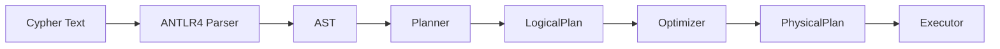
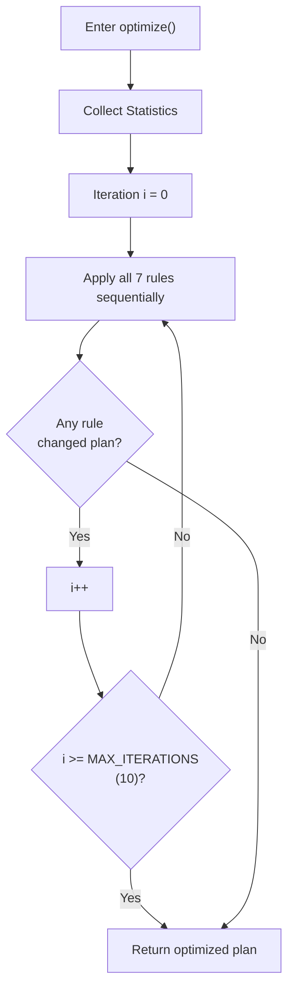
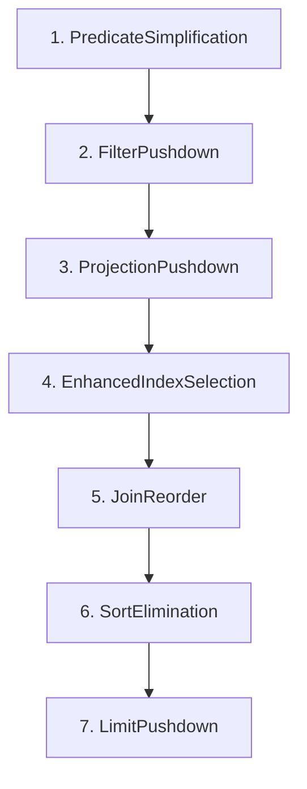
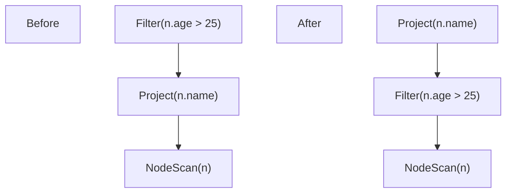
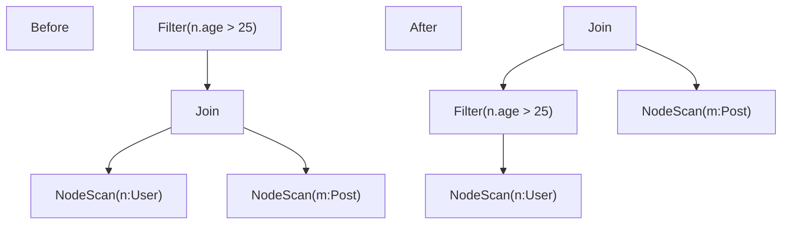
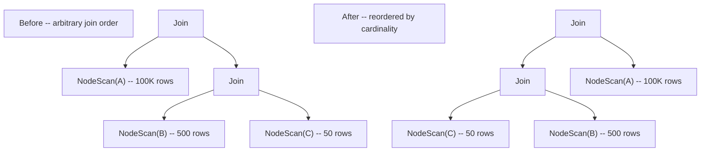
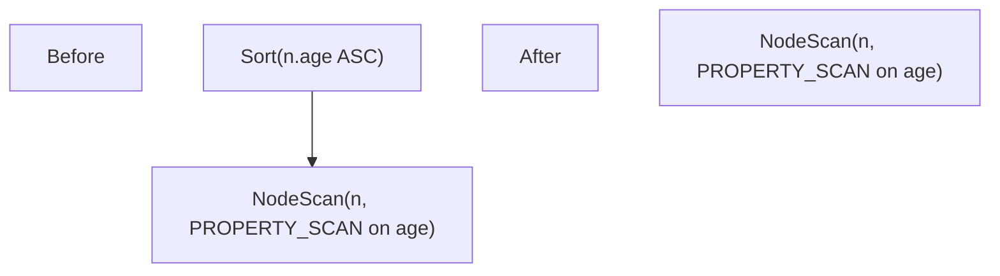
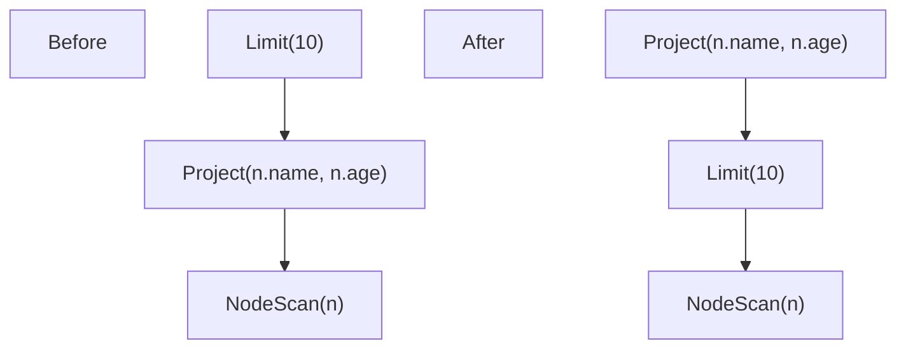

# 查询优化算法

ZYX 使用多规则查询优化器，通过固定点迭代对一组转换规则进行反复应用，在数据库统计信息和代价模型的指导下，将逻辑计划转换为高效的执行计划。

## 查询处理流水线

每条 Cypher 查询在产生结果之前经过四个阶段的流水线处理：

1. **解析（Parse）**：ANTLR4 将 Cypher 文本转换为抽象语法树（AST）。
2. **规划（Plan）**：Planner 将 AST 转换为逻辑算子树（`LogicalNodeScan`、`LogicalFilter`、`LogicalJoin`、`LogicalProject`、`LogicalSort`、`LogicalLimit`、`LogicalAggregate` 等）。
3. **优化（Optimize）**：Optimizer 反复应用一组转换规则，直到计划稳定或达到最大迭代次数。
4. **执行（Execute）**：PhysicalPlanConverter 将每个逻辑算子映射为从存储层读取数据的物理执行算子。

## 固定点迭代算法

优化器在循环中运行所有已注册的规则。每次迭代中，每条规则都会应用到计划树上。如果任何规则修改了计划（通过比较修改前后的计划字符串表示来检测），则开始下一次迭代。当一整轮遍历没有产生任何变化时循环终止，或者当达到 `MAX_ITERATIONS`（10）时终止。

**终止保证**：由于每条规则要么简化计划，要么保持不变，计划必然在有限次迭代内稳定。`MAX_ITERATIONS = 10` 的上限用于防止极端情况。

**源码**：`include/graph/query/optimizer/Optimizer.hpp`

## 优化规则

七条规则按特定顺序注册。顺序很重要，因为前面的规则生成后面的规则所依赖的规范形式。

### 规则 1：谓词简化（Predicate Simplification）

**目标**：简化布尔谓词并合并冗余的过滤节点。

**源码**：`include/graph/query/optimizer/rules/PredicateSimplificationRule.hpp`

此规则执行两类转换：

**表达式简化** -- 逻辑算子的常量折叠：

| 输入 | 输出 |
|------|------|
| `true AND x` | `x` |
| `x AND true` | `x` |
| `false AND x` | `false` |
| `x AND false` | `false` |
| `true OR x` | `true` |
| `x OR true` | `true` |
| `false OR x` | `x` |
| `x OR false` | `x` |
| `NOT (NOT x)` | `x` |

**过滤树简化** -- 相邻过滤节点的结构合并：

- **相邻过滤合并**：两个连续的 `LogicalFilter` 节点合并为一个，谓词为两者原始谓词的 AND。变换前：`Filter(pred_a, Filter(pred_b, child))`。变换后：`Filter(pred_a AND pred_b, child)`。
- **重复过滤消除**：如果两个连续过滤器的谓词在语法上相同（通过字符串表示比较），则丢弃外层过滤器。
- **平凡过滤移除**：如果简化将谓词归约为布尔字面量 `true`，则完全移除过滤节点，由其子节点替代。

此规则最先执行，使下游规则能看到规范的、简化后的计划。

### 规则 2：过滤下推（Filter Pushdown）

**目标**：将 `WHERE` 过滤谓词尽可能推近数据源，减少上游算子需要处理的行数。

**源码**：`include/graph/query/optimizer/rules/FilterPushdownRule.hpp`

规则对计划树执行自底向上的递归遍历。在每个 `LogicalFilter` 节点，应用第一个适用的转换：

**合取拆分**：合取（AND）谓词被拆分为独立的过滤器，每个合取项一个。例如 `WHERE n.age > 25 AND n.active = true` 变为两个堆叠的过滤器，各自可以独立下推。

**推过 Project**：如果过滤器的谓词只引用 `LogicalProject` 下方可用的变量，过滤器移到 project 下方。

**推过 Join**：如果过滤器只引用 `LogicalJoin` 其中一侧的变量，过滤器移入那一侧。

**合并到 NodeScan -- 等值**：如果谓词是简单的属性等值判断（`n.name = "Alice"`），直接合并到 `LogicalNodeScan` 的属性谓词映射中，过滤节点被消除。扫描算子随后可使用属性索引查找。

**合并到 NodeScan -- 范围**：如果谓词是范围比较（`n.age > 25`），合并到扫描的范围谓词列表。同一属性的多个范围边界收紧为最严格的组合。扫描算子随后可使用范围索引扫描。

### 规则 3：投影下推（Projection Pushdown）

**目标**：为 `LogicalProject` 节点标注其祖先实际需要的列集合，使物理算子避免物化未使用的列。

**源码**：`include/graph/query/optimizer/rules/ProjectionPushdownRule.hpp`

规则对计划树执行自顶向下的所需列集合传播：

1. 在 `LogicalProject` 节点：存储来自祖先的所需集合。子节点的所需集合由 project 表达式引用的所有变量加上任何透传列计算得出。
2. 在 `LogicalFilter` 节点：子节点的所需集合包括父节点所需的一切加上过滤器谓词引用的变量。
3. 在 `LogicalAggregate` 节点：子节点的所需集合包括分组键和聚合函数参数。
4. 在其他节点：父节点的所需集合不变传递。

此规则不改变计划结构；它通过 `setRequiredColumns()` 标注 `LogicalProject` 节点，使物理算子可以跳过物化未使用的属性。

### 规则 4：增强索引选择（Enhanced Index Selection）

**目标**：使用代价模型和数据库统计信息为每个 `LogicalNodeScan` 选择代价最低的扫描策略。

**源码**：`include/graph/query/optimizer/rules/EnhancedIndexSelectionRule.hpp`

对于计划中的每个 `LogicalNodeScan`，规则使用 `CostModel` 类估算每个可用扫描策略的代价并选择最低的：

| 策略 | 描述 | 代价估算 |
|------|------|----------|
| `FULL_SCAN` | 扫描所有节点 | `totalNodeCount * 1.0` |
| `LABEL_SCAN` | 使用标签索引 | `labelNodeCount * 1.0` |
| `PROPERTY_SCAN` | 使用属性索引进行等值查找 | `labelNodeCount * selectivity * 0.2` |
| `RANGE_SCAN` | 使用属性索引进行范围查询 | `labelNodeCount * 0.3 * 0.2` |
| `COMPOSITE_SCAN` | 使用复合索引进行多字段等值查找 | `labelNodeCount * 0.1^fields * 0.2` |

规则还检查同一扫描上的多个等值谓词是否可以由复合索引服务，如果可以，则在扫描节点上记录复合等值。

选定的策略通过 `setPreferredScanType()` 存储在 `LogicalNodeScan` 上，`PhysicalPlanConverter` 在构建物理计划时读取此值。

**代价相同时的优先级顺序**：composite scan > property scan > range scan > label scan > full scan。

### 规则 5：连接重排（Join Reorder）

**目标**：重排交叉连接操作链，使较小的关系先连接，最小化中间结果大小。

**源码**：`include/graph/query/optimizer/rules/JoinReorderRule.hpp`

算法使用贪心左深策略：

1. **展平**：递归收集 `LogicalJoin` 节点链中所有叶子输入到扁平列表。
2. **估算**：使用 `CostModel::estimateScanCardinality` 计算每个输入的基数。对于 `LogicalNodeScan` 输入，使用标签统计信息。对于其他输入，使用子节点基数的乘积（交叉连接基数）。
3. **排序**：按估算基数升序排列输入。
4. **重建**：组装为左深连接树：`Join(Join(Join(smallest, next), ...), largest)`。

刻意避免动态规划枚举，以控制编译时间和代码复杂度。

### 规则 6：排序消除（Sort Elimination）

**目标**：当底层扫描已经按所需顺序提供数据时，移除 `LogicalSort` 算子。

**源码**：`include/graph/query/optimizer/rules/SortEliminationRule.hpp`

规则在以下特定条件下识别并消除冗余排序：

- 排序具有单个升序排序键
- 排序键是属性访问表达式（如 `n.age`）
- 子节点是同一变量的 `LogicalNodeScan`
- 子节点的首选扫描类型是同一属性的 `PROPERTY_SCAN` 或 `RANGE_SCAN`

当这些条件满足时，属性索引已经按排序顺序返回结果，`LogicalSort` 变得冗余。排序节点被移除，由其子节点替代。

### 规则 7：Limit 下推（Limit Pushdown）

**目标**：将 `LIMIT` 操作推到 `LogicalProject` 节点下方，减少 project 算子需要处理的行数。

**源码**：`include/graph/query/optimizer/rules/LimitPushdownRule.hpp`

规则执行自底向上的递归遍历。在每个子节点为非 DISTINCT `LogicalProject` 的 `LogicalLimit` 节点，交换两者的顺序：

DISTINCT 检查至关重要：如果 project 是 `DISTINCT`，它可以减少行数，因此将 `LIMIT` 推到它下面会改变查询语义。在这种情况下，规则保持计划不变。

## 统计信息与代价模型

### 统计信息收集

**源码**：`include/graph/query/optimizer/Statistics.hpp`、`include/graph/query/optimizer/StatisticsCollector.hpp`

优化器依赖数据库统计信息进行基于代价的决策。统计信息惰性收集并缓存：

- **`Statistics`**：全局统计信息结构。包含 `totalNodeCount`、`totalEdgeCount` 和以标签名称为键的 `LabelStatistics` 映射。
- **`LabelStatistics`**：每个标签的统计信息，包括 `nodeCount` 和以属性名称为键的 `PropertyStatistics` 映射。
- **`PropertyStatistics`**：每个属性的统计信息，包括 `distinctValueCount`（NDV）、`minValue`、`maxValue` 和 `nullCount`。提供 `equalitySelectivity()`（返回 `1.0 / NDV`）和 `rangeSelectivity()`（返回固定值 `0.33`）。

`StatisticsCollector` 使用蓄水池采样（`MAX_SAMPLE_SIZE = 10000`）从存储中收集统计信息，避免对大型数据集进行全量扫描。它扫描标签索引以统计每个标签的节点数，并采样属性值以估算 NDV、最小/最大值和空值计数。统计信息会被缓存，仅在显式失效时（如数据修改后）重新收集。

### 代价模型

**源码**：`include/graph/query/optimizer/CostModel.hpp`

`CostModel` 类使用抽象代价单位提供代价估算，只有相对比较有意义：

| 常量 | 值 | 含义 |
|------|-----|------|
| `SCAN_COST_PER_ROW` | 1.0 | 全量扫描中处理一行的代价 |
| `INDEX_LOOKUP_COST` | 0.2 | 基于索引的查找每行代价（比全量扫描便宜 5 倍） |
| `FILTER_COST_PER_ROW` | 0.5 | 对一行应用过滤谓词的代价 |
| `JOIN_COST_PER_ROW` | 2.0 | 交叉连接中每对行的代价 |

关键代价估算方法：

- **`fullScanCost`**：`totalNodeCount * SCAN_COST_PER_ROW`
- **`labelScanCost`**：`labelNodeCount * SCAN_COST_PER_ROW`
- **`propertyIndexCost`**：`labelNodeCount * selectivity * INDEX_LOOKUP_COST`，其中等值谓词的选择率为 `1.0 / NDV`，范围谓词为 `0.33`
- **`rangeIndexCost`**：`labelNodeCount * 0.3 * INDEX_LOOKUP_COST`（约 30% 范围选择率）
- **`compositeIndexCost`**：`labelNodeCount * 0.1^matchedFields * INDEX_LOOKUP_COST`（随匹配字段数增加指数递减）
- **`crossJoinCost`**：`leftCardinality * rightCardinality * JOIN_COST_PER_ROW`
- **`estimateScanCardinality`**：对于多标签扫描，使用最具选择性的标签的计数

## 复杂度分析

### 优化器循环

- **最坏情况**：`MAX_ITERATIONS * number_of_rules` 次规则应用 = `10 * 7 = 70` 次计划树遍历。
- **典型情况**：大多数计划在 1-3 次迭代后稳定。每条规则执行单次树遍历，因此每次迭代的代价为 `O(n)`，其中 `n` 为计划树中的节点数。

### 单条规则复杂度

| 规则 | 时间复杂度 | 说明 |
|------|-----------|------|
| PredicateSimplification | `O(n)` | 单次自底向上遍历，每节点常数时间 |
| FilterPushdown | `O(n * p)` | `p` = 谓词数；合取拆分可能重入 |
| ProjectionPushdown | `O(n * v)` | `v` = 每节点的变量数 |
| EnhancedIndexSelection | `O(n)` | 每个 NodeScan 访问一次，每次扫描常数候选数 |
| JoinReorder | `O(j * log j)` | `j` = 连接输入数；主要开销为排序 |
| SortElimination | `O(n)` | 单次自底向上遍历 |
| LimitPushdown | `O(n)` | 单次自底向上遍历 |

### 统计信息收集

- **全量收集**：`O(totalNodeCount)`，蓄水池采样将内存限制为每个属性 `MAX_SAMPLE_SIZE = 10000` 个样本。
- **缓存命中**：初次收集后 `O(1)`。

## 性能建议

### 面向用户

1. **在过滤属性上创建索引**：属性索引启用 `PROPERTY_SCAN` 和 `RANGE_SCAN` 策略，每行代价仅为全量扫描的 1/5。
2. **为节点设置标签**：标签扫描将工作集从所有节点缩小到具有特定标签的节点。
3. **尽早应用过滤**：优化器会自动下推过滤器，但编写具有选择性过滤的查询有助于规划器选择更好的扫描策略。
4. **使用 LIMIT**：`LimitPushdownRule` 减少 project 算子处理的行数。
5. **在同一节点上使用复合谓词**：单个节点上的多个等值谓词可以利用复合索引获得指数级的选择性提升。

### 面向开发者

1. **规则顺序很重要**：当前顺序设计为简化先于下推，下推先于基于代价的决策。改变顺序可能降低优化质量。
2. **可以添加自定义规则**：使用 `Optimizer::addRule()` 注入自定义规则（主要用于测试或实验性优化）。
3. **统计信息时效性**：统计信息仅在显式失效时重新收集。过期统计信息产生次优但正确的计划。
4. **固定点收敛**：编写新规则时，确保它们是幂等的（同一条规则应用两次产生相同结果），以保证收敛。

## 源码定位

| 组件 | 文件 |
|------|------|
| 优化器引擎 | `include/graph/query/optimizer/Optimizer.hpp` |
| 规则注册 | `src/query/optimizer/Optimizer.cpp` |
| 规则接口 | `include/graph/query/optimizer/OptimizerRule.hpp` |
| FilterPushdown | `include/graph/query/optimizer/rules/FilterPushdownRule.hpp` |
| LimitPushdown | `include/graph/query/optimizer/rules/LimitPushdownRule.hpp` |
| IndexPushdown（遗留） | `include/graph/query/optimizer/rules/IndexPushdownRule.hpp` |
| ProjectionPushdown | `include/graph/query/optimizer/rules/ProjectionPushdownRule.hpp` |
| JoinReorder | `include/graph/query/optimizer/rules/JoinReorderRule.hpp` |
| EnhancedIndexSelection | `include/graph/query/optimizer/rules/EnhancedIndexSelectionRule.hpp` |
| PredicateSimplification | `include/graph/query/optimizer/rules/PredicateSimplificationRule.hpp` |
| SortElimination | `include/graph/query/optimizer/rules/SortEliminationRule.hpp` |
| Statistics | `include/graph/query/optimizer/Statistics.hpp` |
| StatisticsCollector | `include/graph/query/optimizer/StatisticsCollector.hpp` |
| CostModel | `include/graph/query/optimizer/CostModel.hpp` |

## 另见

- [查询引擎](/zh/docs/zyx/architecture/query-engine) - 查询执行流水线
- [B+Tree 索引](/zh/docs/zyx/algorithms/btree-indexing) - 属性索引使用的 B+Tree 结构
- [标签索引](/zh/docs/zyx/algorithms/label-index) - 标签索引结构
- [性能优化](/zh/docs/zyx/architecture/optimization) - 系统级性能调优
