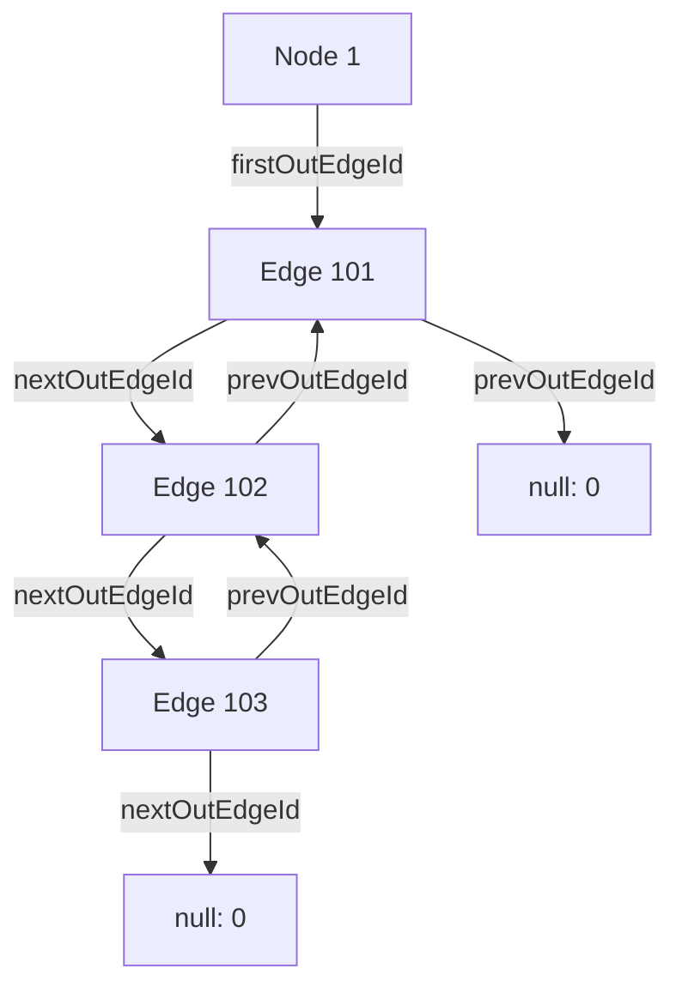
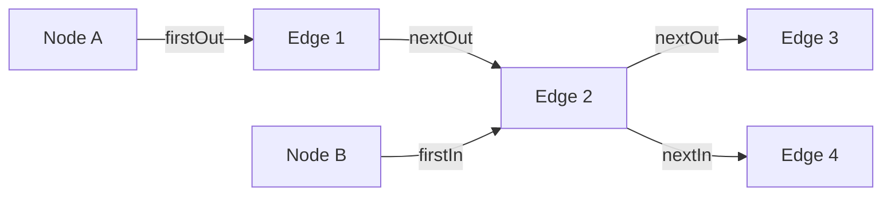
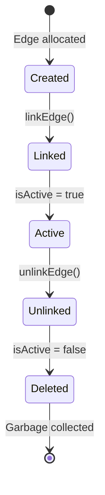
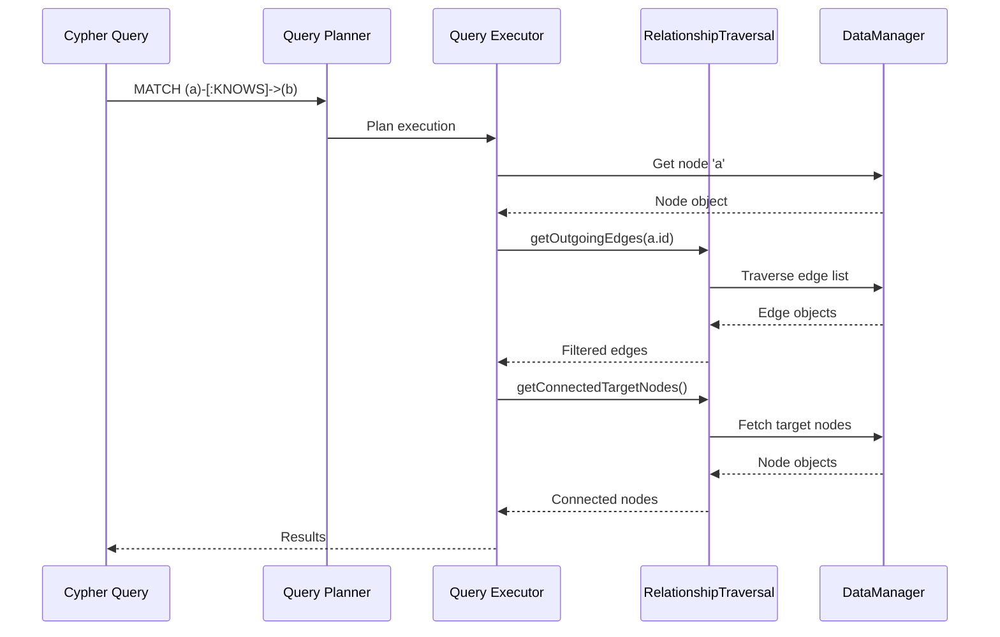
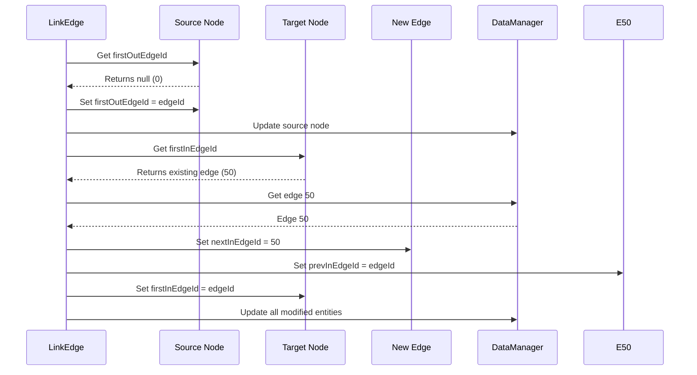

# 关系遍历

ZYX 实现了基于链表邻接结构的高性能关系遍历系统。这为 Cypher 查询（如 `MATCH (a)-[:KNOWS]->(b)`）提供了高效的图关系导航能力，并支持 O(1) 的连接节点和边访问。

## 概述

关系遍历提供以下能力：

- **链表邻接结构**：使用双向链表实现高效的边存储
- **双向遍历**：快速访问出边和入边
- **连接节点检索**：无需全图扫描即可直接访问邻居节点
- **环检测**：自动检测损坏的边链
- **活跃边过滤**：遍历时自动跳过已删除/非活跃的边
- **O(1) 边链接**：常数时间的边插入和删除

## 架构

### 邻接结构

ZYX 使用基于链表的邻接结构，每个节点维护指向其首条出边和首条入边的指针：

### 双向边链接

每条边维护四个指针，用于在两个方向上进行遍历：

**双向边链接：**
- Node A（源节点）：出边列表
- Node B（目标节点）：入边列表
- Edge 2 出现在两个列表中，实现高效的双向遍历

**关键点**：同一条边（Edge 2）同时出现在 Node A 的出边列表和 Node B 的入边列表中，从而实现高效的双向遍历。

## 数据结构

遍历系统建立在两个核心数据结构之上，分别存储在 `include/graph/storage/Node.hpp` 和 `include/graph/storage/Edge.hpp` 中。

### 节点结构

每个节点维护两个 8 字节的指针，作为其边链表的头节点：

| 字段 | 类型 | 用途 |
|-----|------|------|
| `firstOutEdgeId` | int64_t | 出边链表的头节点 |
| `firstInEdgeId` | int64_t | 入边链表的头节点 |

值为 0 表示空链表（该方向上没有边）。这两个指针共计 16 字节的每节点遍历开销。

### 边结构

每条边存储四个 8 字节的指针，将其串联到两个独立的双向链表中 -- 一个用于源节点的出边，一个用于目标节点的入边：

| 字段 | 类型 | 用途 |
|-----|------|------|
| `sourceNodeId` | int64_t | 关系的源节点 |
| `targetNodeId` | int64_t | 关系的目标节点 |
| `nextOutEdgeId` | int64_t | 源节点出边列表中的下一条边 |
| `prevOutEdgeId` | int64_t | 源节点出边列表中的上一条边 |
| `nextInEdgeId` | int64_t | 目标节点入边列表中的下一条边 |
| `prevInEdgeId` | int64_t | 目标节点入边列表中的上一条边 |

四个链接指针（`nextOut`、`prevOut`、`nextIn`、`prevIn`）共计 32 字节的每边遍历开销。

## 边生命周期

边从创建到删除经历一个明确定义的生命周期：

1. **Created**：边对象已分配，源节点和目标节点 ID 已赋值，但尚未从任一节点的边列表中可达。
2. **Linked**：`linkEdge()` 将边插入到源节点的出边列表和目标节点的入边列表的头部位置，O(1) 时间完成。
3. **Active**：当 `isActive` 为 true 时，遍历操作会返回该边。它正常参与查询。
4. **Unlinked**：`unlinkEdge()` 利用双向链表结构在 O(1) 时间内从两个链表中移除该边（通过旁路跳过），并清除所有四个链接指针。
5. **Deleted**：边被标记为非活跃（`isActive = false`）。它不再出现在遍历结果中，可被垃圾回收。

## 核心操作

`RelationshipTraversal` 类（定义在 `include/graph/query/RelationshipTraversal.hpp`）提供所有遍历和链接操作。它持有对 `DataManager` 的弱引用，用于获取节点和边。

### 获取出边

通过遍历出边链检索节点的所有活跃出边：

1. 通过 ID 从 `DataManager` 获取节点。
2. 读取节点的 `firstOutEdgeId` 作为起点。
3. 当前边 ID 不为 0 时循环：
   - 检查该边 ID 是否已被访问过。如果是，抛出运行时错误以标识链损坏（环检测）。
   - 将该边 ID 记录到已访问集合中。
   - 从 `DataManager` 获取该边。
   - 如果边是活跃的（`isActive()`），将其添加到结果中。
   - 前进到 `nextOutEdgeId`。
4. 返回收集到的活跃边。

**特性**：
- **时间复杂度**：O(k)，其中 k = 出边数量
- **空间复杂度**：O(k) 用于结果向量，加上 O(k) 用于环检测集合
- **环检测**：防止在损坏数据上出现无限循环
- **活跃过滤**：自动排除已删除的边

### 获取入边

检索节点的所有活跃入边。算法与 `getOutgoingEdges` 相同，区别在于它从 `firstInEdgeId` 开始，并沿 `nextInEdgeId` 指针前进而非 `nextOutEdgeId` 指针。

**特性**：与 `getOutgoingEdges` 相同 -- O(k) 时间和空间，具有环检测和活跃过滤。

### 获取所有连接边

将出边和入边合并为单一结果：

1. 调用 `getOutgoingEdges(nodeId)` 收集出边。
2. 调用 `getIncomingEdges(nodeId)` 收集入边。
3. 拼接两个向量并返回。

**使用场景**：查找与节点相连的所有关系，不考虑方向。

### 获取连接的目标节点

通过出边检索所有可达节点：

1. 调用 `getOutgoingEdges(nodeId)` 获取所有活跃出边。
2. 对每条边，读取其 `targetNodeId` 并从 `DataManager` 获取相应节点。
3. 返回收集到的目标节点。

**使用场景**：Cypher 查询如 `MATCH (a)-[:KNOWS]->(b) RETURN b`。

### 获取连接的源节点

检索通过入边指向此节点的所有节点：

1. 调用 `getIncomingEdges(nodeId)` 获取所有活跃入边。
2. 对每条边，读取其 `sourceNodeId` 并从 `DataManager` 获取相应节点。
3. 返回收集到的源节点。

**使用场景**：Cypher 查询如 `MATCH (a)-[:KNOWS]->(b) RETURN a`，其中 `b` 是固定值。

### 获取所有连接节点

从两个方向检索所有邻居节点并进行去重：

1. 创建一个空的 `unordered_set<int64_t>` 用于存储已访问的节点 ID。
2. 对每条出边，提取 `targetNodeId`。如果该 ID 之前未见过，将其插入集合并获取节点。
3. 对每条入边，提取 `sourceNodeId`。如果该 ID 之前未见过，将其插入集合并获取节点。
4. 返回所有唯一的邻居节点。

**关键特性**：通过 `unordered_set` 去重，确保同时由出边和入边连接的节点在结果中只出现一次。

**使用场景**：在无向遍历中查找节点的所有邻居。

### 查询流程图

下图展示了典型 Cypher 查询中遍历操作的组合方式：

## 边链接操作

### 链接边

将新边插入邻接结构，O(1) 时间完成，始终放置在源节点出边列表和目标节点入边列表的头部。

**算法**：

对于源节点的出边列表：
1. 获取源节点并读取其当前 `firstOutEdgeId`。
2. 如果列表为空（`firstOutEdgeId` 为 0），将 `firstOutEdgeId` 设为新边的 ID。
3. 如果列表非空，将新边插入头部：将新边的 `nextOutEdgeId` 设为当前头部，将当前头部的 `prevOutEdgeId` 设为新边的 ID，并将源节点的 `firstOutEdgeId` 更新为新边。
4. 持久化修改后的源节点和任何已更新的现有边。

对于目标节点的入边列表：
1. 获取目标节点并读取其当前 `firstInEdgeId`。
2. 如果列表为空，将 `firstInEdgeId` 设为新边的 ID。
3. 如果列表非空，使用相同模式在头部插入：将新边的 `nextInEdgeId` 指向当前头部，更新当前头部的 `prevInEdgeId`，并将目标的 `firstInEdgeId` 设为新边。
4. 持久化修改后的目标节点和任何已更新的现有边。

最后，持久化新边本身。

**特性**：
- **时间复杂度**：O(1) -- 与图大小无关的常数时间
- **插入策略**：始终插入到链表头部（无需遍历）
- **双向链接**：同时维护 next 和 prev 指针以支持高效删除

**可视化示例**：

### 解除边链接

利用双向链表结构在 O(1) 时间内从源节点的出边列表和目标节点的入边列表中移除边。

**算法**：

对于源节点的出边列表：
1. 读取边的 `prevOutEdgeId` 和 `nextOutEdgeId`。
2. 如果 `prevOutEdgeId` 为 0（边位于链表头部）：将源节点的 `firstOutEdgeId` 更新为 `nextOutEdgeId`。
3. 如果 `prevOutEdgeId` 非零（边位于中间或尾部）：更新前一条边的 `nextOutEdgeId` 以旁路跳过被移除的边。
4. 如果 `nextOutEdgeId` 非零：更新下一条边的 `prevOutEdgeId` 为 `prevOutEdgeId`。

对于目标节点的入边列表，使用 `prevInEdgeId` 和 `nextInEdgeId` 重复相同的旁路逻辑：
1. 如果在头部，更新目标的 `firstInEdgeId`。
2. 如果在中间，更新前一条边的 `nextInEdgeId`。
3. 如果存在下一条边，更新其 `prevInEdgeId`。

最后，将移除的边上的所有四个链接指针清零。

**特性**：
- **时间复杂度**：O(1) -- 常数时间
- **双向链接优势**：无需遍历即可找到前一条边
- **安全解链**：正确处理头部、中间和尾部位置

**可视化示例**：

**边解除链接：**
- 通过将前一条边连接到下一条边来旁路跳过被移除的边
- 得益于双向链表结构，为 O(1) 操作

## 与 Cypher 查询的集成

### 模式匹配

关系遍历在 Cypher 查询执行中被广泛使用。查询中模式的方向决定使用哪种遍历方法：

**出向遍历** -- `MATCH (a)-[:KNOWS]->(b) RETURN b`：
1. 获取节点 `a`。
2. 调用 `getOutgoingEdges(a.id)`。
3. 按类型 = KNOWS 过滤边。
4. 从匹配的边中收集目标节点。

**入向遍历** -- `MATCH (a)<-[:KNOWS]-(b) RETURN b`：
1. 获取节点 `a`。
2. 调用 `getIncomingEdges(a.id)`。
3. 按类型 = KNOWS 过滤边。
4. 从匹配的边中收集源节点。

**双向遍历** -- `MATCH (a)-[:KNOWS]-(b) RETURN b`：
1. 获取节点 `a`。
2. 调用 `getAllConnectedEdges(a.id)`。
3. 按类型 = KNOWS 过滤边。
4. 从两个方向提取连接的节点。

## 性能特征

### 时间复杂度

| 操作 | 时间复杂度 | 描述 |
|-----|-----------|------|
| getOutgoingEdges | O(k) | k = 出边数量 |
| getIncomingEdges | O(k) | k = 入边数量 |
| getAllConnectedEdges | O(k1 + k2) | k1 = 出边，k2 = 入边 |
| getConnectedTargetNodes | O(k) | k = 出边数量 |
| getConnectedSourceNodes | O(k) | k = 入边数量 |
| getAllConnectedNodes | O(k1 + k2) | 含去重 |
| linkEdge | O(1) | 常数时间插入 |
| unlinkEdge | O(1) | 常数时间移除 |

### 空间复杂度

| 组件 | 空间 | 描述 |
|-----|------|------|
| 节点元数据 | 2 x 8 字节 | `firstOutEdgeId`、`firstInEdgeId` |
| 边元数据 | 4 x 8 字节 | `nextOut`、`prevOut`、`nextIn`、`prevIn` |
| 环检测 | O(k) | 遍历期间的 `unordered_set` |
| 结果向量 | O(k) | 输出的边/节点集合 |

**每条边总计**：32 字节用于遍历指针（4 x int64_t）

### 内存开销

对于包含 100 万条边和 10 万个节点的图：

- **节点指针**：100K 节点 x 2 指针 x 8 字节 = 1.6 MB
- **边指针**：1M 边 x 4 指针 x 8 字节 = 32 MB
- **总遍历开销**：约 33.6 MB（平均每条边 33.6 字节）

### 优势与权衡

**优势**：
1. **O(1) 边操作**：插入和删除为常数时间
2. **无需全局扫描**：直接访问连接的节点
3. **缓存友好**：边链表的顺序遍历
4. **内存高效**：每条边仅 32 字节用于遍历
5. **可扩展**：性能与图的总大小无关

**权衡**：
1. **指针开销**：每条边 32 字节用于遍历指针
2. **解引用开销**：每次边访问需要通过 DataManager 进行指针追踪
3. **无类型索引**：必须扫描所有边才能按关系类型过滤
4. **环检测开销**：遍历期间增加 O(k) 空间

### 与其他方案的比较

| 方案 | 边访问 | 内存 | 使用场景 |
|-----|-------|------|---------|
| **链表**（ZYX） | O(k) 遍历 | 32 字节/边 | 通用图 |
| 邻接矩阵 | O(1) 查找 | O(V 平方) | 稠密图 |
| 邻接数组 | O(k) 扫描 | O(V + E) | 静态图 |
| 边类型索引 | O(log n + k) | 额外索引 | 类型过滤查询 |

## 最佳实践

1. **批量创建边**：先创建所有节点，再链接边，以最小化更新次数
2. **避免手动指针操作**：永远不要直接修改边指针；始终使用 `linkEdge` 和 `unlinkEdge`
3. **尽早过滤**：在获取连接节点之前应用边类型过滤
4. **检查活跃状态**：使用 `edge.isActive()` 跳过已删除的边
5. **去重**：在无向遍历中使用 `getAllConnectedNodes()`

## 局限性

1. **无边类型索引**：必须扫描所有边才能按关系类型过滤
2. **指针开销**：每条边 32 字节用于遍历元数据
3. **环检测成本**：遍历期间增加运行时开销
4. **仅顺序访问**：无法对链表中的特定边进行随机访问
5. **内存局部性**：边指针追踪可能导致缓存未命中

## 另见

- [存储系统](/zh/docs/zyx/architecture/storage) - 整体存储架构
- [标签索引](/zh/docs/zyx/algorithms/label-index) - 节点标签索引
- [属性索引](/zh/docs/zyx/algorithms/property-index) - 基于属性的索引
- [查询优化](/zh/docs/zyx/algorithms/query-optimization) - 查询规划与优化
- [B+Tree 索引](/zh/docs/zyx/algorithms/btree-indexing) - B+Tree 结构详情
