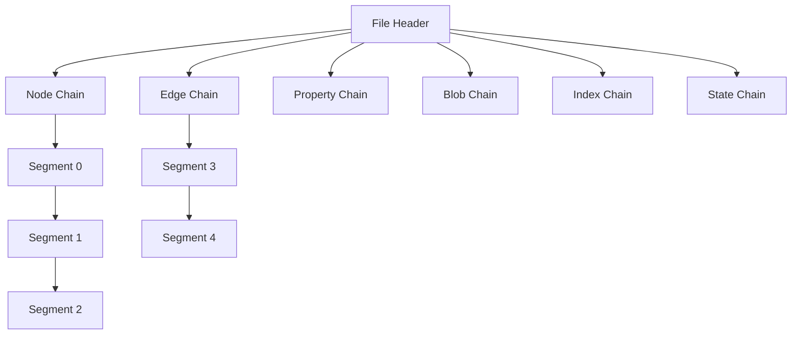
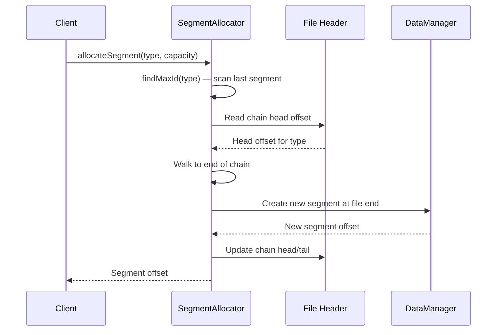
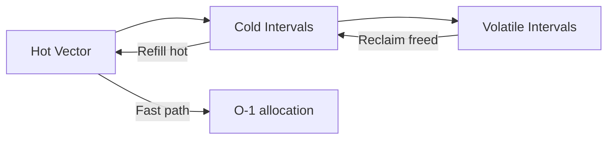

# Segment Allocation

ZYX 将所有图数据存储在固定大小的段中（默认 128 KB）。每种实体类型（Node、Edge、Property、Blob、Index、State）拥有各自的段链。分配算法负责管理段的创建、通过 `IDAllocator` 进行的槽位分配，以及通过文件头实现的链表链接。

## 架构概览

文件头存储每种实体类型段链的头部偏移量。每个段头包含一个 `nextSegmentOffset` 字段，指向链中的下一个段。当段填满时，分配新段并将其追加到链尾。

## 段结构

每个段具有固定的布局：

| 区域 | 用途 |
|------|------|
| Segment Header（40 字节） | 实体类型、槽位数量、数据使用量、下一/上一段偏移量、校验和 |
| Slot Metadata Array | 每槽位元数据（实体 ID、数据偏移量、数据大小、标志位） |
| Data Area | 实际实体数据 |

段头使用 CRC32 校验和来检测数据损坏。所有字段使用固定大小的整数类型，以确保跨平台兼容性。

## 分配过程

当需要存储新实体时：

1. **查找最大 ID**：分配器扫描链中最后一个段，以确定给定类型已分配的最大实体 ID。这确保 ID 单调递增。
2. **分配新段**：如果当前尾段已满，则在文件末尾创建一个具有指定容量的新段。
3. **更新链表链接**：更新前一个尾段的 `nextSegmentOffset`，使其指向新段。如果链头发生变化，文件头也会相应更新。
4. **分配槽位**：在有空闲槽位的段内，`IDAllocator` 分配下一个可用 ID。

## ID 分配

`IDAllocator` 采用三层 ID 管理机制：

- **Hot vector**：预分配的连续 ID 块。从 hot vector 分配 ID 的复杂度为 O(1)——只需递增并返回。
- **Cold intervals**：当 hot vector 耗尽时，新 ID 从 `IntervalSet` 获取——这是一个有序的 `[start, end]` 区间集合，支持高效的批量分配。
- **Volatile intervals**：已释放的 ID 被回收到 volatile intervals 中以便复用。这防止了在大量创建和删除的工作负载下 ID 空间耗尽。

`IntervalSet` 数据结构存储不重叠的区间，并支持合并/拆分操作，以实现高效的区间管理。

## 释放

当段被释放时：

1. 段在段头中被标记为非活跃状态
2. 其在父链中的槽位被清除
3. 已释放的 ID 被归还到 `IDAllocator` 的 volatile intervals
4. 文件不会被截断——空间可供复用

段内已释放的槽位会在分配新段之前被 `IDAllocator` 优先复用。当碎片率超过 30% 时，ZYX 可以运行多阶段段压缩来回收空间——详见[段压缩](segment-compaction)。

## 跨平台考量

所有磁盘上的结构使用固定大小类型（`int64_t`、`uint32_t` 等）和显式的字节序。段头包含校验和，用于加载时的完整性验证。`StorageIO` 抽象层处理文件 I/O 中的平台差异（POSIX 上使用 `pread`/`pwrite`，其他平台使用 `fstream` 回退方案）。

## 源码位置

| 组件 | 路径 |
|------|------|
| SegmentAllocator | `include/graph/storage/SegmentAllocator.hpp` |
| IDAllocator | `include/graph/core/IDAllocator.hpp` |
| IntervalSet | `include/graph/core/IntervalSet.hpp` |
| StorageHeaders | `include/graph/storage/StorageHeaders.hpp` |
| File Header | `include/graph/storage/FileHeader.hpp` |
| SegmentCompactor | `include/graph/storage/SegmentCompactor.hpp` |
| SpaceManager | `include/graph/storage/SpaceManager.hpp` |
