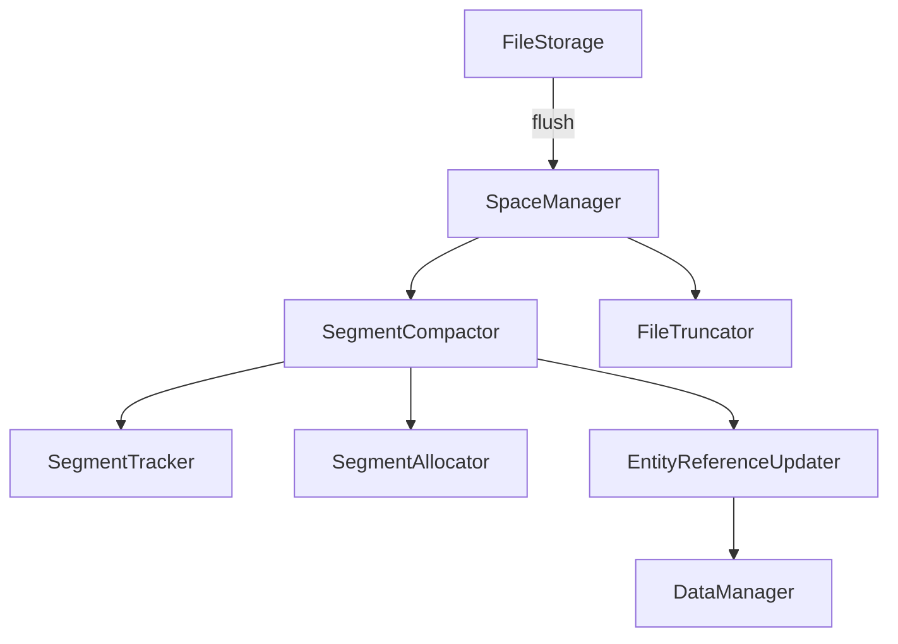
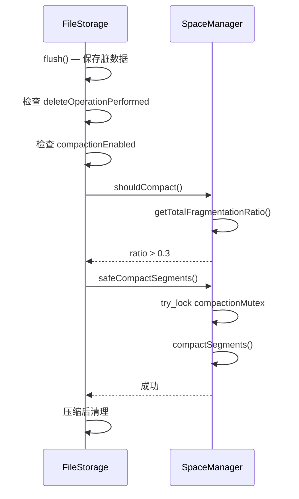

# 段压缩

当实体被删除时，其槽位被标记为非活跃但段空间不会立即回收。随着时间推移会产生碎片化。ZYX 提供了一个多阶段压缩系统，在碎片率超过可配置阈值时回收这些空间。

## 架构

压缩由 `SpaceManager` 协调，它编排 `SegmentCompactor` 和 `FileTruncator`。触发逻辑位于 `FileStorage::flush()` 中。



## 触发条件

压缩在刷盘后自动运行，需**同时满足三个**条件：

1. **删除标志已设置** — 自上次检查以来至少执行了一次删除操作（`deleteOperationPerformed` 原子标志，由 `DeletionManager` 设置）
2. **压缩已启用** — `storage.compaction.enabled` 系统状态键设置为 `true`（默认：禁用）
3. **碎片率超过阈值** — `SpaceManager::shouldCompact()` 返回 `true`，即所有实体类型的加权平均碎片率超过 30%



`safeCompactSegments()` 对专用互斥锁使用 `try_lock`。如果另一个压缩正在进行中，调用将立即返回 `false` 而不阻塞。

## 压缩阶段

`SpaceManager::compactSegments()` 按顺序执行五个阶段：

### 阶段 1：空段移除

```cpp
compactor_->processAllEmptySegments();
```

扫描每种实体类型的段链，移除不包含活跃槽位的段。段从链中断开，文件头相应更新。

### 阶段 2：段内碎片整理

```cpp
compactor_->compactSegments(type, threshold);
```

对每种实体类型，遍历段链并对碎片率超过阈值的段进行碎片整理。活跃槽位被紧缩到段的开头，消除被删除实体留下的间隙。当实体的槽位位置在段内发生变化时，`EntityReferenceUpdater` 更新所有指向旧实体 ID 的引用。

### 阶段 3：段间合并

```cpp
compactor_->mergeSegments(type, threshold);
```

查找使用率不足的段对（低于使用率阈值）并合并它们。`findCandidatesForMerge()` 识别候选段，然后 `mergeIntoSegment()` 将活跃槽位从源段复制到目标段。成功合并后，源段从链中移除。

### 阶段 4：尾部重定位

```cpp
compactor_->relocateSegmentsFromEnd();
```

将文件末尾的段移动到文件前部的空闲位置。这允许 `FileTruncator` 之后缩小文件。`moveSegment()` 复制段数据并通过 `updateSegmentChain()` 更新链指针。

### 阶段 5：最大 ID 重新计算

```cpp
compactor_->recalculateMaxIds();
```

在实体被移动和合并后，每种实体类型的最大已分配 ID 可能已改变。此阶段扫描每条链的最后一个段以重新计算正确的最大 ID，确保 `IDAllocator` 正确分配新 ID。

## 实体引用更新

当压缩移动实体到新槽位（改变其 ID）时，所有对旧 ID 的引用必须更新。`EntityReferenceUpdater` 按实体类型处理：

| 实体类型 | 更新的引用 |
|----------|-----------|
| Node | 指向该节点的属性、连接到该节点的边 |
| Edge | 指向该边的属性、源/目标节点的邻接表 |
| Property | 父实体的属性指针 |
| Blob | Blob 链的链接（next/prev 指针） |
| Index | B+Tree 中的父/子/兄弟指针 |
| State | 状态链的 next/prev 指针 |

更新器通过 `DataManager` 操作，以确保与缓存层和事务层的一致性。

## 配置

压缩通过 `storage.compaction.enabled` 系统状态键控制：

```cypher
// 启用压缩
CALL dbms.setConfigValue('storage.compaction.enabled', true)

// 禁用压缩（默认）
CALL dbms.setConfigValue('storage.compaction.enabled', false)
```

该键在 `SystemStateKeys.hpp` 中定义为 `Config::STORAGE_COMPACTION_ENABLED`。`FileStorage` 中的 `compactionEnabled_` 原子标志在运行时反映此值。

压缩默认禁用，因为它涉及实体 ID 重新分配，在大型数据库上可能开销较大。对于频繁删除且需要磁盘空间回收的工作负载，建议启用。

## 压缩后清理

成功压缩后，`FileStorage` 执行以下清理步骤：

1. **清除缓存** — `DataManager::clearCache()` 使所有缓存实体失效，因为 ID 可能已更改
2. **重置 ID 分配器** — 每个 `IDAllocator::resetAfterCompaction()` 清除 hot/cold 向量，使其从新的段状态延迟加载
3. **重建段索引** — `SegmentIndexManager::buildSegmentIndexes()` 重建实体 ID 到段的映射
4. **持久化头部** — 重新持久化段头，重新计算 CRC，并刷新文件头

## 源码位置

| 组件 | 路径 |
|------|------|
| SpaceManager | `include/graph/storage/SpaceManager.hpp` |
| SegmentCompactor | `include/graph/storage/SegmentCompactor.hpp` |
| EntityReferenceUpdater | `include/graph/storage/EntityReferenceUpdater.hpp` |
| DeletionManager | `include/graph/storage/DeletionManager.hpp` |
| FileTruncator | `include/graph/storage/FileTruncator.hpp` |
| SystemStateKeys | `include/graph/storage/state/SystemStateKeys.hpp` |
| FileStorage（触发） | `src/storage/FileStorage.cpp` |
