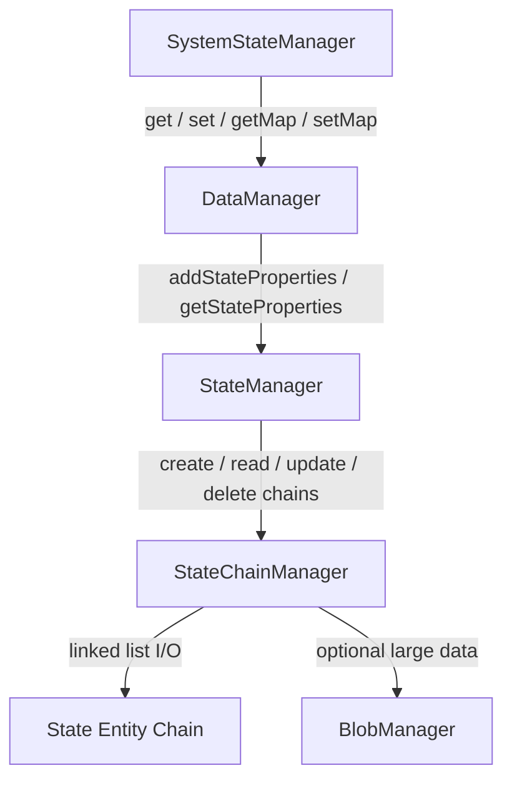
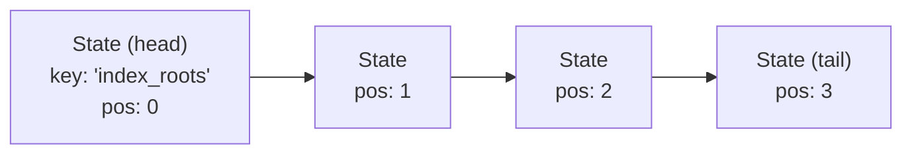
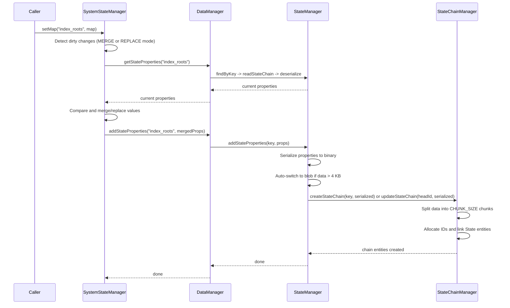
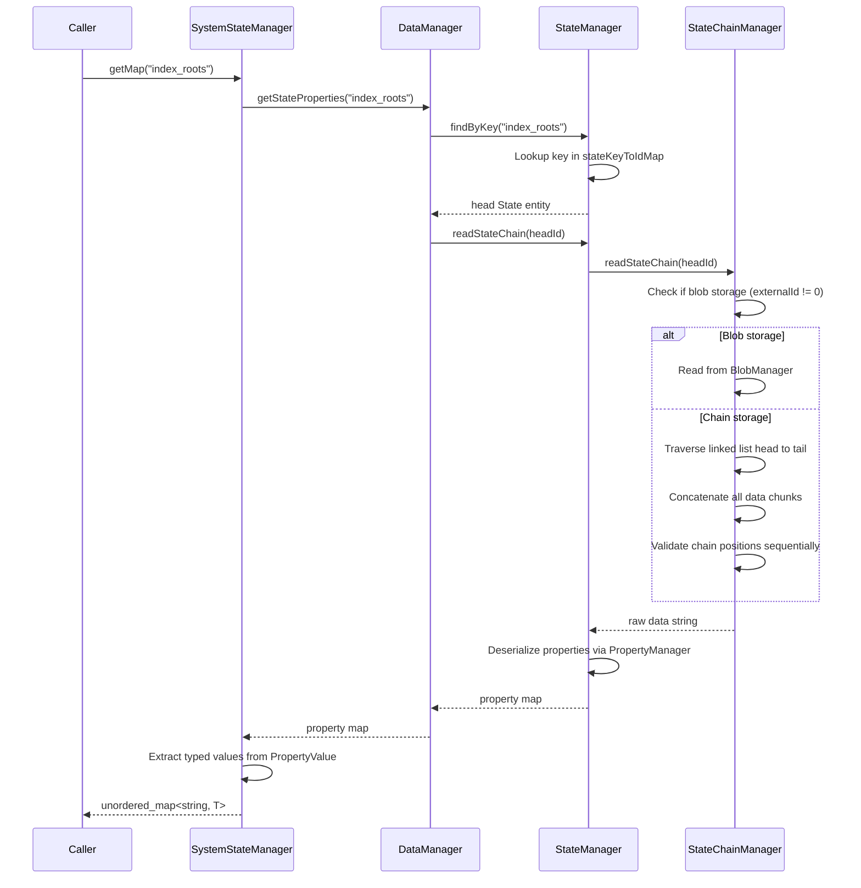
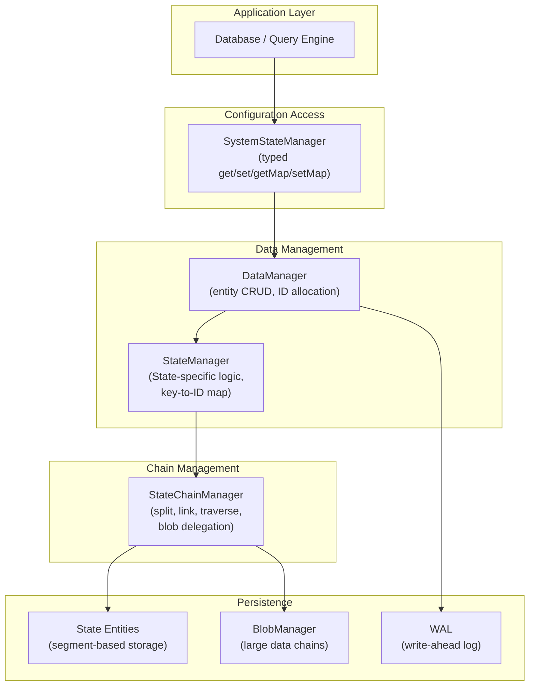

# State Chain 配置存储

ZYX 将内部配置数据 -- 如 B+Tree 根 ID、键类型映射、启用标志以及索引元数据 -- 存储在 **State chain** 中。State chain 是由 `StateChainManager` 管理的固定大小 State 实体组成的链表。更高层的类型化接口 `SystemStateManager` 为标量、映射和混合类型配置提供了便捷的 get/set 操作。

## 概述

State chain 系统分为三层：

- **State 实体** -- 固定大小（256 字节）的存储记录，包含元数据头部和一小段内联数据块。当数据超过一个块的大小时，会链接额外的 State 实体形成链。
- **StateChainManager** -- 底层管理器，负责创建、读取、更新和删除 State 实体链。它处理数据拆分、链式链接以及可选的 blob 存储委托。
- **SystemStateManager** -- 高层类型化接口，通过 DataManager 将属性序列化工作委托给 StateChainManager，并为 `int64_t`、`bool`、`double`、`std::string` 和 vector 类型提供 `get`/`set`/`getMap`/`setMap` 操作。

## State 实体结构

每个 State 实体在磁盘上恰好占用 256 字节。其布局由元数据头部和随后的内联数据缓冲区组成。元数据头部包含以下字段：

- **id** (int64_t) -- 该 State 实体的唯一标识符。
- **nextStateId** (int64_t) -- 链中下一个 State 的 ID，如果是尾部则为 0。
- **prevStateId** (int64_t) -- 链中上一个 State 的 ID，如果是头部则为 0。
- **externalId** (int64_t) -- 如果非零，指向使用 blob 存储模式时的头部 Blob ID。
- **dataSize** (uint32_t) -- 该实体块中存储的实际数据字节数。
- **chainPosition** (int32_t) -- 该实体在链中从零开始的位置索引。
- **key** (char[64]) -- 标识头部 State 实体的唯一字符串键。
- **isActive** (bool) -- 该实体是否处于活跃状态（未被逻辑删除）。

元数据之后的剩余字节构成内联数据缓冲区，其大小为 `256 - metadata_size`，称为 `CHUNK_SIZE`。

只有头部实体（chainPosition == 0，prevStateId == 0）携带 key。链中所有后续实体通过 nextStateId 指针链接。

## State Chain 布局

当配置数据在单个块内容纳时，只需使用一个 State 实体。当数据超过块大小时，数据被拆分到多个实体并链接成链：

每个实体存储序列化数据的一个连续片段。在读取时，链从头部遍历到尾部，所有数据块被拼接以重建原始数据。

对于特别大的配置（序列化后超过约 4 KB），系统可以将存储委托给 `BlobManager`。在 blob 模式下，头部 State 实体的 `externalId` 字段指向一个 blob 链，无需 State 链式存储。

## 写入流程

通过 `SystemStateManager.setMap()` 写入配置数据的流程如下：

关键步骤如下：

1. **脏数据检查** -- SystemStateManager 加载当前属性并与传入数据进行比较。如果没有任何变更，则不执行写入。
2. **序列化** -- 属性通过 `PropertyManager::serializeProperties` 序列化为二进制字符串。
3. **自动 blob 阈值** -- 如果序列化后的数据超过 4 KB，系统自动切换到 blob 存储模式。
4. **链创建或更新** -- StateChainManager 根据键是否存在，创建新链或更新已有链（删除旧的尾部实体并写入新实体）。
5. **持久化** -- 每个 State 实体通过 DataManager 写入磁盘。

## 读取流程

读取配置数据时从 State chain 重建原始属性：

链遍历过程中通过以下检查验证数据完整性：

- 每个实体处于活跃状态且具有非零 ID。
- `chainPosition` 字段与预期的顺序索引匹配。
- 不存在循环引用（通过已访问集合跟踪）。

如果任何检查失败，将抛出运行时错误。

## SystemStateManager 类型化访问

`SystemStateManager` 在原始 State chain 存储之上提供了类型化层。它支持两种更新模式：

- **MERGE** -- 追加或更新单个属性，同时保持现有属性不变。由 `set()` 用于单字段更新。
- **REPLACE** -- 删除整个现有链并仅使用新属性写入一条全新的链。由 `setMap()` 在需要完全替换时使用。

支持的类型如下：

| 类型 | 用途 |
|---|---|
| `int64_t` | 数值计数器、根 ID、段 ID |
| `bool` | 启用标志、功能开关 |
| `double` | 浮点配置值 |
| `std::string` | 字符串配置值 |
| `std::vector<float>` | 向量索引嵌入 |
| `std::vector<PropertyValue>` | 异构列表 |

读取时，SystemStateManager 从链中加载所有属性，并使用类型提取辅助函数处理隐式转换（例如，`bool` 值可能以 `int64_t` 的 0 或 1 存储）。

## 更新操作

更新已有的 State chain 涉及用新数据替换旧数据：

1. **相同数据检查** -- StateChainManager 读取当前链并将原始字节与新数据进行比较。如果完全相同，则不执行更新。
2. **清理旧存储** -- 如果旧链使用 blob 存储，则删除 blob 链。如果使用内部链式存储，则删除所有尾部实体。
3. **建立新存储** -- 新数据被拆分为块，使用相同的头部实体 ID 构建新链。
4. **应用更新** -- 头部实体原地更新。任何新的尾部实体被添加。

此方法复用头部实体 ID，使得外部引用（如 StateManager 中的 key-to-ID 映射）在更新后仍然有效。

## 分层架构

下图展示了各组件之间的关系以及它们与更广泛的存储系统的联系：

## 与 WAL 和事务的集成

State chain 修改参与 ZYX 的标准事务和持久化机制：

- **预写日志** -- 所有 State 实体的创建、更新和删除在执行前先记录到 WAL 中。这确保配置数据在崩溃后可以恢复。
- **单写者模型** -- ZYX 使用由 `std::shared_mutex` 强制执行的单写者/多读者并发模型。同一时间只能有一个写事务处于活跃状态，因此不需要按实体进行冲突检测。
- **Undo log 回滚** -- 如果写事务被回滚，UndoLog 会恢复所有被修改 State 实体的先前状态。

由于数据库引擎控制 State chain 的写入时机（在索引创建、模式变更或配置更新期间），这些写入始终在写事务内发生。WAL 保证完整的链更新要么全部持久化，要么全部不持久化。

## 存储模式

StateChainManager 支持两种存储模式，可按链选择：

**内部链模式**（默认）-- 数据被拆分为 `CHUNK_SIZE` 字节的块，每个块存储在通过 `nextStateId` 链接的独立 State 实体中。适用于中小型配置。

**Blob 模式** -- 数据通过 `BlobManager` 存储，后者管理自己的 Blob 实体链，针对更大的负载进行了优化。头部 State 实体的 `externalId` 字段指向头部 Blob。当序列化数据超过 4 KB 时自动选择此模式，也可以显式请求。

## Key-to-ID 映射

StateManager 维护一个内存中的 `stateKeyToIdMap`，将字符串键映射到头部 State 实体 ID。该映射在启动时通过扫描所有段中的 State 实体并识别链头（`prevStateId == 0` 且 key 非空的实体）来填充。

创建新的 State chain 时映射被更新。删除 State 时条目被移除。这使得 `findByKey()` 查找可以在 O(1) 时间内完成，无需扫描整个存储。

## 源码位置

| 组件 | 头文件 |
|---|---|
| State 实体 | `include/graph/core/State.hpp` |
| StateChainManager | `include/graph/core/StateChainManager.hpp` |
| SystemStateManager | `include/graph/storage/state/SystemStateManager.hpp` |
| StateManager | `include/graph/storage/data/StateManager.hpp` |
| 压缩工具 | `include/graph/utils/CompressUtils.hpp` |

## 相关文档

- [存储系统](/zh/docs/zyx/architecture/storage) - 持久化存储与段格式
- [WAL 恢复](/zh/docs/zyx/algorithms/wal-recovery) - 预写日志与崩溃恢复
- [事务](/zh/docs/zyx/architecture/transactions) - 事务模型与并发
