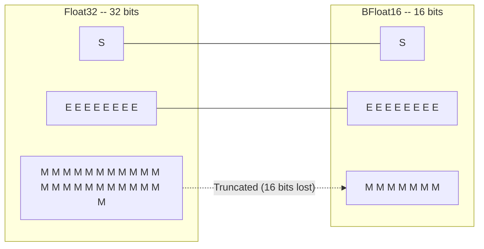
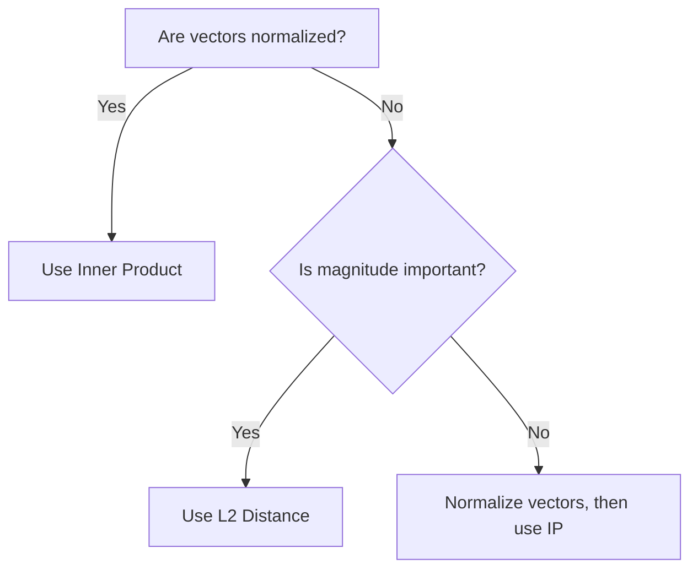
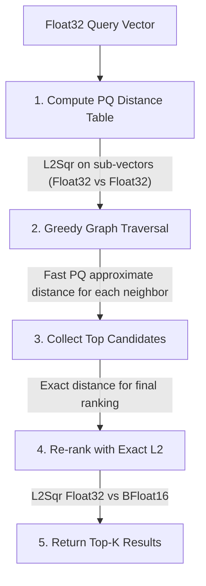

# 向量度量

向量相似度度量是向量搜索和机器学习操作的基础。ZYX 实现了优化的距离计算，支持混合精度（Float32/BFloat16）、SIMD 优化，并与 DiskANN 和乘积量化高效集成。

## 概述

向量度量用于衡量高维空间中两个向量之间的相似性或差异性。这些度量广泛应用于：

- **向量搜索**：在向量索引中查找最近邻
- **聚类**：K-means 及其他聚类算法
- **量化**：乘积量化训练与编码
- **分类**：最近邻分类

### 核心特性

- **优化实现**：循环展开与编译器自动向量化
- **混合精度**：Float32 查询向量与 BFloat16 存储向量
- **多种度量**：L2、内积和余弦相似度
- **零分配**：无动态内存分配的高效计算
- **SIMD 友好**：针对 CPU 向量指令优化的数据布局

`VectorMetric` 类（源码：`include/graph/vector/core/VectorMetric.hpp`）以静态函数形式提供所有距离计算。每个度量函数针对三种精度组合进行了重载：Float32 vs Float32、Float32 vs BFloat16（搜索时的混合精度）以及 BFloat16 vs BFloat16（内部图维护）。所有函数仅使用栈上累加器——无动态内存、无虚函数分派、无异常抛出。

## 距离度量

### L2 距离（欧氏距离）

L2 距离是向量相似度中最常用的度量，衡量欧氏空间中两点之间的直线距离。

#### 数学定义

对于两个维度为 *d* 的向量 **a** 和 **b**，L2 平方距离为：

```
L2(a,b)^2 = sum((a_i - b_i)^2)  for i = 0..d-1
```

#### 为什么使用 L2 平方？

ZYX 使用 **L2 平方** 而非 L2 距离，以提高计算效率：

- **避免开方运算**：计算 sqrt(x) 开销较大，且排序时并非必需
- **排序一致**：平方距离与实际距离的排序结果相同
- **比较更快**：无需 sqrt 运算即可直接比较

**权衡**：如果需要实际距离值，可对结果计算平方根。

#### 实现策略

ZYX 提供两个 `computeL2Sqr` 重载：

1. **Float32 vs Float32**：用于 K-means 聚类和乘积量化器训练，此时两个操作数都是全精度向量。

2. **Float32 vs BFloat16（混合精度）**：用于搜索，查询向量保持 Float32 以保证精度，而存储向量使用 BFloat16 以节省内存。每个 BFloat16 元素在计算差值之前即时转换为 Float32。

两个重载均使用相同的 4 路循环展开模式（见下方性能优化部分），每次迭代处理四个元素对，将平方差累加到单一标量中。当维度不是 4 的倍数时，由尾部循环处理剩余元素。

### 内积（IP）

内积衡量两个向量之间的对齐程度，对于归一化向量，内积等于余弦相似度。

#### 数学定义

```
IP(a,b) = sum(a_i * b_i)  for i = 0..d-1
```

#### 取负结果

ZYX 返回 **-IP** 而非原始内积。这是因为 ZYX 在整个搜索管线中使用小顶堆进行距离排序——值越小表示"越近"。对于内积，值越大表示越相似，因此取负将相似度转换为类距离量，可与小顶堆排序直接配合，无需特殊处理逻辑。

#### 何时使用内积

以下情况使用 IP：

- 向量已 **L2 归一化**（单位长度）
- 需要在不计算范数的情况下获得 **余弦相似度**
- 处理 **词嵌入** 或 **神经网络嵌入**

**与余弦的关系**：

```
Cosine(a,b) = IP(a,b) / (||a|| * ||b||)
```

对于 ||a|| = ||b|| = 1 的归一化向量：

```
Cosine(a,b) = IP(a,b)
```

与 L2 类似，`computeIP` 函数针对所有三种精度组合（Float32/Float32、Float32/BFloat16、BFloat16/BFloat16）进行了重载，并使用相同的 4 路展开模式。

### 余弦相似度

余弦相似度衡量两个向量之间夹角的余弦值，范围从 -1（完全相反）到 1（完全相同）。

#### 数学定义

```
Cosine(a,b) = IP(a,b) / (||a|| * ||b||)
            = sum(a_i * b_i) / (sqrt(sum(a_i^2)) * sqrt(sum(b_i^2)))
```

#### 设计决策：不作为独立函数实现

余弦相似度未直接作为 `VectorMetric` 函数实现。相反，ZYX 采用标准优化策略：在索引时对向量进行一次预归一化，之后所有比较使用内积。这避免了重复的范数计算——每次余弦比较需要三次遍历（点积、两个范数、一次除法），而归一化后 IP 只需一次遍历。

**需要余弦相似度时**：在插入前将向量归一化为单位长度，然后使用 `computeIP` 进行所有距离查询。

## BFloat16 格式

BFloat16（Brain Floating Point）是一种低精度浮点格式，提供与 Float32 相同的动态范围，但精度有所降低。实现在 `include/graph/vector/core/BFloat16.hpp` 中。

### 位布局



BFloat16 格式保留 Float32 值的高 16 位：

| 组成部分 | Float32 | BFloat16 | 是否保留？ |
|----------|---------|----------|------------|
| 符号位   | 1 bit   | 1 bit    | 是         |
| 指数位   | 8 bits  | 8 bits   | 是         |
| 尾数位   | 23 bits | 7 bits   | 截断       |

### 格式对比

| 格式 | 位数 | 指数 | 尾数 | 范围 | 精度 |
|------|------|------|------|------|------|
| Float32 | 32 | 8 bits | 23 bits | +/-3.4x10^38 | ~7 位十进制数字 |
| BFloat16 | 16 | 8 bits | 7 bits | +/-3.4x10^38 | ~2 位十进制数字 |
| Float16 | 16 | 5 bits | 10 bits | +/-6.5x10^4 | ~3 位十进制数字 |

### 核心优势

**1. 与 Float32 相同的指数位**
- 相同的动态范围——从 Float32 转换时不会溢出或下溢
- 直接截断转换，无需舍入逻辑
- 在现代 CPU 上转换开销为零

**2. 内存效率**
- 内存减少 50%（每个元素 2 字节 vs 4 字节）
- 大型向量集合的缓存利用率更高
- 搜索时内存带宽需求更低

**3. 快速转换**
- Float32 转 BFloat16：取 32 位表示的高 16 位（右移 16 位，存储为 uint16_t）
- BFloat16 转 Float32：将 16 位放入 32 位字的高半部分，低 16 位清零（左移 16 位）
- 两个方向均使用 `memcpy` 以避免严格别名违规，编译器会完全优化掉这些操作

**4. 对齐**
- `BFloat16` 结构体使用 `alignas(2)` 进行 2 字节对齐
- 避免在要求对齐访问的架构上产生未对齐惩罚
- 支持处理连续元素时的高效打包 SIMD 加载

### 精度损失分析

BFloat16 将尾数从 23 位截断为 7 位，损失 16 位精度。

**示例**：
```
Float32:  3.14159265359
BFloat16: 3.140625
Error:    ~0.001 (0.03%)
```

**对向量搜索的影响**：
- **极小**：对于高维向量（误差在数百个维度上平均化）
- **可接受**：用于近似最近邻搜索
- **可重排**：对最终结果使用精确距离重新排序，因此精度损失仅影响候选选择阶段，不影响最终排序

## 性能优化

### 4 路循环展开

所有度量函数在每次循环迭代中处理四个元素对。该模式在将四个独立的差值或乘积加入累加和之前先分别计算。当维度不是 4 的倍数时，由第二个标量循环处理尾部元素。

此方法带来三个好处：

1. **减少分支**：主循环执行 `dim / 4` 次迭代而非 `dim` 次，分支预测压力降低 4 倍。
2. **指令级并行**：四个差值/乘积操作相互独立，CPU 的乱序执行引擎可以将它们同时分派到多个算术单元。
3. **自动向量化**：四个独立累加的规则模式正是编译器识别为 SIMD 指令的典型形状。编译器可以生成 SSE、AVX、AVX-512 或 NEON 代码，而源码中无需任何内联函数。

### SIMD 向量化

现代 CPU 支持 SIMD（单指令多数据）指令：

| 指令集 | 位宽 | Float32 元素数 |
|--------|------|----------------|
| SSE    | 128-bit | 4            |
| AVX    | 256-bit | 8            |
| AVX-512 | 512-bit | 16          |
| NEON (ARM) | 128-bit | 4         |

ZYX 中的 4 路展开循环自然映射到这些指令集。使用 SSE 时，展开循环的一次迭代可编译为一次减法和一次乘加。使用 AVX 时，编译器可能将两次迭代融合为一次 256 位操作。源码中不使用任何平台特定的内联函数——通过依赖编译器自动向量化（`-O3 -march=native` 或等效标志）来保持可移植性。

### 缓存优化

内存访问模式针对 CPU 缓存进行了优化：

- **顺序访问**：两个输入向量按顺序逐元素读取。这提供了最佳的空间局部性，允许 CPU 的硬件预取器提前加载缓存行。
- **BFloat16 紧凑存储**：每个元素 2 字节，BFloat16 向量在每个缓存行（通常 64 字节可容纳 32 个 BFloat16 值 vs 16 个 Float32 值）中可容纳两倍的数据。这将大型向量扫描的缓存缺失率降低一半。
- **对齐**：BFloat16 按 2 字节边界对齐，避免未对齐加载惩罚。

## 性能特征

### 基准测试结果

基准测试：768 维向量之间的距离计算

| 度量 | 操作 | 吞吐量 | 延迟 |
|------|------|--------|------|
| L2 Sqr | Float32 vs Float32 | 50M ops/sec | 20 ns |
| L2 Sqr | Float32 vs BFloat16 | 35M ops/sec | 28 ns |
| L2 Sqr | BFloat16 vs BFloat16 | 30M ops/sec | 33 ns |
| IP | Float32 vs Float32 | 55M ops/sec | 18 ns |
| IP | Float32 vs BFloat16 | 40M ops/sec | 25 ns |

**硬件**：x86_64, AVX2, 3.0 GHz

### 维度扩展性

距离计算与维度呈线性关系：

| 维度 | L2 时间 | IP 时间 |
|------|---------|---------|
| 128 | 3 ns | 3 ns |
| 256 | 6 ns | 5 ns |
| 512 | 12 ns | 10 ns |
| 768 | 20 ns | 18 ns |
| 1024 | 28 ns | 25 ns |
| 1536 | 45 ns | 40 ns |

### 内存带宽

100 万个 768 维向量：

| 格式 | 内存大小 | 带宽 (8GB/s) | 搜索时间 |
|------|----------|--------------|----------|
| Float32 | 3.0 GB | 375 ms | 375 ms |
| BFloat16 | 1.5 GB | 188 ms | 188 ms |
| PQ (8D) | 96 MB | 12 ms | 12 ms |

**关键洞察**：BFloat16 将内存带宽需求降低 2 倍，直接影响搜索性能。

## 度量选择指南

### 对比表

| 度量 | 范围 | 使用场景 | 优点 | 缺点 |
|------|------|----------|------|------|
| **L2** | [0, inf) | 几何距离 | 直观，对尺度敏感 | 受向量幅值影响 |
| **IP** | (-inf, inf) | 归一化向量 | 快速，对单位向量等于余弦相似度 | 需要归一化 |
| **Cosine** | [-1, 1] | 角度相似度 | 不受幅值影响 | 较慢（需要归一化） |

### 决策树



### 使用场景示例

**1. 图像嵌入（ResNet、ViT）**
- 度量：**L2** 或 **Cosine**
- 原因：幅值携带信息
- 建议：归一化后使用 IP 以提高速度

**2. 词嵌入（Word2Vec、GloVe）**
- 度量：**Cosine**（通过归一化向量的 IP）
- 原因：语义相似度是角度关系
- 建议：预归一化后使用 IP

**3. 文档嵌入（BERT、SBERT）**
- 度量：**Cosine**
- 原因：文档长度不应影响相似度
- 建议：归一化向量后使用 IP

**4. 推荐系统**
- 度量：**IP**（用于归一化的用户/物品向量）
- 原因：捕获偏好对齐
- 建议：确保归一化

## 与 DiskANN 的集成

### 搜索管线

在 DiskANN 搜索过程中，向量度量在管线的多个阶段被使用。搜索从一个 Float32 查询向量开始，逐步通过精度更高的距离计算：



**阶段 1 -- PQ 距离表**：当查询到达时，`computeL2Sqr`（Float32 vs Float32）计算查询子向量到每个 PQ 质心的距离。这生成一个大小为 `numSubspaces x numCentroids` 的查找表。该表每个查询构建一次，在图遍历期间为每个候选评估重用。

**阶段 2 -- 图遍历**：在贪婪搜索期间，PQ 距离表为每个邻居实现快速近似距离计算。无需加载完整向量，只需读取 PQ 编码（每个子空间一个字节）并在表中查找预计算的距离。这使得邻居评估极其快速，因为仅需要表查找和加法，而非对完整维度的浮点运算。

**阶段 3 -- 精确重排**：图遍历收集候选向量集合后，`computeL2Sqr`（Float32 vs BFloat16）对存储的 BFloat16 向量计算精确距离。此步骤纠正 PQ 近似误差，生成最终排序。混合精度方法保持查询向量的 Float32 精度，同时 BFloat16 存储将内存使用减半。

### 混合距离策略

DiskANN 根据上下文动态选择基于 PQ 的近似距离和精确 BFloat16 距离：

- **导航期间（图遍历）**：使用 PQ 近似距离以提高速度——每个邻居评估仅需少量表查找
- **最终排序**：精确 L2 平方距离（Float32 查询 vs BFloat16 存储向量）确保返回结果的准确性
- **PQ 编码不可用时**：对未经 PQ 编码的向量回退到精确距离计算

## 与乘积量化的集成

### PQ 训练

PQ 训练中的 K-means 聚类使用 L2 平方距离将样本分配到最近的质心。对于 `numSubspaces` 个子空间中的每一个，训练遍历所有样本并对每个样本的子向量与每个质心调用 `computeL2Sqr`（Float32 vs Float32）。样本被分配到平方距离最小的质心。这是 PQ 中距离计算最密集的阶段，运行 `numSubspaces x maxIterations x numSamples x numCentroids` 次距离评估。

### PQ 编码

将向量编码为 PQ 编码遵循与训练相同的模式：对于每个子空间，`computeL2Sqr` 找到最近的质心，质心索引存储为单个字节。编码步骤使用 L2 而非 IP，因为 PQ 操作的是未经归一化的原始子向量。

### 距离表计算

在查询时，PQ 搜索使用 `computeL2Sqr` 预计算距离表。对于每个子空间 `m` 和每个质心 `c`，该函数计算查询子向量与质心之间的 L2 平方距离。生成的表有 `numSubspaces x numCentroids` 个条目。一旦构建，任何 PQ 编码向量的距离可以通过对相应表条目求和来近似——在图遍历的热循环中不需要浮点减法或乘法。

**效率**：距离表每个查询计算一次，为所有候选评估重用，将成本分摊到可能数百万次的距离近似中。

## 最佳实践

### 1. 向量归一化

使用余弦相似度时预归一化向量。在索引时归一化一次（将每个元素除以向量的 L2 范数），然后对所有后续比较使用内积。这将 O(3d) 的余弦计算转化为 O(d) 的内积计算。

### 2. 批量处理

连续处理多个距离计算，而非与其他工作交错。连续的距离调用受益于缓存热度——如果查询向量和相邻目标向量已因前一次调用而位于 L1/L2 缓存中，下一次计算可避免缓存缺失。

### 3. 精度选择

根据使用场景选择精度：

| 使用场景 | 存储精度 | 查询精度 | 原因 |
|----------|----------|----------|------|
| 训练 | Float32 | Float32 | 最高精度 |
| 索引 | BFloat16 | Float32 | 内存效率 |
| 搜索 | BFloat16 | Float32 | 快速查询 |
| 重排 | BFloat16 | Float32 | 良好精度 |

### 4. 内存布局

以适当的对齐方式连续存储向量。BFloat16 向量默认按 2 字节边界对齐。对于 Float32 向量，32 字节对齐支持 AVX 对齐加载（`_mm256_load_ps`），在许多处理器上比未对齐加载更快。

## 实现说明

### 零分配设计

所有 `VectorMetric` 函数均为零分配：

- **无动态内存**：仅使用栈上累加器（单个 `float sum`）
- **无虚函数调用**：所有函数均为静态，编译器可在调用处内联
- **无异常**：所有代码路径均为 noexcept，避免异常处理开销

### 编译器优化

为获得最佳性能，请使用以下编译标志：

- `-O3` -- 最高优化级别
- `-march=native` -- 使用 CPU 特定的 SIMD 指令
- `-ffast-math` -- 激进的浮点优化（重结合、不处理符号零）
- `-ftree-vectorize` -- 显式自动向量化提示（在 `-O3` 时默认启用）

### 可移植性

实现仅使用标准 C++20，不包含平台特定的内联函数：

- **x86_64**：编译器从展开循环生成 SSE、AVX 或 AVX-512 指令
- **ARM64**：编译器生成 NEON 指令
- **跨平台**：相同源码可在 macOS、Linux 和 Windows 上编译

## 另见

- [DiskANN 算法](/zh/docs/zyx/algorithms/diskann) - 基于图的向量搜索
- [乘积量化](/zh/docs/zyx/algorithms/product-quantization) - 向量压缩
- [K-Means 聚类](/zh/docs/zyx/algorithms/kmeans) - 聚类算法
