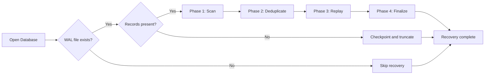
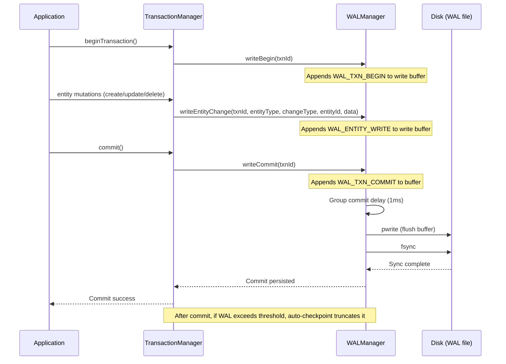
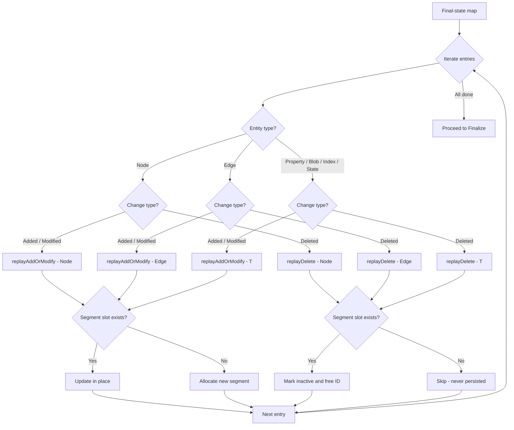

# WAL 恢复算法

Write-Ahead Log (WAL) 恢复算法通过重放已提交事务、丢弃未提交事务，确保数据库在系统崩溃后保持一致性。

## 概述

ZYX 采用延迟 WAL 策略：WAL 文件不在数据库打开时创建，而是在第一次写事务开始时延迟创建。如果数据库仅服务只读事务（例如 WASM Playground），则 WAL 永远不会被创建。

在数据库打开时，如果磁盘上已存在 WAL 文件，恢复引擎将运行一个 **4 阶段算法**：

1. **Scan（扫描）** -- 从文件中顺序读取所有 WAL 记录，识别已提交的事务
2. **Deduplicate（去重）** -- 按实体构建"后写者胜"的最终状态映射，丢弃中间更新
3. **Replay（重放）** -- 通过基于模板的重放函数将实体变更重新写入数据库文件
4. **Finalize（收尾）** -- 持久化 segment 头、文件头，fsync 数据库文件，然后截断 WAL

恢复是**幂等的**：如果系统在重放期间崩溃，下一次重启会安全地重新运行相同的 4 个阶段。去重步骤确保只写入每个实体的最终状态，无论 WAL 中存在多少中间版本。

## WAL 文件格式

### 文件头

每个 WAL 文件以 32 字节的文件头开始，包含 magic number（`ZYLW`）、版本号、WAL 创建时的数据库文件大小、两个 salt 值以及保留空间。文件头在 WAL 文件创建时写入一次，并在每次后续打开时进行校验。

### 记录类型

WAL 存储四种记录类型，表示为一个小型枚举：

| 类型 | 值 | 描述 |
|------|-------|-------------|
| `WAL_TXN_BEGIN` | 1 | 标记事务开始 |
| `WAL_TXN_COMMIT` | 2 | 标记事务成功提交 |
| `WAL_TXN_ROLLBACK` | 3 | 标记事务回滚 |
| `WAL_ENTITY_WRITE` | 4 | 实体级写入操作（创建、更新或删除） |

只有同时拥有 `WAL_TXN_BEGIN` 和 `WAL_TXN_COMMIT` 记录的事务才被视为已提交，才有资格被重放。仅有 `WAL_TXN_BEGIN`（或 `WAL_TXN_ROLLBACK`）的事务将被丢弃。

### 记录布局

每条 WAL 记录由固定大小的记录头和可选的数据负载组成：

| 字段 | 大小 | 描述 |
|-------|------|-------------|
| `recordSize` | 4 字节 | 包含头部的总记录大小 |
| `txnId` | 8 字节 | 事务标识符 |
| `type` | 1 字节 | 记录类型枚举值 |
| `checksum` | 4 字节 | 数据负载的 CRC32 校验和 |
| `padding` | 3 字节 | 对齐填充 |
| `data` | 可变 | 负载（仅 `WAL_ENTITY_WRITE` 记录存在） |

对于 `WAL_ENTITY_WRITE` 记录，数据负载以实体负载头开始：

| 字段 | 大小 | 描述 |
|-------|------|-------------|
| `entityType` | 1 字节 | 实体类型标识符（Node、Edge、Property、Blob、Index、State） |
| `changeType` | 1 字节 | 变更类型：Added、Modified 或 Deleted |
| `entityId` | 8 字节 | 唯一实体标识符 |
| `dataSize` | 4 字节 | 序列化实体数据的大小（删除操作为 0） |
| `entityData` | 可变 | 序列化实体字节（删除操作不存在） |

### 完整性保护

每条记录的负载由使用 zlib 的 `crc32()` 函数计算的 CRC32 校验和保护。在恢复期间，扫描阶段验证每条记录的校验和。如果检测到校验和不匹配，扫描将在最后一条有效记录处停止，并在结果上设置 `corrupted` 标志。只有成功通过验证的记录才会传递给去重和重放阶段。

## 延迟 WAL 创建

WAL 文件通过 Database 类中的两阶段延迟初始化机制创建：

1. **阶段 1**（`ensureWALAndTransactionManager`）：在第一次事务开始时调用。如果磁盘上已存在 WAL 文件（表示之前发生过崩溃），则打开 WAL，运行恢复，并将 WAL 接入存储子系统。如果不存在 WAL 文件，则完全跳过 WAL 创建 -- `WALManager` 指针保持为 null。

2. **阶段 2**（`ensureWALForWrites`）：在第一次写事务开始时调用。如果阶段 1 中未创建 WAL，则创建新的 WAL 文件并将其接入 `TransactionManager` 和 `DataManager`。

两个阶段都使用 `std::call_once` 实现线程安全的一次性初始化。只读事务仅触发阶段 1，因此从未被写入的数据库永远不会创建 WAL 文件。

## 事务提交期间的 WAL 写入

WAL 记录在事务生命周期的三个关键时间点写入：

1. **事务开始**：将 `WAL_TXN_BEGIN` 记录写入 WAL 写缓冲区
2. **实体变更**：每次实体创建、更新或删除通过 DataManager 将 `WAL_ENTITY_WRITE` 记录写入缓冲区
3. **事务提交**：追加 `WAL_TXN_COMMIT` 记录，然后在提交返回前将整个缓冲区通过 `fsync` 刷写到磁盘

提交步骤使用**组提交**机制：第一个提交的线程成为组领导者，短暂等待（可配置，默认 1ms）以积累其他并发事务的提交，然后执行一次覆盖所有已积累记录的 `flush` + `fsync`。其他正在提交的线程在条件变量上等待，直到其数据已被持久化。这样将 `fsync` 的开销分摊到多个事务上。

回滚记录使用简单的缓冲区刷写（无 `fsync`）写入，因为未提交的数据不需要在崩溃后存活。

## 4 阶段恢复算法

### 阶段 1：Scan（扫描）

扫描阶段从文件头之后的第一条记录开始顺序读取 WAL 文件。它验证文件头的 magic number 和版本，然后通过读取每条记录头、验证其 CRC32 校验和、读取关联的负载数据来遍历记录。

此阶段的主要输出是一组已提交的事务 ID。如果扫描找到某个事务 ID 对应的至少一条 `WAL_TXN_COMMIT` 记录，则该事务被视为已提交。所有记录（包括来自未提交事务的实体写入）都被收集到一个 vector 中传递给下一阶段。

如果 WAL 文件为空（文件头之后没有记录）或没有已提交事务，恢复将直接进入 checkpoint 和截断，跳过重放。

**扫描期间的关键行为：**
- 如果记录头具有无效大小（小于头部本身，或超出文件末尾），扫描将停止并将结果标记为损坏
- 如果 CRC32 校验和与计算值不匹配，扫描将在该点停止
- 只有通过大小和校验和双重验证的记录才会包含在输出中

### 阶段 2：Deduplicate（去重）

去重阶段处理所有属于已提交事务的 `WAL_ENTITY_WRITE` 记录，并构建以 `(entityType, entityId)` 为键的最终状态映射。对于每条实体写入记录，该阶段：

1. 检查记录的事务 ID 是否在已提交集合中 -- 来自未提交或已回滚事务的记录被跳过
2. 从记录数据中反序列化 `WALEntityPayload` 头，提取 `entityType`、`changeType` 和 `entityId`
3. 从实体类型和实体 ID 构造 `EntityKey`
4. 将 `EntityState`（包含变更类型和序列化实体数据）存入映射，覆盖相同键的任何先前条目

"后写者胜"行为意味着如果同一实体在单个事务内被修改三次，或跨多个已提交事务被修改，只有最终版本被保留用于重放。这显著减少了重放阶段必须执行的工作量，并确保了幂等性 -- 运行恢复两次产生相同结果。

### 阶段 3：Replay（重放）

重放阶段遍历最终状态映射，将每个实体变更写入数据库文件。对于每个条目，它根据实体类型（Node、Edge、Property、Blob、Index 或 State）和变更类型（Added/Modified 与 Deleted）进行分派。

**对于添加/修改操作**，重放逻辑：
1. 使用 `FixedSizeSerializer` 从 WAL 负载反序列化实体
2. 推进该实体类型的 ID 分配器，确保实体 ID 已被记录（以防崩溃丢失了计数器推进）
3. 检查实体在数据库文件中是否已有 segment 槽位
4. 如果槽位存在，在现有 segment 偏移处就地更新实体
5. 如果槽位不存在，分配新 segment 并写入实体

**对于删除操作**，重放逻辑：
1. 从 WAL 负载反序列化实体（前像）
2. 将实体标记为非活跃
3. 在数据库文件中查找实体的 segment 槽位
4. 如果槽位存在，就地写入非活跃实体并在分配器中释放实体 ID
5. 如果槽位不存在，说明该实体从未持久化到磁盘，无需操作

两条路径都使用 C++ 模板函数（`replayAddOrModify<T>` 和 `replayDelete<T>`），它们为六种实体类型各进行一次显式实例化，提供类型安全的编译时分派重放，无需虚函数开销。

### 阶段 4：Finalize（收尾）

收尾阶段持久化所有重放变更并重置 WAL：

1. **刷写脏 segment**：`SegmentTracker` 将所有已修改的 segment 头写入磁盘
2. **更新聚合 CRC**：收集所有 segment 的 CRC 值，将聚合校验和写入文件头
3. **刷写文件头**：将更新后的文件头写入磁盘
4. **Fsync 数据库文件**：确保所有写入已持久化到磁盘
5. **Checkpoint WAL**：关闭 WAL 文件，删除它，用新的文件头重新创建空 WAL 文件，然后重新打开

收尾完成后，数据库文件处于完全一致状态，WAL 为空，准备好接受新事务。

## Checkpoint 与自动截断

WAL 管理器支持基于可配置字节阈值（默认 1 MB）的自动 checkpoint。每次事务提交后，`TransactionManager` 检查当前 WAL 写偏移量是否超过此阈值。如果超过，则执行 checkpoint：WAL 缓冲区被刷写并同步，WAL 文件被删除并以新的文件头重新创建。

Checkpoint 是安全的，因为在执行时，所有已提交的事务数据已经通过正常的存储路径写入数据库文件。WAL 仅用于填补事务提交与脏 segment 最终刷写到磁盘之间的间隔。

## 性能特征

| 方面 | 详情 |
|--------|------|
| **Scan 阶段** | O(n) -- 对 WAL 文件的单次顺序读取，n 为 WAL 记录总数 |
| **Deduplicate 阶段** | O(n) -- 单次遍历实体写入记录，构建以 (entityType, entityId) 为键的有序映射 |
| **Replay 阶段** | O(k) -- 对最终状态映射中每个唯一实体执行一次磁盘写入，k 为去重后的条目数 |
| **Finalize 阶段** | O(s) -- 刷写脏 segment 头和文件头，s 为已修改的 segment 数量 |
| **总体** | O(n + k + s) -- 由扫描和重放阶段主导 |
| **幂等性开销** | 最小 -- 去重确保重放仅写入每个实体的最终版本 |
| **组提交** | 将 fsync 开销分摊到并发事务（可配置延迟，默认 1ms） |
| **写缓冲区** | 默认 64 KB；记录在内存中积累后再刷写到磁盘 |
| **自动 checkpoint** | 当 WAL 超过可配置阈值（默认 1 MB）时触发 |

## 关键设计属性

- **Write-ahead 保证**：事务的所有 WAL 记录在提交返回给调用者之前已被 flush 和 fsync 到磁盘
- **幂等恢复**：可安全多次运行恢复；去重步骤确保仅重放每个实体的最后版本
- **延迟 WAL 创建**：直到第一次写事务才创建 WAL 文件，避免只读工作负载的不必要 I/O
- **CRC32 完整性**：每条记录都进行校验和计算；损坏的记录使扫描在最后一个有效点停止
- **无 undo 阶段**：与传统的 ARIES 风格恢复不同，ZYX 不执行 undo 阶段。未提交的事务在去重步骤中被简单丢弃，因为单写者模型确保未提交的变更对读不可见

## 源码位置

| 组件 | 文件 |
|-----------|------|
| WALManager（写入、读取、checkpoint） | `src/storage/wal/WALManager.cpp` |
| WAL 记录序列化与 CRC32 | `src/storage/wal/WALRecord.cpp` |
| WAL 恢复（4 阶段算法） | `src/storage/wal/WALRecovery.cpp` |
| WAL 记录类型定义 | `include/graph/storage/wal/WALRecord.hpp` |
| WALManager 类声明 | `include/graph/storage/wal/WALManager.hpp` |
| WALRecovery 类声明 | `include/graph/storage/wal/WALRecovery.hpp` |
| 延迟 WAL 创建逻辑 | `src/core/Database.cpp` |
| 事务提交与组提交 | `src/core/TransactionManager.cpp` |

## 另见

- [WAL 实现](/zh/docs/zyx/architecture/wal) -- WAL 架构详情
- [事务管理](/zh/docs/zyx/architecture/transactions) -- 事务系统
- [存储系统](/zh/docs/zyx/architecture/storage) -- 持久化存储
