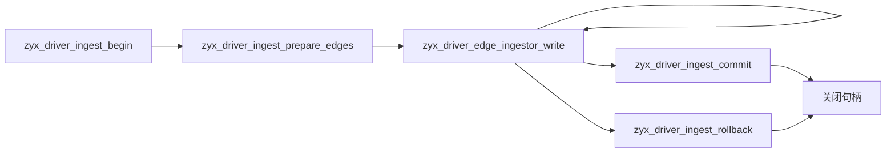

# Driver ABI Arrow 导入

Driver ABI 1.1 新增基于 Arrow C Data Interface 的 prepared 事务式导入路径。ZYX 只使用稳定的 `ArrowSchema` 和 `ArrowArray` ABI 声明，不依赖 Apache Arrow Runtime。

## 输入 Schema

每个 prepared relationship ingestor 接受一种 schema：

```text
struct<
  source_id: int64 not null,
  target_id: int64 not null,
  properties: struct<...>
>
```

关系类型在 prepare ingestor 时单独传入。属性字段支持 Arrow Boolean、有符号与无符号整数、Float32、Float64、UTF-8、List、FixedSizeList、Struct、Map 和 Dictionary 布局。输入 array buffer 始终由调用方持有，只需在 `zyx_driver_edge_ingestor_write()` 调用期间保持有效。

Map key 必须是非 NULL 的 UTF-8 值，并且在每一行内唯一。所有受支持的属性类型都可以使用 Dictionary 编码，Map key 也可以使用。

调用方仍必须保证实际 buffer 大小满足 Arrow metadata 所描述的布局。C Data Interface 不携带内存分配的字节长度，因此任何 consumer 都无法证明一个裸 buffer 指针背后一定有足够的可访问内存。

## 生命周期



一个 ingest session 持有一个 bulk write transaction。commit 保证 WAL 持久化，主数据库 checkpoint 可以延迟到 `zyx_driver_db_save()` 或正常关闭数据库时执行。关闭仍处于 active 状态的 session 会自动回滚。

任何 write 失败都会将整个 session 标记为失败，之后禁止 commit，只能 rollback 或 close。Schema prepare 错误发生在 writer 创建之前，不会污染 session。

## 生成的 ID

批量边 ID 以连续区间分配。成功后，`zyx_driver_id_range_t` 返回 `first_id` 和 `count`；输入第 `i` 行对应 `first_id + i`。不需要生成 ID 时可以为结果传入 `NULL`。

## 错误定位

批量错误可以携带从零开始的输入行号和字段路径：

```c
int64_t row = zyx_driver_error_row_index(error);
const char *field = zyx_driver_error_field_path(error);
```

错误与具体输入值无关时，`row` 为 `-1`，`field` 为空字符串。

## Batch 大小

应在同一个 prepared ingestor 中连续写入多个 Arrow RecordBatch，不要构造一个无限大的 array。可以从 32–128 MiB 的 batch 开始，再根据真实数据调优。Schema 和关系类型只编译一次，并被 session 中的所有 batch 复用。

单个 batch 最多包含 10,000,000 行，Arrow adapter 内部最多物化 512 MiB 数据。Prepared schema 的所有嵌套层级合计最多包含 4,096 个字段，复制的 schema 文本总量最多为 1 MiB，嵌套深度最多为 64 层。超过限制时会在图写入开始前返回 `ZYX_DRIVER_OUT_OF_RANGE`。

写入路径将 Arrow 值直接解码为 storage-native 属性列，不构造逐行 Map，也不构造中间的公开 `zyx::Value` 对象图。端点校验同样在 ID 分配前完成，因此非法 batch 不会产生部分 ID 区间。

浏览器 Playground 有意不导出写入侧 ingest 符号，仍然只使用 Driver ABI 只读事务。
