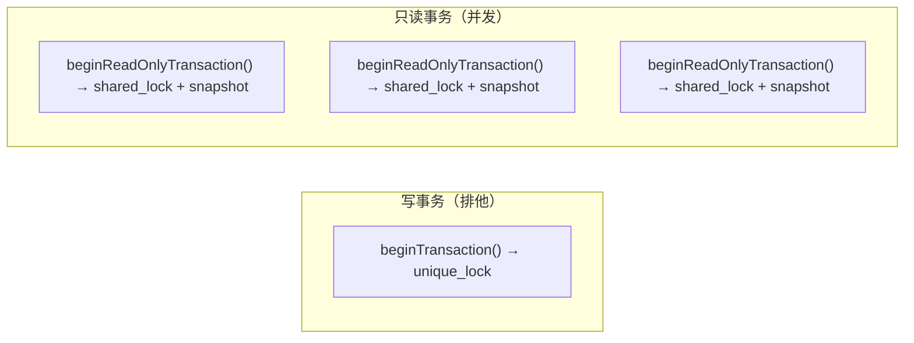

# 事务 API

ZYX 支持三种事务使用方式。

## 1. API 级显式事务

### 写事务

```cpp
zyx::Database db("/path/to/db");

auto tx = db.beginTransaction();

tx.execute("CREATE (n:Person {name: 'Alice'})");
tx.execute("CREATE (n:Person {name: 'Bob'})");
tx.execute(
    "MATCH (a:Person {name: 'Alice'}), (b:Person {name: 'Bob'}) "
    "CREATE (a)-[:KNOWS]->(b)");

tx.commit();
```

`Transaction` 对象为 **move-only**。若在活跃状态下被销毁（如离开作用域），会自动回滚。

```cpp
{
    auto tx = db.beginTransaction();
    tx.execute("CREATE (n:Person {name: 'Charlie'})");
    // 没有 commit — tx 离开作用域，自动回滚
}
```

### 只读事务

```cpp
auto roTx = db.beginReadOnlyTransaction();

auto result = roTx.execute("MATCH (n:Person) RETURN n.name");
while (result.hasNext()) {
    // 以快照一致性读取数据
    result.next();
}
// roTx 析构时自动回滚（只读回滚是无操作）
```

只读事务特点：

- 获取**共享锁** — 多个只读事务可并发运行。
- 获取开始时刻的不可变**快照**。
- 无法执行写操作（三层强制：exec mode、plan flags、data manager guard）。

### Transaction 方法

| 方法 | 签名 | 说明 |
|------|------|------|
| `execute` | `Result execute(const string& cypher) const` | 在事务内执行 Cypher 查询 |
| `execute` | `Result execute(const string& cypher, const unordered_map<string, Value>& params) const` | 执行参数化 Cypher 查询 |
| `commit` | `void commit()` | 提交所有变更，之后 `isActive()` 返回 `false` |
| `rollback` | `void rollback()` | 回滚所有变更 |
| `isActive` | `bool isActive() const` | 事务是否仍在进行中 |
| `isReadOnly` | `bool isReadOnly() const` | 是否为只读事务 |

## 2. Cypher 事务语句

可以直接在 `execute()` 中使用 `BEGIN`、`COMMIT`、`ROLLBACK`：

```cpp
db.execute("BEGIN");
db.execute("CREATE (n:Person {name: 'Alice'})");
db.execute("CREATE (n:Person {name: 'Bob'})");
db.execute("COMMIT");
```

适用于 CLI 和脚本场景。不支持嵌套事务。

## 3. 隐式事务

没有显式事务时，`Database::execute()` 自动处理：

- **读查询** — 走只读快速路径（无写锁、无 WAL 开销）。
- **写查询** — 自动包裹单语句事务，立即提交。

```cpp
// 自动提交 — 无需 beginTransaction()
db.execute("CREATE (n:Person {name: 'Alice'})");

// 走只读快速路径
auto result = db.execute("MATCH (n:Person) RETURN n.name");
```

## 并发模型



- 同一时刻只能有**一个写事务**活跃（`std::shared_mutex` 排他锁）。
- **多个只读事务**可互相并发。
- 只读事务看到的是开始时刻的一致快照。

## 错误处理模式

```cpp
auto tx = db.beginTransaction();
try {
    tx.execute("CREATE (n:Person {name: 'Alice'})");
    tx.execute("CREATE (n:Person {name: 'Bob'})");
    tx.commit();
} catch (const std::exception& e) {
    // tx 析构函数自动回滚
    std::cerr << "事务失败: " << e.what() << std::endl;
}
```

可能抛异常的方法：

| 方法 | 抛异常场景 |
|------|-----------|
| `beginTransaction()` | 存储 I/O 失败、另一个写事务活跃 |
| `commit()` | WAL sync 失败、存储刷新失败 |
| `execute()` | 解析错误（返回失败的 `Result`，不抛异常） |

查询执行错误被捕获在 `Result` 中 — 检查 `result.isSuccess()` 和 `result.getError()`，而非依赖异常。

## 源码定位

| 组件 | 路径 |
|------|------|
| Transaction | `include/graph/core/Transaction.hpp` |
| TransactionManager | `include/graph/core/TransactionManager.hpp` |
| Database API | `src/api/DatabaseImpl.cpp` |
