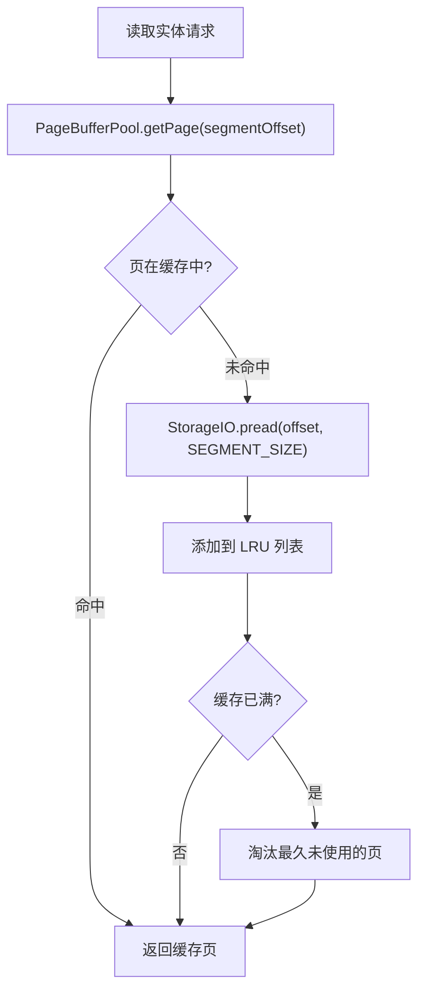
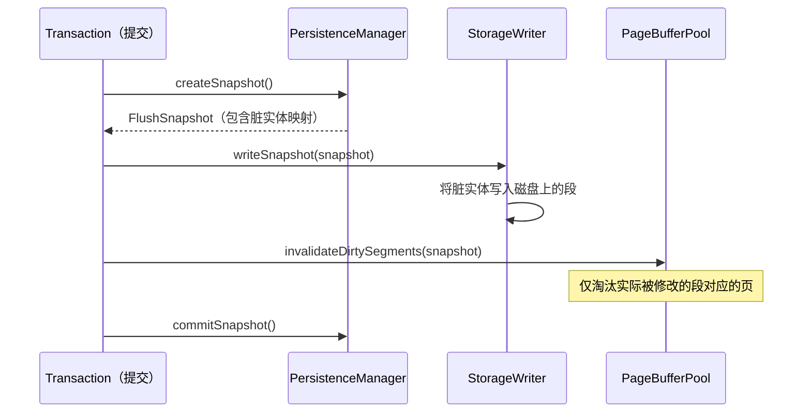
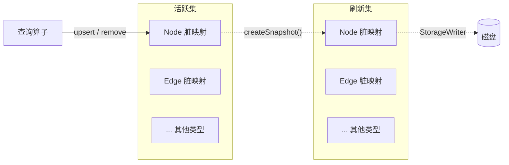

# 缓存管理

ZYX 的缓存不是单一模块，而是多处协同：

- **PageBufferPool** — 统一 LRU 缓存，以段为粒度（128 KB/页）。
- **DirtyEntityRegistry** — `PersistenceManager` 内的每实体类型脏跟踪。
- **组件内部缓存** — 如 `VectorIndexRegistry` 维护自己的向量索引结构缓存。

## 设计目标

1. 减少热段重复磁盘读取。
2. 在事务边界内控制写放大。
3. 保持批量写的内存用量受控。

## PageBufferPool

`PageBufferPool` 是跨所有实体类型共享的段级 LRU 缓存。它存储完整段（128 KB/段）而非单个实体，分摊磁盘寻道开销。

**关键特性：**

- **线程安全** — 使用 `std::shared_mutex` 保护，允许并发读取。
- **统计信息** — 原子计数 `hits` 和 `misses`，用于监控。
- **可配置容量** — 在构建时设定页数上限。

## 缓存失效

失效是定向的，而非全量的：

`StorageWriter` 将脏实体刷新到磁盘后，`invalidateDirtySegments()` 仅移除被修改段的页。这避免在每次提交时清空整个缓存，保留未参与事务的热数据。

## 脏实体跟踪

`PersistenceManager` 维护六个 `DirtyEntityRegistry` 实例 — 每实体类型一个（Node、Edge、Property、Blob、Index、State）。

### 双缓冲设计

当 `createSnapshot()` 被调用时：

1. 当前活跃脏映射被捕获到 `FlushSnapshot`。
2. 新的空映射被交换为活跃集。
3. 后续操作的新写入进入活跃集，不阻塞刷新。
4. `StorageWriter` 完成写入后，`commitSnapshot()` 清空刷新集。

这种双缓冲确保读取操作可以在刷新期间继续从刷新集提供数据。

### 自动 Flush

`PersistenceManager` 监控所有类型的脏实体总数。当超过可配置阈值（默认 10,000）时，调用注册的回调触发自动 flush。这防止长时间运行的写事务导致内存无限增长。

## 源码定位

| 组件 | 路径 |
|------|------|
| PageBufferPool | `include/graph/storage/PageBufferPool.hpp` |
| PersistenceManager | `include/graph/storage/PersistenceManager.hpp` |
| DirtyEntityRegistry | `include/graph/storage/DirtyEntityRegistry.hpp` |
| VectorIndexRegistry | `include/graph/vector/VectorIndexRegistry.hpp` |
