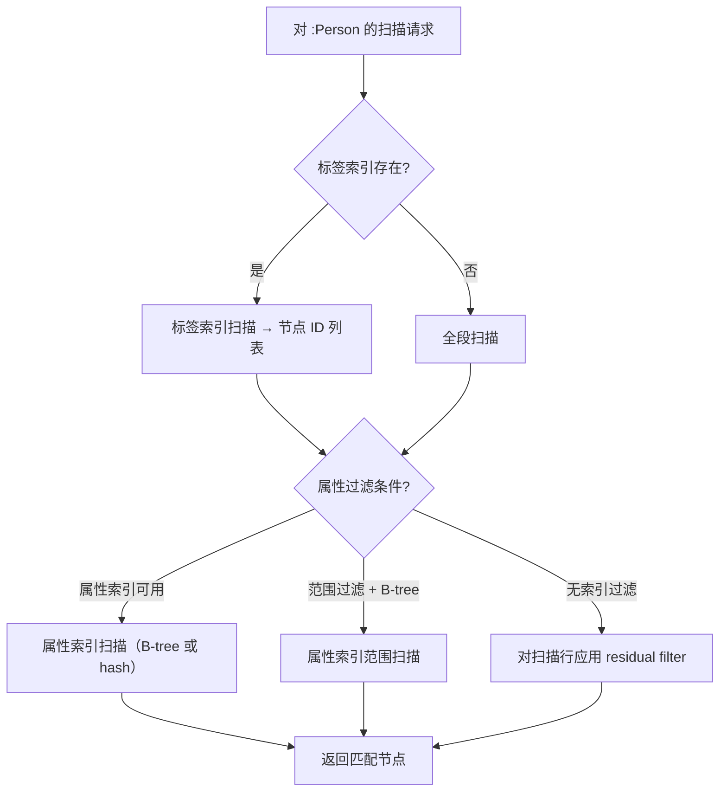

# 优化策略

ZYX 的性能优化发生在三层：逻辑优化、物理执行策略和存储 I/O 路径。

## 逻辑优化规则

优化器按固定顺序应用规则，迭代至计划收敛或达到最大迭代次数：

| 规则 | 效果 |
|------|------|
| **PredicateSimplification** | 化简布尔表达式（如 `true AND x` → `x`、`x OR true` → `true`） |
| **FilterPushdown** | 将过滤谓词下推到扫描算子附近，减少下游处理的行数 |
| **ProjectionPushdown** | 移除后续算子中不使用的列，缩减元组宽度 |
| **EnhancedIndexSelection** | 评估可用索引并为每次扫描选择最具选择性的索引 |
| **JoinReorder** | 重排连接操作以最小化中间结果大小 |

## 扫描策略选择

`NodeScanOperator` 执行时评估可用索引和统计信息，选择最优访问路径：

未被选中索引吸收的条件作为 **residual filter** 在扫描后应用。

## 执行层技术

### 多标签过滤

当查询指定多个标签（如 `MATCH (n:A:B)`）时，扫描算子选择基数最小的标签作为主索引查找，然后将剩余标签作为 residual filter 应用。

### 批量实体加载

`DataManager.bulkLoadEntities()` 按顺序读取整个段链，比逐实体的随机访问快得多。这在索引构建和恢复期间内部使用。

### 向量查询优化

向量相似性查询使用专用算子（`VectorSearchOperator`），利用 HNSW 索引结构进行近似最近邻搜索，避免全库扫描。

### 并行执行

配置线程池后，某些操作（并行段扫描、索引构建）可将工作分布到多个线程。

## 存储 I/O 优化

### StorageIO 抽象

`StorageIO` 在支持的平台（Linux、macOS）使用原生 `pread`/`pwrite` 系统调用，在不支持的平台上回退到 `fstream` seek。双文件描述符模型（独立的读/写句柄）使并发读不会阻塞写。

### PageBufferPool

段级 LRU 缓存避免热段的冗余磁盘读取。刷新后的定向失效（`invalidateDirtySegments`）保留未修改段的缓存条目。

### WAL 组提交

多个事务提交被批量到一个 `fsync` 调用，将最昂贵的 I/O 操作从每事务降到每组。默认组窗口为 1 毫秒。

## 源码定位

| 组件 | 路径 |
|------|------|
| Optimizer | `src/query/optimizer/Optimizer.cpp` |
| 优化规则 | `include/graph/query/optimizer/Optimizer.hpp` |
| PhysicalPlanConverter | `src/query/planner/PhysicalPlanConverter.cpp` |
| StorageIO | `include/graph/storage/StorageIO.hpp` |
| PageBufferPool | `include/graph/storage/PageBufferPool.hpp` |
