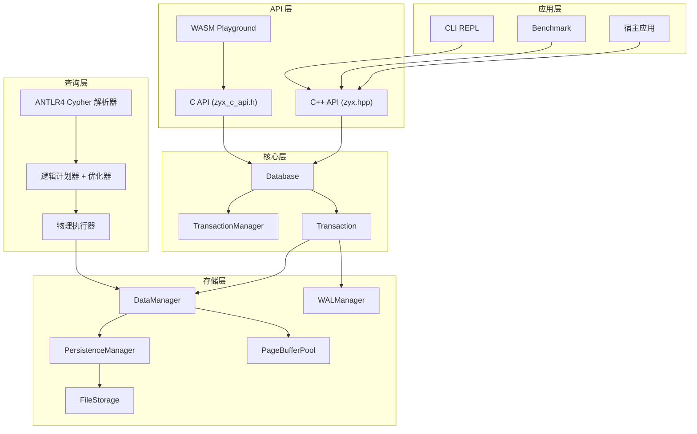
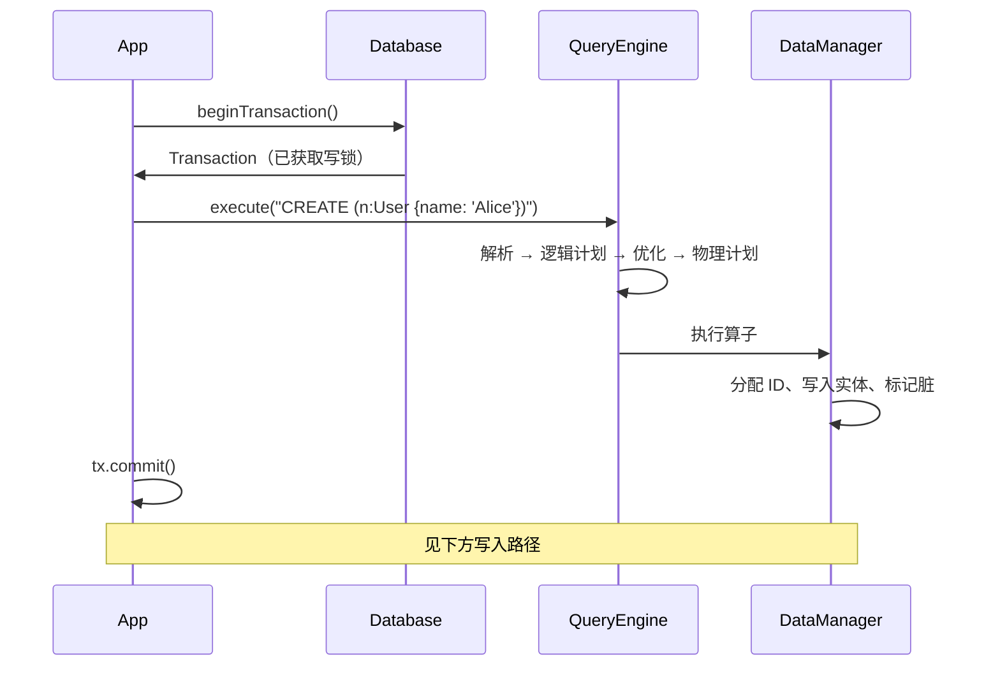
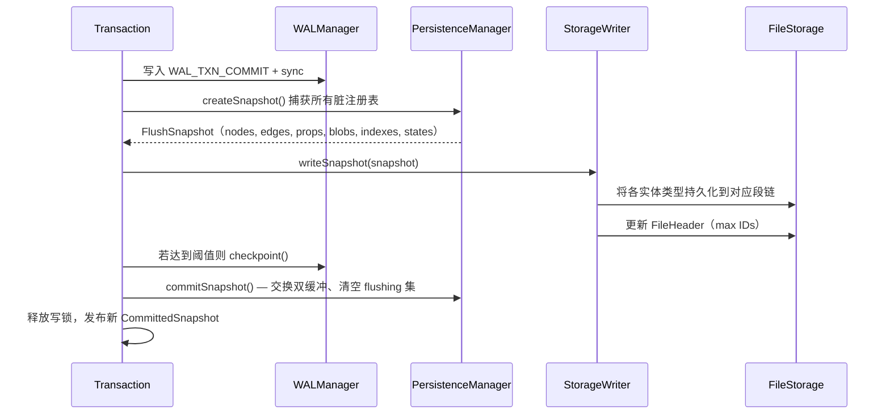
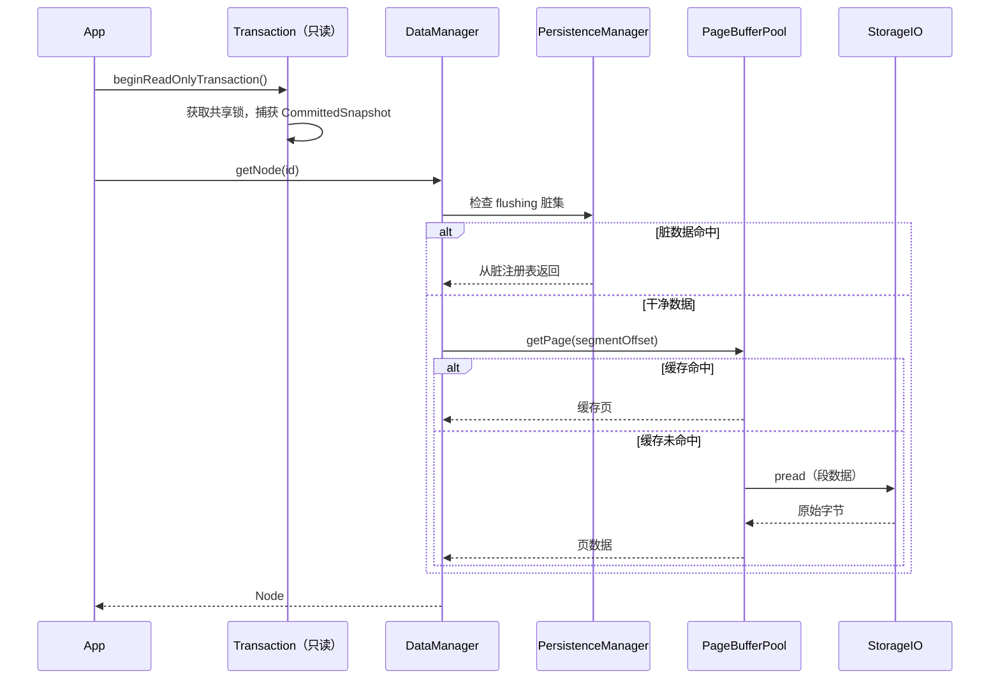

# 架构概述

ZYX 是可嵌入式图数据库引擎，核心是单进程内库调用模型，不依赖独立服务进程。

## 分层结构

**各层职责：**

- **应用层** — CLI 工具、benchmark 套件以及嵌入 ZYX 的宿主应用。
- **API 层** — C++ API（`zyx.hpp`）、C API（`zyx_c_api.h`）及 WASM 绑定。
- **查询层** — Cypher 文本经解析、计划、优化后，作为物理算子流水线执行。
- **存储层** — `DataManager` 统一管理实体读写，`PersistenceManager` 跟踪脏数据，`FileStorage` 管理段式文件，`WALManager` 处理预写日志，`PageBufferPool` 提供 LRU 段缓存。
- **核心层** — `Database` 为顶层入口；`TransactionManager` 实现单写多读并发；`Transaction` 为外部句柄。

## 关键对象

| 对象 | 职责 | 源码位置 |
|------|------|----------|
| `graph::Database` | 生命周期管理，QueryEngine / ThreadPool / WAL 惰性初始化 | `include/graph/core/Database.hpp` |
| `graph::query::QueryEngine` | Cypher 解析、计划构建与执行 | `include/graph/query/api/QueryEngine.hpp` |
| `graph::storage::FileStorage` | 段式文件布局，flush/save 协调 | `include/graph/storage/FileStorage.hpp` |
| `graph::storage::DataManager` | Node / Edge / Property / Blob / Index / State 统一 I/O 入口 | `include/graph/storage/data/DataManager.hpp` |
| `TransactionManager` | 单写锁、快照管理、commit/rollback 协调 | `include/graph/core/TransactionManager.hpp` |

## 主执行路径

### 查询路径

### 写入路径（提交）

### 读取路径

## 设计原则

1. **嵌入式优先** — ZYX 是库而非服务器，直接链接到进程内。
2. **单写多读** — `std::shared_mutex` 提供排他写权限，同时允许多个并发读。
3. **段式存储** — 固定大小（128 KB）段，每实体类型独立链表。
4. **惰性初始化** — `QueryEngine`、`ThreadPool`、`WAL` 仅在首次访问时创建，保持启动快速。
5. **双缓冲脏跟踪** — `PersistenceManager` 维护 active/flushing 两组脏映射，使读取可在 I/O 期间继续。

## 源码定位

| 组件 | 头文件 | 实现 |
|------|--------|------|
| Database | `include/graph/core/Database.hpp` | `src/core/Database.cpp` |
| QueryEngine | `include/graph/query/api/QueryEngine.hpp` | `src/query/` |
| FileStorage | `include/graph/storage/FileStorage.hpp` | `src/storage/` |
| TransactionManager | `include/graph/core/TransactionManager.hpp` | `src/core/TransactionManager.cpp` |
| WAL | `include/graph/storage/wal/WALManager.hpp` | `src/storage/wal/` |
