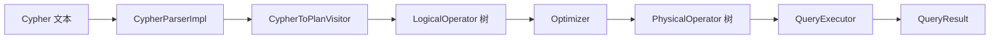
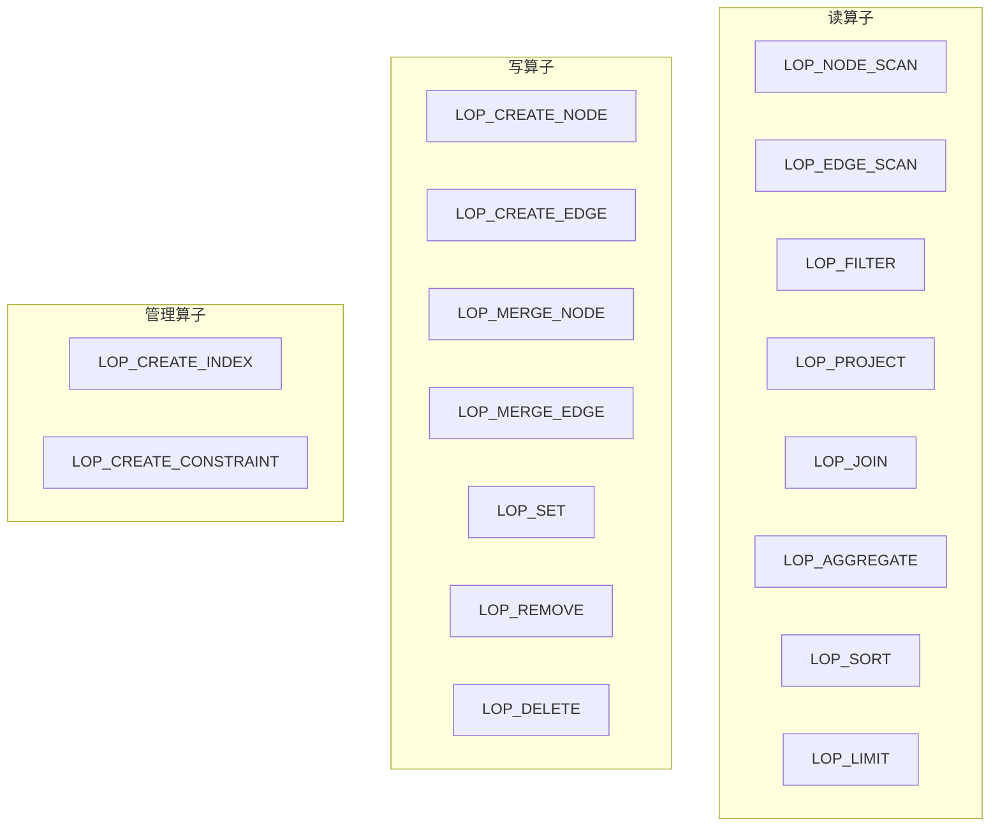
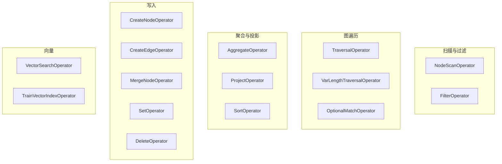
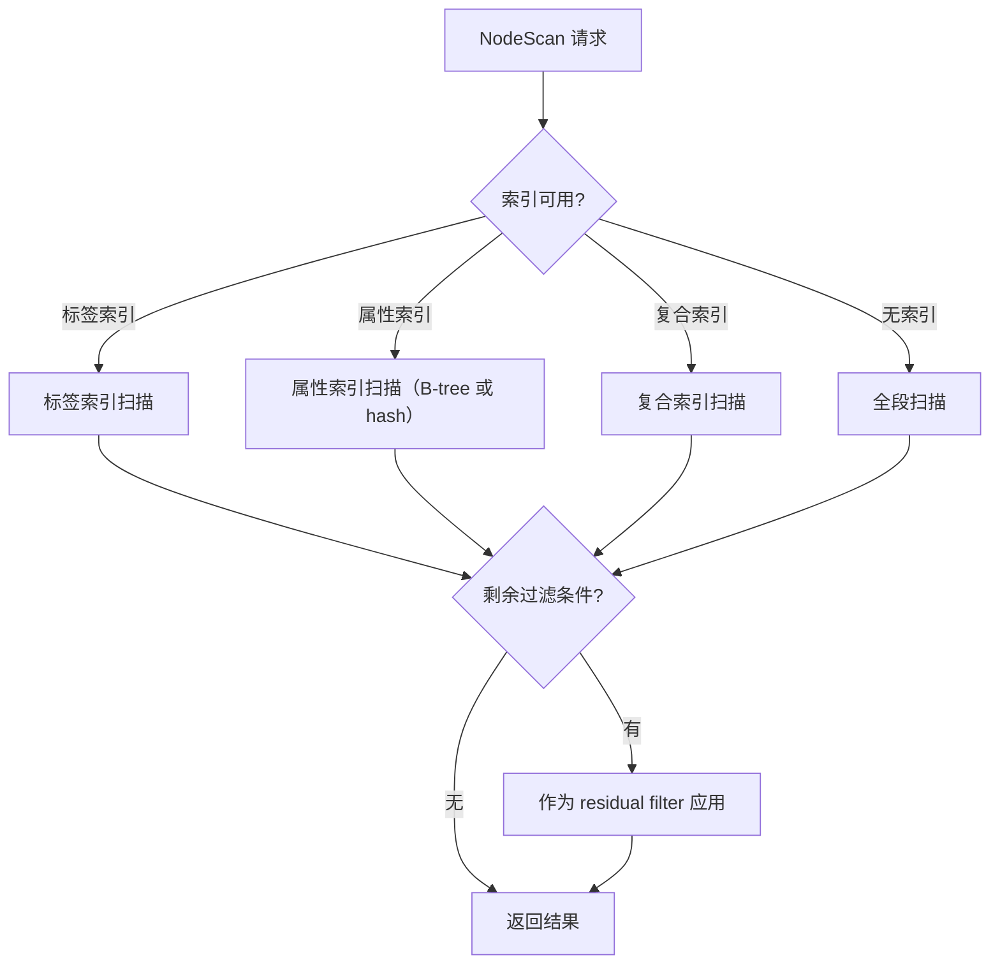

# 查询引擎

查询引擎是四阶段流水线：**解析 → 逻辑计划 → 优化 → 物理执行**。

## 流水线总览

`QueryEngine` 协调整个流水线，持有 `QueryPlanner`（构建逻辑计划）、`Optimizer`（基于规则的优化）和 `QueryExecutor`（运行物理计划）。`PlanCache` 用于缓存已编译的计划。

## 1. 解析层

解析器由 ANTLR4 从 Cypher 语法文件生成：

- **语法文件**：`src/query/parser/cypher/generated/CypherParser.g4` 和 `CypherLexer.g4`
- **入口**：`CypherParserImpl` 接受查询字符串并生成解析树。
- **计划构建**：`CypherToPlanVisitor` 遍历解析树并直接构建 `LogicalOperator` 树——没有独立的 AST 中间表示。

每个 Cypher 子句在 `src/query/parser/cypher/clauses/` 中有专用处理器，实现 visitor 模式。

### 已支持的 Cypher 子句

**读取**：`MATCH`、`OPTIONAL MATCH`、`UNWIND`、`CALL`

**写入**：`CREATE`、`MERGE`、`SET`、`REMOVE`、`DELETE` / `DETACH DELETE`

**结果**：`RETURN`、`ORDER BY`、`SKIP`、`LIMIT`、`DISTINCT`

**组合**：`WITH`、`UNION` / `UNION ALL`

**管理**：索引/约束 DDL、`SHOW INDEX` / `SHOW CONSTRAINT`

**事务**：`BEGIN`、`COMMIT`、`ROLLBACK`

## 2. 逻辑计划层

所有子句转换为 `LogicalOperator` 节点树（定义在 `include/graph/query/logical/LogicalOperator.hpp`）。

算子形成树结构，数据从叶节点（扫描）向上流经转换（过滤、投影）和修改（创建、删除）算子。

## 3. 优化层

优化器按固定顺序应用规则，迭代至计划收敛或达到最大迭代次数：

| 规则 | 效果 |
|------|------|
| `PredicateSimplificationRule` | 化简布尔表达式（如 `true AND x` → `x`） |
| `FilterPushdownRule` | 将过滤条件下推到数据源附近，减少中间行数 |
| `ProjectionPushdownRule` | 尽早消除后续未使用的列，缩减元组宽度 |
| `EnhancedIndexSelectionRule` | 评估可用索引，选择最具选择性的索引用于扫描 |
| `JoinReorderRule` | 重排连接顺序以最小化中间结果大小 |

## 4. 物理执行层

`PhysicalPlanConverter` 将优化后的逻辑计划映射为 `PhysicalOperator` 实例树，由 `QueryExecutor` 执行。

### 关键物理算子

### 扫描策略选择

`NodeScanOperator` 执行时考虑可用索引和统计信息：

未被选中索引吸收的条件作为 **residual filter** 在扫描后应用。

## 表达式求值

表达式求值器处理：

- **字面量** — 整数、浮点数、字符串、布尔值、null
- **变量** — 查询绑定标识符（`n`、`r` 等）
- **属性访问** — `n.name`、`r.weight`
- **二元/一元运算符** — 算术、比较、逻辑（`AND`、`OR`、`NOT`）
- **函数调用** — 内置函数（`count`、`sum`、`avg`、`min`、`max`、`collect` 等）

## 结果处理

`QueryResult` 包含列名和 `Value` 对象行。支持的值类型：

| 类型 | 说明 |
|------|------|
| Null | 空值 |
| Boolean | `true` / `false` |
| Integer | 64 位有符号整数 |
| Float | 双精度浮点数 |
| String | UTF-8 字符串 |
| List | 有序值列表 |
| Node | 图节点引用 |
| Edge | 图边引用 |
| Path | 节点和边的有序序列 |

## 源码定位

| 组件 | 路径 |
|------|------|
| CypherToPlanVisitor | `src/query/parser/cypher/CypherToPlanVisitor.cpp` |
| 子句处理器 | `src/query/parser/cypher/clauses/` |
| Optimizer | `src/query/optimizer/Optimizer.cpp` |
| PhysicalPlanConverter | `src/query/planner/PhysicalPlanConverter.cpp` |
| QueryExecutor | `src/query/executor/` |
| LogicalOperator | `include/graph/query/logical/LogicalOperator.hpp` |
| QueryEngine | `include/graph/query/api/QueryEngine.hpp` |
