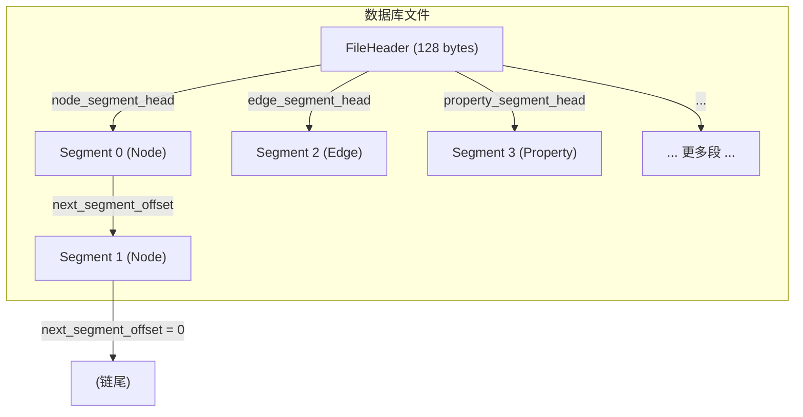
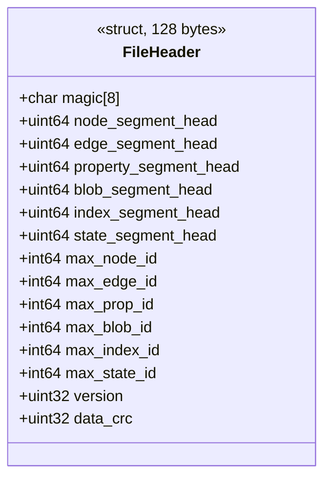
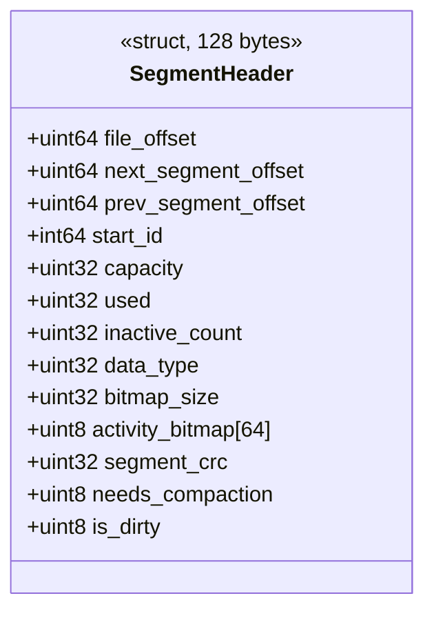
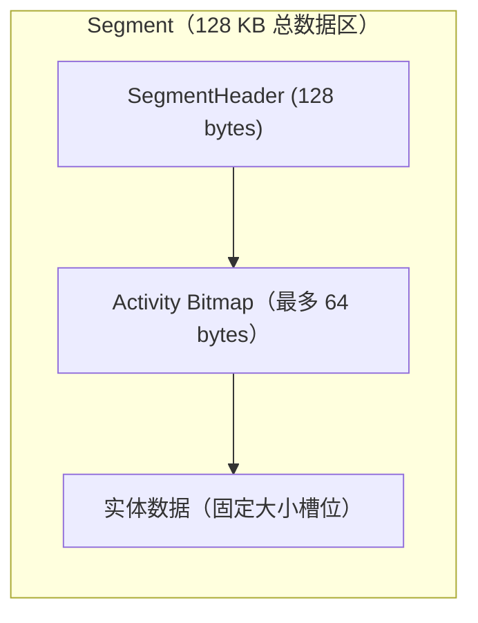
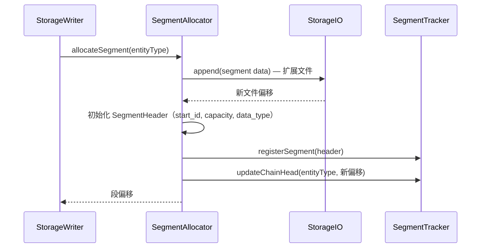
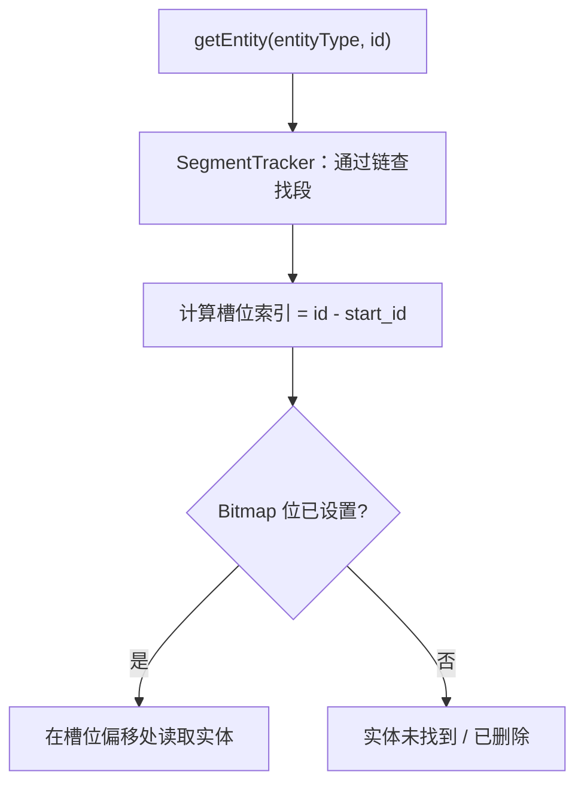

# 段格式

底层存储格式定义在 `StorageHeaders.hpp`。数据库文件被划分为固定大小的段，以链表形式组织，每种实体类型各一条链。

## 常量

| 常量 | 值 | 说明 |
|------|-----|------|
| `FILE_HEADER_MAGIC_STRING` | `<ZYX-DB>` | 文件起始的魔数字符串 |
| `STORAGE_PAGE_SIZE` | 4096 字节 | OS 页大小 |
| `SEGMENT_SIZE` | 128 KB（32 页） | 每段数据区大小 |
| `FILE_HEADER_SIZE` | 128 字节 | 文件头大小（对齐填充） |
| `SEGMENT_HEADER_SIZE` | 128 字节 | 段头大小（对齐填充） |
| `MAX_BITMAP_SIZE` | 64 字节（512 位） | Activity bitmap 容量 |

每段实际实体数量取决于实体类型的固定记录大小。段大小常量可能在不同版本间变化 — 始终以源码头文件为准。

## 文件级结构

每种实体类型有独立的段链表。`FileHeader` 存储每条链的头偏移。

## FileHeader

| 字段 | 用途 |
|------|------|
| `magic` | 验证字符串：`<ZYX-DB>` |
| `*_segment_head` | 各实体类型链表的第一个段的文件偏移（0 = 空） |
| `max_*_id` | 各实体类型已分配的最高 ID — 启动时被 `IDAllocator` 使用 |
| `version` | 文件格式版本（当前为 3） |
| `data_crc` | 头部内容的 CRC32 校验 |

## SegmentHeader

| 字段 | 用途 |
|------|------|
| `file_offset` | 文件中的自引用偏移 |
| `next_segment_offset` | 链表中下一个段（0 = 尾部） |
| `prev_segment_offset` | 链表中上一个段（0 = 头部） |
| `start_id` | 该段第一个槽位的实体 ID |
| `capacity` | 实体槽位总数 |
| `used` | 当前占用的槽位数 |
| `inactive_count` | 已删除（墓碑标记）的槽位数 |
| `data_type` | 段中存储的实体类型 |
| `activity_bitmap` | 512 位位图 — bit = 1 表示槽位活跃 |
| `segment_crc` | 段数据的 CRC32 用于完整性检查 |
| `needs_compaction` | 碎片化超过阈值时设置的标志 |
| `is_dirty` | 表示有未刷新修改的标志 |

## 段内部布局

每段以固定大小槽位存储实体。槽位大小取决于实体类型。Activity bitmap 跟踪哪些槽位在使用中：

- Bit `i` = 1 → 槽位 `i` 活跃（被存活实体占用）
- Bit `i` = 0 → 槽位 `i` 空闲（从未使用或已墓碑标记）

Bitmap 的作用：

- **快速活跃/空闲计数** — 对 bitmap 做 popcount 得到活跃数。
- **碎片化检测** — `inactive_count` 跟踪墓碑标记的槽位。当 `inactive_count / capacity` 超过阈值时，段被标记为需要压缩。
- **按 ID 查找实体** — 给定实体 ID，`start_id` 和 bitmap 确定槽位索引以及实体是否活跃。

## 段链操作

### 分配新段

### 实体查找

## 校验和

每个段携带 `segment_crc` 字段，对段数据（排除校验和字段本身）计算 CRC32。`FileStorage::verifyIntegrity()` 期间验证所有段校验和以检测文件损坏。

## 源码定位

| 组件 | 路径 |
|------|------|
| StorageHeaders | `include/graph/storage/StorageHeaders.hpp` |
| SegmentTracker | `include/graph/storage/SegmentTracker.hpp` |
| SegmentAllocator | `include/graph/storage/SegmentAllocator.hpp` |
