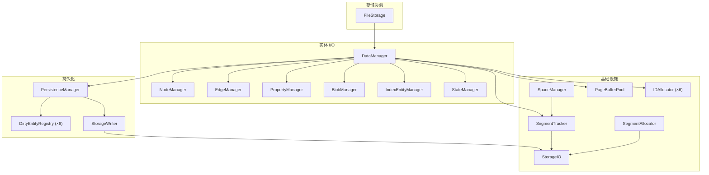
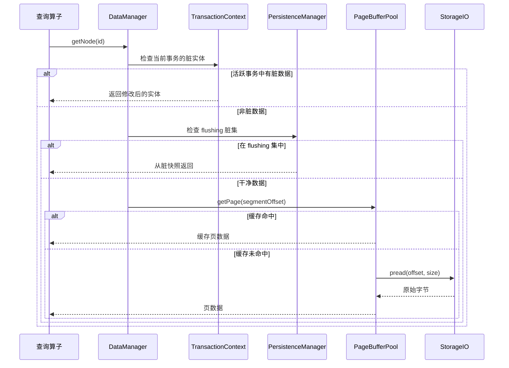
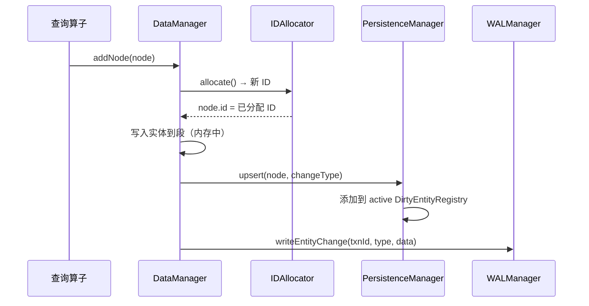
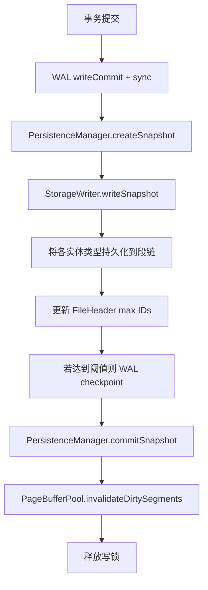

# 存储系统

存储层由 `FileStorage` 统筹，`DataManager` 负责实体读写，`SegmentTracker` / `SpaceManager` 负责空间管理。

## 组件职责

| 组件 | 职责 |
|------|------|
| **FileStorage** | 打开/关闭数据库文件，初始化所有子组件，协调 `save()` / `flush()` |
| **DataManager** | 所有实体类型的统一门面；持有 `TransactionContext`、`PageBufferPool` 及各类型管理器 |
| **PersistenceManager** | 维护六个 `DirtyEntityRegistry`（每实体类型一个）；脏数据量超阈值时触发自动 flush |
| **StorageWriter** | 将 `FlushSnapshot` 写入磁盘 — 处理段分配、原地更新和文件截断 |
| **SegmentTracker** | 跟踪段头与链表关系；通过 activity bitmap 将实体 ID 映射到段偏移 |
| **IDAllocator** | 每类型独立的 ID 分配，三级缓存（hot vector、cold intervals、volatile intervals），以段扫描为后备 |
| **StorageIO** | 跨平台 I/O 抽象 — 优先使用 `pread`/`pwrite`，回退到 `fstream` seek |

## 实体类型

系统管理六类实体，每类有独立的段链和索引结构：

| 类型 | 说明 | 段链头 |
|------|------|--------|
| Node | 带标签和属性引用的图节点 | `fileHeader.node_segment_head` |
| Edge | 带类型和端点引用的有向边 | `fileHeader.edge_segment_head` |
| Property | 键值属性记录（内联或 blob 支撑） | `fileHeader.property_segment_head` |
| Blob | 大块二进制数据（zlib 压缩） | `fileHeader.blob_segment_head` |
| Index | 索引元数据和结构 | `fileHeader.index_segment_head` |
| State | 内部系统状态记录 | `fileHeader.state_segment_head` |

## 读取路径

读取路径有三个查找层次：

1. **事务上下文** — 若当前事务已修改该实体，返回内存中的版本。
2. **Flushing 脏集** — 若 `PersistenceManager` 有未刷新的脏实体（双缓冲），从该处返回。
3. **PageBufferPool → 磁盘** — 检查 LRU 段缓存；未命中则通过 `StorageIO` 读取磁盘。

## 写入路径

写入在内存中累积：

1. `IDAllocator` 从其分级缓存中分配唯一 ID。
2. 实体写入内存中的段表示。
3. `PersistenceManager.upsert()` 将其添加到活跃脏注册表。
4. 追加 WAL 记录以确保持久性。

## Flush 与 Save

写事务提交时，`FileStorage::save()` 协调持久化：

**关键细节：**

- `createSnapshot()` 捕获活跃脏映射并交换为新的空映射（双缓冲），新写入可继续进入活跃集。
- `StorageWriter` 处理新实体的段分配、修改的原地更新和删除的墓碑标记。
- 刷新后，`invalidateDirtySegments()` 仅从 `PageBufferPool` 中移除受影响的页，避免全量清缓存。

## 校验与调试

- **完整性校验**：`FileStorage::verifyIntegrity()` 验证所有段 CRC 及交叉引用。
- **调试检查器**：`DatabaseInspector` 提供已存实体的详细视图。
- **REPL `debug` 命令**：交互式检查 nodes、edges、properties、blobs、indexes、states。

## 源码定位

| 组件 | 路径 |
|------|------|
| FileStorage | `include/graph/storage/FileStorage.hpp` |
| DataManager | `include/graph/storage/data/DataManager.hpp` |
| PersistenceManager | `include/graph/storage/PersistenceManager.hpp` |
| StorageWriter | `include/graph/storage/StorageWriter.hpp` |
| SegmentTracker | `include/graph/storage/SegmentTracker.hpp` |
| IDAllocator | `include/graph/storage/IDAllocator.hpp` |
| StorageIO | `include/graph/storage/StorageIO.hpp` |
| PageBufferPool | `include/graph/storage/PageBufferPool.hpp` |
