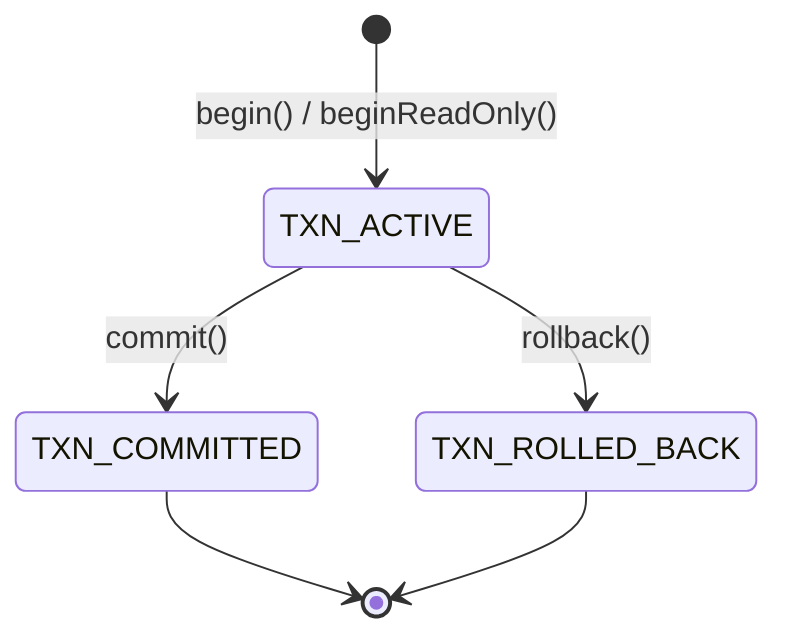
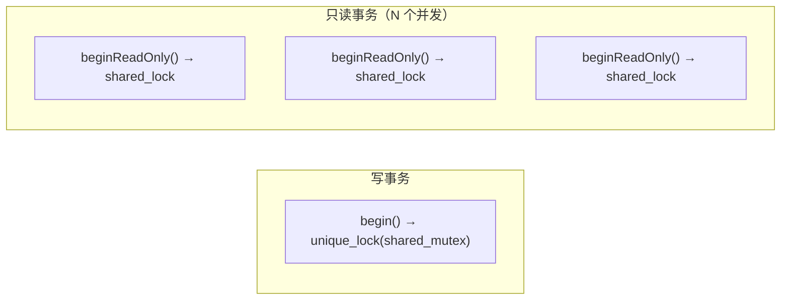
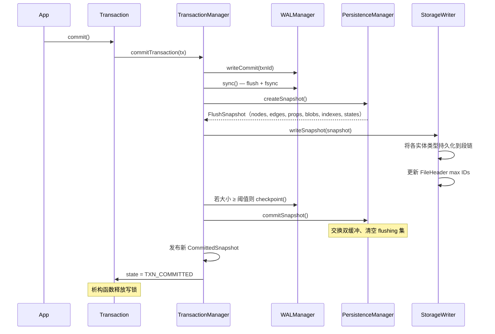
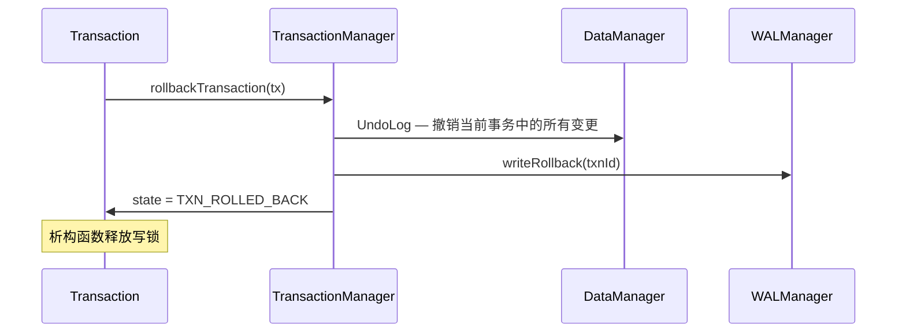
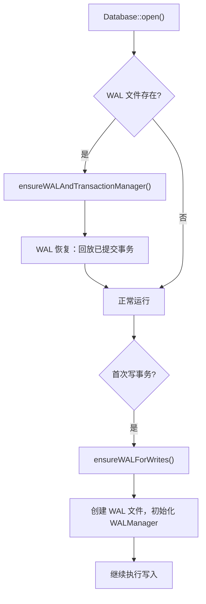

# 事务管理

事务由 `TransactionManager` 管理，`Transaction` 提供外部句柄，具有 RAII 语义。

## 状态机

`Transaction` 为 move-only；若对象析构时仍为 `TXN_ACTIVE`，会自动回滚。

## 并发策略

- **写事务** — 获取排他锁（`std::unique_lock<std::shared_mutex>`），同一时刻只能有一个活跃写事务。
- **只读事务** — 获取共享锁（`std::shared_lock<std::shared_mutex>`），多个只读事务可并发运行，但不能与写事务并发。

这种单写多读设计完全避免写-写冲突，并为读者提供快照隔离。

## 写事务提交流程

**逐步说明：**

1. **WAL commit 记录** — 写入 `WAL_TXN_COMMIT` 并 `sync()` 到磁盘。这是不可回退点——此后即使进程崩溃，事务也是持久的。
2. **快照脏实体** — `PersistenceManager.createSnapshot()` 捕获所有脏实体并交换为新的空注册表（双缓冲），新写入可继续进入活跃集。
3. **持久化到存储** — `StorageWriter` 将各实体类型写入对应段链，按需分配新段。
4. **Checkpoint** — 若 WAL 增长超过阈值（默认 1 MB），执行 checkpoint 截断 WAL。
5. **发布快照** — 发布新 `CommittedSnapshot` 供只读事务使用。
6. **释放锁** — `Transaction` 对象析构时释放写锁。

## 回滚流程

回滚时，`TransactionContext` 中的 `UndoLog` 撤销事务期间记录的每个操作（add → remove、update → restore、delete → re-insert）。写入 `WAL_TXN_ROLLBACK` 记录后释放写锁。

## WAL 初始化（两阶段）

ZYX 将 WAL 创建推迟到实际需要时：

这种两阶段方式意味着只读工作负载永远不会产生 WAL 文件创建的开销。

## 只读事务

只读事务在开始时获取不可变的 `CommittedSnapshot`，保证在整个生命周期内看到一致的数据库视图，不受并发写事务影响。

三层只读强制机制防止任何数据变更：

1. **ExecMode** — 查询引擎在只读模式下拒绝写操作。
2. **QueryPlan 标志** — 计划本身标记为只读。
3. **DataManager 守卫** — 数据层拒绝来自只读事务的任何写调用。

## 源码定位

| 组件 | 路径 |
|------|------|
| Transaction | `include/graph/core/Transaction.hpp` |
| TransactionManager | `include/graph/core/TransactionManager.hpp` |
| CommittedSnapshot | `include/graph/storage/SnapshotManager.hpp` |
| PersistenceManager | `include/graph/storage/PersistenceManager.hpp` |
