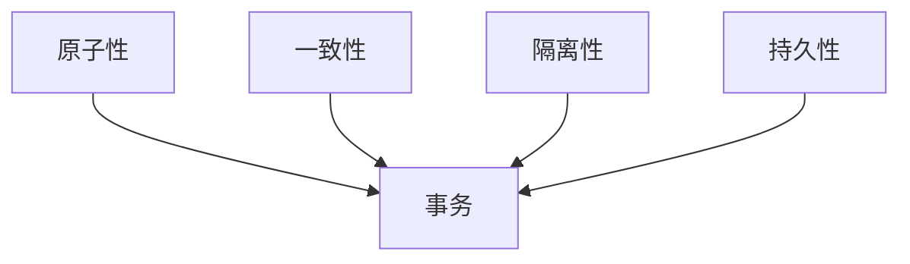
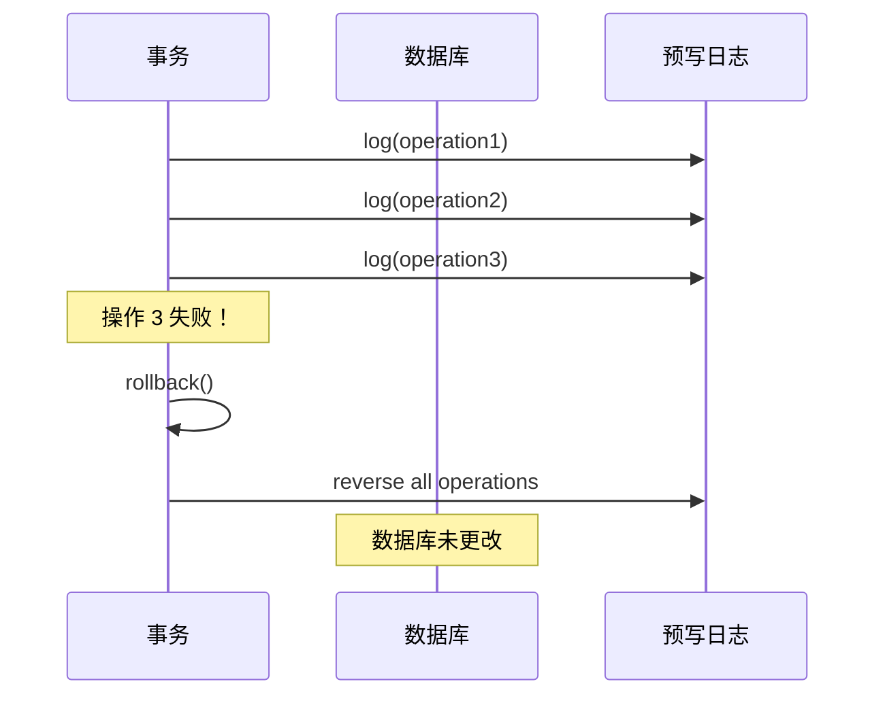
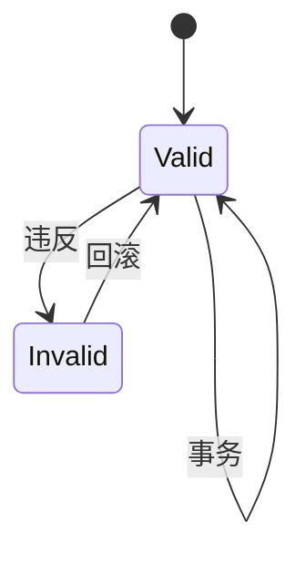
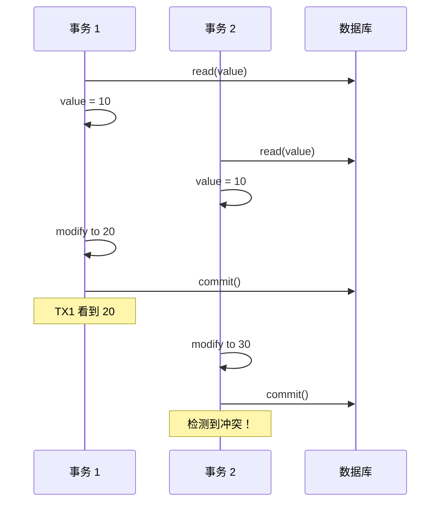
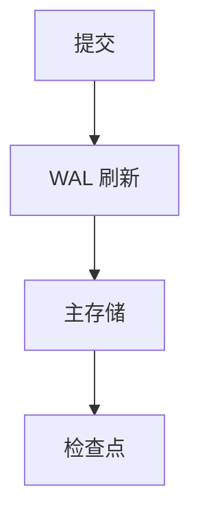
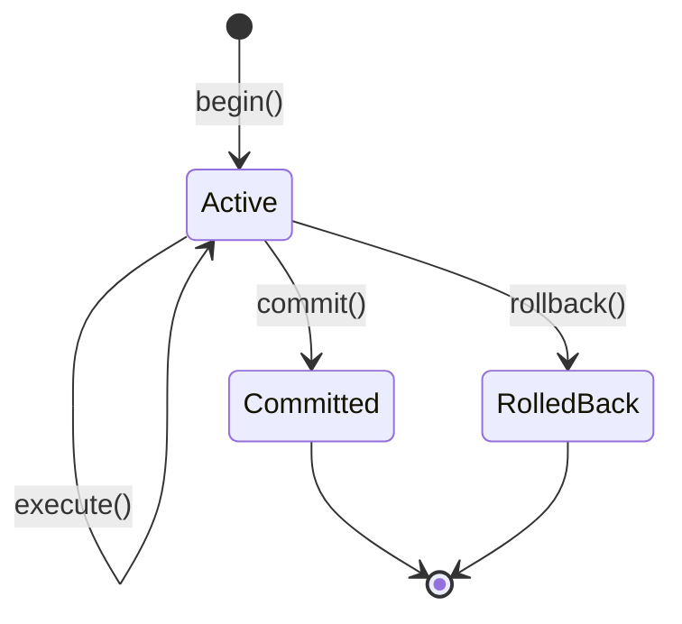
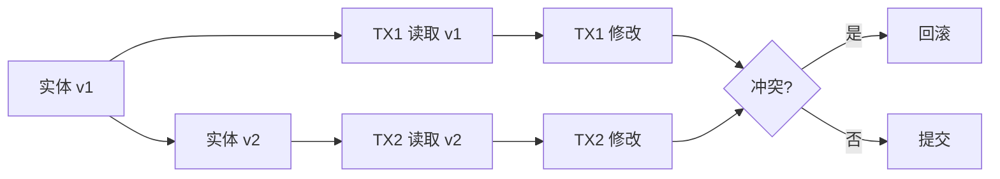
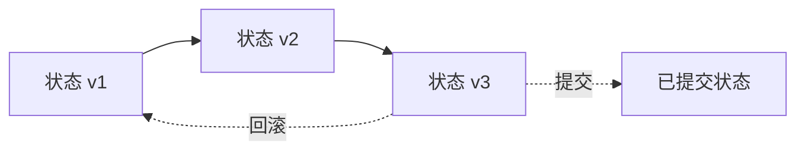
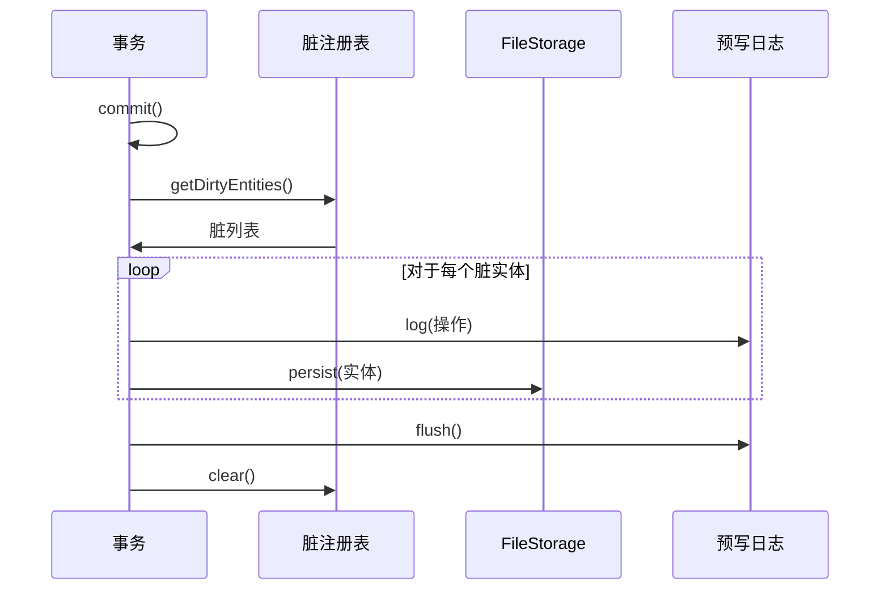

# 事务管理

ZYX 提供完整的 ACID 事务支持，具有乐观并发控制和全面的回滚功能。

## ACID 属性



### 原子性

事务中的所有操作一起成功或一起失败。



**实现**：
- WAL 在执行之前记录所有操作
- 失败时，从 WAL 反转操作
- 数据库保持一致

### 一致性

数据库始终从一个有效状态转换到另一个有效状态。



**约束**：
- **类型约束**：属性类型必须匹配
- **唯一性约束**：唯一属性值（未来）
- **存在性约束**：必需属性（未来）

### 隔离性

并发事务互不干扰。



**隔离级别**：
- **读已提交**：默认，查看已提交的数据
- **可序列化**：完全隔离（计划中）
- **快照一致性**：每事务视图

### 持久性

已提交的更改在故障后仍然存在。



**保证**：
- 提交时 WAL 刷新到磁盘
- 即使进程崩溃，更改仍然持久
- 恢复重放已提交的事务

## 事务生命周期



### 开始事务

```cpp
auto db = Database::open("./mydb");
auto tx = db->beginTransaction();
```

### 执行操作

```cpp
tx->execute("CREATE (n:User {name: 'Alice'})");
tx->execute("CREATE (n:User {name: 'Bob'})");
```

### 提交

```cpp
tx->commit();
```

### 回滚

```cpp
tx->rollback();
```

## 乐观并发控制

ZYX 使用带有版本控制的乐观并发控制。

### 版本跟踪



### 冲突检测

```cpp
class Entity {
private:
    uint64_t version_;

public:
    bool detectConflict(const Entity& other) const {
        return version_ != other.version_;
    }
};
```

### 冲突解决

1. **检测**：提交时版本不匹配
2. **重试**：使用指数退避自动重试
3. **失败**：最大重试次数后，抛出错误

## 事务状态管理

### 状态链

每个实体维护一个状态链：



**状态链演变：**
- v1：初始状态
- v2：已修改状态
- v3：已修改状态（可以提交或回滚）

### 脏实体跟踪

```cpp
class DirtyEntityRegistry {
private:
    std::unordered_set<EntityId> dirty_;

public:
    void markDirty(EntityId id);
    bool isDirty(EntityId id) const;
    void clear();
};
```

### 提交时刷新



## 事务隔离

### 读已提交（默认）

```cpp
auto tx = db->beginTransaction(IsolationLevel::ReadCommitted);
```

**行为**：
- 仅查看已提交的数据
- 可能出现不可重复读
- 可能出现幻读

### 可序列化（计划中）

```cpp
auto tx = db->beginTransaction(IsolationLevel::Serializable);
```

**行为**：
- 完全隔离
- 无幻读
- 更高开销

## 嵌套事务

ZYX 支持保存点用于嵌套事务：

```cpp
auto tx = db->beginTransaction();

tx->execute("CREATE (n:User {name: 'Alice'})");

auto savepoint = tx->createSavepoint("sp1");

tx->execute("CREATE (n:User {name: 'Bob'})");

// 回滚到保存点
tx->rollbackToSavepoint("sp1");

tx->commit(); // 仅提交 Alice
```

## 事务配置

### 超时配置

```cpp
struct TransactionConfig {
    std::chrono::milliseconds timeout = 30000ms;  // 30 秒
    size_t maxRetries = 3;
    std::chrono::milliseconds retryDelay = 100ms;
};
```

### 隔离级别

```cpp
enum class IsolationLevel {
    ReadCommitted,
    Serializable
};
```

## 错误处理

### 事务错误

```cpp
try {
    auto tx = db->beginTransaction();
    tx->execute("CREATE (n:User {name: 'Alice'})");
    tx->commit();
} catch (const TransactionError& e) {
    // 事务失败，已回滚
    std::cerr << "事务失败: " << e.what() << std::endl;
} catch (const StorageError& e) {
    // 存储 I/O 错误
    std::cerr << "存储错误: " << e.what() << std::endl;
}
```

### 自动回滚

事务在以下情况下自动回滚：
- 未处理的异常
- 超时
- 数据库关闭
- 冲突检测失败

## 性能考虑

### 事务大小

**最佳实践**：
- 保持简短
- 最小化每个事务的操作
- 避免长时间运行的事务

### 批量操作

```cpp
// 好的做法 - 多个小事务
for (int i = 0; i < 1000; ++i) {
    auto tx = db->beginTransaction();
    tx->execute("CREATE (n:User {id: $id})", {{"id", i}});
    tx->commit();
}

// 更好的做法 - 单个事务中批量（如果可接受）
auto tx = db->beginTransaction();
for (int i = 0; i < 1000; ++i) {
    tx->execute("CREATE (n:User {id: $id})", {{"id", i}});
}
tx->commit();
```

### WAL 管理

- **检查点频率**：平衡性能和持久性
- **WAL 大小**：监控并截断旧条目
- **刷新策略**：分组刷新以提高效率

## 监控和调试

### 事务统计

```cpp
class TransactionStats {
public:
    size_t getActiveCount() const;
    size_t getCommittedCount() const;
    size_t getRolledBackCount() const;
    std::chrono::milliseconds getAverageDuration() const;
};
```

### 日志记录

启用事务日志记录以进行调试：

```cpp
db->setLogLevel(LogLevel::Debug);
db->setLogTransaction(true);
```

## 最佳实践

1. **始终提交或回滚**：永远不要让事务保持打开状态
2. **处理异常**：捕获并处理事务错误
3. **保持简短**：最小化锁定持续时间
4. **使用适当的隔离**：使用所需的最低隔离级别
5. **监控性能**：跟踪事务持续时间和冲突

## 下一步

- [存储系统](/zh/docs/zyx/architecture/storage) - 事务如何持久化数据
- [查询引擎](/zh/docs/zyx/architecture/query-engine) - 事务中的查询执行
- [API 参考](/zh/docs/zyx/api/cpp-api) - 事务 API 使用
