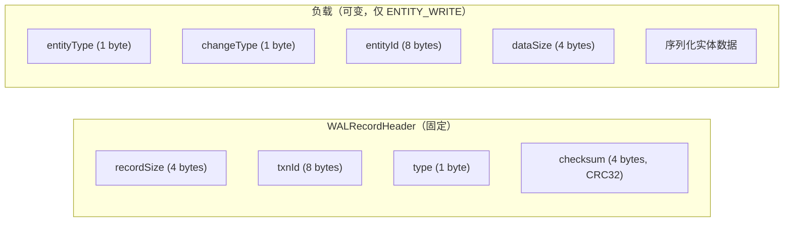
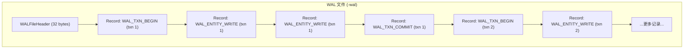
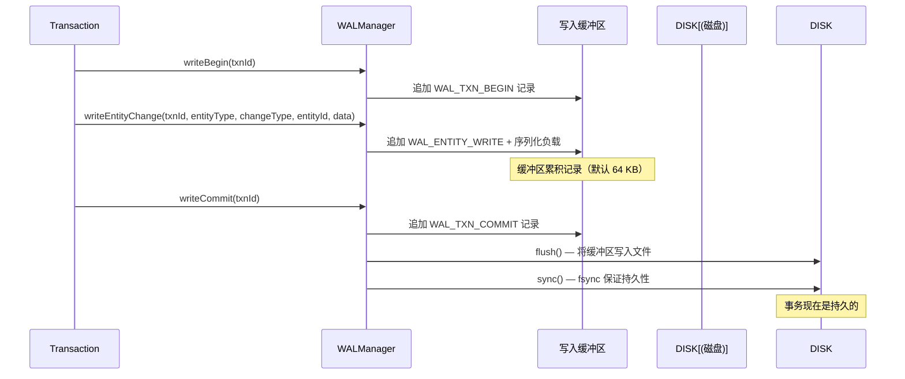
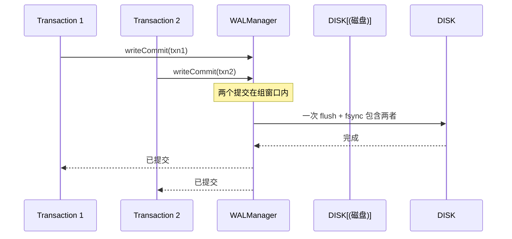
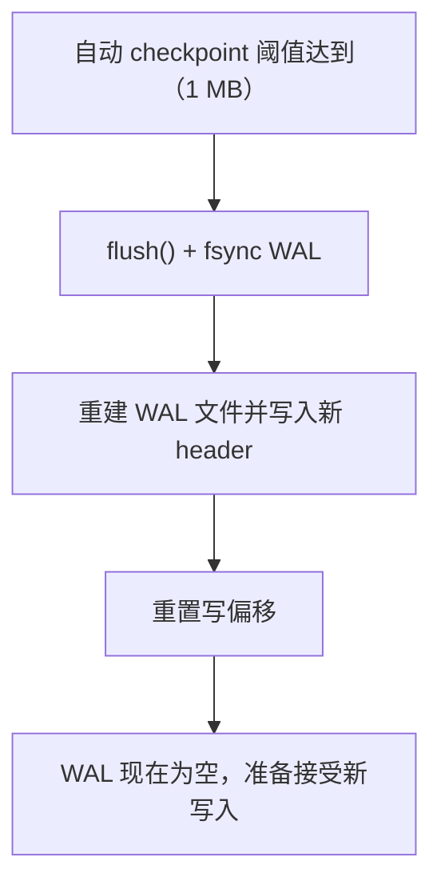
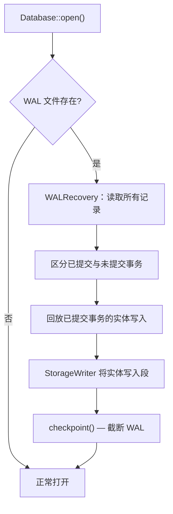

# WAL 实现

WAL 由 `WALManager` 管理，文件路径为 `<db_path>-wal`，与主数据库文件并列。

## 为什么需要 WAL？

WAL 保证**持久性** — 一旦事务的 commit 记录被写入并 `sync()` 到 WAL 文件，该事务的变更就能在后续的任何进程崩溃中存活。重启时，`WALRecovery` 回放已提交但未刷新的实体写入，将数据库恢复到一致状态。

## 记录类型

`WALRecordType` 定义四种记录类型：

| 类型 | 值 | 用途 |
|------|-----|------|
| `WAL_TXN_BEGIN` | 1 | 标记事务开始 |
| `WAL_TXN_COMMIT` | 2 | 标记成功提交（不可回退点） |
| `WAL_TXN_ROLLBACK` | 3 | 标记回滚（恢复时忽略此事务） |
| `WAL_ENTITY_WRITE` | 4 | 记录实体变更（创建、更新或删除） |

### 记录格式

每条 WAL 记录由固定头部和可选负载组成：

CRC32 校验覆盖头部之后的所有数据，在恢复时提供完整性验证。

## WAL 文件结构

`WALFileHeader`（32 字节）包含：

| 字段 | 说明 |
|------|------|
| `magic` | `0x5A594C57`（"ZYLW"）— 验证这是 ZYX WAL 文件 |
| `version` | WAL 格式版本 |
| `dbFileSize` | WAL 创建时的数据库文件大小 |
| `salt1`、`salt2` | 用于完整性检查的随机值 |

## 写入机制

**关键细节：**

- **内存缓冲** — `writeBuffer_` 在内存中累积记录（默认 64 KB），将小写入批量化为较大 I/O 操作。
- **缓冲满刷新** — 当缓冲区超过容量时，刷新到磁盘（不做 `fsync`）以释放内存。
- **提交时同步** — `writeCommit()` 时，缓冲区被刷新并 `fsync`。这是持久性保证。
- **组提交** — 多个事务并发提交时，`WALManager` 使用微秒级延迟窗口（默认 1 ms）将多个 commit 记录批量到一个 `fsync`。

## 组提交

组提交减少 `fsync` 调用次数 — 最昂贵的 I/O 操作 — 通过将多个事务提交批量到一次磁盘同步。

## Checkpoint

Checkpoint 在所有脏数据已持久化到主数据库文件后截断 WAL：

自动 checkpoint 阈值可配置（默认 1 MB）。数据库关闭时也会触发 checkpoint 以确保干净关闭。

## 恢复

当数据库打开并检测到已有 WAL 文件时，执行恢复：

**恢复流程：**

1. 顺序读取所有 WAL 记录。
2. 识别有 `WAL_TXN_COMMIT` 记录的事务 — 这些是已提交的。
3. 对每个已提交事务，回放其 `WAL_ENTITY_WRITE` 记录（通过 `StorageWriter`）。
4. 没有 commit 记录的事务视为未提交，直接忽略。
5. 回放完成后执行 checkpoint 截断 WAL。

WAL 文件采用惰性创建 — 仅在首次写事务实际需要时创建。只读工作负载永远不会创建 WAL 文件。

## 源码定位

| 组件 | 路径 |
|------|------|
| WALManager | `include/graph/storage/wal/WALManager.hpp` |
| WALRecord | `include/graph/storage/wal/WALRecord.hpp` |
| WALRecovery | `src/storage/wal/WALRecovery.cpp` |
| Database（WAL 初始化） | `src/core/Database.cpp` |
