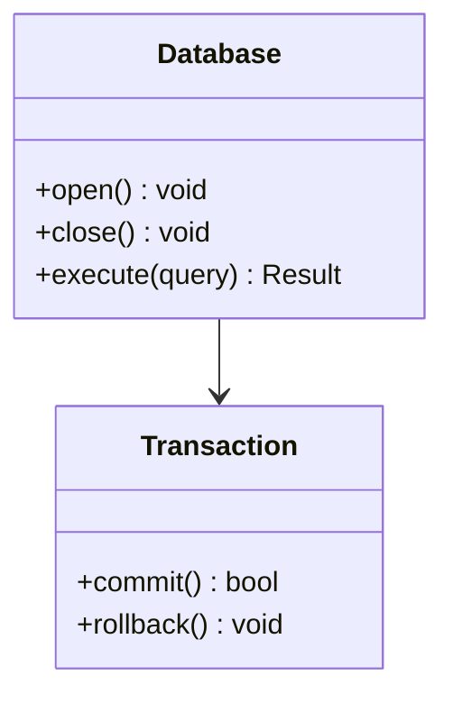

# 文档标准

清晰、全面的文档对 ZYX 的可用性和可维护性至关重要。本指南概述文档标准。

## 文档类型

### 1. 代码注释

#### 文件头

每个源文件都应有描述性头：

```cpp
/**
 * @file Database.cpp
 * @brief Database 类的实现
 *
 * 本文件实现核心 Database 类，提供数据库操作的主要接口，包括打开、
 * 关闭和事务管理。
 *
 * @author ZYX 贡献者
 * @date 2024
 */
```

#### 类文档

```cpp
/**
 * @class Database
 * @brief 图操作的主数据库接口
 *
 * Database 类提供使用 ZYX 图数据库的主要接口。它管理数据库生命周期，
 * 协调存储引擎和查询引擎，并提供事务支持。
 *
 * 示例用法：
 * @code
 * auto db = Database::open("/path/to/database");
 * auto result = db->execute("MATCH (n) RETURN n");
 * db->close();
 * @endcode
 */
class Database {
    // ...
};
```

#### 方法文档

```cpp
/**
 * @brief 打开现有数据库
 *
 * 打开指定路径的数据库。数据库必须已存在，否则将抛出 DatabaseNotFoundException。
 *
 * @param path 数据库目录的文件系统路径
 * @return 打开的 Database 实例的唯一指针
 *
 * @throws DatabaseNotFoundException 如果数据库不存在
 * @throws DatabaseLockException 如果数据库被另一个进程锁定
 * @throws IOException 如果发生文件系统错误
 *
 * @par 示例
 * @code
 * try {
 *     auto db = Database::open("/data/mydb");
 *     // 使用数据库
 * } catch (const DatabaseNotFoundException& e) {
 *     std::cerr << "数据库未找到" << std::endl;
 * }
 * @endcode
 */
static std::unique_ptr<Database> open(const std::string& path);
```

### 2. API 文档

#### 公共 API 头

公共 API 文档应全面并包括：

| 章节 | 说明 |
|---|---|
| 目的 | API 做什么 |
| 参数 | 带类型和约束的输入参数 |
| 返回值 | 返回的内容和可能的值 |
| 异常 | 可能抛出的错误 |
| 示例 | 使用示例 |
| 线程安全 | 操作是否线程安全 |
| 性能 | 性能特征 |

```cpp
/**
 * @brief 执行 Cypher 查询
 *
 * 执行给定的 Cypher 查询字符串并返回结果。
 * 查询在新的自动提交事务中执行。
 *
 * @param cypher 要执行的 Cypher 查询字符串
 * @return 包含查询结果的 Result 对象
 *
 * @throws ParseException 如果查询语法无效
 * @throws ExecutionException 如果查询执行失败
 * @throws ConstraintViolationException 如果违反约束
 *
 * @par 线程安全
 * 此方法是线程安全的。多个线程可以并发执行查询。
 *
 * @par 性能
 * 查询执行时间取决于查询复杂性。简单查找通常在 < 1ms 内完成。
 * 复杂的模式匹配可能需要更长时间。
 *
 * @par 示例
 * @code
 * auto result = db->execute("MATCH (n:Person) RETURN n.name");
 * for (const auto& row : result) {
 *     std::cout << row["n.name"].asString() << std::endl;
 * }
 * @endcode
 */
Result execute(const std::string& cypher);
```

### 3. 用户文档

用户文档应基于教程和示例。编写分步指南，在每个阶段提供可运行的代码示例。

概念文档应使用图表清晰解释概念。使用 Mermaid 图表（参见下方视觉图表标准）来展示架构、状态机和数据流。

### 4. 架构文档

架构文档描述各组件如何协同工作。每个组件概述应包含：

- **主要职责** — 组件做什么
- **实现位置** — 源文件路径
- **依赖关系** — 依赖的其他组件

## 文档结构

### 目录组织

| 目录 | 用途 |
|---|---|
| `user-guide/` | 用户指南（快速开始、基本操作、事务等） |
| `api/` | API 参考（C++、C API、类型、错误） |
| `architecture/` | 架构深入（存储、查询引擎、WAL） |
| `contributing/` | 贡献者指南（开发设置、测试、文档标准） |

## 编写指南

### 风格

1. **使用清晰简单的语言** — 尽可能避免行话
2. **简洁** — 快速切入正题
3. **使用主动语态** — "创建数据库"而不是"可以创建数据库"
4. **分段** — 使用标题组织内容
5. **包含示例** — 展示，而不仅仅是讲述

### 代码块

始终使用带语言标签的语法高亮代码块：

- C++ 代码：使用 `cpp`
- Shell 命令：使用 `bash`
- Cypher 查询：使用 `cypher`
- 纯文本/配置：不指定语言

### 提示框

使用 `:::` 块来突出重要信息：

:::tip 最佳实践
完成后始终关闭数据库以释放资源。
:::

:::warning
对已连接的节点使用 `DELETE` 会导致错误，请改用 `DETACH DELETE`。
:::

:::danger
数据库打开时切勿直接修改数据库文件。
:::

可用类型：

| 类型 | 用途 |
|---|---|
| `:::info` | 补充说明和澄清 |
| `:::tip` | 最佳实践和快捷方式 |
| `:::warning` | 潜在陷阱和注意事项 |
| `:::danger` | 破坏性或不可逆的操作 |

### 表格

使用表格展示结构化信息：

| 方法 | 描述 | 线程安全 |
|---|---|---|
| `open()` | 打开现有数据库 | 否 |
| `create()` | 创建新数据库 | 否 |
| `execute()` | 执行查询 | 是 |

## 视觉图表标准

:::danger 关键规则
这些规则适用于 ZYX 文档中的所有图表。违规将在审查中被驳回。
:::

### 1. 禁止 ASCII 艺术

绝对禁止使用框线字符（`┌│└─/\` 等）手绘 ASCII 艺术图表。

- **原因**：ASCII 艺术难以维护、容易出错、在不同设备上渲染效果差
- **始终使用**：Mermaid 图表代替

### 2. 颜色限制 — 仅限专业灰度

| 类别 | 使用方式 |
|---|---|
| 首选 | 不使用任何颜色样式（默认黑白） |
| 允许 | 微妙灰色：`fill:#f0f0f0`, `fill:#e0e0e0`, `fill:#d0d0d0` |
| 禁止 | 任何颜色：`fill:#90EE90`, `fill:#e1f5ff`, `fill:#ff0`, `fill:lightblue` 等 |

彩色图表显得不专业、打印效果不佳、可能分散注意力。

### 3. Mermaid 图表类型

| 用途 | Mermaid 类型 |
|---|---|
| 类层次结构/数据结构 | `classDiagram` |
| 过程和流程 | `flowchart TD` 或 `flowchart LR` |
| 状态机 | `stateDiagram-v2` |
| 交互/消息传递 | `sequenceDiagram` |
| 数据库模式 | `erDiagram` |

### 4. 图表清晰度

- 保持图表简单和专注
- 避免过多细节或视觉噪音
- 确保文本可读且标签清晰
- 在所有文档中保持一致的样式

### 示例 — 干净的 Mermaid 图表



## 代码示例标准

1. **仅限真实代码** — 所有代码示例必须来自实际实现
   - 禁止：假设代码、伪代码、"简化"示例
   - 要求：直接从源文件复制
   - 包含文件路径以提供上下文（例如，`参见：include/graph/core/Database.hpp:123-145`）

2. **代码准确性**
   - 验证所有示例可以编译和工作
   - 保持示例与代码更改同步
   - 包含必要的头文件和上下文

3. **代码格式化**
   - 使用正确的语言标签：`cpp`、`bash`、`cypher`
   - 包含有用的注释
   - 保持示例专注和简洁

## 双语文档要求

### 平行结构

- 英文文件：`docs/apps/docs/content/docs/en/...`
- 中文文件：`docs/apps/docs/content/docs/zh/...`
- 完全镜像目录结构，两种语言使用相同的文件名

### 翻译质量

- **禁止**：机器翻译（Google 翻译、DeepL 等）
- **要求**：技术准确的人工翻译
- 使用正确的技术术语
- 与现有翻译保持一致

### 同步

- 两个版本必须一起更新
- 保持平行结构和内容
- 交叉引用必须在两种语言中都有效

### 导航配置

- 保持 frontmatter 元数据（`category`、`order`、project 字段）完整
- 保持双语侧边栏结构同步
- 使用一致的链接文案（按语言正确翻译）

## 文档审查清单

提交文档更改之前：

**视觉标准：**
- [ ] 不存在 ASCII 艺术图表
- [ ] 所有 Mermaid 图表仅使用黑白灰色
- [ ] 图表干净且专业
- [ ] 图表在文档站点中正确渲染

**内容标准：**
- [ ] 代码示例来自实际实现
- [ ] 代码示例包含文件路径/引用
- [ ] 英文和中文版本都存在
- [ ] 两个版本同步
- [ ] 翻译技术准确（非机器翻译）

**技术标准：**
- [ ] 所有链接和交叉引用有效
- [ ] NexDoc 元数据完整且排序行为符合预期
- [ ] 图表使用适当的 Mermaid 类型
- [ ] 代码块具有正确的语言标签
- [ ] 表格格式正确
- [ ] 拼写和语法已检查

## 审查流程

### 更新文档

进行代码更改时：

1. **更新代码注释** — 与代码保持同步
2. **更新 API 文档** — 记录新 API 或更改
3. **更新示例** — 确保示例仍然有效
4. **更新图表** — 反映架构更改

## 工具

| 工具 | 用途 |
|---|---|
| **Doxygen** | 从代码注释生成 API 文档 |
| **NexDoc**（`docs/apps/docs`） | 用户和架构文档 |
| **Mermaid** | 基于文本的图表 |
| **PlantUML** | 复杂的 UML 图表 |

### 链接检查

```bash
cd docs/apps/docs && bun run check:links
```

## 最佳实践

1. **边编码边文档** — 与代码一起编写文档，而不是事后补充
2. **保持示例工作** — 测试所有代码示例以确保其按文档工作
3. **使用特定版本的文档** — 需要时维护不同版本的文档
4. **获取反馈** — 让用户审查文档的清晰度和完整性
5. **记录决策** — 记录重要的架构决策及其理由

## 指标

跟踪文档质量：

| 指标 | 说明 |
|---|---|
| 覆盖率 | 已记录 API 的百分比 |
| 准确性 | 有效示例的百分比 |
| 完整性 | 所有概念已记录 |
| 清晰度 | 用户理解分数 |

## 另请参阅

- [开发设置](../contributing/development-setup) — 入门指南
- [代码规范](../contributing/code-style) — 编码标准
- [编写测试](../contributing/writing-tests) — 测试文档
