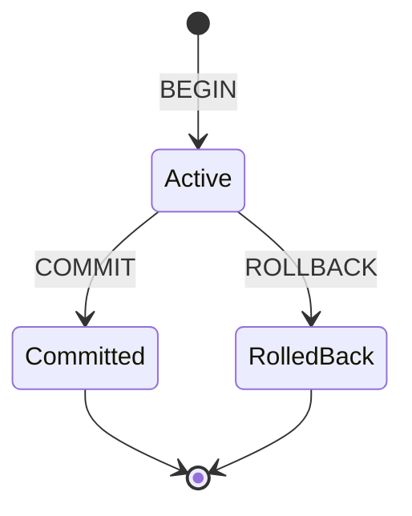
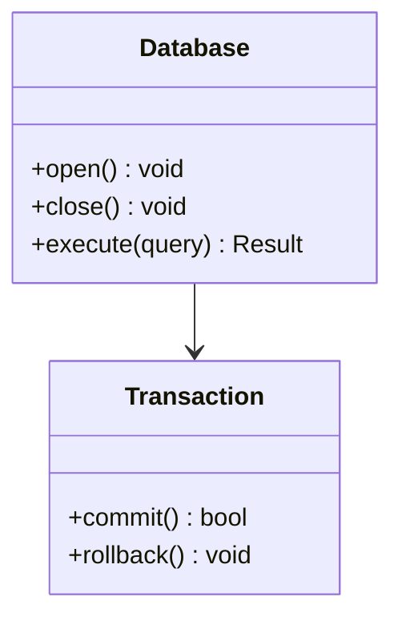
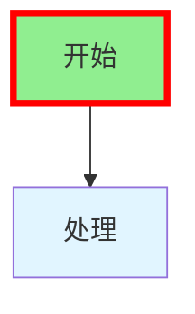
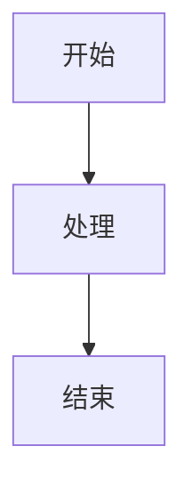

# 文档标准

清晰、全面的文档对 ZYX 的可用性和可维护性至关重要。本指南概述文档标准。

## 文档类型

### 1. 代码注释

#### 文件头

每个源文件都应有描述性头：

```cpp
/**
 * @file Database.cpp
 * @brief Database 类的实现
 *
 * 本文件实现核心 Database 类，提供数据库操作的主要接口，包括打开、
 * 关闭和事务管理。
 *
 * @author ZYX 贡献者
 * @date 2024
 */
```

#### 类文档

```cpp
/**
 * @class Database
 * @brief 图操作的主数据库接口
 *
 * Database 类提供使用 ZYX 图数据库的主要接口。它管理数据库生命周期，
 * 协调存储引擎和查询引擎，并提供事务支持。
 *
 * 示例用法：
 * @code
 * auto db = Database::open("/path/to/database");
 * auto result = db->execute("MATCH (n) RETURN n");
 * db->close();
 * @endcode
 */
class Database {
    // ...
};
```

#### 方法文档

```cpp
/**
 * @brief 打开现有数据库
 *
 * 打开指定路径的数据库。数据库必须已存在，否则将抛出 DatabaseNotFoundException。
 *
 * @param path 数据库目录的文件系统路径
 * @return 打开的 Database 实例的唯一指针
 *
 * @throws DatabaseNotFoundException 如果数据库不存在
 * @throws DatabaseLockException 如果数据库被另一个进程锁定
 * @throws IOException 如果发生文件系统错误
 *
 * @par 示例
 * @code
 * try {
 *     auto db = Database::open("/data/mydb");
 *     // 使用数据库
 * } catch (const DatabaseNotFoundException& e) {
 *     std::cerr << "数据库未找到" << std::endl;
 * }
 * @endcode
 */
static std::unique_ptr<Database> open(const std::string& path);
```

### 2. API 文档

#### 公共 API 头

公共 API 文档应全面并包括：

- **目的**：API 做什么
- **参数**：带类型和约束的输入参数
- **返回值**：返回的内容和可能的值
- **异常**：可能抛出的错误
- **示例**：使用示例
- **线程安全**：操作是否线程安全
- **性能**：性能特征

```cpp
/**
 * @brief 执行 Cypher 查询
 *
 * 执行给定的 Cypher 查询字符串并返回结果。
 * 查询在新的自动提交事务中执行。
 *
 * @param cypher 要执行的 Cypher 查询字符串
 * @return 包含查询结果的 Result 对象
 *
 * @throws ParseException 如果查询语法无效
 * @throws ExecutionException 如果查询执行失败
 * @throws ConstraintViolationException 如果违反约束
 *
 * @par 线程安全
 * 此方法是线程安全的。多个线程可以并发执行查询。
 *
 * @par 性能
 * 查询执行时间取决于查询复杂性。简单查找通常在 < 1ms 内完成。
 * 复杂的模式匹配可能需要更长时间。
 *
 * @par 示例
 * @code
 * auto result = db->execute("MATCH (n:Person) RETURN n.name");
 * for (const auto& row : result) {
 *     std::cout << row["n.name"].asString() << std::endl;
 * }
 * @endcode
 */
Result execute(const std::string& cypher);
```

### 3. 用户文档

#### 教程风格

用户文档应基于教程和示例：

```markdown
# 快速入门指南

## 创建数据库

使用 `Database::create()` 方法创建新数据库：

```cpp
#include <zyx/zyx.hpp>

using namespace zyx;

// 在指定路径创建数据库
auto db = Database::create("/path/to/database");
```

## 添加数据

使用 Cypher 查询添加节点：

```cpp
// 创建人员节点
db->execute("CREATE (p:Person {name: 'Alice', age: 30})");
```

## 查询数据

使用 MATCH 子句查询数据：

```cpp
// 查找所有人员
auto result = db->execute("MATCH (p:Person) RETURN p.name, p.age");

// 处理结果
for (const auto& row : result) {
    std::cout << row["p.name"].asString() << std::endl;
}
```
```

#### 概念文档

用图表清晰解释概念：

```markdown
## 事务系统

ZYX 通过预写日志（WAL）提供 ACID 事务。

### 事务状态



### 事务隔离

ZYX 使用快照隔离来确保事务一致性...
```

### 4. 架构文档

#### 组件概述

```markdown
# 查询引擎架构

查询引擎负责解析、规划和执行 Cypher 查询。

## 组件

### 解析器

解析器将 Cypher 文本转换为抽象语法树（AST）。

**主要职责：**
- 词法分析
- 语法解析
- AST 构建

**实现：** `src/query/parser/cypher/` 中基于 ANTLR4 的解析器

### 规划器

规划器将 AST 转换为可执行的查询计划。

**主要职责：**
- 逻辑计划生成
- 优化规则应用
- 成本估算

**实现：** `src/query/planner/QueryPlanner.cpp`
```

## 文档结构

### 目录组织

```
docs/
├── user-guide/           # 面向用户的文档
│   ├── installation.md
│   ├── quick-start.md
│   └── advanced-queries.md
├── api/                  # API 参考
│   ├── cpp-api.md
│   ├── transaction.md
│   └── types.md
├── architecture/         # 架构文档
│   ├── overview.md
│   ├── storage.md
│   └── query-engine.md
└── contributing/         # 贡献者文档
    ├── development-setup.md
    ├── testing.md
    └── doc-standards.md
```

## 编写指南

### 风格指南

1. **使用清晰简单的语言**：尽可能避免行话
2. **简洁**：快速切入正题
3. **使用主动语态**："创建数据库"而不是"可以创建数据库"
4. **分段**：使用标题组织内容
5. **包含示例**：展示，而不仅仅是讲述

### 格式化

#### 代码块

使用语法高亮的代码块：

````markdown
```cpp
auto db = Database::open("/path/to/db");
```
````

#### 提示框

使用提示框突出重要信息：

```markdown
::: tip 最佳实践
完成后始终关闭数据库以释放资源。
:::

::: warning 警告
删除节点也会删除所有连接的关系。
:::

::: danger 危险
数据库打开时切勿直接修改数据库文件。
:::
```

#### 表格

使用表格展示结构化信息：

| 方法 | 描述 | 线程安全 |
|--------|-------------|-------------|
| `open()` | 打开现有数据库 | 否 |
| `create()` | 创建新数据库 | 否 |
| `execute()` | 执行查询 | 是 |

### 图表

使用 Mermaid 绘制图表：

```markdown

```

#### 视觉图表标准

**关键**：文档中的所有图表必须遵循这些严格准则。

1. **禁止 ASCII 艺术**：绝对禁止手绘 ASCII 艺术图表
   - **禁止**：框线字符如 `┌│└─│/\`, `+----+`, `|    |`
   - **原因**：ASCII 艺术难以维护、容易出错、在不同设备上渲染效果差，且不易更新
   - **始终使用**：Mermaid 图表代替

2. **颜色限制**：仅限专业灰度
   - **禁止的颜色**（切勿使用）：
     - `fill:#90EE90`（浅绿色）
     - `fill:#e1f5ff`（浅蓝色）
     - `fill:#ffe1e1`（浅红色）
     - `fill:#ff0`, `fill:#f9f`, `fill:#bbf`（明亮颜色）
     - `fill:lightblue`, `fill:lightgreen` 等
     - 任何带颜色的 `stroke:` 样式
   - **允许的样式**（谨慎使用）：
     - 无填充/颜色（默认黑白）- **首选**
     - 仅限微妙的灰色：`fill:#f0f0f0`, `fill:#e0e0e0`, `fill:#d0d0d0`
   - **理由**：彩色图表显得不专业、打印效果不佳、可能分散注意力。简单的灰度图表更简洁、更适合出版。

3. **图表类型**：使用适当的 Mermaid 图表类型：
   - **结构**：`classDiagram` 用于类层次结构、数据结构
   - **流程/过程**：`flowchart TD` 或 `graph TD` 用于过程和流程
   - **状态**：`stateDiagram-v2` 用于状态机
   - **序列**：`sequenceDiagram` 用于交互
   - **实体关系**：`erDiagram` 用于数据库模式

4. **图表清晰度**：
   - 保持图表简单和专注
   - 避免过多细节或视觉噪音
   - 确保文本可读且标签清晰
   - 在所有文档中保持一致的样式

#### 示例

**良好 - 干净的 Mermaid 图表：**


**不良 - ASCII 艺术（禁止）：**
```
┌─────────────┐
│  Database   │
├─────────────┤
│  open()     │
│  close()    │
│  execute()  │
└─────────────┘
```

**不良 - 彩色 Mermaid（禁止）：**


**良好 - 专业灰度：**


#### 代码示例标准

1. **仅限真实代码**：所有代码示例必须来自实际实现
   - **禁止**：假设代码、伪代码、"简化"示例
   - **要求**：直接从源文件复制
   - **引用**：包含文件路径以提供上下文（例如，`参见：include/graph/core/Database.hpp:123-145`）

2. **代码准确性**：
   - 验证所有示例可以编译和工作
   - 保持示例与代码更改同步
   - 包含必要的头文件和上下文

3. **代码格式化**：
   - 使用正确的语言标签：` ```cpp `, ` ```bash `, ` ```python `
   - 包含有用的注释
   - 保持示例专注和简洁

#### 双语文档要求

1. **平行结构**：
   - 英文文件：`docs/apps/docs/content/docs/en/...`
   - 中文文件：`docs/apps/docs/content/docs/zh/...`
   - 完全镜像目录结构
   - 两种语言使用相同的文件名

2. **翻译质量**：
   - **禁止**：机器翻译（Google 翻译、DeepL 等）
   - **要求**：技术准确的人工翻译
   - 使用正确的技术术语
   - 与现有翻译保持一致

3. **同步**：
   - 两个版本必须一起更新
   - 保持平行结构和内容
   - 交叉引用必须在两种语言中都有效

4. **导航配置**：
   - 保持 frontmatter 元数据（`category`、`order`、project 字段）完整。
   - 保持双语侧边栏结构同步。
   - 使用一致的链接文案（按语言正确翻译）。

#### 文档审查清单

提交文档更改之前：

**视觉标准：**
- [ ] 不存在 ASCII 艺术图表
- [ ] 所有 Mermaid 图表仅使用黑白灰色
- [ ] 图表干净且专业
- [ ] 图表在文档站点中正确渲染

**内容标准：**
- [ ] 代码示例来自实际实现
- [ ] 代码示例包含文件路径/引用
- [ ] 英文和中文版本都存在
- [ ] 两个版本同步
- [ ] 翻译技术准确（非机器翻译）

**技术标准：**
- [ ] 所有链接和交叉引用有效
- [ ] NexDoc 元数据完整且排序行为符合预期
- [ ] 图表使用适当的 Mermaid 类型
- [ ] 代码块具有正确的语言标签
- [ ] 表格格式正确
- [ ] 拼写和语法已检查

## 审查流程

### 文档审查清单

- [ ] 所有公共 API 已记录
- [ ] 示例准确且已测试
- [ ] 代码块语法高亮
- [ ] 图表清晰准确
- [ ] 拼写和语法检查
- [ ] 链接有效
- [ ] 格式一致

### 更新文档

进行代码更改时：

1. **更新代码注释**：与代码保持同步
2. **更新 API 文档**：记录新 API 或更改
3. **更新示例**：确保示例仍然有效
4. **更新图表**：反映架构更改

## 工具

### 文档生成器

- **Doxygen**：从代码注释生成 API 文档
- **NexDoc**（`docs/apps/docs`）：用户和架构文档

### 图表工具

- **Mermaid**：基于文本的图表
- **PlantUML**：复杂的 UML 图表

### 拼写检查

```bash
# 检查文档拼写
scripts/check_spelling.sh docs/
```

### 链接检查

```bash
# 检查损坏的链接
scripts/check_links.sh docs/
```

## 最佳实践

### 1. 边编码边文档

与代码一起编写文档，而不是事后。

### 2. 保持示例工作

测试所有代码示例以确保其按记录工作。

### 3. 使用特定版本的文档

需要时维护不同版本的文档。

### 4. 获取反馈

让用户审查文档的清晰度和完整性。

### 5. 记录决策

记录重要的架构决策及其理由。

## 指标

跟踪文档质量：

- **覆盖率**：已记录 API 的百分比
- **准确性**：有效示例的百分比
- **完整性**：所有概念已记录
- **清晰度**：用户理解分数

## 另请参阅

- [开发设置](/zh/docs/zyx/contributing/development-setup) - 入门指南
- [代码规范](/zh/docs/zyx/contributing/code-style) - 编码标准
- [编写测试](/zh/docs/zyx/contributing/writing-tests) - 测试文档
