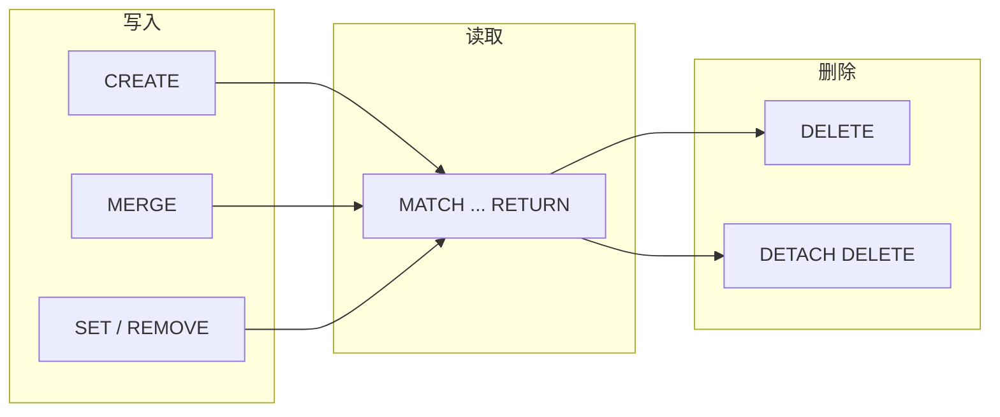

# 基本操作

本页覆盖 ZYX 中最常用的图操作，按 CRUD 流程组织。



## 创建节点与关系

```cypher
CREATE (p:Person {name: 'Alice', age: 30});
CREATE (c:Company {name: 'ZYX'});
MATCH (p:Person {name: 'Alice'}), (c:Company {name: 'ZYX'})
CREATE (p)-[:WORKS_AT {since: 2026}]->(c);
```

:::tip 幂等写入
如果需要"不存在则创建、存在则更新"的语义，使用 `MERGE` 代替 `CREATE`。详见 [Cypher 基础](cypher-basics)。
:::

## 查询

```cypher
MATCH (p:Person) RETURN p.name, p.age ORDER BY p.age DESC;
MATCH (p:Person)-[r:WORKS_AT]->(c:Company)
RETURN p.name, c.name, r.since;
```

## 更新属性与标签

| 操作 | 语法 |
|---|---|
| 设置属性 | `SET p.age = 31, p.city = 'Shanghai'` |
| 添加标签 | `SET p:Employee` |
| 移除属性 | `REMOVE p.city` |
| 合并属性 | `SET p += {active: true}` |

:::info
`SET p += {...}` 是合并语义，仅覆盖指定键而不影响其他属性。
:::

## 删除

| 目标 | 语句 |
|---|---|
| 仅删除关系 | `DELETE r` |
| 删除节点及所有关联关系 | `DETACH DELETE p` |

:::warning
直接 `DELETE` 一个仍有关系连接的节点会报错。如果需要连同关系一起删除，请使用 `DETACH DELETE`。
:::

## 索引

### 属性索引

```cypher
CREATE INDEX person_name_idx FOR (n:Person) ON (n.name);
SHOW INDEXES;
DROP INDEX person_name_idx;
```

### 向量索引

用于嵌入向量近邻检索（如 RAG 场景）：

```cypher
CREATE VECTOR INDEX doc_vec_idx ON :Doc(embedding)
OPTIONS {dimension: 4, metric: 'COSINE'};

CALL db.index.vector.queryNodes('doc_vec_idx', 5, [0.1, 0.2, 0.3, 0.4])
YIELD node, score
RETURN node, score;
```

## 约束

ZYX 支持以下约束类型，节点和边均可使用：

| 约束类型 | 语义 |
|---|---|
| `IS UNIQUE` | 属性值唯一 |
| `IS NOT NULL` | 属性不允许为空 |
| `NODE KEY` | 复合唯一键（仅节点） |
| `IS ::TYPE` | 属性类型约束（如 `IS ::BOOLEAN`、`IS ::INTEGER`） |

```cypher
CREATE CONSTRAINT person_email_unique FOR (n:Person)
REQUIRE n.email IS UNIQUE;

CREATE CONSTRAINT user_age_not_null FOR (n:Person)
REQUIRE n.age IS NOT NULL;

CREATE CONSTRAINT rel_since_type FOR ()-[r:WORKS_AT]-()
REQUIRE r.since IS ::INTEGER;
```

:::tip
唯一约束会自动创建索引。为高频查询属性创建索引可以显著提升 `MATCH` 性能。
:::

## 操作选择速查

| 目标 | 推荐模式 |
|---|---|
| 小规模写入 | REPL/脚本中直接 `CREATE` |
| 按业务键幂等写入 | `MERGE` + `ON CREATE/ON MATCH SET` |
| 安全删除有边节点 | `DETACH DELETE` |
| 强化数据质量 | `CREATE CONSTRAINT` |
| 提升属性检索性能 | `CREATE INDEX` |
| 向量近邻检索 | `CREATE VECTOR INDEX` + `db.index.vector.queryNodes` |
