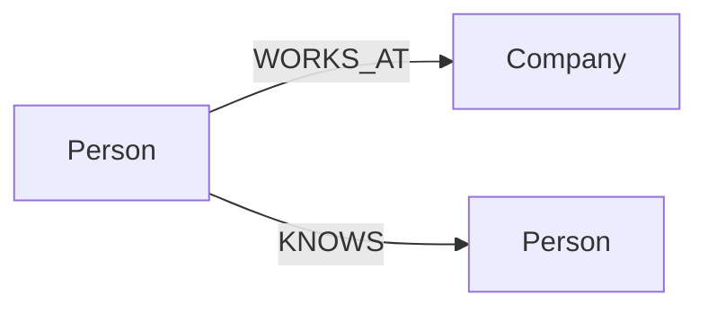

# 基本操作



## 创建（Create）

```cypher
CREATE (p:Person {name: 'Alice', age: 30});
CREATE (c:Company {name: 'ZYX'});
MATCH (p:Person {name: 'Alice'}), (c:Company {name: 'ZYX'})
CREATE (p)-[:WORKS_AT {since: 2026}]->(c);
```

## 读取（Read）

```cypher
MATCH (p:Person) RETURN p.name, p.age ORDER BY p.age DESC;
MATCH (p:Person)-[r:WORKS_AT]->(c:Company)
RETURN p.name, c.name, r.since;
```

## 更新（Update）

```cypher
MATCH (p:Person {name: 'Alice'})
SET p.age = 31, p.city = 'Shanghai';

MATCH (p:Person {name: 'Alice'})
SET p:Employee;

MATCH (p:Person {name: 'Alice'})
REMOVE p.city;

MATCH (p:Person)
SET p += {active: true, source: 'import-1'};
```

## 删除（Delete）

仅删除关系：

```cypher
MATCH (:Person {name: 'Alice'})-[r:WORKS_AT]->(:Company)
DELETE r;
```

删除节点及其关联关系：

```cypher
MATCH (p:Person {name: 'Alice'})
DETACH DELETE p;
```

## 索引与约束

```cypher
CREATE INDEX person_name_idx FOR (n:Person) ON (n.name);
SHOW INDEXES;
DROP INDEX person_name_idx;
```

```cypher
CREATE CONSTRAINT person_email_unique FOR (n:Person)
REQUIRE n.email IS UNIQUE;
SHOW CONSTRAINT;
DROP CONSTRAINT person_email_unique;
```

## 向量索引（嵌入检索场景）

```cypher
CREATE VECTOR INDEX doc_vec_idx ON :Doc(embedding)
OPTIONS {dimension: 4, metric: 'COSINE'};

CALL db.index.vector.queryNodes('doc_vec_idx', 5, [0.1, 0.2, 0.3, 0.4])
YIELD node, score
RETURN node, score;
```

## 场景与推荐写法

| 目标 | 推荐模式 |
|---|---|
| 小规模写入 | REPL/脚本中直接 `CREATE` |
| 按业务键幂等写入 | `MERGE` + `ON CREATE/ON MATCH SET` |
| 安全删除有边节点 | `DETACH DELETE` |
| 强化数据质量 | `CREATE CONSTRAINT` |
| 提升属性检索性能 | `CREATE INDEX` |
| 向量近邻检索 | `CREATE VECTOR INDEX` + `db.index.vector.queryNodes` |
