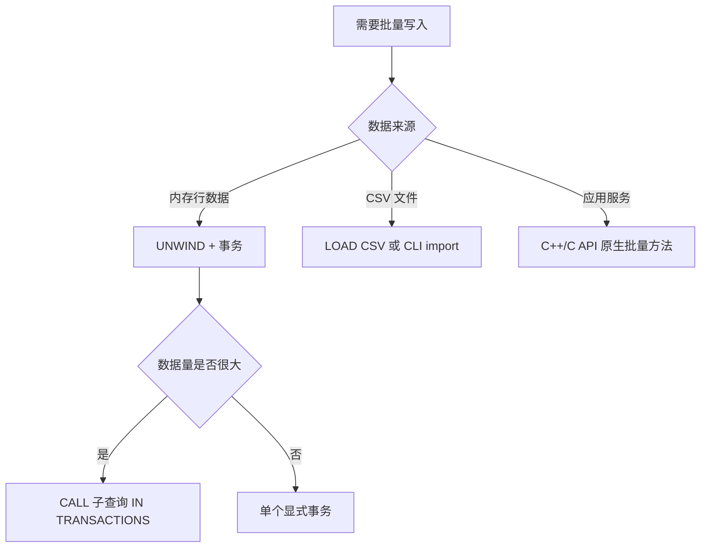

# 批处理操作

## 策略选择



## 方案 A：UNWIND + 显式事务

适用于中等规模、内存中已有数据列表的场景：

```cypher
BEGIN;
UNWIND [
  {name: 'u1', age: 20},
  {name: 'u2', age: 21}
] AS row
CREATE (:User {name: row.name, age: row.age});
COMMIT;
```

## 方案 B：子查询事务分批

适用于大规模写入，自动按批次提交：

```cypher
UNWIND $rows AS row
CALL {
  WITH row
  MERGE (:User {name: row.name})
} IN TRANSACTIONS OF 1000 ROWS
RETURN count(*) AS processed;
```

:::info
`IN TRANSACTIONS OF N ROWS` 会将数据按 N 行分批，每批独立提交。某批失败不影响已完成批次。
:::

## 方案 C：脚本模式

适合重复执行的运维任务和 CI 初始化：

```bash
zyx database exec ./demo.zyx ./batch.cypher
```

## 方案 D：原生批量 API

在极限吞吐场景优先使用原生 C++ API：

| 方法 | 说明 |
|---|---|
| `Database::createNodes(label, propsList)` | 批量创建同标签节点 |
| `Database::createNodeRetId(label, props)` | 创建节点并立即返回内部 ID |
| `Database::createEdgeById(srcId, dstId, type, props)` | 按 ID 直接建边，O(1) 复杂度 |

:::tip
`createEdgeById` 绕过查询解析和索引查找，直接通过内部 ID 建边，是最高效的边创建方式。
:::

## 运维检查清单

- 固定批大小与提交节奏
- 记录成功/失败批次范围，便于断点恢复
- 对可重放流程设计幂等键（必要时使用 `MERGE`）
- 每个大批次后执行一致性校验查询
