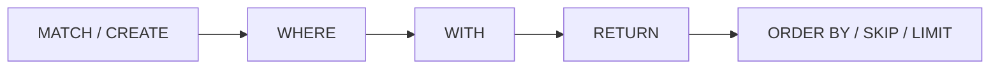

# Cypher 基础

ZYX 使用 Cypher 作为图查询语言。本页概述当前可用的子句、表达式与函数能力。

## 查询管线

一条典型 Cypher 查询按照以下管线执行：



:::info
并非所有子句都必须出现。最简查询可以只有一个 `RETURN`。上图的顺序反映了子句的典型组合方式。
:::

## 子句分组

| 分组 | 子句 |
|---|---|
| 读取 | `MATCH`, `OPTIONAL MATCH`, `WHERE`, `RETURN` |
| 写入 | `CREATE`, `MERGE`, `SET`, `REMOVE`, `DELETE`, `DETACH DELETE` |
| 结果整形 | `DISTINCT`, `ORDER BY`, `SKIP`, `LIMIT` |
| 组合与展开 | `WITH`, `UNION`, `UNION ALL`, `UNWIND`, `FOREACH` |
| 过程与子查询 | `CALL ...`, `CALL { ... }`, `CALL { ... } IN TRANSACTIONS` |
| 数据加载与诊断 | `LOAD CSV`, `EXPLAIN`, `PROFILE` |
| 管理 DDL | `CREATE/DROP INDEX`, `CREATE/DROP CONSTRAINT`, `SHOW INDEXES`, `SHOW CONSTRAINT` |

## 模式与表达式

| 构造 | 写法 | 说明 |
|---|---|---|
| 节点 | `(n)`, `(n:Label)`, `(n {k: v})` | 变量、标签、属性可任意组合 |
| 关系 | `-[r:REL]->`, `-[:REL]->`, `-[:REL]-` | 有向或无向 |
| 多标签 | `(n:Person:Employee)` | 同时匹配多个标签 |
| 变长 | `[:REL*1..3]` | 1 到 3 跳 |
| Map 投影 | `n {.name, .age, score: expr, .*}` | 选择性投影节点属性 |
| 列表推导 | `[x IN list WHERE cond \| expr]` | 过滤并转换列表 |
| 模式推导 | `[(n)-[:KNOWS]->(m) \| m.name]` | 将模式匹配结果投影为列表 |

## 运算符与谓词

| 类别 | 运算符 |
|---|---|
| 算术 | `+ - * / % ^` |
| 比较 | `= <> != < <= > >=` `IN` `BETWEEN ... AND ...` |
| 逻辑 | `AND OR XOR NOT` |
| 字符串 | `STARTS WITH` `ENDS WITH` `CONTAINS` `=~` |
| 空值 | `IS NULL` `IS NOT NULL` |
| 条件 | `CASE WHEN ... THEN ... ELSE ... END` |

## 内置函数

| 分组 | 函数 |
|---|---|
| 聚合 | `count`, `sum`, `avg`, `min`, `max`, `collect`（均支持 `DISTINCT`） |
| 字符串 | `toString`, `upper`, `lower`, `trim`, `lTrim`, `rTrim`, `left`, `right`, `substring`, `replace`, `split`, `reverse`, `length` |
| 数值 | `abs`, `ceil`, `floor`, `round`, `sqrt`, `sign` |
| 列表 | `size`, `range`, `head`, `tail`, `last`, `reverse` |
| 类型转换 | `toInteger`, `toFloat`, `toBoolean` |
| 实体自省 | `id`, `labels`, `type`, `keys`, `properties` |
| 路径 | `nodes(path)`, `relationships(path)`, `length(path)`, `shortestPath(...)` |
| 量词 | `all`, `any`, `none`, `single` |
| 通用 | `coalesce`, `timestamp`, `randomUUID`, `exists((pattern))`, `reduce(...)` |

## 参数化查询

```cypher
MATCH (u:User {name: $name})
WHERE u.age >= $minAge
RETURN u.name, u.age;
```

:::tip 生产环境建议
使用参数 API 可以避免 Cypher 注入并提升计划缓存命中率：
- C++：`Database::execute(query, params)`
- C API：`zyx_execute_params(...)`
:::

## 特性边界

完整支持/未支持清单维护在仓库根目录 [`UNSUPPORTED_CYPHER_FEATURES.md`](https://github.com/nexepic/zyx/blob/main/UNSUPPORTED_CYPHER_FEATURES.md)。
