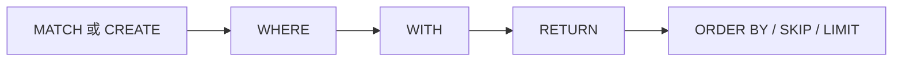

# Cypher 基础



## 子句分组

| 分组 | 子句 |
|---|---|
| 读取 | `MATCH`, `OPTIONAL MATCH`, `WHERE`, `RETURN` |
| 写入 | `CREATE`, `MERGE`, `SET`, `REMOVE`, `DELETE`, `DETACH DELETE` |
| 结果整形 | `DISTINCT`, `ORDER BY`, `SKIP`, `LIMIT` |
| 组合与展开 | `WITH`, `UNION`, `UNION ALL`, `UNWIND`, `FOREACH` |
| 过程与子查询 | `CALL ...`, `CALL { ... }`, `CALL { ... } IN TRANSACTIONS` |
| 数据加载与诊断 | `LOAD CSV`, `EXPLAIN`, `PROFILE` |
| 管理 DDL | `CREATE/DROP INDEX`, `CREATE/DROP CONSTRAINT`, `SHOW INDEXES`, `SHOW CONSTRAINT` |

## 模式与表达式基础块

- 节点模式：`(n)`、`(n:Label)`、`(n {k: v})`
- 关系模式：`(a)-[:REL]->(b)`、`(a)-[r:REL]->(b)`、`(a)-[:REL]-(b)`
- 多标签节点：`(n:Person:Employee)`
- 变长关系：`[:REL*1..3]`

## 运算符与谓词

- 算术：`+ - * / % ^`
- 比较：`= <> != < <= > >=`、`IN`、`BETWEEN`
- 逻辑：`AND OR XOR NOT`
- 字符串谓词：`STARTS WITH`、`ENDS WITH`、`CONTAINS`、正则 `=~`
- 空值判断：`IS NULL`、`IS NOT NULL`
- 条件表达式：`CASE WHEN ... THEN ... ELSE ... END`

## 内置函数分组

| 分组 | 代表函数 |
|---|---|
| 字符串 | `toString`, `upper`, `lower`, `trim`, `substring`, `replace`, `split` |
| 数值 | `abs`, `ceil`, `floor`, `round`, `sqrt`, `sign` |
| 列表 | `size`, `range`, `head`, `tail`, `last`, `reverse` |
| 类型转换 | `toInteger`, `toFloat`, `toBoolean` |
| 实体自省 | `id`, `labels`, `type`, `keys`, `properties` |
| 量词 | `all`, `any`, `none`, `single` |
| 通用 | `coalesce`, `timestamp`, `randomUUID` |

## 参数化查询模式

```cypher
MATCH (u:User {name: $name})
WHERE u.age >= $minAge
RETURN u.name, u.age;
```

生产环境建议使用参数 API：

- C++：`Database::execute(query, params)`
- C API：`zyx_execute_params(...)`

## 特性边界

完整支持/未支持清单维护在仓库根目录 `UNSUPPORTED_CYPHER_FEATURES.md`。
