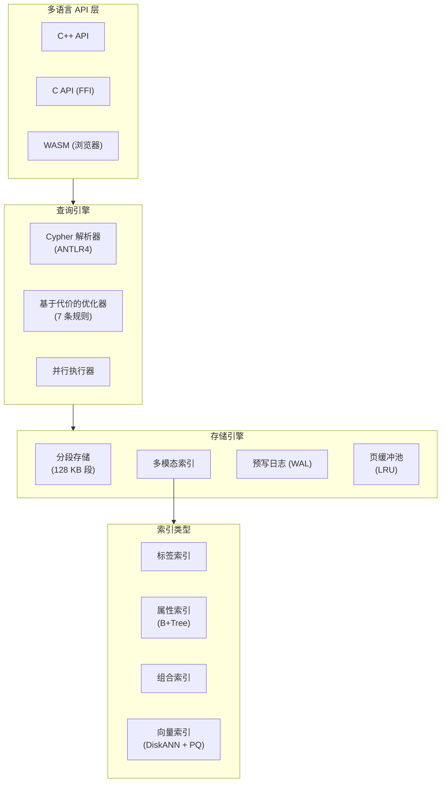
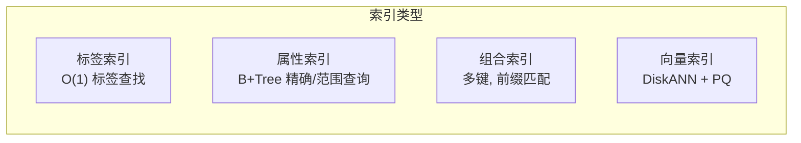
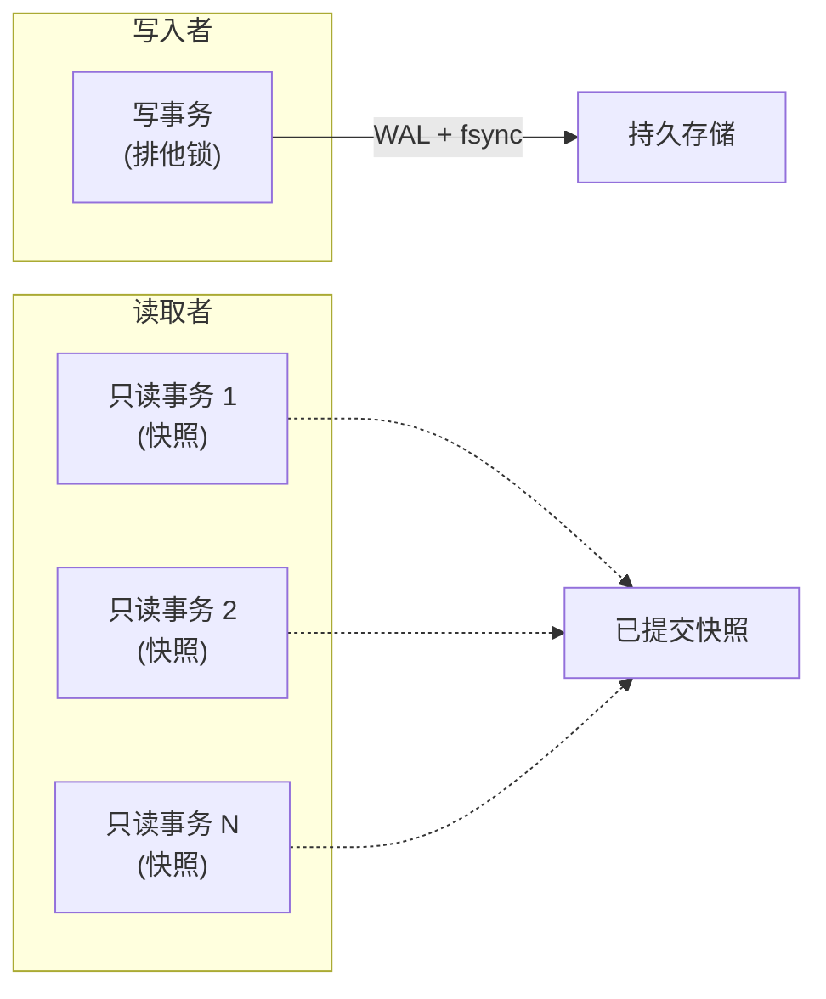
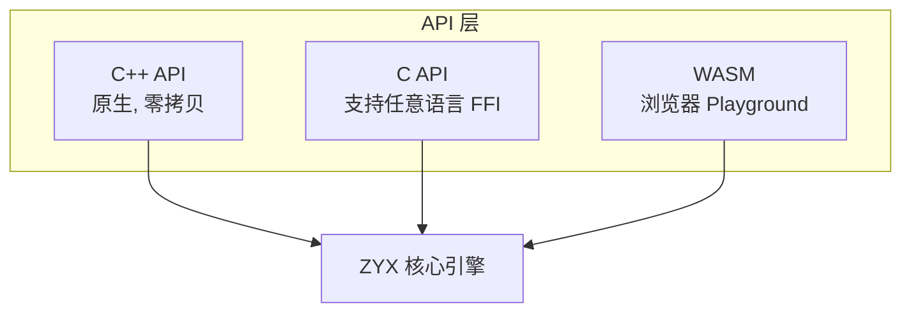

# 特性概览

ZYX 是一个高性能的嵌入式图数据库引擎，使用 C++20 编写。它以进程内库的方式运行，零网络开销，支持 Cypher 查询、ACID 事务、向量检索和图分析 — 所有数据存储在单个数据库文件中。

:::info 什么是"嵌入式"
ZYX 以库的形式直接链接到你的应用中（类似于 SQLite 之于关系数据库）。没有独立的服务器进程，没有 TCP 连接，没有部署基础设施。打开文件、执行查询、关闭 — 就这么简单。
:::

## 架构概览



## 核心能力

### 单文件嵌入式数据库

| 特性 | 说明 |
|------|------|
| 部署方式 | 零配置 — 一个数据库文件，无需服务器进程 |
| 存储格式 | 分段式，CRC32 校验 + zlib 压缩 |
| 段大小 | 128 KB 固定大小段，按实体类型链表组织 |
| 文件 I/O | 跨平台 `pread`/`pwrite`（POSIX）+ `fstream` 回退（Windows） |
| 完整性 | `verifyIntegrity()` 逐段校验 CRC |
| 压缩 | 可选的后台段压缩 |

### Cypher 查询语言

ZYX 实现了 Cypher 查询语言的广泛子集，覆盖读取、写入、DDL 和管理操作。

**读取子句**: `MATCH`, `OPTIONAL MATCH`, `WHERE`, `RETURN`, `ORDER BY`, `SKIP`, `LIMIT`, `DISTINCT`

**写入子句**: `CREATE`, `MERGE`（支持 `ON CREATE SET` / `ON MATCH SET`）, `SET`, `REMOVE`, `DELETE`, `DETACH DELETE`

**组合**: `WITH`, `UNION` / `UNION ALL`, `UNWIND`, `FOREACH`, `CALL { 子查询 }`, `CALL { ... } IN TRANSACTIONS`

**数据加载**: `LOAD CSV` / `LOAD CSV WITH HEADERS`，支持 `FIELDTERMINATOR`

**诊断**: `EXPLAIN`（逻辑计划）, `PROFILE`（含耗时的执行计划）

```cypher
// 变长路径模式匹配
MATCH (a:Person)-[:KNOWS*1..3]->(b:Person)
WHERE a.name = "Alice"
RETURN b.name, length(shortestPath((a)-[*]-(b))) AS distance

// Map 投影与列表推导
MATCH (n:User)
RETURN n {.name, .email, friends: [(n)-[:KNOWS]->(f) | f.name]}
```

:::tip
完整的功能支持/未支持清单维护在 [`UNSUPPORTED_CYPHER_FEATURES.md`](https://github.com/nexepic/zyx/blob/main/UNSUPPORTED_CYPHER_FEATURES.md)。
:::

### 丰富的数据类型系统

ZYX 支持全面的属性类型：

| 类型 | 说明 | Cypher 示例 |
|------|------|-------------|
| Boolean | `true` / `false` | `SET n.active = true` |
| Integer | 64 位有符号整数 | `SET n.age = 30` |
| Double | IEEE 754 双精度浮点 | `SET n.score = 95.5` |
| String | UTF-8 字符串 | `SET n.name = "Alice"` |
| List | 异构列表 | `SET n.tags = ["a", "b"]` |
| Map | 字符串键映射 | `SET n.meta = {k: "v"}` |
| Date | 日历日期 | `RETURN date("2024-01-15")` |
| DateTime | 时间戳（毫秒） | `RETURN datetime()` |
| Duration | ISO 8601 时长 | `RETURN duration("P1Y2M")` |
| Float Vector | 嵌入向量 | 用于向量索引检索 |

时间类型支持算术运算（`date + duration`、`date - date`）和分量访问（`d.year`、`dt.hour`）。

### 多模态索引



| 索引类型 | 适用场景 | Cypher |
|----------|----------|--------|
| 标签 | 按标签快速查找节点/边 | `CREATE INDEX FOR (n:Person) ON (n.name)` |
| 属性 (B+Tree) | 精确匹配和范围扫描 | `CREATE INDEX FOR (n:Person) ON (n.age)` |
| 组合 | 多属性联合查找, 前缀匹配 | `CREATE INDEX FOR (n:Person) ON (n.lastName, n.firstName)` |
| 向量 (DiskANN) | 近似最近邻检索 | `CREATE VECTOR INDEX movie_emb FOR (n:Movie) ON (n.embedding) OPTIONS {dimension: 128, metric: "Cosine"}` |

### 向量检索

ZYX 内置基于 DiskANN 算法和 Product Quantization (PQ) 压缩的生产级向量检索引擎。

| 特性 | 说明 |
|------|------|
| 算法 | DiskANN — 基于 alpha 剪枝的可导航小世界图 |
| 距离度量 | L2（欧氏距离）、内积、余弦相似度 |
| 存储 | BFloat16（每维 2 字节，相比 float32 压缩 50%） |
| 量化 | Product Quantization，每子空间 256 个质心 |
| 自动训练 | PQ 码本在可配置阈值（默认 2000 向量）时自动训练 |
| 混合检索 | PQ 用于图导航，原始 BFloat16 用于最终重排序 |

```cypher
// 创建向量索引
CREATE VECTOR INDEX movie_emb FOR (n:Movie) ON (n.embedding)
OPTIONS {dimension: 128, metric: "Cosine"}

// 检索最相似的 10 个向量
CALL db.index.vector.queryNodes("movie_emb", 10, $queryVector)
YIELD node, score
RETURN node.title, score
```

### 图数据科学 (GDS)

通过 Cypher 过程调用的内置图算法：

| 算法 | 过程 | 说明 |
|------|------|------|
| PageRank | `gds.pageRank.stream` | 迭代式重要性评分 |
| 连通分量 | `gds.wcc.stream` | Union-Find 弱连通分量 |
| 介数中心性 | `gds.betweenness.stream` | Brandes 算法，支持采样 |
| 紧密中心性 | `gds.closeness.stream` | 基于 BFS 的紧密度 |
| Dijkstra 最短路径 | `gds.shortestPath.dijkstra.stream` | 加权最短路径 |
| 最短路径 | `algo.shortestPath` | 无权 BFS 最短路径 |

```cypher
// 投影图、运行 PageRank、返回排名最高的节点
CALL gds.graph.project("social", "Person", "KNOWS")
YIELD graphName

CALL gds.pageRank.stream("social", {maxIterations: 20, dampingFactor: 0.85})
YIELD nodeId, score
RETURN nodeId, score ORDER BY score DESC LIMIT 10
```

### ACID 事务



| 属性 | 实现方式 |
|------|----------|
| **原子性** | UndoLog 在回滚时撤销所有变更 |
| **一致性** | 每次插入/更新/删除均校验约束 |
| **隔离性** | 单写多读；只读事务获取不可变快照 |
| **持久性** | WAL + `fsync` 提交；组提交窗口 1 ms |

:::info WAL 效率
WAL 文件延迟到首次写事务时才创建。纯只读负载不会接触 WAL 文件。自动检查点在 1 MB 阈值时触发（可配置）。
:::

### 约束 (Schema Constraints)

| 约束 | 语法 | 说明 |
|------|------|------|
| 唯一 | `CREATE CONSTRAINT ... IS UNIQUE` | 对一个或多个属性强制唯一性 |
| 非空 | `CREATE CONSTRAINT ... IS NOT NULL` | 强制属性存在 |
| 类型 | `CREATE CONSTRAINT ... IS ::TYPE` | 强制属性值类型 |
| 节点键 | `CREATE CONSTRAINT ... IS NODE KEY` | 组合唯一 + 非空 |

约束在插入、更新和删除时校验。创建约束时会校验已有数据。

### 查询优化器

基于代价的优化器在固定点迭代中最多应用 7 条规则：

| 规则 | 效果 |
|------|------|
| 谓词简化 | 常量折叠、重复消除、无效过滤移除 |
| 过滤下推 | 将 WHERE 谓词下推至扫描算子 |
| 投影下推 | 尽早减少列宽 |
| 索引选择 | 基于代价选择：全扫描、标签扫描、属性扫描、范围扫描、组合扫描 |
| Join 重排序 | 基于基数估计的贪心左深重排序 |
| 排序消除 | 索引已按序返回时移除冗余排序 |
| Limit 下推 | 将 LIMIT 下推到非 DISTINCT 投影之下 |

:::tip
使用 `EXPLAIN` 查看优化后的逻辑计划（不执行），或使用 `PROFILE` 查看执行后的算子级耗时。
:::

### 内置函数

ZYX 提供了覆盖多个类别的全面内置函数：

| 类别 | 函数 |
|------|------|
| 聚合 | `count`, `sum`, `avg`, `min`, `max`, `collect`, `stDev`, `stDevP`, `percentileDisc`, `percentileCont` |
| 数学 | `abs`, `ceil`, `floor`, `round`, `sqrt`, `sign`, `log`, `log10`, `exp`, `pow`, `rand`, `pi`, `e` |
| 三角函数 | `sin`, `cos`, `tan`, `asin`, `acos`, `atan`, `atan2` |
| 字符串 | `toString`, `upper`/`toUpper`, `lower`/`toLower`, `trim`, `lTrim`, `rTrim`, `left`, `right`, `substring`, `replace`, `split`, `reverse`, `length` |
| 时间 | `date`, `datetime`, `duration` |
| 列表 | `size`, `range`, `head`, `tail`, `last`, `reverse` |
| 类型转换 | `toInteger`, `toFloat`, `toBoolean` |
| 量词 | `all`, `any`, `none`, `single` |
| 通用 | `coalesce`, `timestamp`, `randomUUID`, `exists`, `reduce` |

### 并行执行

ZYX 内置线程池，支持并行查询执行：

| 组件 | 并行化方式 |
|------|-----------|
| 查询算子 | NodeScan、Filter、Sort 并行执行 |
| 批量写入 | `FileStorage::save()` 并行段准备 |
| PQ 训练 | K-means 跨子空间并行训练 |
| 向量检索 | DiskANN 重排序和 PQ 距离计算并行 |

```cypher
// 运行时配置线程池大小
CALL dbms.setConfig("thread.pool.size", 8)
```

:::info WASM 模式
编译为 WebAssembly 时，ZYX 自动以单线程模式运行，无需额外配置。
:::

### 运行时配置

| 配置键 | 说明 |
|--------|------|
| `query.timeout_ms` | 单次查询执行超时 |
| `query.max_memory_mb` | 单次查询内存限制 |
| `query.max_var_length_depth` | 变长遍历最大深度 |
| `query.slow_log.enabled` | 启用慢查询日志 |
| `query.slow_log.threshold_ms` | 慢查询阈值 |
| `thread.pool.size` | 线程池大小（0 = 自动） |
| `storage.compaction.enabled` | 启用段压缩 |

```cypher
-- 查看所有配置
CALL dbms.listConfig

-- 设置 5 秒超时
CALL dbms.setConfig("query.timeout_ms", 5000)

-- 查看查询统计
CALL dbms.showStats
```

## 多语言 API

ZYX 提供三套 API 以适配不同使用场景：



### C++ API

原生 API，基于 `std::variant` 的值类型、RAII 事务管理和参数化查询。

```cpp
#include <zyx/zyx.hpp>

zyx::Database db("./my.db");
db.open();

// 参数化查询
auto result = db.execute(
    "CREATE (n:Person {name: $name, age: $age}) RETURN n",
    {{"name", std::string("Alice")}, {"age", int64_t(30)}});

// 事务 — 作用域结束时自动回滚
auto txn = db.beginTransaction();
txn.execute("CREATE (:Person {name: 'Bob'})");
txn.execute("CREATE (:Person {name: 'Charlie'})");
txn.commit();  // 或让析构函数回滚

db.close();
```

### C API

纯 C API，可通过 FFI 与 Python、Rust、Go 等任何支持 C 互操作的语言集成。支持列表/Map 构建器处理复杂参数类型。

```c
#include <zyx/zyx_c_api.h>

ZYXDB_T* db = zyx_open("./my.db");
ZYXResult_T* res = zyx_execute(db, "MATCH (n:Person) RETURN n.name");

while (zyx_result_next(res)) {
    const char* name = zyx_result_get_string(res, 0);
    printf("%s\n", name);
}
zyx_result_close(res);
zyx_close(db);
```

### WebAssembly

ZYX 通过 Emscripten 编译为 WebAssembly，支持基于浏览器的 Cypher Playground。浏览器环境中使用只读事务保证安全性。

## 跨平台支持

| 平台 | 状态 | 备注 |
|------|------|------|
| macOS | 支持 | 原生 `pread`/`pwrite` |
| Linux | 支持 | 原生 `pread`/`pwrite` |
| Windows | 支持 | `fstream` 回退 I/O，枚举前缀避免宏冲突 |
| 浏览器 (WASM) | 支持 | 单线程，只读 Playground |

构建系统：**Meson** + **Conan** + **Ninja**。测试：**Google Test**，覆盖率目标 95%+。
