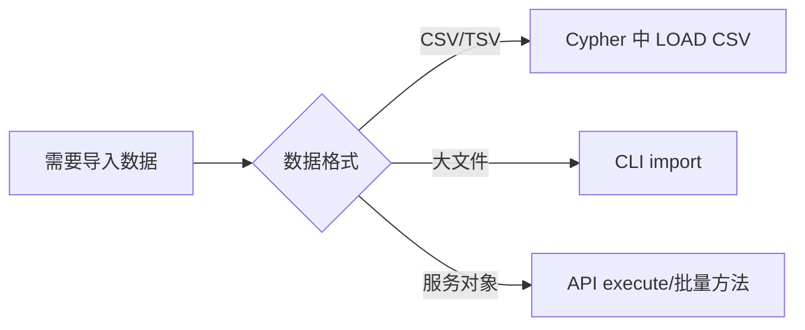
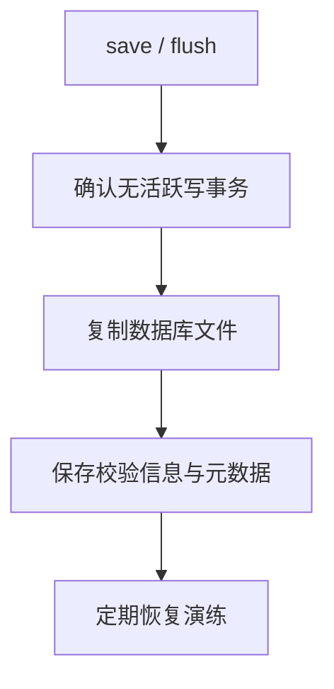

# 导入与导出

## 能力矩阵

| 任务 | 内置路径 | 说明 |
|---|---|---|
| 查询内 CSV 导入 | `LOAD CSV` / `LOAD CSV WITH HEADERS` | 支持 `FIELDTERMINATOR` |
| 文件批量导入 | CLI `import` 命令 | 支持 CSV 与 JSONL |
| 结果导出 | API 迭代结果集 | 由应用层写出 CSV/JSON/Parquet |
| 物理备份 | `save` + 复制数据库文件 | 快照时应无活跃写事务 |

## 导入路径选择



## 路径 1：LOAD CSV

在 Cypher 查询管线内导入 CSV，适合小到中等文件：

```cypher
LOAD CSV WITH HEADERS FROM 'file:///tmp/users.csv' AS row
MERGE (:User {name: row.name})
RETURN count(*) AS imported;
```

## 路径 2：CLI 批量导入

专用导入命令，适合大文件批量加载：

```bash
zyx import \
  --database ./demo.graph \
  --nodes ./nodes.csv \
  --relationships ./rels.csv \
  --format auto \
  --array-delimiter ';' \
  --skip-bad-entries
```

### 支持的文件格式

#### CSV（Neo4j 兼容表头）

节点文件示例：

```csv
:name:STRING,:ID,:LABEL,:age:INT
"Alice",p1,"Person;Employee",30
"Bob",p2,"Person",25
```

关系文件示例：

```csv
:START_ID,:END_ID,:TYPE,:since:INT
p1,p2,KNOWS,2026
```

#### JSONL

```json
{"_id": "p1", "_labels": ["Person"], "name": "Alice", "age": 30}
{"_id": "p2", "_labels": ["Person"], "name": "Bob", "age": 25}
```

### 导入命令参数

| 参数 | 说明 |
|---|---|
| `--database, --db <path>` | 数据库路径（必填） |
| `--nodes <files>` | 节点数据文件（必填） |
| `--relationships <files>` | 关系数据文件（可选） |
| `--format <auto\|csv\|jsonl>` | 文件格式（默认 `auto`） |
| `--array-delimiter <char>` | 数组分隔符（默认 `;`） |
| `--skip-bad-entries` | 跳过格式错误的行而非中断 |

:::tip
使用 `--skip-bad-entries` 可以在导入时容忍少量格式问题，导入完成后检查日志确认跳过的行数。
:::

## 路径 3：导出与备份

### 查询结果导出

通过 C++ / C API 迭代查询结果，由应用层决定输出格式。

### 物理备份流程



:::warning 备份一致性
物理备份前必须确保没有活跃的写事务。建议在备份前执行 `save` 命令，并暂停写入操作。
:::
