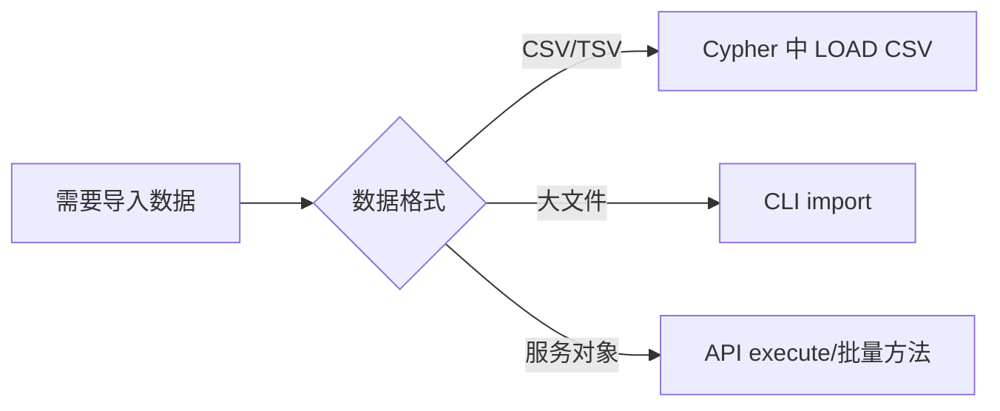
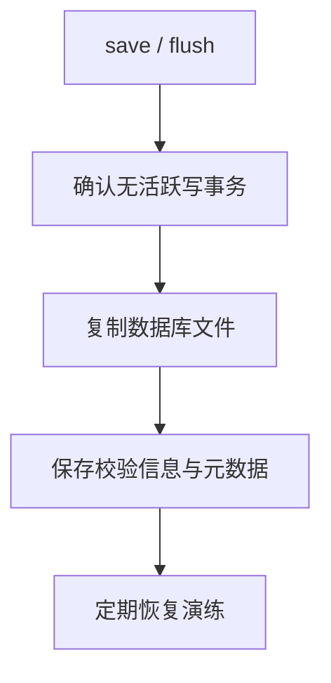

# 导入与导出

## 能力矩阵

| 任务 | 内置路径 | 说明 |
|---|---|---|
| 查询内 CSV 导入 | `LOAD CSV` / `LOAD CSV WITH HEADERS` | 支持 `FIELDTERMINATOR` |
| 文件批量导入 | CLI `import` 命令 | 支持 CSV 与 JSONL |
| 结果导出 | API 迭代结果集 | 由应用层写出 CSV/JSON/Parquet |
| 物理备份 | `save` + 复制数据库文件 | 快照时应无活跃写事务 |

## 导入路径选择



## 路径 1：查询管线中的 LOAD CSV

```cypher
LOAD CSV WITH HEADERS FROM 'file:///tmp/users.csv' AS row
MERGE (:User {name: row.name})
RETURN count(*) AS imported;
```

## 路径 2：CLI 批量导入命令

```bash
./buildDir/apps/cli/zyx import \
  --database ./demo.graph \
  --nodes ./nodes.csv \
  --relationships ./rels.csv \
  --format auto \
  --array-delimiter ';' \
  --skip-bad-entries
```

CSV 模式可识别 Neo4j 风格表头，例如：

- 节点：`:ID`, `:LABEL`, `name:STRING`, `age:INT`
- 关系：`:START_ID`, `:END_ID`, `:TYPE`, `since:INT`

JSONL 模式当前重点使用保留键（`_id`, `_labels`, `_start`, `_end`, `_type`）完成图结构映射。

## 路径 3：导出与备份

- 结果导出：通过 C++/C API 迭代查询结果。
- 物理备份建议：
  1. 执行 `save`（或 API `save()`）并停止写入。
  2. 复制数据库文件。
  3. 恢复时在下次打开前替换文件。


