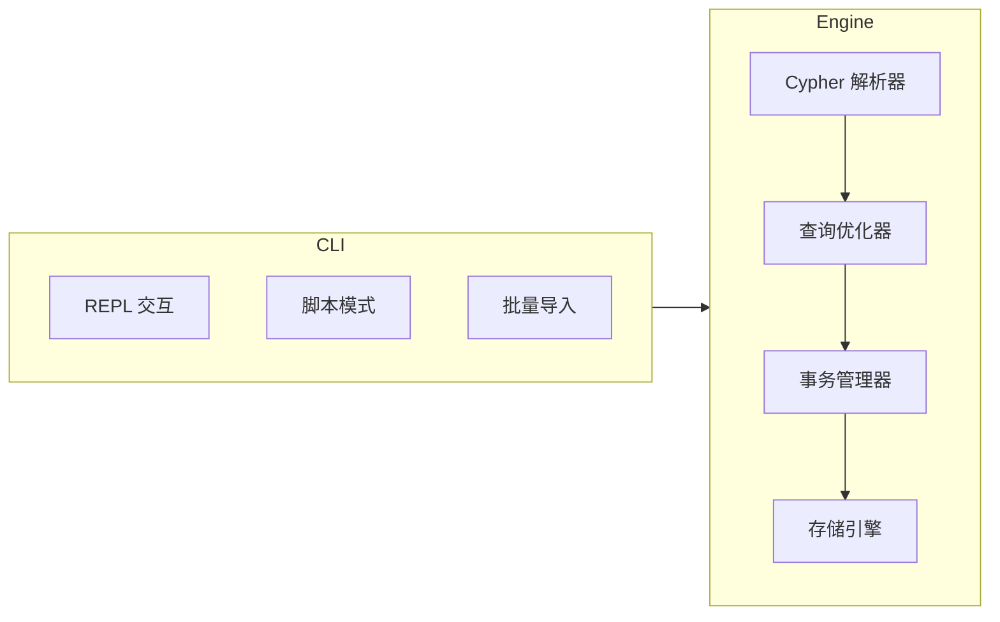

# 用户指南

本指南面向"直接使用产品"的用户，重点是如何高效使用 ZYX，而不是源码实现细节。

:::info
ZYX 是一个嵌入式图数据库引擎，以 CLI 为主要交互入口，支持 Cypher 查询语言。如果你需要将 ZYX 嵌入到自己的 C/C++ 应用中，请参考 C/C++ API 文档。
:::

## 推荐阅读顺序

| 步骤 | 文档 | 重点 |
|---|---|---|
| 1 | [快速开始](quick-start) | 安装 CLI、打开数据库、跑通首条查询 |
| 2 | [基本操作](basic-operations) | CRUD、索引、约束 |
| 3 | [Cypher 基础](cypher-basics) | 子句模型与表达式能力 |
| 4 | [模式匹配](pattern-matching) | 有向/无向与变长模式 |
| 5 | [高级查询](advanced-queries) | WITH/UNION/UNWIND/CALL/LOAD CSV |
| 6 | [事务控制](transactions) | 显式事务边界与回滚 |
| 7 | [批处理操作](batch-operations) | 大规模写入与导入策略 |
| 8 | [导入与导出](import-export) | 数据迁移与备份恢复 |

## 当前产品形态

- **CLI 为核心工作流**：REPL 交互模式、脚本批量执行、数据导入命令
- **Cypher 查询语言**：覆盖常见读写子句、子查询、`LOAD CSV` 与管理 DDL
- **多模态查询**：图查询 + 向量检索 + GDS 图算法过程
- **ACID 事务**：单写多读并发模型，持久化基于 WAL（预写日志）

## 文档约定

:::tip 命令行约定
CLI 示例命令统一使用 `zyx`。如果可执行文件不在 `PATH` 中，请将 `zyx` 替换为实际路径（例如 `./zyx` 或 `./buildDir/apps/cli/zyx`）。
:::

- REPL 中的查询以 `;` 结束后立即执行；也可以输入空行触发执行
- 默认每条 Cypher 语句以隐式事务执行（自动提交成功语句，失败自动回滚）；也可使用 `BEGIN` / `COMMIT` / `ROLLBACK` 显式控制事务边界
- 特性边界以仓库根目录 [`UNSUPPORTED_CYPHER_FEATURES.md`](https://github.com/nexepic/zyx/blob/main/UNSUPPORTED_CYPHER_FEATURES.md) 为准
